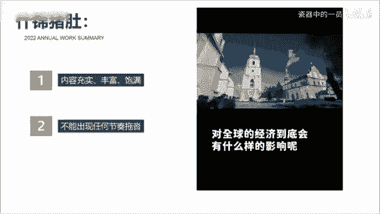

# 2024年全网最干货的新媒体运营教程，自媒体运营系统课(包含了剪辑／起号／短剧推广／今日头条各种玩法）抖音短视频零基础入门到精通，吊打一切付费课！ - P16：7抖音怎么发才有流量？ - 瓷器中的一员 - BV1yB2zYVEr1

🎼我也知道好内容才会被推荐，但到底什么才是好内容，这个也太抽象了，有没有什么办法能把抽象的价值变成可视化的短视频语言呢？😡。

🎼还真有教你一个公式，爆炒虎头十几猪肚、红烧爆肚，什么意思呢？有句话叫客户买的不是产品，而是感觉。🎼爆炒虎头就是说开头的5秒要开的精彩，像虎头般斑斓夺目。比如这样，那一天，上海感受到了被吞噬的恐惧。

夜空中出现了一张血盆大口，钢筋森林都被他吸进嘴里。开头就写出它的具体表现，而不是给大家推荐一部高分末日电影。🎼再或者这样，有人说来上海旅游没什么好玩的那可能是你的打开方式不太对。作为十年的老护漂。

我想送你今天这份上海旅行攻略，写出你要为观众解决什么苦恼，而不是我给大家分享三个上海的景点。😊，🎼石锦猪肚呢则是那种，就像猪肚那样饱满丰富。🎼包括画面的切换，也要符合情绪的递节。🎼比如这样。

然而啊过了一天，个股股市呢又普遍的回血了，那问题就来了。接下来这场仗对全球的经济到底会有什么样的影响呢？内容充实，丰富饱满，一定不能出现任何的节奏拖沓，华而不实的内容。😡。

🎼红烧鲍尾则是指豹子般意味深长的结尾，用最简短有力、干脆利落的语言将总结打好。比如这个屏幕前的你看完会不会食欲大增呢？反正我能多干两碗米饭，用一句反问来提高评论互动数据。

🎼再比如这样吞陷了委屈，伟大的格局，改变不了别人，就改变自己。把前面写的小范围事件称成到较大的范围，从而升华视频的主题。😡，🎼明白了这个故事后，你再问问自己，你的内容真的优质吗？是不是开头不够细睛。

内容节奏拖沓，让人看不到最后。而结尾呢就有一句，我们下期再见。