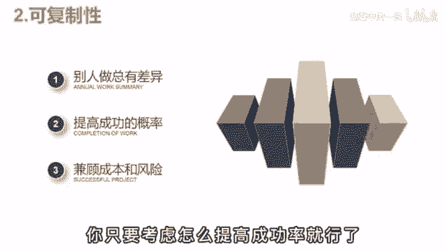

# 2024年全网最干货的新媒体运营教程，自媒体运营系统课(包含了剪辑／起号／短剧推广／今日头条各种玩法）抖音短视频零基础入门到精通，吊打一切付费课！ - P19：变现篇丨影视解说如何快速起号？ - 瓷器中的一员 - BV1yB2zYVEr1

🎼之前啊有个朋友做影视后，干了俩月发了50多套作品，就是没啥起色，每天焦虑的睡不着，死活都想不明白这到底是哪出了问题。为啥辛辛苦苦做了这么久，就一点回报没有。后来呢跟我通了个电话。

聊完后啊说自己是彻底不弱的，原来玩自媒体是这么回事。之前啊被那帮博主给忽悠了，什么三天不播放，轻松100万流量都是鬼话，想做好自媒体，真正的核心逻辑，其实啊就两点。😡。

🎼一、概率。🎼大多数人都被欲望通昏了头脑，梦想着一口吃成胖子，实现财富自由。但无论你是做短视频，做电商，开饭店，本质啊都是做生意，都是通过自己的服务和产品来盈利。你做影视解说可以啊给大家提供娱乐价值。

提供投资。😡，🎼但就算你有货有料，已不见得有人愿意看，这样就和做生意是一样的。影响客源的因素有很多，不可能百分百超过。

🎼那话虽这么说，但抖音啊作为时代的风口，多少还是有区别于传统生意的优势的。首先呢低成本拍抖音是真的没什么成本。一人出镜一部手机，一个麦就够了。你要玩装视频计划，好物带货什么。连手机都用不上。

有一台电脑再加上一点时间就足够。而你如果要开店，租房装修雇员工进货，这些啊都是必不可少，少了一年也得几十个打折，这就全退了一波人。😡，🎼第二点，可复制性。假设你这个店啊经营的还不错，这时呢有想开个连锁。

一个店的收入100万3个店，不就是300万吗？😡，🎼在现实中，培养一个靠谱的店长，太难了，手把手的脚撵读大夫之，总有差异点。😡，🎼而做抖音呢就没有这个烦恼，反正都是你做的。

你只要考虑怎么提高成功的概率就可以。

🎼办法呢就一个就是批量起号。🎼一个号就算20%的概率，你做5个就能无限的接近于百分之百，总能跑出来一个。😡，🎼哎，这就体现出了可复制性的优势。🎼当一个号做起来后，你完全可以仿着那个爆款的脚本。

用其他的号再来一遍。🎼自己操自己总不会出问题吧。😡，🎼之后呢，你就有了5个成熟的账号，然后啊雇一些人帮你打理。比如这两个大学生帮你切高剪辑，就解放了，可以去钻研其他新项目的技会。😊。

🎼这就进入到了一个健康良性的运营状态。🎼那做影视号怎么批上几号扩大概率呢？剪辑啊倒不是事儿，可惜解说稿就要累死了，要怎么一个人做5号呢？这个当然是有技巧方法。你平时应该刷到过那些一剪梅吧。

就是只剪辑最精彩的部分，主页呢是没有全集的，但粉丝和播放还挺多。😊，🎼你像这种号呀就能提升效率了，一个号就算平均收益2005个就是1000，这还不算爆款的流量，是不是美滋滋？😡。

