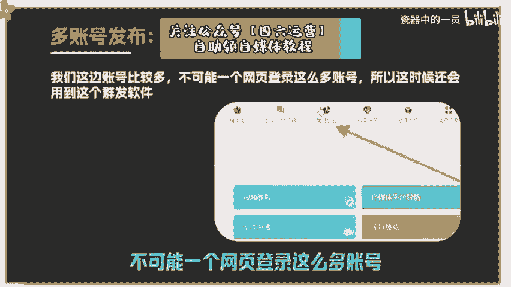

# 2024年全网最干货的新媒体运营教程，自媒体运营系统课(包含了剪辑／起号／短剧推广／今日头条各种玩法）抖音短视频零基础入门到精通，吊打一切付费课！ - P1：今日头条图文收益 - 瓷器中的一员 - BV1yB2zYVEr1

Yeah。Yeah。🎼今天分享的是今日头条图文类型的玩法和细节。首先，手机所需要的软件有今日头条、星斗、西瓜视频、电脑软件、小火花，这个是做自媒体比较实用的软件。如果说长期做自媒体的话。

一定要去好好利用它注册账号，可以通过手机版的今日头条或者西瓜视频去注册。因为有的手机今日头条是没办法注册的。这种情况就可以通过西瓜视频注册，注册成功以后再去头条登录就可以了。记住。

一定得是实名的正规手机号，要用正规三大运营商联通移动电信这些，不然账号一注册就废了，这也是我这边测了几十个账号得出来的结论，这些坑我们都踩过，注册以后必须得去实名认证，一个手机号注册一个账号。

多账号批量运营，可以让家里人亲戚朋友帮你实名。因为这涉及到以后的账号提现的银行卡，实名是谁就要提现到谁的银行卡里面，不实名的账号是发布不了作品，一个人一天操作10到15个账号，我这边操作熟练的同事。

一般4小时就能搞定。🎼刚开始弄可能会稍微慢一些，这个很正常，需要慢慢熟练，账号要切记一点，一定要去开通文章的原创，头条的首发以及文章的创作权益。就这三大点一定要去开通吗。不开通的话。

你发1万个视频都没什么收益，这一点是很重要，不然的话，你努力都是白费的，就算几千万几个亿的播放量，你也没有什么钱赚。第二点，作品发布领域的赛道。我这边主攻三大领域。

三农体育奇文每个领域里面去做2到3个账号，比如说三农可以做2到3个账号，体育可以做2到3个账号，奇文再做2到3个账号。当然，账号越多越好，就要看你手上账号的数量，它和抖音一样。

每个账号都要保证作品的垂直度，发了一个作品，这个账号以后就一直更新这个类型，比如现在发的是体育类型的作品，你就要去发足球排球之类的。比如现在做的是奇文，那么就可以一直去发科普类型的作品，还有一个重点。

如果说你账号目前流量还算不错的情况下，一天发布作品的数量，最多不要超过8个。为什么。🎼如果你发布再多，因为账号播放量好了以后就会隐形限留几天，这是每个平台都会有的机制和规则。报了之后必然会限制流量。

如果目前账号流量很一般，你报的很少，那每天发布作品的数量就不要超过3个，这是我这边测出来的，再多发的话，可能你作品就白做，因为会隐形限流。第三点，找对标作品和账号，我们做的不是视频类型的作品。

主要以文章和图片组成的图文为主。这是我整理好的同行账号，可以直接拿过去用拿三农举例，先去平台搜索我举例其中一个账号的名字进去以后随便点开一个作品去看一下。看这个作品做头条和西瓜它标题是很重要的。

直接决定你的作品能不能报西瓜视频还有一个好处。不论是你观看什么类型的视频，它右侧都会给你推出相关类型视频的素材，这也导致我们的选材和取材是源源不断，用之不节的。目前三农有三个比较火的话题。

就是养老金新型骗局和拆迁政策，目前关注度比较高，流量比较大，单价也比较好。通过拆迁新政策。🎼能搜到很多相关的视频，随便点进去一个。如果说想长期在这个行业生存，你必须得不断的找对标账号和对标作品。

在它的右侧就能找到。这个在前面已经说过，再就是复制它的标题，打开一个新的网页去度娘搜和这个话题相关的资料和一些简介。当然我们做的是图文，而不是视频用小虎花软件去生成想要的文章。

用手机号去免费注册一个就可以了。进入后台以后找到GPT工具进来以后点击长文写作，然后把刚才那个短标题粘贴到这右侧它会根据你左侧的标题生成一篇很长的文章，所以左侧的标题一定要写的完整性好一些。

我弄的这个就太简单了。你们可以通过网页去把这个标题搞得稍微完整一些，我又重新弄了个标题，再生成一次，即便左侧的标题一模一样的字，它每生成一次，右边的内容都有些区别。因为像这种方式布置我们自己操作。

也有不少同行用这样的方法，弄出来的文章也会涉及到相似度比较大，所以要多生成几次，需要把每次生成的内容全部复制下来，通过2到3篇去拼。🎼成一个，这样就没什么问题了。因为每次生成的内容字数也就大几版。

需要把它们拼接起来才可以。每次生成完以后，你大概去浏览一下，感觉内容不错，那就把内容存下来，感觉不好，重新生成就行了。因为它每次生成的内容都是不一样的。你不浏览的话，可能有些很垃圾的内容也被你整理了。

到时候你发出去文章阅读量是不可能起来的。一般你可以通过三篇拼接成一篇，拼完以后要去检查一遍，看看语句是否通顺，细节决定成败，切记一点，它这个软件有一个毛病。首先，其次，最后另外这些词一定要删除掉。

这些发到平台上可能会影响你的作品甚至会违规，全部检查完，然后语句字数都觉得没有什么问题，那就可以接着搞下一篇了。如何去上传作品，进入头条后台点击创作文章，然后去把你的内容粘贴到下方，粘贴好之后。

可以去重新检测一下，看一下作品有没有违规，有错别字，修改好就可以。到这一步的时候，还需要去配一些图片，比如新型片局，那就打开网页去搜索。🎼农村新型骗局图片这几个字一搜一大堆去选几张吸引力比较高的图片。

也可以去观摩一下同行，看看他们在用什么类型的图片，咱们就去找类似的。切记一点，图片千万不能有水印，有水印的就给它裁剪一下，或者通过截图把有水印的地方过滤掉。一篇文章配个三张图片就够了。

把图片放在自然段之间，再就是标题不能原封不动，直接用，要改一下，并且改的标题要有一定的吸引力。图片这个地方要选择三图投放广告赚取收益，声明原创头条首发都要点上，这就是发布的一个流程，我们这边账号比较多。

不可能一个网页登录这么多账号，所以这时候还会用到小虎花这个软件，点击管理后台点开以后可以在左侧账号管理里面去添加你的所有账号。所有平台它都可以添加，就算添加几百个账号都没有问题。

这就是目前这个平台比较有优势的点，可以设置一键分发所有平台，做自媒体要合理化的利用这个平台很便捷。虽然这些功能是收费的。但这个钱花的很值。因为可以节省很多的时。

🎼间能够大大提高我们的工作效率。标题还要做到一个点，就是要和你的内容息息相关，不能说驴头不对马嘴，单纯只做一个标题党绝对不行，那样会被下架作品，还有标点符号要正确使用，不能用英文代替。

我们都知道做短视频内容，前三秒吸引力很重要，单向我们做图文，优质的标题和封面可以很好的吸引观众，多少账号比较合适，最少做到10个账号以上，千万千万不要去做几个账号，几个账号真没啥意思。

我这边一个人用这个流程，一天最少能够搞出50篇文章，所以你要做的话，也要按照这个标准来，正所谓量大出奇迹。以上就是今日头条图文玩法，有什么不明白的问题，可以找我聊聊。感兴趣的朋友可以直接去实操。好了。

今天的项目就分享到这里，我们下期再见。

