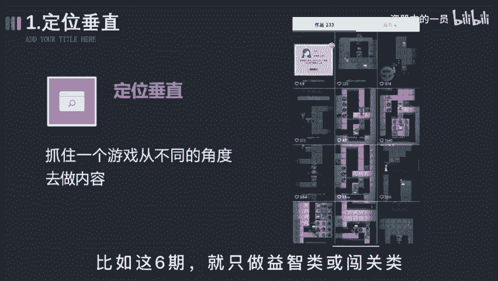
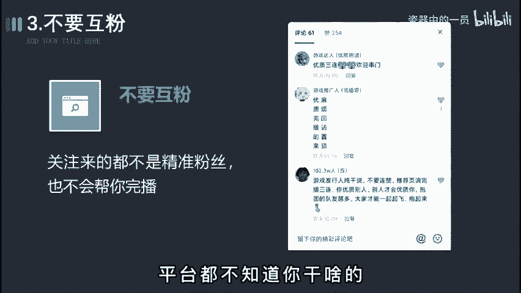
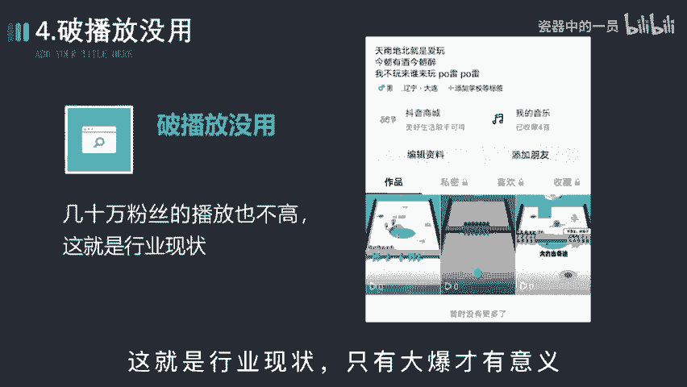
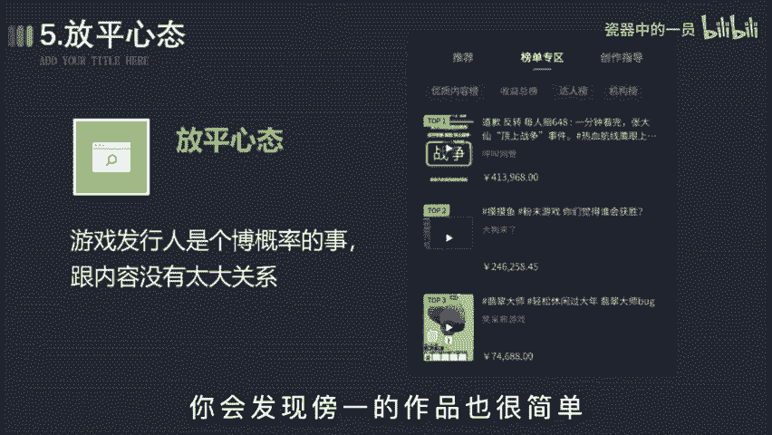

# 2024年全网最干货的新媒体运营教程，自媒体运营系统课(包含了剪辑／起号／短剧推广／今日头条各种玩法）抖音短视频零基础入门到精通，吊打一切付费课！ - P21：变现篇丨抖音游戏号怎么玩 - 瓷器中的一员 - BV1yB2zYVEr1

🎼游戏发行人要怎么起号才能有稳定的复业收入，才能让自己不那么焦虑。🎼这期呢都是我的一些肺腑之言，都是一些行内人不会告诉你的秘密，希望做任务的能够耐心看完。第一步，定位垂直。所谓垂直。

不是说你发了游戏就叫垂直，而是要以系列来发布。😡，🎼比如这6期就只做益智类或者闯关类，就抓住一个游戏，从不同的角度去做内容，测试每一个类型的游戏播放数据，而不是随心性乱发。

🎼主页干净统一一点，粉丝啊更容易关注你。🎼第二步，内容制作剪辑节奏上要短平快，不要局限于录屏和搬运，适当的加入一些其他的素材，比如表情包之类。🎼尽量呀往小孩喜欢的事物上去靠，像奥特曼、斗罗大陆之类的。

都可以作为你内容的主角，你就去蹭这些热门动漫的流量，突破游戏的圈层。第三步，不要互粉，停掉所有互关互粉的行为。😡，🎼除了让你的粉丝数变得好看些，没有任何的意义。🎼关注来的都不是精准粉丝。

也不会帮你玩播乱七八糟的人，会让系统无法给你打标签。😡，🎼平台都不知道你是干啥的那播放就更不容易增长了。😡。

🎼第四步会播放没用。🎼无论你是几千还是几万的播放，都没有什么太大的意义。😡，🎼最多啊几块十几块的收益。🎼你但凡有耐心观察下，就会发现那些榜单的其他视频大多啊也没多少赞，有几十万粉丝的播放也不高。

这就是行业的现状，只有大爆才有意义。😡。

🎼第五步，放平心态，这也是最重要的一点。🎼不要觉得说只要发了视频就播放就有收益。任何行业起信号都不会有播放，这很正常。游戏发行人呢就是个薄概率的事情，跟内容有时啊也没有太大关系。

你会发现榜一的作品也很简单，你都能随时模仿，但他就是能货，而你就不行。😡。

🎼所以啊奉劝所有做游戏发行人的玩家，你就把它当成能赚个午饭钱的差事就行。😡，🎼毕竟啊制作也简单，像我不到半小时就能出一个作品，也不耽误干其他事情。🎼如果哪个视频爆了，这就属于意外现象。🎼没报呢也无所谓。

就跟洗脸刷牙一样，就是顺便的事。🎼这样呢你就不会为了流量而焦虑。🎼但如果你实在是想要体会百万播放的快感。🎼建议你换个赛道，比如做游戏解说或者沙雕动画，去玩中视频计划，那个呀不放高，收益还比游戏稳定。

