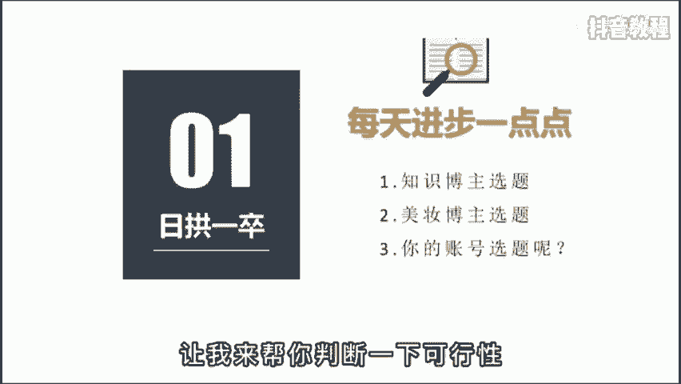

# 2024年全网最干货的新媒体运营教程，自媒体运营系统课(包含了剪辑／起号／短剧推广／今日头条各种玩法）抖音短视频零基础入门到精通，吊打一切付费课！ - P26：基础篇丨新手如何做好内容定位 - 瓷器中的一员 - BV1yB2zYVEr1

🎼你现在做抖音流的泪都是定选题时脑子里进的水，是不是想选题想的头都秃了，不知道明天该发啥。😡，🎼今天啊教你一套公式，一分钟帮你解决这个苦恼。会找选题的人呀，他会有更多的时间去制作视频。

🎼每天发三条，一个月就是9精，靠堆量都能卷死，根本不需要透透家。🎼而且会做选题的人啊，能比你更精准的找到用户的痛点所在，也更容易得到精准粉丝的驻足观看，从而快速打开账号标签。🎼那有什么办法解决吗？

当然有，这是一套呀百万粉丝博主常用的选题技巧。为了方便理解，我把它总结成了一个公式，就是内容定位加用户痛点，加借时热点。用好这个公式，你的内容啊一定不会抛片。😡。

🎼比如你想和我一样做一个知识博主，就得去啊挖掘一些行业的关键词，像播放量、粉丝量、定位选题等等。这下都是关键词啊，没有任何的主观描述。然后呢在这个基础上去寻找用户的痛点。

比如像便捷高效、技巧教学内容输出，最后啊去蹭近期的热点，把他们进行任意个组合就可了。😊，🎼那我们呀再把这个公式套在别的行业再试行。🎼比如美妆行业，内容定位是美白、除皱、口红。🎼用户痛点呢是评价好用。

明星同款避坑扫雷。🎼最后啊借时热点进行排列组合。比如迪丽热巴同款美白面膜推荐七夕，千万别送女朋友口红等等。

🎼那以上我已经举一反二了，至于反三就交给你了。你可以根据你的行业特性，把你的思考过程发出来，让我来帮你判断一下可行性。😡。

