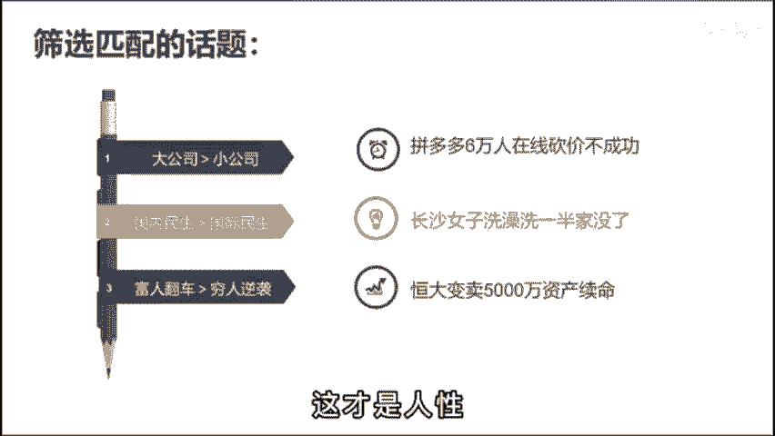

# 2024年全网最干货的新媒体运营教程，自媒体运营系统课(包含了剪辑／起号／短剧推广／今日头条各种玩法）抖音短视频零基础入门到精通，吊打一切付费课！ - P27：基础篇丨抖音如何做出爆款选题？ - 瓷器中的一员 - BV1yB2zYVEr1

🎼今天我要分享的是如何找到一个必虎的话题。🎼一个好的选题就是内容再差，也会有一定的流量。而如果你的干货都在中间啊，别人开头就划走了也没有意义。很多人啊都发出选题啊，不知道选择什么方向。😡。

🎼但找选题这个事儿，其实呢我们可以通过已经火过的内容来找到规律啊，比如说大蓝啊，你把它10万点赞的视频标题啊都扒下来，就会直观的发现。它的选题呢无外乎就这三点。大众话题反正内容与定有关。😡，🎼啊。

比如说七句话，把房价的问题彻底说明白，房价的问题呢永远是自带流量的。😡，🎼那属于啊刚才说的大众话题，而我要跟你彻底说明白，哎，这就是与你有关的范畴。😡，🎼这个选题呢同时的踩中了两个药店。

那它必然是一个优秀的选题。那最终数据呢点赞22万，评论1万，而反之内容呢则指颠覆了大多数人的认知啊，比如为什么外国富豪喜欢捐光所有财富？😡，🎼啊，正常老百姓会想。

有那么多财富不得飞集体挥霍起来啊为什么要捐了呢？这个呢就是吸引大家想要看下去的诱因啊，最终数据是157万点赞6。2万的评论。😡，🎼那道理是明白了怎么筛选匹配的话题呢？啊，比如说你是做口播知识类账号。😊。

🎼今天呢同时有3个热点。🎼拼多多6万人在线砍价不成功啊长沙女子洗澡媳妇虾美儿。😊，🎼第三个，恒大变卖了5000万资产虚面，你会选择哪个选题来做呢？🎼答案都可以，你今天去说拼多多有多恶心。😡。

🎼点赞肯定是过万的爆款视频。🎼在这里呢有一个基本的原则，就是在话题的选择上，大公司的话题大于小公司的话题。🎼国内民生话题大于国际的民生话题。🎼富人翻车的话题大于穷人一袭的话题。

🎼这个呢就是朴实无华的大众价值观。🎼那在第二点上，估计有人会反驳，啊最近国际形势才是热门呀。啊老李说的不对。😊，🎼那这种事情呢是特殊事件啊不具备参考意义。一般在正常的情况下，大家只会关心自己的生活。

这个呢是人性。

🎼那无论你是做什么类型的账号，想要有流量，就不能过多的被自己的主观感受所影响。🎼你的感受呢是没有流量。🎼大众关心的事儿才是流量密码。🎼尤其啊在内容质量相差不大的情况下，想要战胜同领域的对手。

你就得依赖一个好的热点选题。