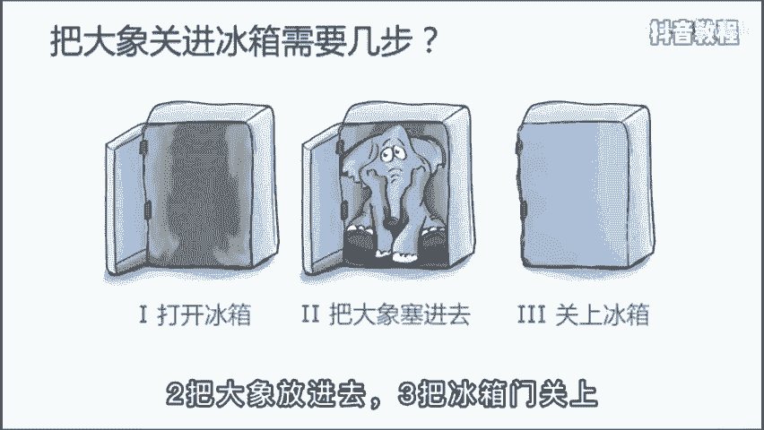
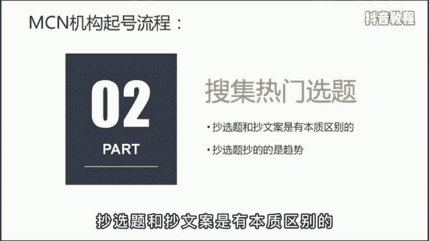
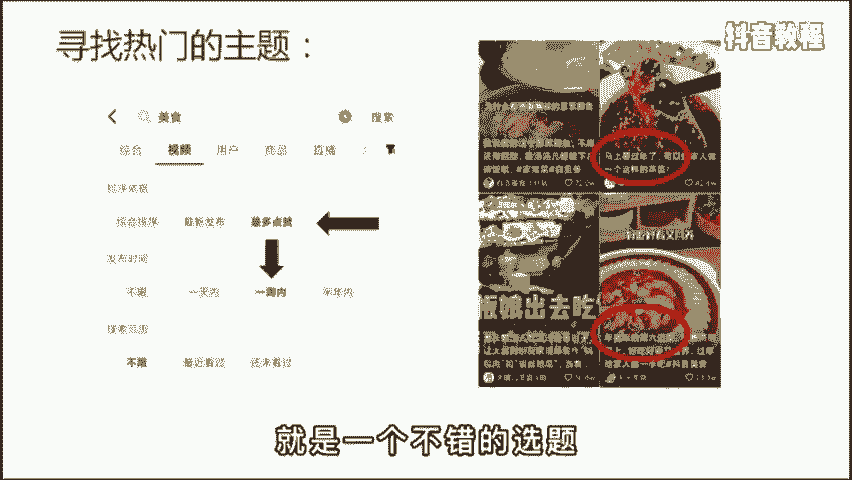
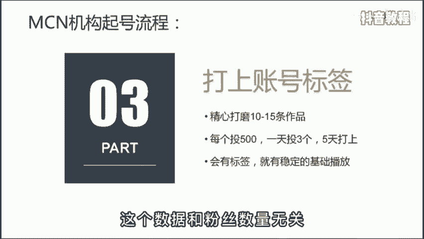
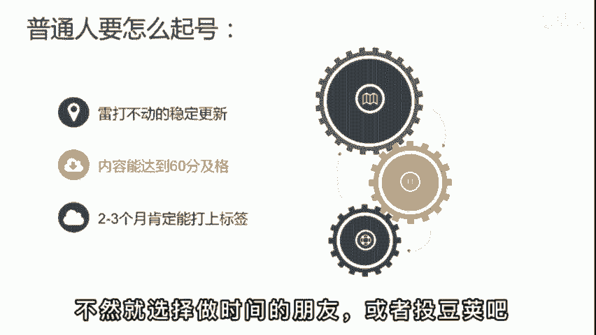
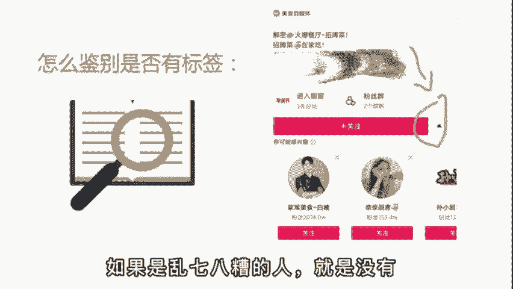

# 2024年全网最干货的新媒体运营教程，自媒体运营系统课(包含了剪辑／起号／短剧推广／今日头条各种玩法）抖音短视频零基础入门到精通，吊打一切付费课！ - P28：基础篇丨抖音起号流程 - 瓷器中的一员 - BV1yB2zYVEr1

🎼为什么同样的方法，你用的就是没效果。于是啊你开始怀疑自己的能力有问题。其实啊做短视频最重要的不是创意，不是套路，也不是颜值，而是标准化的工作流程。😡。

🎼这就跟宋丹丹的小品一样，把大象关进冰箱里，需要几步，需要三步。一、把冰箱门打开。2、把大象放进去。3、把冰箱门关上，就这么讲。

🎼M森机构拿到一个账号啊，首先就是确定定位。你是做美食美妆还是才艺，得我一个清晰的定位，确定了你的粉丝群体是哪类人？视频的展现形式是什么样的？未来如何进行变现呢？🎼第二步，在抖音里选择关键词，比如美食。

点击右上角的筛选，选择一周内最多点赞的作品，统计前30个热门作品，准备抄选题。注意啊，超选题和抄文案是有本质区别的。超选题抄的是趋势。

🎼举个例子来说，假设啊你发现教做年夜饭的视频很多，你就也可以选择年夜饭这个主题。比如挑战15天，学会为家人做顿年夜饭，这就是一个不错的选题。

🎼第三步，打上账号标签，这是啊整个流程中最重要的。🎼很多人啊做不起来账号，就是因为没有打开收签。😡，🎼所以没有稳定的流量来源。🎼MCN机构打标签啊方法很简单，就是偷透价，精心打磨10到15条作品。

每个作品投5001天啊投3个，5天就能打开标签，起号成功。后面呢就是不继续追投，也会有稳定的技础播放，一般呢是5000到50万左右的播放。🎼这个数据啊和粉丝的数量是没有关系的。

🎼那普通人没有那么多预算怎么办呢？你就保证啊雷打不动的稳定更新就好。🎼至少啊一天一个作品先发上100条。😡，🎼冷启动只要内容能达到60分及格，一般2到3个月肯定能达上标签。🎼很多人呢就是又穷又心急。

🎼明明还没发几个作品，一看不到500播放，就急得满世界找老师找破播放的技巧。其实啊谁做都一样。🎼除非你有大号已经混了个脸熟，那再起新号肯定快，不然呢就选择做时间的朋友或者偷豆家吧。

🎼那判断账号打没打上标签啊，这里有个鉴别方法，就是用另一个号去到你的主页，点击关注旁边的小三角。🎼如果下面要推荐的是领域相关的账号，就是打商。如果是乱七八糟的人，就是没有。

🎼学会后赶紧去试试吧。