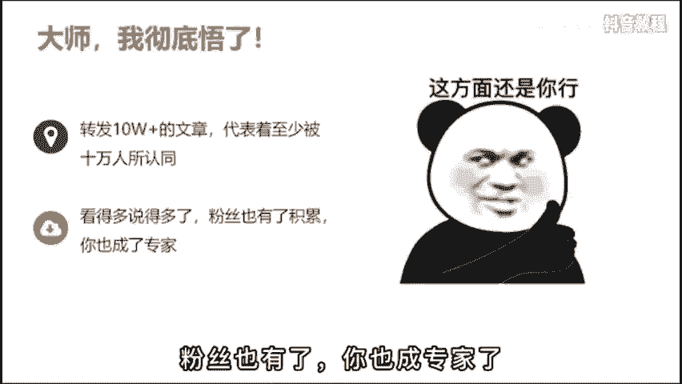
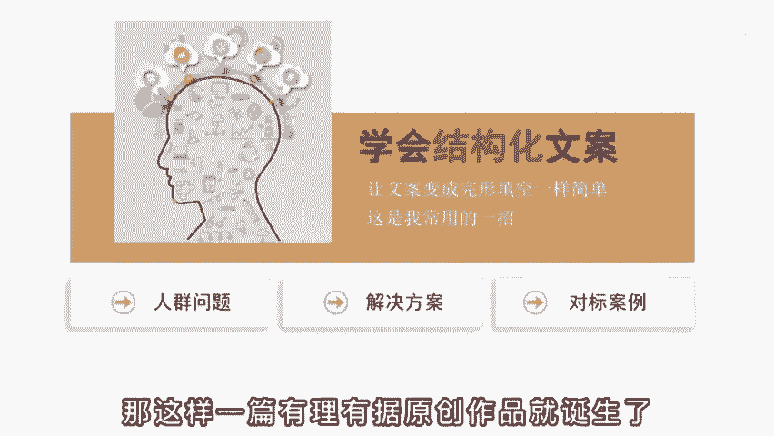
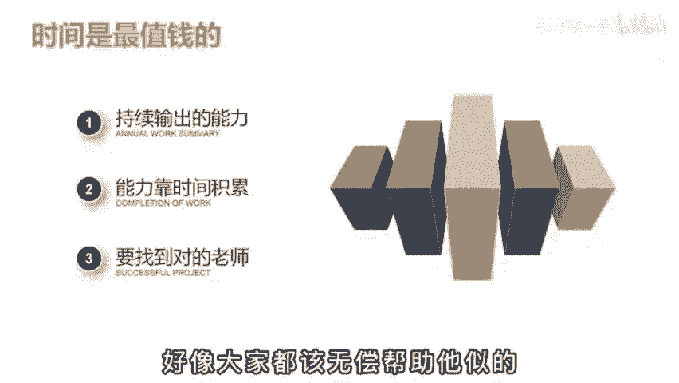

# 2024年全网最干货的新媒体运营教程，自媒体运营系统课(包含了剪辑／起号／短剧推广／今日头条各种玩法）抖音短视频零基础入门到精通，吊打一切付费课！ - P29：基础篇丨抖音的文案怎么找 - 瓷器中的一员 - BV1yB2zYVEr1

🎼说啥也不做抖音了，做短视频最崩溃的就是写文案啊，群里有个伙伴刚做短视频一个月，说什么也不继续干了，天天写800字的文案稿，还没啥人看，说自己啊都快成精神病了。然后呢，他就问我有没有一种输出方式。

可以不这么累。在自己一个人做的时候呢，也能保持作品的数量和质量。😡。

🎼我说啊酒是有，但是手段呢有点不齿啊，我是不太推荐的。🎼但是呢有一个大V就是靠这个办法积累到了上千万的粉丝。🎼这个办法是什么呢？其实啊用一句话就可以说明白任何一个图文平台出现过的10万家内容。

你都可以用短视频的形式再做一遍。😡。

🎼什么意思呢？啊？比如说啊你在朋友圈看到了1个10万家的文章，大家呢都在转发桌面这篇文章里已经被至少10万个人认同啊是能产生情绪共鸣的高质量内容啊，就比如说这个讲拼夕夕砍价的文章。😊。

🎼普通人呢就是满腔的愤怒，他觉得终于有人发声给出了口恶气。然后呢，你也想蹭这个热点。🎼但是啊你自己说三言两语，肚子里就没货了，怎么办呢？啊，你就去某号某户啊搜索相关的话题，你用口播的形式再拍一遍就。

🎼要做其他领域呢也是一个道理啊，比如说你觉得健身减肥还是一个好的项目赛道，卖健卡零食或者减肥代餐什么的，有搞头。但你是门外汉，不懂，那这个呢还是有这个办法。那，你就去找爆款的门汉，就这么讲3个月。😊。

🎼看的多了，说的多了，粉丝呢也就觉得你呢也成了行业的专家。😊。

🎼这个呢是第一个阶段，通过转换输出的方式来帮助自己快速起考。🎼因为曾经火过的内网，一定可以再火。🎼那第二个阶段呢就不能这么用了。🎼万一让人发现啊，你都没有自己的观点。迟早口碑人设会崩溃。😡。

🎼那这时呢你就得学会结构化文案。🎼把你的文案变得像繁星填空一样简单啊，比如说我常用的一个结构。🎼一、提出一个精准人群的问题。🎼第二，给出具体的解决方案。第三，给出实操的对标案例。🎼你看这不就是填空吗？

🎼当你第一阶段积累了一定的知识储备后，第二阶段会很好做。🎼啊，比如还是减肥这个问题。🎼我能提出哪些问题呢？🎼一、新手健身该怎么制定计划啊，减肥做什么运动最有效，少吃多餐对身体有没有影响？

🎼然后啊你就按照1234给出具体的意见，再给出一个已经瘦身成功的案例来佐证观点。那这样一篇有理有据的原创作品就诞生了。

🎼那这个呢就是结构化思维的好处。🎼很多人啊为什么做不起来账号，就是因为他肚子里没货，没有办法持续的输出，然后呢还不愿意花时间去积累，而只想速成。😡，🎼那想宿舍呢也行，对吧？你付费向有经验的老师学习。

他花时间花钱得到的经验肯定呢是对你有帮助的啊。你做半年都想不通的点，可能啊老师的一句话你就醒过了。😊，🎼但有部分人啊他自己的时间就不值钱，也不尊重别人的时情。😡，🎼啊，我关注你，你就该为我免费解答。

不然呢我就取关威胁，或者呢直接割韭菜盐了。😡，🎼好像大家都该无偿帮助他是不。

