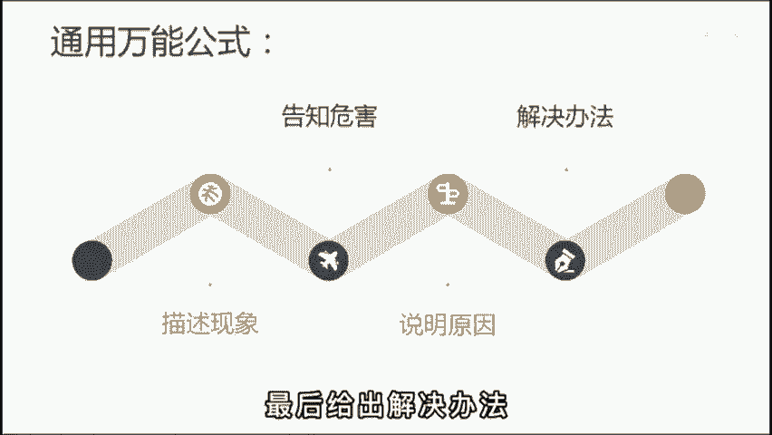

# 2024年全网最干货的新媒体运营教程，自媒体运营系统课(包含了剪辑／起号／短剧推广／今日头条各种玩法）抖音短视频零基础入门到精通，吊打一切付费课！ - P32：基础篇丨爆款文案套路 - 瓷器中的一员 - BV1yB2zYVEr1

🎼给你们经秘一个爆款文案套路，各行各业谁用谁活。在这个内容为王的时代，运营者必须要具备一定的脚本创作能力。而想要拥有创作能力。我们首先要弄清楚什么是好文案。其实啊就一点记好了，要让对方认为与自己有关。

也就是所谓的引起共鸣。如果你说的我的不关心，怎么可能会有人看呢？😡，🎼那道底是明白了，要怎么做呢？给你一个万能公式，线下加危害加原因来解决办法。🎼怎么理解呢？现象筛选用户关系与你有关就会停留危害。

负责放大情绪，不让你5秒滑走原因引导继续观看，提高完波率。最后呢给出解决办法，鼓励点赞，提升互动率。😊。

🎼那举个例子来说，比如服装行业梨形身材的女孩太难买裤子，挑错了钥匙，显得腿又粗又短，但梨形身材呢是天生的，很难改变。而这三种裤子不仅显瘦，还显腿长，穿上第二天就被小哥哥搭讪了。姐妹们赶快收藏起来吧。

你看这段短子，是不是完美契合了这个公式。开头一句话就把目标客户给锁定了，然后不断勾入她，看完视频，有了这样的精争粉丝，后面变现起来呀，也很容易。😊，🎼我们再来个运营行业，每天啊用心制作短视频。

但发完只有100多放，继续下去呢，只是浪费时间，徒增焦易。这跟你啊没有系统的运营底层逻辑有关。现在呢去看完我的前三条视频，不花一分钱也能学会运营制付。😊，🎼还不快快行动起来。🎼懂了吧？用好这个套路。

不管什么行业，网一套肯定没问题，都是不足30秒的短文啊。后边派件起来呀也轻松，尤其搞个矩阵什么的，效率会很快。😊。

🎼但以上呢我已经举一反二了，至于反三就交给你了。🎼你可以根据你的行业特性，把你的思考过程发出来，让我来帮你判断一下可行性。

