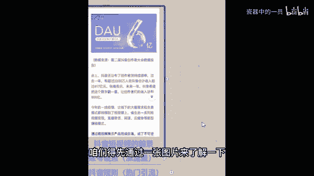
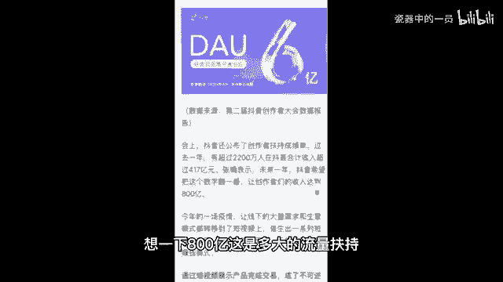

# 2024年全网最干货的新媒体运营教程，自媒体运营系统课(包含了剪辑／起号／短剧推广／今日头条各种玩法）抖音短视频零基础入门到精通，吊打一切付费课！ - P33：1、抖音短视频的前景 - 瓷器中的一员 - BV1yB2zYVEr1

了解抖音短视频的前景，咱们得先通过一张图片来了解一下。这张图片是抖音创作者大会的一个数据报告。这个报告上显示有超过2200万人在抖音的合计收入超过了多少呀？417亿元。并且啊抖音希望把这个数字翻一翻。

让我们这些创作者的收入达到800亿，想一下800亿，这是多大的流量扶持。那么同时我给你们说第一个知识点啊，就是抖音上面有两类人，第一类人叫做玩家。😡。

玩家是干嘛的？就是单纯的玩抖音，没想过从抖音上赚到钱。另外一类人，咱班同学你们都可以称作创作者，因为你们想自己制作抖音，哎，来获取一份收益，搞清楚啊，这两类人一会还会提到。

那么为什么我们选择抖音短视频呢？这么多短视频平台，快手火山短视频，咱们为什么非得做抖音呢？像开实体店铺的同学有没有咱们班有没有做实体店生意的，可以公屏上扣个一。

我看一下实体店同学一开始自己选店面选位置的时候，你肯定会找一个流量好，对吧？适合你开店流量又大的地方，像做抖音也一样啊，对吧？你做短视频一定要选一个流量大的平台。那个平台他自己都没啥流量。

他怎么分给咱他没法分给咱，咱就赚不着钱。所以抖音每天今天一天的活跃用户就达到了8亿以上，一个月的活跃用户更是达到了40亿人次以上啊。你想一下，这是多大的流量。那么流量。😡，放大竞争压力会不会很大？不会。

创作者啊只有约5000万。什么叫创作者，非得是那种网红达人，很牛逼的，才能叫创作者吗？不是啊，像你邻居家的老太太拿自己的手机拍了一下自己做的饭，传到抖音上，这个老太太算不算创作者？😡，也算。

所以你90%的竞争压力都来自于邻里相亲。那接着呃做抖音短视频需不需要买电脑，需不需要买摄像机呀，不需要啊，只需要一部智能手机和一个手机号就可以注册抖音账号。

抖音倡导全民能够通过短视频的形式分享记录自己的生活。很简单啊，都达标了。那第三个有什么样的风口值得我们去做呢。首先抖音计划，抖音计划说的是抖音将帮助1000名优质的艺术创作者涨粉超过100万。

有的同学说，老师我不会创作呀，你不会创作不用担心，你要什么都会了，就不来听老师的课了。就是因为咱们什么都不会，所以才需要老师来帮你。我之前带过很多学员，有年纪比我比较大的。

那个六七十岁的都有有社会经验也很丰富的。我当时很好奇，我说您怎么想着找我学习抖音运营呢。他跟我说了这样一段话，他说虚心请教厉害的人不丢人。就算你的年纪比我小几岁。但只要你在我。😡，懂的这个方面。

你比我有本事，我又刚好想学，那么你就是我的老师，虚心请教，你能让我少走很多弯路，所以不以年龄定高低，不以穷富断金后，所以我要求啊今天跟着我学习，包括听老师我课的学员，我希望你是这种谦虚的哎好学的。哎。

那老师特别愿意把我的知识分享给你。但是如果说你不是谦虚好学，你觉得自己什么都会了，那你可以直接退出直播间了。因为你也不是我要找的学员啊，来啊这边给大家送上一朵小鲜花。

愿意好好学的同学接着往后看市场大净控族，行业还很容易产出内容。现在是一个什么时代，大数据时代，大数据时代，人人无隐私，你喜欢看帅哥，你刷到的全都是有腹肌的帅哥，你喜欢看美女，你刷到的全都是长腿美女。

就是你喜欢看什么，抖音他就给我们推荐什么，以至于我们自己刷手机看到的内容会非常片面。有的同学说老师我。😡，这个宝妈，我不知道拍什么，我能不能拍我们家宝宝，我能不能拍我做的饭。来，我告诉你可以。

有的同学说老师我是开实体店的，我主要想引流我能拍我的产品吗？我告诉你可以，那有的同学说老师我就是一个普通的上班族，我就想分享一下我的生活，但是我觉得很无聊，我可不可以拍来可以，为什么一个月40亿的群体。

只要你拍的不是那种触犯法律道德红线，是那种低俗的东西，总有一部分人会喜欢上你一定会有人喜欢你的。那为什么老师说一定会有人喜欢你，你却只有嗯几十个粉丝呢，是因为喜欢你的这一部分人，他还没有刷到过你的作品。

你让他怎么喜欢上你，所以啊对于我们小白来说，大家都想涨粉，心情很迫切，老师理解，但是实在话不要把涨粉放成第一个目标。我们的第一个目标是什么？先把流量涨起来，把播放量涨起来，你的粉丝自然就来了。

这一点能明白的同学公屏上给老师我扣个明白两个字哈。😡，あ。