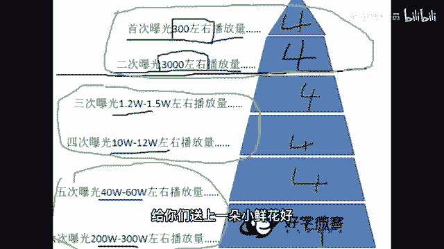
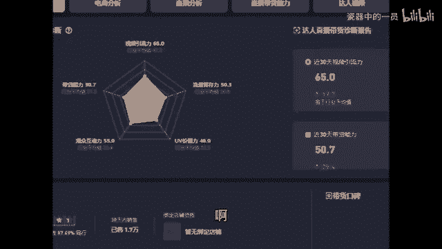

# 2024年全网最干货的新媒体运营教程，自媒体运营系统课(包含了剪辑／起号／短剧推广／今日头条各种玩法）抖音短视频零基础入门到精通，吊打一切付费课！ - P37：5、如何上热门 - 瓷器中的一员 - BV1yB2zYVEr1

怎么热门引流呢？都想上热门来看一下上热门的因素，对吧？什么因素取决于你的视频能不能火起来呀，就这四个因素。呃，前三个我相信我不用给你们讲，你们都知道来第四个我着重讲一下玩播是什么意思。

玩播就是别人把我们的作品从第一秒钟看到最后一秒钟，从头到尾看完了就叫玩播。你想抖音视频千千万能给咱视频看完，那证明咱视频肯定好，他肯定喜欢咱，对吧？不然他看一半就走了。

那么有的同学说老师既然玩播挺重要的，我可不可以拍视频拍的短一点，我就拍3秒钟，这样别人一下子就看完了，我是不是能火呀，呃，格局小了，他的确给你看完了。但是他如果不给你评论点赞啥的那也没用啊，光看完没用。

这四个都很重要啊，这是取决于你上热门的评论点赞转发完播。那么接着你的流量是怎么来的。什么叫上热门上热门不就是你的播放量特别多，这就。😡，要上热门，那么你的播放量是怎么来的呢？😡。

来这张图是我们自然流量池的一个图，咱抖音给咱流量不是从第一个一直给给给给给给到咱上百万个流量，他不是这么给咱的，他怎么给咱啊。哎来哎跟老师我一起来看一下啊，他是这么给咱们的。就是我们班每一位同学。

你发布一条视频出去。抖音啊都会给我们300左右的播放量，可能有的同学是呃一两百，有的同学可能是四五百就是三00左右。然后我们在这个播放量里面，那四个评论点赞转发完播四个数据都不错。

那么恭喜你你就会获得第二次曝光，他会再给你3000左右的播放量，但是在3000左右的播放量里面，你那个评论点赞转发完播不咋地了。唉，那么老师我很遗憾的告诉你，你的播放量就只有3000多，就不会再增加了。

必须是这四个东西，你看这四个评论点赞，转发完播一直都很好。他会接着给你一万多。😊，10万多40多万230百万的播放量，咱播放量是这么来的。那么你们现在都处在第几层流量池啊，可以告诉老师一下。

是不是大部分同学都在一和二啊，这个播放量可能偶尔作品好了一点，是不是来到第三层和第四层了呀，都是在什么情况呀，也可以分享一下啊。😊，还是很希望咱们大家努努力，咱不要老在上面飘着。

咱们争取来第五层和第六层播放量转一转啊，都可以加加油，给你们送上一朵小鲜花。好，那么老师接着带咱们班同学往后看了啊。😊。

嗯，既然我们已经知道了呃，播放量是怎么来的，也知道热门是需要哪些因素才能上的那我要问一个问题了，就是咱们班同学有没有投过抖家的同学呀？投过抖家的同学公屏上给老师我扣个一。

我看一下看咱们班同学多少人花花过钱，为抖音花过钱的，扣个一啊。然后投过抖家的同学接着再回答我一个问题，就是你觉得投了之后呃，以他是对你来说有帮助还是没有帮助，有帮助的，扣个有没有帮助的扣个没就行了。

我看一下啊，包括有的同学不知道抖家是啥？抖家就是呃，你给抖音给抖给抖音花钱，抖音让你的作品被更多人看到，就是给他充钱。😡，有的10个同学里面可能有7个同学说没有用啊，有浏览量，有浏览量量不叫有用。

那个浏览量是你花钱买的，你只要给他充钱，他都给你浏览量，那个不叫有用，什么叫有用，你充了抖加，他给你涨很多粉丝，涨很多点赞，那才叫有用，光涨浏览量不叫有用啊。来仔细听，不管你们投没投过。

老师帮你解决这个问题之后别乱花钱啊。咱们。😡，抖音有两个流量池，一个叫自然流量池，就是咱刚才看的那个图片嘛。你的作品好，这四个数据好，给你更多流量，数据不好就给你300多。还有一个流量池叫做抖加流量池。

😡，这这两个流量池啊，它是平行的，它不是叠加的。有的同学哎就是说给抖家充钱了。哎，抖家给我流量了，觉得哎是不是有用啊，不是它是一个商人，你给他多少钱，他给你多少流量。而且你俩是明码标价，谁也别欠谁的。

他绝对不会多给你自然流量池就是你数据好，他多给你。那么我们能不能靠抖家上热门呢？嗯，我也不知道能不能我告诉你一个数据，你自己来判定，你觉得能不能啊，就是一个普通的作品，你想靠单纯的投抖家。

而不是靠视频质量，想要他播放量达到几十万上百万上到热门的话，你需要投16万人民币。那你觉得他能不能帮助你上热门。我觉得如果我们都是大土豪的话，那抖家能帮咱们上热门，不就投16万嘛？

但如果我们都是普普通通的嗯，神经病才会花16万投抖家呢？所以可能对于咱们来说，他没法帮咱们上热门啊。那么如果你真的想要投抖家，你怎么去投，不要胡乱投了。😡，啊，来这样去投，你发了一条作品。😡。

你先别着急抖抖家，你先隔半天或者第二天你看一下，结果到了第二天，你发现他只给了你300左右的播放量，证明什么证明你数据不咋地，别人不怎么喜欢看这种作品，你就别投抖家了，他对你没有任何帮助。

那么接着哪种作品适合投抖家还是一样先发呃，先发出来，先别投抖家，然后过个半天过个第二天看一下。如果说他给了你包括说一万多的播放量，给了你10万多的播放量，证明什么？证明别人喜欢看这个作品，这个作品好。

那这个作品好的话，你再花钱投抖家效果一定不错，抖家，他就是只能给你起到锦上添花的效果，就是你这个东西本身好，他能让你更好。如果你这个作品不好，你投了抖家，你就是拿钱砸水漂，你连个水漂动静都听不见。来。

这一点能够明白的同学在公屏上给老师我扣个明白两个字啊，确保咱们是知道怎么回事了。包括说后期老师我会告诉你，咱们如何翘。😡，动自然流量池，如何通过把作品做好，它给你更多流量。

而不是说我们只是盲目的充钱小火，那不现实哈。好。😊。