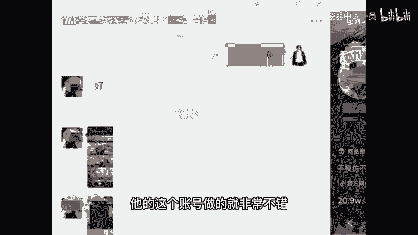
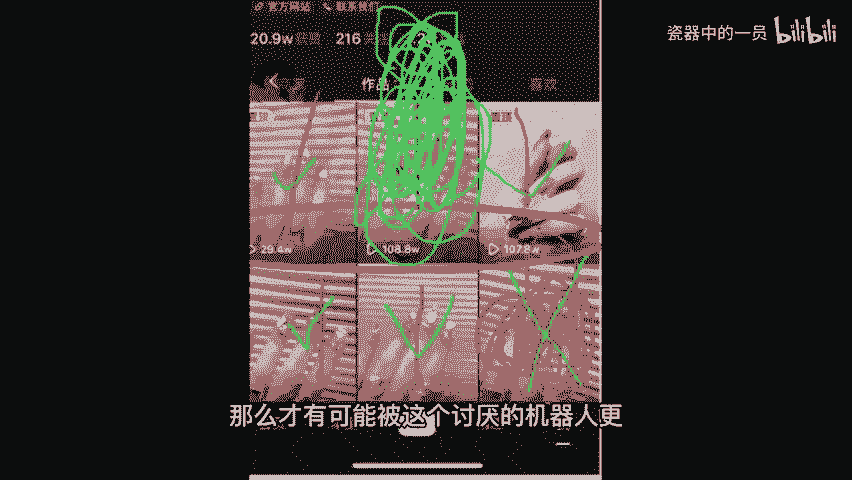
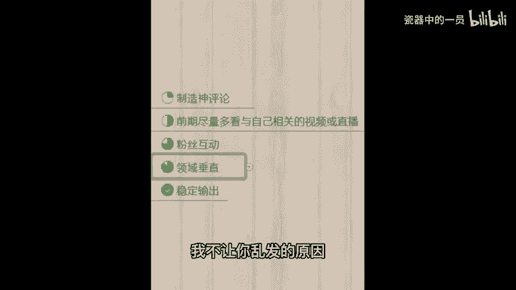

# 2024年全网最干货的新媒体运营教程，自媒体运营系统课(包含了剪辑／起号／短剧推广／今日头条各种玩法）抖音短视频零基础入门到精通，吊打一切付费课！ - P39：7、分析不能上热门的因素(下) - 瓷器中的一员 - BV1yB2zYVEr1

那么接着第二个，前期尽量多看与自己相关的视频或者是直播。既然你有目标了，可以多去看一下同行同行业，包括同行的一个视频，他们是怎怎么制作的。一方面啊，你能够把你的活跃度提升。另外一方面呢。

你又能够加强你自己的权重和定位，这是件好事情啊。那接着往后粉丝互动。这一点就是咱们前期自己没有多少粉丝的时候，有有人给咱评论的时候啊，你给人回一下，不要太高冷。后期咱的这个评论增多了。

那么你就挑选那么个三条或者5条回一下，不要都回啊，这是你粉丝多和粉丝少的一个区别。记住，那第四个领域垂直。😊，领域垂直，我直接大白话给你讲，就是你是做什么的，你就拍什么，你不要东一下西一下瞎拍。

千万不要拍成朋友圈。来，我这边给你看一下我之前带过的那个学员，他的这个账号做的就非常不错。呃，自己开店铺的一周涨了5000粉丝，来，你看他这个主页是不是你看这个主页的第一眼，你就能够知道他是干什么的。

包括他开什么店的，一眼就能看出来，一看就是开美甲店的，他这个就做到了领域垂直。那我们回忆一下你自己的账号，你给你5秒钟看一眼自己的账号，你能看出你自己的这个账号是做什么领域的吗？如果说看不出来。

那证明肯定没有领域垂直，尤其是东一下吸一下封面都不注意的。来，我给你们举一个呃讲一个打标签的知识点啊。你看这里有6条视频呃，比如说12345，这5个他很听老师话，都发的是美甲。第六个他没听老师话乱发。

发了个宠物，结果好。😡。

巧不巧吧，他的美甲作品都没火，他的宠物的作品浏览量点赞啊都小爆了一下。那么我告诉你，不管他发多少美甲的作品都没用，这个抖音的机器人还是会给我们打上一个宠物类型的标签。我们不想做宠物咋整啊。

那你必须持之以恒的更新你的美甲作品，直到有一天你的美甲作品，浏览量啊，点赞啊都爆了，并且一定要爆的比之前这个宠物爆的还要厉害，那么才有可能被这个讨厌的机器人更改标签，这也是为什么老师我不让你乱发的原因。

如果咱们班同学已经说主页乱七八糟看不出什么领域了怎么办？不要去删除哈，删除会影响你的主页曝光和粉丝量，以后遇到不喜欢的视频尽可能不要删除，我们怎么办？把它设置为仅自己可见，把它私密起来。

隐藏起来就可以了啊，记下来我们不不需要删除了，设置为仅自己可见隐藏起来即可。😊。

。这个时候你下课就可以按照老师说的，包括啊看一看自己的主页呀，隐藏一下视频啊，取消一些毫无意义的关注啊，都可以去做啊。包括自我介绍啊，包括你的名字啊，都可以去完善啊，那接着往后稳定输出。

咱们班同学都是几天更新一条作品啊，可以扣在公屏上面，让老师我看一下，直接告诉我，你几天更新一次作品，稳定输出它的字面意思就是说只有我们稳定的更新咱的作品了。抖音它才会给我们稳定的流量。

如果说你更新作品都是那种随随便便啊半个多月，这样啊一个礼拜更新一条作品。说实话这个时间稍微有点长，他抖音不会认为我们是一个稳定的创作者，那么我们应该怎么办啊？来，同学们，你想把抖音做好。

那就如果你工作不忙的同学可以每天更新一条工作不忙的啊。如果你工作比较忙的，可以两天更新一条或者三天更新。😊，条都算稳定啊。像老师我说的这个都不错。那么有的那你如果说10天半个月更新一条。

我就不建议你做了。因为时间太久了，抖音不会认为你这个人很稳定，他也不会给你越来越稳定，越来越多的流量啊。记住老师说的，那么有的同学每天更新好几好几条，每天都发个三四条这种老师我告诉你不要这么去做。

为什么有同学说老师我每天发好多，我怎么还不行啊，是因为如果说你每天发了好多视频，但是你的视频嘛，每一条质量又不怎么样，别人又不怎么喜欢看你每天发再多都没有用抖音他就会认为你不是一个优质的创作者。

什么是优质创作者。就是可能我们两三天发一条，或者是一天发一条，两天发一条只发一条，但是我们发的这一条作品，质量非常的高，他就会判定为你是优质的创作者，给你更多流量。但是如果你每天发那好多条。

每条都不咋地，那么你就被移出优质创作者的行列了。所以不要乱发。😡，啊啊，按照老师说的，尽可能咱一天一条或者两三天一条，对吧？你实在偶尔想要一天发两条也行，但你别天天整个三四条啊。

这是老师我跟你说的提升账号权重的这5个方法。来这5个能够听明白，并且自己做了笔记的公屏上给老师我扣个明白两个字啊，确保咱们班同学都能边听边会。😡。

