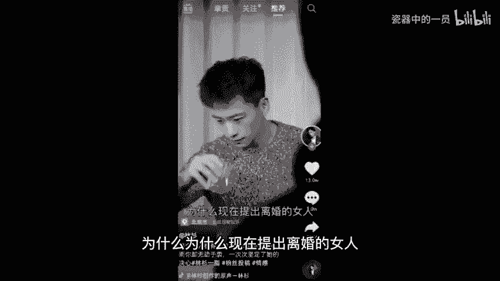

# 2024年全网最干货的新媒体运营教程，自媒体运营系统课(包含了剪辑／起号／短剧推广／今日头条各种玩法）抖音短视频零基础入门到精通，吊打一切付费课！ - P40：8、视频制作核心(上) - 瓷器中的一员 - BV1yB2zYVEr1

视频制作的核心，这是一个大板块，先跟老师一起来看。我先给你们放一个视频。呃，看完这个视频要回答我的问题。我的问题是来思考一下这些视频它能够火起来的共同点在哪里，然后回答在我们公屏上啊，看谁先答出来。😡。

老婆，你觉得女人真正吸引男人的是什么呢？你喜欢的人叫是什么？😊。

我喜欢的人叫我滚，普通人怎么用帽子拍大片？哥，你觉得快乐是什么？什么是真正的打水漂？😊。

今天给你看看什么叫真正的打水漂，如何拒绝道德绑架，中午发钱记得转给我，明天一起给你。😊。

🎼为什么现在提出离婚的女人越来越多了？大家知道为什么饭店的鱼汤喝起来那么好喝吗？娶里的话需要多少彩礼？8万10万吧。

哎，有的同学回答情感哎，不是情感，因为它里面还教你怎么摄影啊，包括怎么做饭，那肯定不是情感啊。有的同学说问答问题，对吧？哎，没错啊，跟情感没关系，是不是抄作业了啊，来，没错啊。

他们这些视频的共同点都在于开头提出了问题，呃，有些同学很认真拍视频可能开头来个自我介绍。比如说我举个例子，大家好，我叫小月，我来自赣州，今天我给大家讲一节抖音的课程，你拍一个这个短视频啊。

短视频有人看嘛，人家立马划走，因为短视频它节奏非常的快，你像你刷视频是不是希望他上来，直接说事儿，哎，我不好奇你是谁，我也不在乎你是谁，来，你直接给我有事说事，对吧？咱们刷视频也一样啊。

那如果说咱们做视频，记住，开头别废话，开头用抖音的黄金时间3到6秒钟，直接说你这条视频要干什么，或者你的标题就围绕视频的内容去做，让别人一看。😡。

开头第一句，他就知道你是做什么的，如果他感兴趣，他就会看完，不感兴趣，他直接划走证明呃，咱们想吸引的也不是他嘛。所以来开头3到6秒是黄金时间，不要把这个黄金时间给糟蹋了。那我们来看一下标题应该怎么去起。

我找了10个行业的标题，可能没有咱嗯可能没有咱们同学的，不用着急啊，我带你们先浏览一下划重点来比如说服装类型的，成熟女性划重点，要懂得这些穿搭技巧，来宠物类型的，你划重点见过猫咪游泳嘛？

来美食类型的鸡蛋这样做，孩子特爱吃教育类型的父母一定要知道的这5个细节，包括美妆类型的学生党，你们是不是还在用这个来汽车类型的，穷人适合开什么车，来家居类型的。

家里这三种物品可能含大量甲醛会释放毒气很多年，你家有。😡，有吗？来一下就吸引别人母婴类型的烧钱又不实用的婴儿产品，你买了吗？来看到了没有？这些标题都很吸引人，而且我画出来的重点在于什么？

他们都吸引了一个群体。😡，边听我讲课边思考了啊，咱们是边听边思考的一个课堂。来，我的问题是在于你思考一下你做的那个短视频吸引的群体到底是谁，然后可以打在公屏上，我举一个例子，比如说我做的是服装。好。

那接着我卖的到底是男装还是女装哦，女装，那吸引的肯定是女性群体啊，那再接着我这个女装适合多大年龄阶段的人穿，20多岁30多岁，40多岁还是50多岁，对吧？我的服装适合哪个年龄阶段的哈。

比如说二三十岁的哈，女性232三十岁。接着我这个服装是适合职场女性穿，还是说居家休闲的宝妈穿，还是追求价格实惠的学生党来穿，我再结合啊，我这个衣服很便宜，性价比很高，而且适合学生穿。

那我的啊可能锁定的群体，就是女性啊，多少哪个年龄阶段的追求什么价格的学生党，对吧？抓准群体不要指望40亿群体都喜欢咱。😡，神仙都做不到，你们对吧？吸引的是哪个群体思考一下，哪怕说你吸引的是男性、女性。

哪个年龄阶段的对吧？对什么感兴趣的，你看这个你要不动脑筋，你说你后面该怎么搞，得自己思考出自己的群体，你要实在找不着，你课下哎，我和你一对一沟通，我帮你找好不好？来，接着群体结束了之后。

再找这个核心话题。😡，他们感兴趣的核心话题。你比如说你做游戏的好，你这个游戏，比如说你打的是那个彩虹6号，你吸引的都是男性群体，女性很少去玩，那你肯定要找男性群体好奇的点，对不对？

你不可能拍一个口红颜色呃，哪个颜色好看，那男生大概率不会看，接着一问结尾，这个记下来，一会儿我们会来到文案环节，你不会选文案，老师我会教你怎么样去选文案，先不用着急。我看有同学问什么产品啊。

问什么黄金啊，对吧？你想一下你的产品吸引的是哪个群体啊，比如说你卖的你得看你卖的是什么产品，对吧？就跟服装是一样的，那个比如说你卖一个老年保健品，你也不可能说吸引学生党，十几岁的人去买，对吧？😡。

