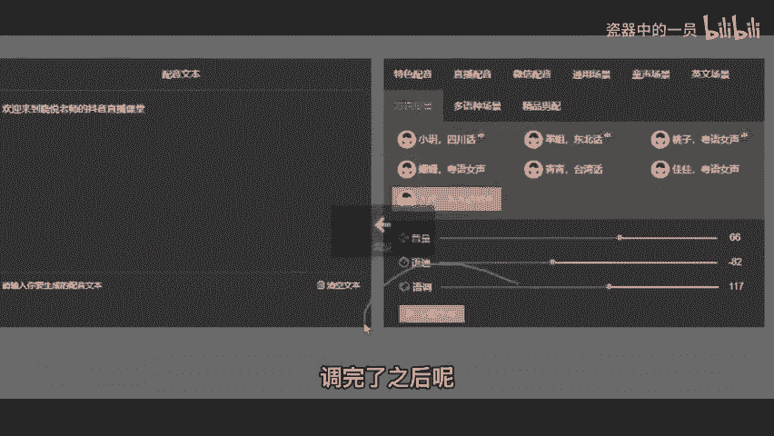

# 2024年全网最干货的新媒体运营教程，自媒体运营系统课(包含了剪辑／起号／短剧推广／今日头条各种玩法）抖音短视频零基础入门到精通，吊打一切付费课！ - P42：10、如何寻找文案-1 - 瓷器中的一员 - BV1yB2zYVEr1

咱浏览量涨上来了，是不是得让他变成咱自己的粉丝，然后你再赚钱，对吧？你想让他变成你自己的粉丝，那么一定是优化作品吸粉。像我刚才说的，你哪怕每天认认真真兢兢业业发个三四条。结果你那每条视频都不咋地。

流量也不好，抖音他就不会给你更多流量，那反而效果差，咱就做到我虽然只是一天发一条，或者虽然只是两三天发一条，但我发的每条视频都很吸引人。那效果不就来了吗？来，怎么把作品优化，一步一步讲，都不要着急。

先解决文案问题，很多同学不会写文案，没关系，来先截个图，截完图的同学公屏上给我扣个一哈，给你10秒钟的时间截图。😡，来赶紧截图，我就先给你介绍一下这5个是啥，这5个是文案的网页，不是APP不需要下载。

你只需要打开你手机或者电脑，手机电脑都能用啊。百度浏览器啊、搜狐浏览器啊或者是360浏览器啊，一搜直接就可以用啊。😡，🤧咳。好，差不多了是吧？都截完了。那我直接讲了，我拿这个淘金阁给我们举例子。

我直接点进去告诉你教你怎么去用啊，边听边辑来，这是淘金阁。我给你们看一下，这是上面的这个网址，你自己如果搜淘金阁，发现广告太多了，咱直接点网址进去也行啊，给你们发上去了，自己存一下。

然后你看这个主页有非常多的这个内容啊，财经军事动漫科技美食美文、星座体育、旅游、育儿、汽车社会娱乐时尚，包括什么。😡。

房产啊、国际呀、宠物呀。等等我就不念了啊，非常多。那么我们随便点一个。比如说我们点一个情感类型。你看这还有咱们同学说的那个三农呢，很多啊情感类型，然后你往下翻，看到了没有？

这一页就有这么多情感类型的话题，而且一共有5页，老师，我刚才让你截图了5个平台，我觉得是够你用的了。那么你到时候挑选文案，你不知道怎么选，我是不是刚才也让你保存下来了。

我说的那个一个群体加一个核心话题加疑问，你可以去套一下，你觉得合适，咱就可以用这个啊，选一选嘛，你就不缺文案了，你到时候就是说这么多，我选哪一个好，接着。😡。

有的同学说，老师这里没有我想要的内容怎么办啊？你有条件的开个会员，咱从上面搜啊，不想开会员的同学，咱们看到这个下面啊输入多个关键词。比如说我们可以搜一个来，老师，我这边搜宝妈两个字，我们直接点开始抓取。

😡。

看到没有？这里红色的是不是全都是宝妈呀？我个人觉得是够你用的。来这个会用的同学公屏上给我扣个666啊，我电脑怎么用的？你手机就怎么用，手机电脑全部通用，不用担心手机不会用啊，按照我说的。

然后我再给你推荐一个，有的同学担心自己声音不好听的。我刚才也问了，有担心声音不好听的来。😡。

点右上角这个小工具看到没有啊？点进去，我们接着点第四个，看到没配音在线生成，咱点进去。😡。

哎，让他给你配音，又免费又不花钱，又配音种类多。你看淘金阁的配音制作功能展示怎么使用啊，老师教给你看到了没有？这里有非常多的亲和女生温柔女声甜美女声，然后往下翻，还有什么自然女声卖场广播很多。

然后直播配音有亲切女声活力女生，然后通用场景，标准男声标准女声，什么湖南众口音同声场景，小孩的声音，然后配英语的啊，英文，然后配方言的四川话粤语东北话、台湾话，然后这有外国话，还有精品男配。

有什么情感解说，影视解说娱乐解说啊，不念了太多了，回头自己看看啊。那我们怎么做呢？左边这个配音文本，这里输入你想要的，比如说我输入一个欢迎来到我想提个问题，我想知道你们听我的课听了这么久了。

知不知道我叫什么名字呀，你把老师我的名字扣在公屏上面吧。我看一下。😊。

你不可能说听我的课听那么久了，连我叫什么都不知道吧。哎，你看我只有我们三三同学知道老师我叫什么吗？其他同学你都是怎么听的课呀？😡，欢迎来到小月老师的抖音直播课堂啊，咱们其他同学打字打的比较慢是吧？

来在这边记住了啊，不要把我的名字叫什么都忘记了，真的是生气了啊。来在这边打好你想要的文案或者复制粘贴进去。咱们右边选一个比如说我们选个方言，选个大虎的东北话吧，选好了之后啊，调一下音量。

音量可以调大调小，语速可以让他说话快一点，说话慢一点，语调可以高一点或者低一点都可以啊。调完了之后呢，我们直接点击一个立即生成。你到时候用手机的话，你就拿这个手机截个图，哎，拿微信扫码登录一下。

就能免费使用配音了，非常方便啊，不用花钱，你看配音生成列表，这里右下角就能下载。然后你直接把你配的这个音下载到你的手机上，然后回头一会到剪辑环节，我教你怎么去使用它啊。反正你是知道怎么去配了。

这就是咱们的文案啊，不仅。😊。

解决了文案的问题，还连你的这个配音声音问题一起给你解决了。我个人觉得是非常不错的。😊。