# 2024年全网最干货的新媒体运营教程，自媒体运营系统课(包含了剪辑／起号／短剧推广／今日头条各种玩法）抖音短视频零基础入门到精通，吊打一切付费课！ - P45：13、视频类型案例分析-4 - 瓷器中的一员 - BV1yB2zYVEr1

接着往后看啊，晒过程哎，万物皆可晒过程。我不管你做的是哪个领域，不论是什么健身、游泳、服装、美食生活类型，什么钓鱼啊等等啊，我就不一一列举了，都能来晒过程。比如说晒制作过程，工作过程，卖货过程。来。

我给你们举一个万物皆可晒过程的例子啊。刚才有个同学不是说自己是做健身类型的嘛。来，我给你们看一下，我之前带过的一个学员，他就和你们很像啊，就之前那个朋友圈看他发的啊，拍拍自己去哪玩了啊。

拍拍自己的这个啊帅气的照片，拍拍自己出去玩的风景，看一下他的播放量啊，100101279，就权重很低。然后接着啊我们啊一对一的沟通之后，就围绕健身减肥，现在是全民健身的时代，就晒过程，晒什么过程。

晒健身的过程。同时晒过程的同时教给别人一些健身。😡，知识，那你看它的播放量150多万、210多万、380多万，就是围绕一个领域的视频，认真坚持做下去。并且你拍的这个内容有知识，让别人看完之后能学到东西。

那就是一个好作品。我再给你们举一个例子啊，这个学员就是按照老师我刚才说的去做的。它是自己有工厂做的发箍生产类型的。😡，他就是自己有工厂嘛，平常拍自己工厂，拍自己的发箍，没人看这边这条视频185万。

为什么流量爆了呢？因为我让他晒过程的同时，画面是晒过程，然后呢，声音配上了一个故事，你看忍住一天不联系，你配上了一个故事，结果呢播放量一下就爆了。你说一条视频，100多万人看给你引个几万的顾客。

几万的流量，好像并不难吧。那接着再看一个宝妈的吧，呃，雨露均沾一下，咱都瞅一瞅。😡，这个宝妈同学之前就是宝妈都喜欢拍自己家宝宝嘛，老师我也理解她就很喜欢拍自己家宝宝。你看播放量400多播放量。

200多播放量，100多播放量啊，拍完后期我们怎么做的呢？可以拍宝宝不用改，对不对？你拍宝宝没有错。那我们拍宝宝的小脚丫还是一样的拍，接着配上一个搞笑配音，有意思的配音，结果给到了1400多万的播放量。

1400多万人看过他们家宝宝的小脚丫，觉得好玩，觉得有意思关注他这边也是小脚丫250多万的播放量，你就可以看出，其实呃拍还是那么拍，只不过我们只是微调的一个办法而已，对吧？同学们可以理解吧。

只是微调一下，并没有说你平常自己制制作那么复杂，这就是老师我跟你说的万物皆可晒过程。我举一个例子啊，晒过程它最主要注意的是什么？是对比。😡，怎么对比呢？来比如说我做服装好，服装穿搭。

我之前穿我自己的衣服，哎，在视频面前看起来像120斤。我穿了我准备要卖的衣服，我的产品，我搭配了一下，哎，一下子显瘦20斤，对吧？这就是对比对比越强烈效果越好。比如说做美发呀，做美甲呀，等等。

都是一样的，全部都是对比在里面。你看指甲之前是什么样，做了美甲之后之后是什么样子，发型也是一样，包括说你们能想到的呃，晒自己的生活呀，晒美食啊，对吧？晒工厂啊。

都可以配上老师说的画面是一部分再配上任何一个搞笑趣事或者一个故事，都是很好的一个灵感。那这边我给你们举一个例子吧，这是我的一个学员，他的名字叫海椒，抖音上直接可以查到它它是一个小学学历的农村宝妈。

我给你们看一下它的这个美食生活类型的视频是怎么做出来的。那么看完之后呢，告诉我，这个是强人设还。😊。

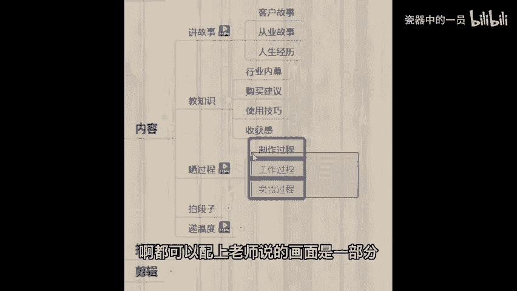

若人设呀。😡。

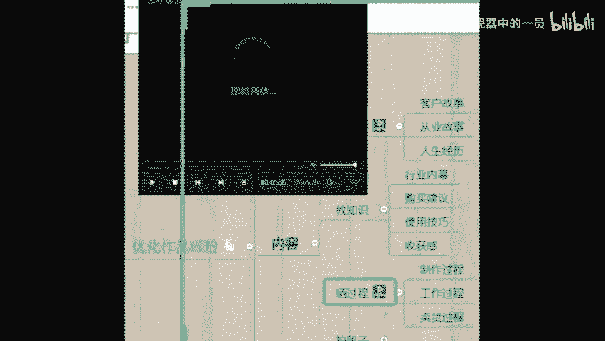

🎼今天给大家分享一个养殖甘露。😊。

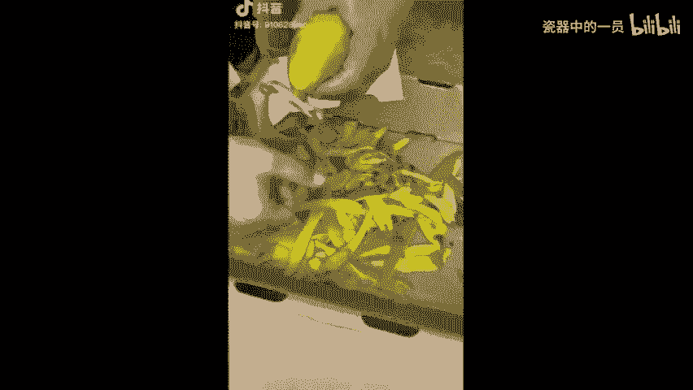

🎼Yeah。

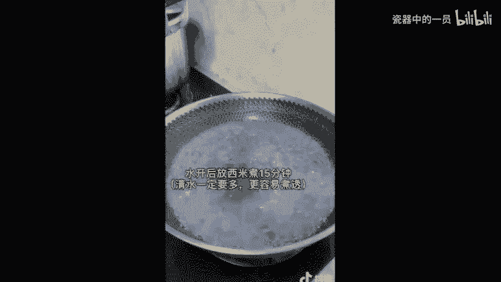

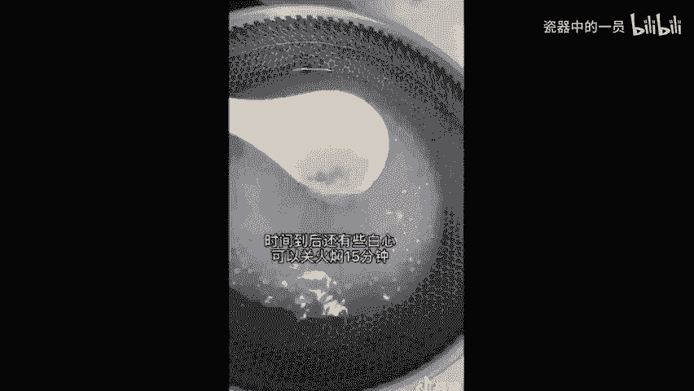

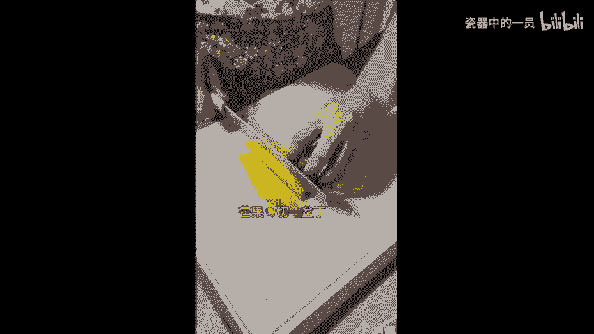

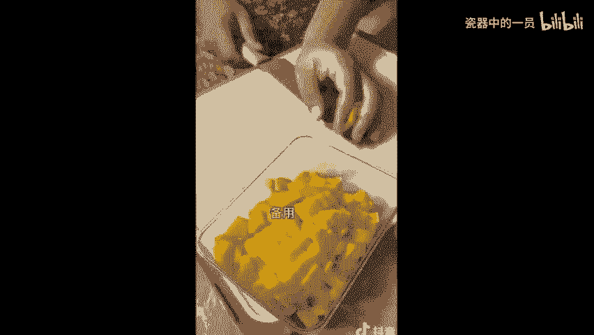

🎼静静的夏天，天空中繁星点点，心里头有些思念，思念着你的脸。😊。

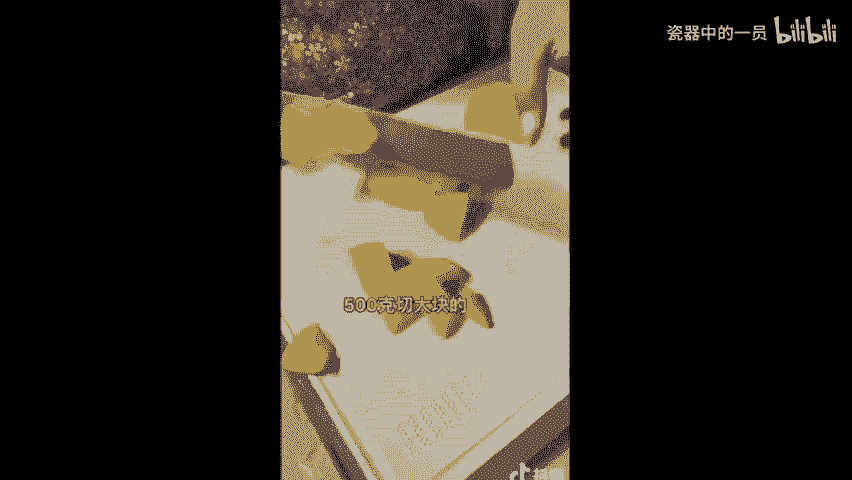

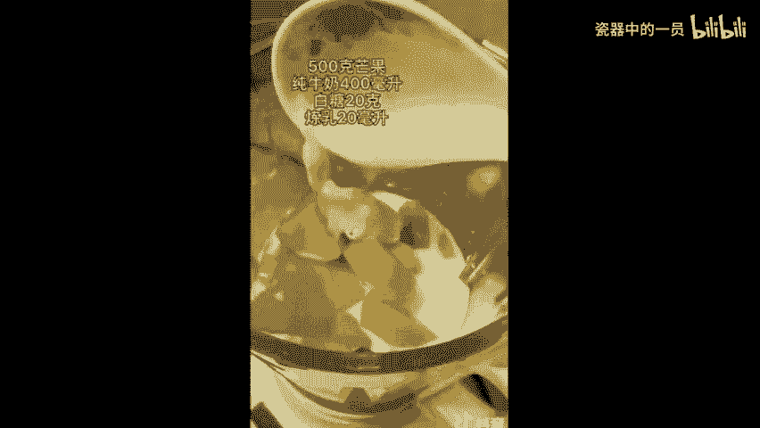

🎼我。🎼假装看不见。

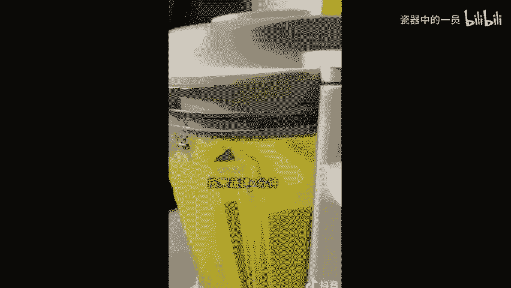

🎼也可以偷偷的想念。🎼直到让我。

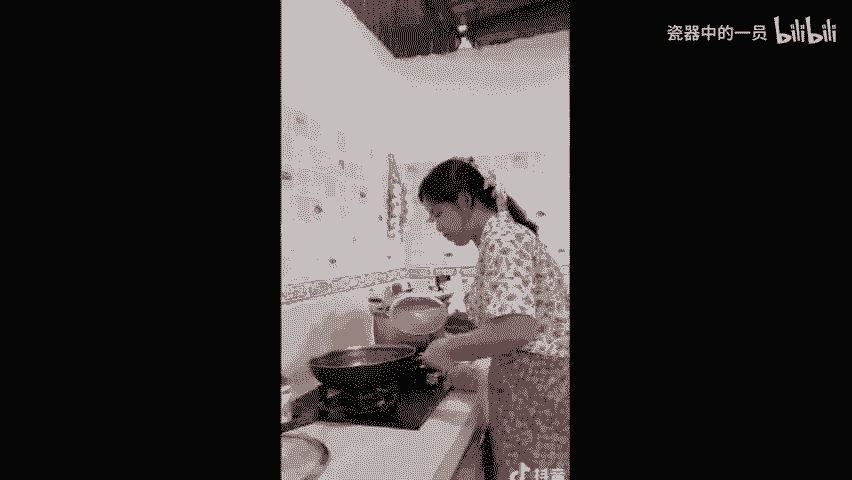

🎼我到你。🎼的温暖。

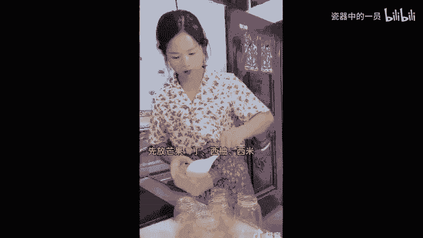

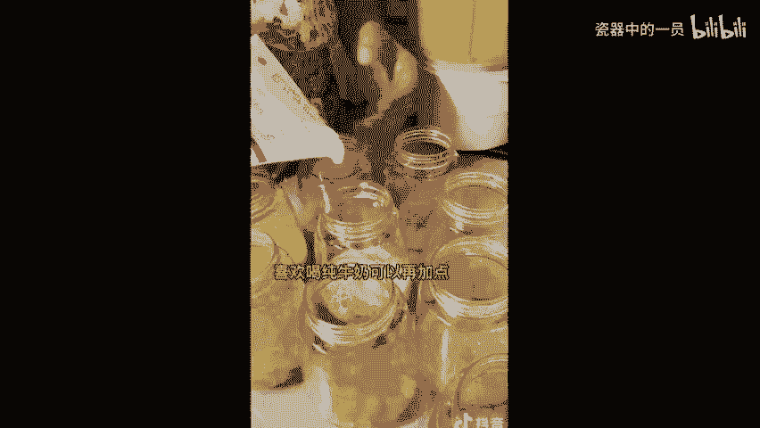

🎼宁静的夏天，天空中繁星点点，心里头有些思。😊。

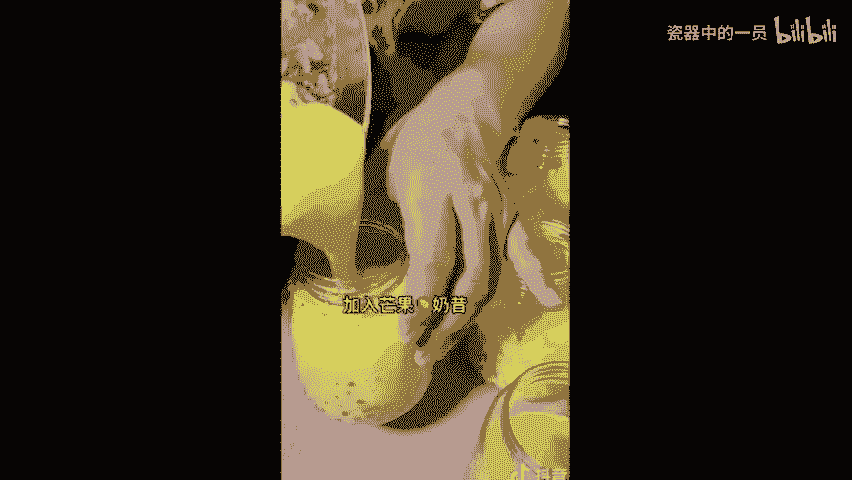

🎼思念着你的脸。🎼我可以假装看不见，也可以偷偷的想念直到让。😊。

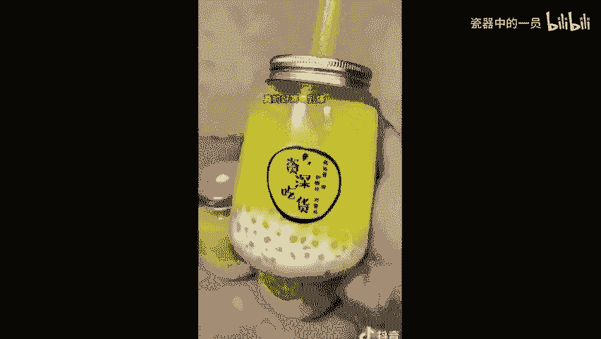

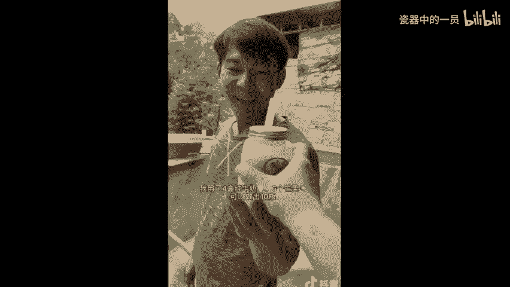

🎼你那温暖。😊，🎼的脸。

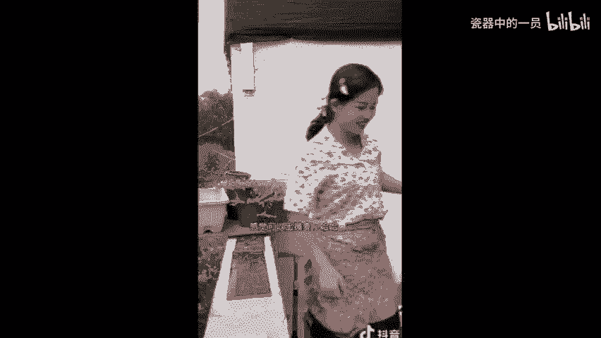

🎼龙对还有黑色马哥，颜枝大斗我是。😊。

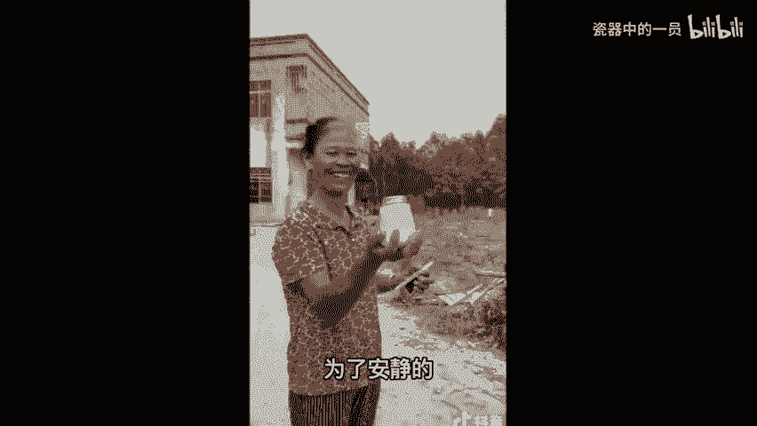

抖音。好，我们看完这个海椒的视频了，她就是一个小学学历的农村宝妈。那她这个绝对是强人社真人出镜晒自己的制作过程。那么同时我们同学如果说你想做这一类型的视频，晒制作过程的话，记住结尾不要说啊。

我交完你东西，我就咔停止了。你要分享一下，哪怕是和你周围的朋友和你的同事和你的这个哎认识的人，对吧？有一个对话，有一个沟通，让你你看一条视频他能够认识你几秒十条视频呢，也几十条视频呢。

他就能感觉这个用户啊，观众他会觉得他已经和你很熟悉了。他有这个错觉，他就会觉得认识你很久了。那么他变成你的真中粉真爱粉，特别喜欢你的粉丝效果会强烈一些。😡。

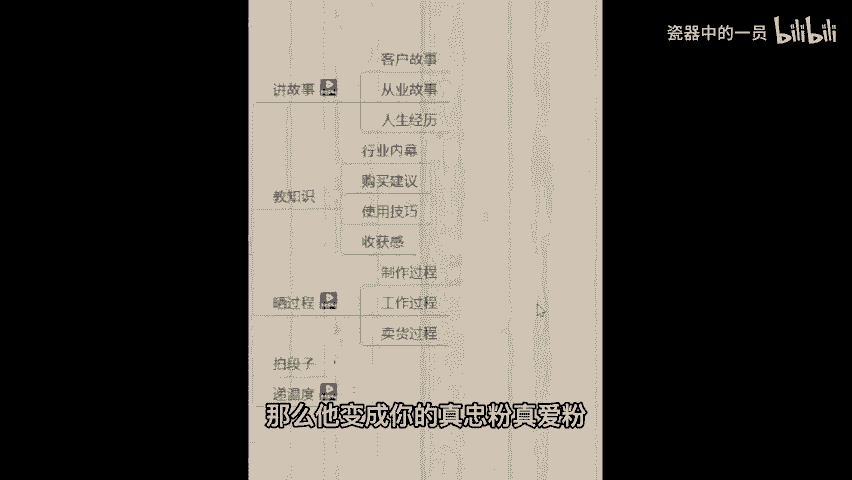