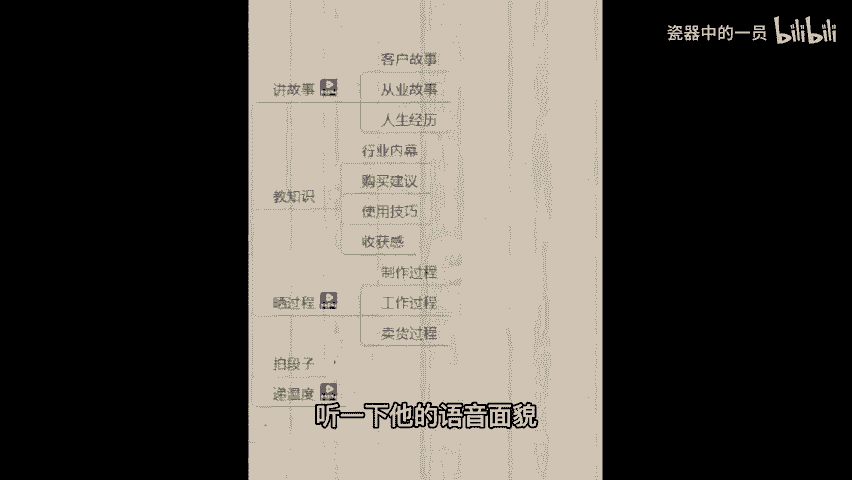
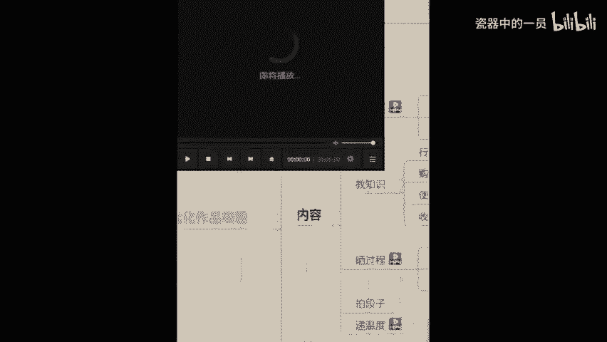
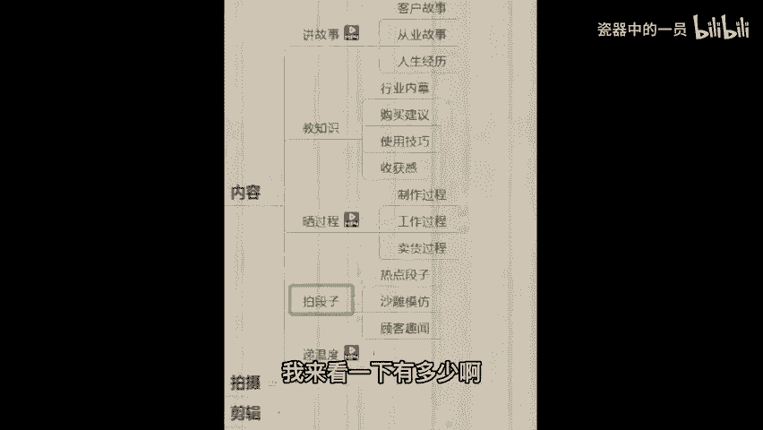
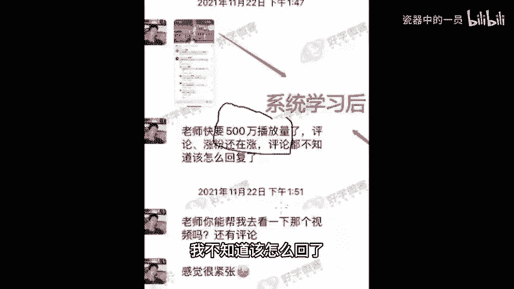
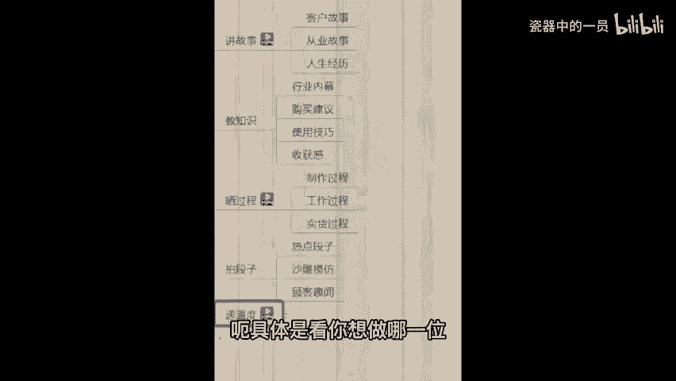

# 2024年全网最干货的新媒体运营教程，自媒体运营系统课(包含了剪辑／起号／短剧推广／今日头条各种玩法）抖音短视频零基础入门到精通，吊打一切付费课！ - P46：14、学员分享-5 - 瓷器中的一员 - BV1yB2zYVEr1

抖音一个月能赚多少钱呢？就拿海椒举例子，他现在有122万的粉丝，我可以给你们听一下他的普通话，听一下他的语音面貌。咱们同学可以猜一下海椒一个月能赚多少钱，在抖音上面。😡。

🎼hello微课的教育老师们，你们好，我是你们的学员，我叫梁海江。我是去年8月21号。通过小飞老师的介绍，后来去听了阿国老师的公开课。但是我没有听阿国老师的公开课之前，我有去了解别的教育的老师的公开课。

但是我觉得他们老其他老师讲的课程都没有阿国老师讲的比较动心那种。呃，听了阿国老师的公开课以后，就是说知道抖音，他的前程，他的历思是非常好的。后来我就抓住了这个机会，我就交了学费。

后来就9月份我就是正式上课，一边学习一边发布作品，我也是非常感谢阿国老师的指导。前期的话我是不懂得如何定位的。他也有很耐心的给我定位。和后面边线方面，他也是非常耐心的给我指导，给我解答的。我的。

🎼解答老师是加菲老师，他是非常有耐心解答我的任何一个问题。特别是前期我对这方面一点都不一点都不懂。因为我的小我的文化级要小学六年级的文化，比如说拍视频剪辑视频这方面了，都是零基础的。

后面通过他们老师的课程就是八一老师嘛，基础班就是八一老师讲的课，他讲的是非常好的。他讲的课程真的是呃讲的非常的详细，任何一个点子上他都会讲到。😊，🎼还有其他学员。

但是我们也说八一老师的课讲的真的是非常好。后面我也有我也有听过呃小峰老师的课程，嗯，后面就通过万国老师的指导，八一老师的课程，还有佳菲老师的解答。小飞老师，我也平时跟他谈谈心的。🎼前段时间一两个月前。

我经常有问题，我都会去问八一老师，我觉得八一老师他这个人很好，真的很好。他不是我的解答老师，他都是很回答我的问题。但样的情况下，我就把账号做起来了。目前的粉丝的话也给我带来一份经济的收入。

但是一个传职宝妈来说，这份收入已经很满足了。嗯，感谢大家也感谢老师的指导啊，新的学员呢，如果说你们看到我的视频的话，你们也要努力支持个去操作。坚持更新作品，发布作品。😊，🎼微科教育老师们都是很好的。

都是很负责任，很有耐心解答我们的问题的，你们放心吧，希望你们也一样。🎼能把账号做起来，感谢大家，拜拜。😊。

OK我们看完这个视频了，我给你看这个视频的目的，主要是首先第一点让你听一下海椒的普通话。另外一点猜一猜它的收入。一会儿我把这个环节讲完，在拍摄环节带你们揭秘一下海椒的一个月收入啊，我们直接去官方平台查。

因为口说无凭，抖音就是一个行业，你只要了解这个行业，不管你多大岁数，不管你什么学历，什么文化，跟这个没关系啊。接着我们往后看拍段子来想做类似于对口型搞笑剧情，沙雕段子啊。

顾客驱闻的这种段子类的同学可以公屏上给老师我扣个一，让我来看一下有多少啊。像呃拍段子，我还是实打实的给你看一下。比如说我有一个学员，他是干什么，他是做在工地上上班的，很辛苦啊。

就是工地大家所谓的开玩笑的那种搬砖，的的确确在工地上班，之前你看他自己拍的一个播放量，他也是直接拍搞笑的2000多播放量，3000多2000多播放量。后期啊通过学习之后呢，直接给老师的反馈说。😊。

老师，我这播放量快要破500万了，评论涨粉还在涨，我不知道该怎么回了，就很紧张。啊，希望咱们到时候也能体会一下播放量暴涨的一个心情啊。那么同时呃像这种拍段子啊，不难。

只但是你不能说你本身自己是一个特别腼腆，特别害羞，不好意思的人，那肯定不行。呃，拍这种段子就是为了让别人哈哈一笑嘛，让别人觉得有意思，有趣，有这种表演成分就行了。后期你不要道拍什么。

老师会提供这个段子的素材，段子的脚本给你，这个完全是不用担心的。呃，具体是看你想做哪一类。😊。

