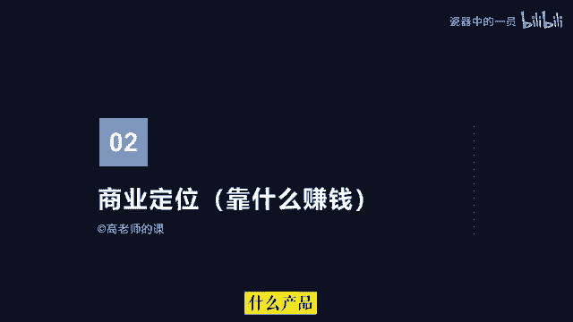
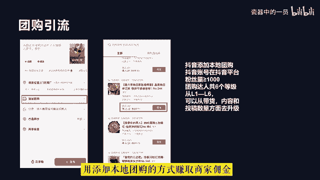
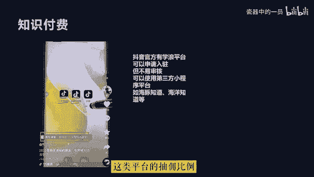
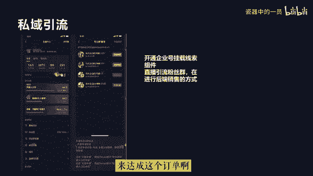
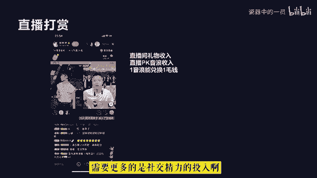

# 2024年全网最干货的新媒体运营教程，自媒体运营系统课(包含了剪辑／起号／短剧推广／今日头条各种玩法）抖音短视频零基础入门到精通，吊打一切付费课！ - P6：2.变现方式 - 瓷器中的一员 - BV1yB2zYVEr1

好，同学们，各赛道的账号类型我们讲完了。下面我们来看一下商业定位。所谓的商业定位，就是你打算在抖音中靠什么赚钱的问题。我们经常在抖音中看到有的账号发作品，作品流量上来就开直播，然后开始专注做直播带货。

例如疯狂小杨哥、彩虹夫妇等。这类是属于达人直播带货。他们是靠给商家带货赚取佣金的方式来变现的。还有一部分自身有才艺，表现能力比较强，具备娱乐性，前期拍段子等拍的段子被很多人喜欢。

粉丝涨起来之后就开始开直播PK或者表演才艺，以满足大家的娱乐需求，然后在直播间收取直播打赏的礼物，收到礼物呢，在抖音中可以提现，这也是变现的一种方式，直播打赏。这抖音中。

不管做什么类型的账号最终都要考虑变现的问题，否则将无法持久。这就是为什么有的粉丝很多的账号做着做着就停工的原因。很大一部分是因为账号无法解决变现的问题，难以维持创作的成本。所以我们在做。

号之初就应该把我们的变现路径想明白，通常就是很多人所说的商业模型是什么样子的这就是商业定位。简单来说就是你最终要靠什么方式，什么产品，什么服务来赚钱的问题。

在抖音中，大体有以下几种比较常见的变现方式。第一，短视频直播带货，带货的方式是抖音重点打造的商业核心抖音电商。所以在抖音中，大部分博主最终变现都会优先考虑如何去带货。有的依托短视频。

短视频带货的开通条件是个人需要达到1000粉丝。企业的话认证之后领粉就可以看通。然后呢交纳500元的作者保证金就可以开通商品橱窗。在商品橱窗中，可以通过去精选联盟里边进行商品选品。

然后呢发布视频时添加商品就可以了。如果有人通过短视频购买商品。那么作者就会得到相应的佣金。但是目前来说，短视频带货单纯依靠一个账号流量极不稳定，且需要大量的时间去创作优质的短视频。

所以很多人都会采用账号矩阵的方式，甚至开设剪辑工作室，通过团队化批量化的操作来测评做视频。如果是初境博主具备IP属性的，一般都会进行直播带货，直播带货可以依托自身IP效应，增加粉丝信任。当然。

直播带货需要个人开通商品橱窗，然后在开播的时候挂上商品链接就可以。对于企业来说，从某种程程度上可以解决粉丝信任的问题。所以通常有的企业也可以不用打造IP就可以直接开始直播带货。

但前提是需要具备专业的直播电商团队。第二，广告商单。一个账号把粉丝做起来，最直接的商业价值就是可以通过星图广告来接品牌广告订单，通过新途广告，博主可以进行广告报价。

品牌方会根据博主粉丝量、粉丝画像以及粉丝粘性，在短视频中投放广告。这种方式也是大部分网红IP都在做的变形方式。最基础的我们可以参与抖音短视频投稿任务，不过需要抖音账号在抖音平台粉丝量大于等于1万。

也有抖音的图。任务及图文形式的作品，也需要抖音账号在抖音平台粉丝量大于等于1万，而且近30天内发布过两篇图文题材的内容，才可以接到这种类型的广告。通常我们看到一些大V在抖音短视频中植入广告的形式。

是星图中的抖音传播任务，需要抖音账号在抖音平台粉丝量大于等于10万。第三，团购引流。对于本地生活的商家来说，通过抖音团购来进行线下引流，是目前广告成本比较低的方式。

也是很多商家在当前营商环境下提升自身竞争力最佳的手段，粉丝在直播间领取商家的抖音团购券，然后拿着团购券再去线下进行核销，商家利用这样的方式通过抖音来进行引流获客和店铺宣传。当商家发布抖音团购券的时候呢。

可以设置佣金比例。团购或者探店达人呢就可以在发布短视频的时候，用添加本地团购的方式赚取商家佣金。中视频伙伴中视频伙伴计划是抖音联合西瓜视频，为创作者提供广告分成的账号变现方式。

创作者可以通过拍摄一分钟以上的横版视频同步到西瓜视频中，平台会根据播放量和流量价值来自动分成。在抖音中做影视剪辑故事解说里拍Vlog的账号，通常都会采用这种变现方式。

想要加入中视频伙伴计划，抖音视频需要同步到西瓜视频中发布至少三个原创横版视频，视频的累计播放量达到17000就可以。第五，小程序计划啊，针对一些随拍类的文案类的图文类的户外类的账号。

通常嗯时长比较短的视频，可以添加小程序推广。小程序推广计划的开通呢也需要粉丝量大于等于1000。支付费。如果是知识分享类的账号，可以开通学浪或者入驻第三方平台，售卖自己专业领域的课程。

可以通过短视频挂链接或者直播挂学浪、小黄车或者是课程小程序的方式来实现变现。呃，其中第三方小程序平台有海豚之道、海洋之道等。这类平台的抽佣比例相对来说比较高啊，一般都在10%左右啊。

呃，第七呢就是私域引流。针对客单价比较高的产品和服务，通常会通过抖音开通企业号来获取线索，或者是直播引流到粉丝群，再进行后端销售的方式来达成这个订单啊，实现最终成交变现。这是私域引流啊。

第八呢就是直播打赏。

呃，娱乐主播呢通常采用的变现方式就是通过PK连麦或者是才艺表演以及聊天的方式来收打赏礼物，呃，赚取音浪收入。在抖音中，一音浪能兑换一毛钱，但这种方式的变现并不稳定，需要更多的是社交经历的投入啊。

