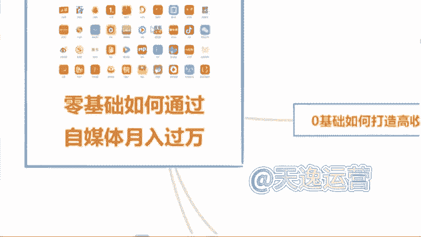
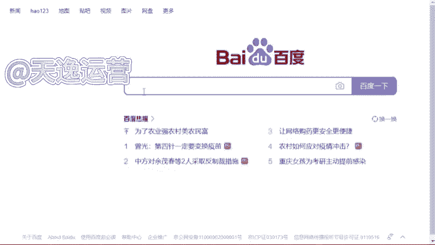
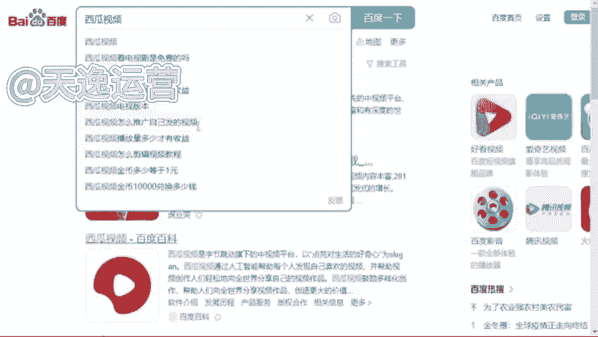
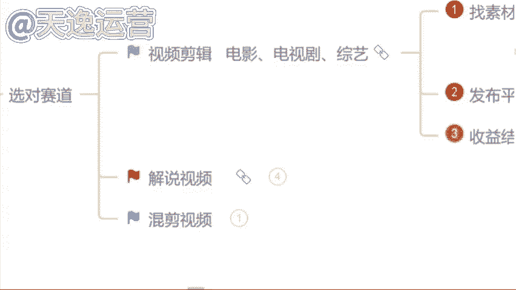

# 2024年全网最干货的新媒体运营教程，自媒体运营系统课(包含了剪辑／起号／短剧推广／头条各种玩法）抖音短视频零基础入门到精通，吊打一切付费课！ - P10：5.视频剪辑找素材 - 文武生小五 - BV1pe2vY8E8w

🎼啊，那首先呢。我们先来讲第一个视频剪辑类，好吧，视频剪辑的话呢分为很多都可以去做这个视频剪辑。比如说首先第一个就是这个电影的，就影视的剪辑嘛。电影的啊除此之外呢，像这个电视剧的或者说综艺的啊。

这个都是这个视频剪辑类的那如果说我们想去做这个视频剪辑类的呢？我们首先要去干嘛，要去找素材，对不对？那这个素材我们该怎么去找呢？找素材呢，我们先从这几个平台去找。首先第一个所有的视频平台。

知道视频平台有哪些吗？啊，那现在不知道的同学来看一下，这个就是我刚才让你们截图保存的这30多个自媒体平台。现在不知道的同学在截图保存一次啊，这30多个自媒体平台呢，都是我们能够找到素材的地方。

啊这30多个自媒体平台呢，我们都能找到素材。那除此之外呢，第二个我们可以去一些影视网站里面去找，我不知道同学们有没有了解过哈，影视网站。比如说我举一个例子，就原来我们所说的这个豆瓣电影。

这样子的呢都是这个影视的网站。

包括我自己呢整理了将近有这个50多个啊影视的一些网站，这些网站里面所有的一个影视素材，它全部都是没有版权要求的。这个呢我到时候也可以送给你们。除此之外呢，这个平台呢，就这些网站呢，他是关于影视类的。

就很多同学说哎，曾老师那我不想做影视类的是吧？我想做一些其他的什么动漫的综艺的搞笑的，我想做一些这些类型的O也可以啊，我自己呢也整理了将近有60多个这60多个网站呢里面除了影视类的。

像这个旅游的啊这个图片类的啊音效类的评论的体育的美食的动漫的综艺的搞笑的或者说各个国家的境内境外的视频素材。我们都是能找到的啊，都是能找到的这个呢我后边也送给你们好吧，让你们能有一个找素材的地方。

那除此之外呢，第三个就是我所讲到的这个影视推广的平台。就影视推广的平台呢，现在他可能做的更多。就是我们在这个抖音或者说快手上面，我们很多同学都知道哈。

你去抖音或者说快手上面做视频有做过的来就是去这个抖音或者说快手上面发过视频的。有没有就我们都知道啊，就抖音和快手这两个平台，你去发布视频，最多最多，可能只能达到一个涨粉的作用是吧？

这个播放量它是变不了线的那如果说我们去做这些影视推广平台里面的这些影视素材啊，我们是可以靠这个播放量去拿到奖金的啊，这个平台呢等一下我会着重奖啊，我会着重奖。那么首先呢如果说我们要去做这个视频的剪辑。

我们素材该怎么去找呢？比如说我给你举个例子吧。啊吧我们今天打开我们自己手机的百度啊，我们先打开这个百度打开了过后呢，我们随便去搜索一个自媒体平台吧。嗯，用这个西瓜视频。😊。

我们搜索一下这个西瓜视频，然后点击百度。我们打开它的网页。比如说我今天举一个例子，我想要去做一个这个关于综艺类型的是吧？我想要找一个人，比如说综艺类型的，就是他跟娱乐是相关的，就同学们平常看直播吗？

直播看不看，就像一些网红的直播，什么大杨哥，小杨哥是吧？比如说我们想要找一些这一类的素材，我们直接去搜索他们这一个关键词就可以了。什么关键词呢？就直接搜名字啊，大洋哥。

小杨哥，我们直接搜索关键词，然后点开搜索，我们就能找到非常多的一个素材了。现在我们按照这种关键词的方式去找素材，能不能找到。但是在这个找素材过程当中，我得给你们强调一点，我们正确找素材的一个方式。

不是让你们把这个视频直接下载下来，就很多同学我不知道同学们有没有听到过这样一个词语，就你们可能听过课程的哈。有的老师叫你去做搬运，有没有听过的，或者说有没有做过搬运的。如果说你直接去把这个视频下载下来。

它跟搬运就没有什么区别了啊，搬运的内容，现在平台95%的人，你去做都通过不了审核，所以说告诉你们正确找素材的一个方式，就是我们要从这么多的这个视频当中去找到符合我们自己视频主题的视频片段。

就每一个片段呢大概保持在10秒钟左右啊，10秒钟这个数字，你们要记住，到时候。我们找到素材，我们去做视频，平台在审核的过程当中才能给你通过，是不会有违规存在的。这个记住了吗？记住了公屏上打一啊。

10秒钟左右，每一个素材片段就按照这个这个时长去找就可以了。那除此之外，再举一个例子，比如说我们今天想要做一个沈腾的是吧？沈腾明星明星网红它都是自带呃这个热点的啊，热度的，你去做它不缺流量啊。

不缺流量的那一样的。我们打开一个。关键词直接搜索，就你们能找到素材呢是非常多的啊是非常多的那现在我们素材能找到了吗？那如果说我们这个视频素材我们自己能找到了。

那我们想要去做视频OK那我们是必须要用到什么呢？用到剪映这个软件的。做视频的话呢？问一下同学们用哪一个软件用的是最多的，手机还是电脑，你用哪个我等一下就用哪一个给你们实操好吧，根据你们的一个要求来。

都是手机啊，没有一个打电脑的吗？好的，我知道了，就你们打手机的这个搜度就让我感觉到，生怕我看见电脑是吗？好的，稍等一下，我投个屏好吧，我投个屏。😊，啊，那我们今天呢如果说我们要做视频哈。

我们首先呢要确定一个什么呢？主题。比如说我举个例子吧，我说我们今天去做一个综艺类型的，我们就要确定一个人物什么人物呢？我们今天去做一个这个呃沈腾的搞笑名场面吧，就这一个视频的主题，我们的主题确定了。

那这个视频的素材当中必须要有沈腾这个人啊，这个是主题，到时候你们要记清楚，好吧。😊。

