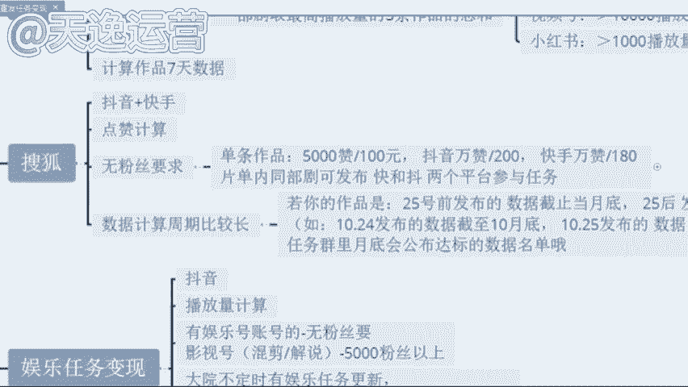

# 2024年全网最干货的新媒体运营教程，自媒体运营系统课(包含了剪辑／起号／短剧推广／头条各种玩法）抖音短视频零基础入门到精通，吊打一切付费课！ - P13：8.影视推广平台 - 文武生小五 - BV1pe2vY8E8w

那很多同学呢也说到曾老师，那这个视频一样的，我如果说想要去发到这个抖音或者说这个快手上面，我们该怎么去结算这个收益呢？这个曾曾老师要给你们讲到哈，我们这些视频呢，他发到其他的一个平台上面去。

如我刚才所给你们讲到的。这个视频我们剪完了过后，发到这30多个自媒体平台，就除开抖音和快手，其他的平台呢，我们都是可以靠这个视频本身给我们的一个播放量去结算收益的这是可以的。但是抖音和快手这两个平台呢。

就像我刚才讲到的，这个视频发上去最多最多，他可能只能增长粉丝啊，这个就是我所要强调的，就有没有同学你们是只想去做抖音和快手这两个平台的，就只想去做自己熟悉的平台，抖音和快手。曾老师我想去做这两个平台。

但是我同时去做呢，不光想涨粉，但是我也想靠这个播放量去结算。收益的有没有有的在公屏上打有字吧。让我刚才所讲到的这个所有的一个视频的话呢，它发布的平台呢。

你们就可以去这个抖音、快手小红书以及微信视频号上面去发，就这四个平台熟不熟悉，同学们熟悉吗？就你平常会用到的对不对？这个小红书呢，包括很多这个呃可能女性或者稍微年轻一点的95后，可能用小红书这个平台呢。

可能用的比较多一点。像微信视频号呢？就我们人手都有一个微信，微信里面有一个这个小程序就叫视频号，我们可以去发布这几个平台，啊，这几个平台发布了过后，我们通过什么样的途径呢？我们去通过这个视频。

就个影视推广这个平台，我们去做任务，然后我们通过这个任务去结算奖金。我们可以看一下素材的话呢是非常多的，包括这个红字的部分，你们就可以看一下，包括爱奇艺的任务。

搜狐的任务，这个呢就是所有影视剧的名字。看见没？影视推广是什么意思，知道吗？同学们影视推广是什么？知道吗？就影视推广的话，就是每一个电视剧或者说每一个电影或者说每一个综艺，它都会涉及到宣传，啊。

宣传就很多这个现在很多广告商呢，就是因为很多明星也好，或者说很多网红也好，我们拍完了这些电视剧或者说短剧，之前因为疫情的原因，没有办法到线下去这个宣传。他们都会运用到这个影视推广的平台。

就我们去做视频帮他去推广。我们就可以靠这个播放量去让他给我们结算奖金。包括每一个这个视频，就每一个电视剧这个视频，我们做完了之后，我们是需要添去这个提交一个这个任务的这个回填链接的。就我们要去报名。

就我们要填写自己的微信号账号昵称，或者说我们自己抖音或者说快手的ID包括我们自己做的是哪一个电视剧，我们要添加清楚，包括。这个电视剧这个作品的链接你是发到哪个地方的，你要粘贴上去，发布的时间是哪一天。

包括你要把这个视频的播放量的截图上传上去。到时候我们这个回填链接填完了过后，我们就会给你结算收益了，这个就是影视推广哈。就我们也可以看一下这个影视推广的话呢。

它的这一个收益呢会比纯播放量的一个收益会更高一点。那现在我给你看一下。😊，看见没？包括短剧的话呢，其实是非常多的。短剧的话呢，就是现在很多这个不是很多传媒公司嘛，就有很多网红，他们会自制一些短剧。

短剧话呢就是他没有办法自己去做一些这个广告的宣传，他就会让我们自己来做这个视频，发布到抖音小红书视频号，那没这三个平台都是可以去发布的。然后呢，根据播播放量的这个要求去计算我们的收益，没有粉丝要求的啊。

对于我们自己的账号是没有粉丝要求的，有没有粉丝跟他没有关系啊，我们一部剧呢最高播放量的三个作品，加起来的总和去给你结算，包括这个总和该怎么去计算的。看一下抖音这个平台一万的播放量奖金是50块钱。

就最开始我给你们算的那个单价还记得是多少嘛，就一万的播放量单价，就一万的播放量单价是34块钱，那个是头条号34啊，对，34。就那个呢是头条号，它这个播放量的一个单价的收益。像这个抖音的话。

你明显的感觉到这个一万的播放量奖金收益是会更高一点的。因为抖音的话呢，它这个每天的日活跃用户接近10亿了，非常庞大的啊，非常庞大的啊第二个视频号的话，就是微信视频号，你发上去一万的播放量奖金是10块钱。

为什么它的单价会低呢？是因为我们每一个人都有微信啊，每一个人都有微信都会去看这个视频号的，所以说它单价呢会少一点啊，会少一点。像这个小红书的话，它单价是最高的啊。

小红书的单价是1000的播放量奖金是30块钱1000啊，就我们叠加起来呢，每一个这个呃视频，就如果说我们去结算这个收益过后，每增加1万的播放量到时候还是会有奖金的啊，这个就比较可观了是吧？除此之外呢。

像一些搜狐的短句。搜狐视频的话就是现阶段我们可能看见的是比较少了，就我们原来看的时候呢会更高一点。就是搜狐视频搜狐视频呢他也买了很多视频的版权。但是因为这个本身这个是视频，它的这个知名度可能不是很高啊。

可能不是很高，所以说它很多短剧呢，没有办法去拿到一个好的评分，或者说更高的一个这个播放量，但是会拿过来给我们去做的，像这个抖音和快手这是需要两个平台都去发的啊，抖音加快手让他按照什么结算呢，点赞计算。

也是没有粉丝要求的，就单条作品如果说有5000个赞是怎么的？就是我们抖音和快手。我们右边他是会看什么，就会看那个点星星知道吗？那个是点赞5000个赞是100块钱。抖音的话如果是1万个赞是200块钱。

快手1万个赞它是180，他给的单价是最高的啊。这个搜狐的短剧，单价是最高的，就这一个有没有兴趣的。

あ？