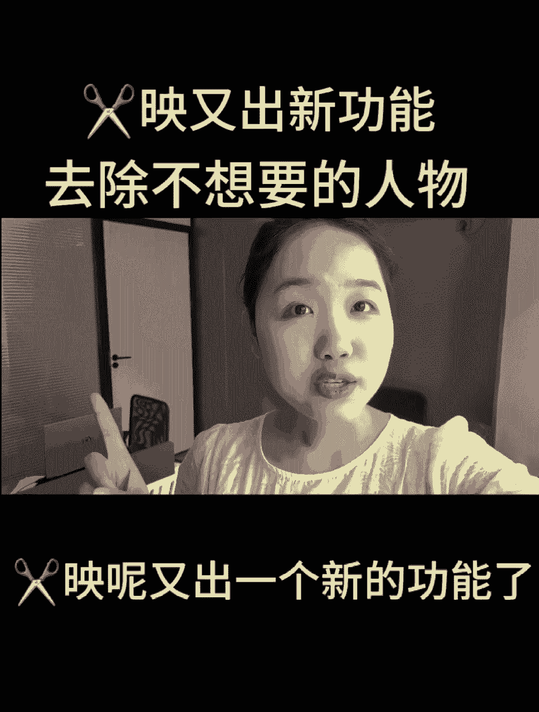
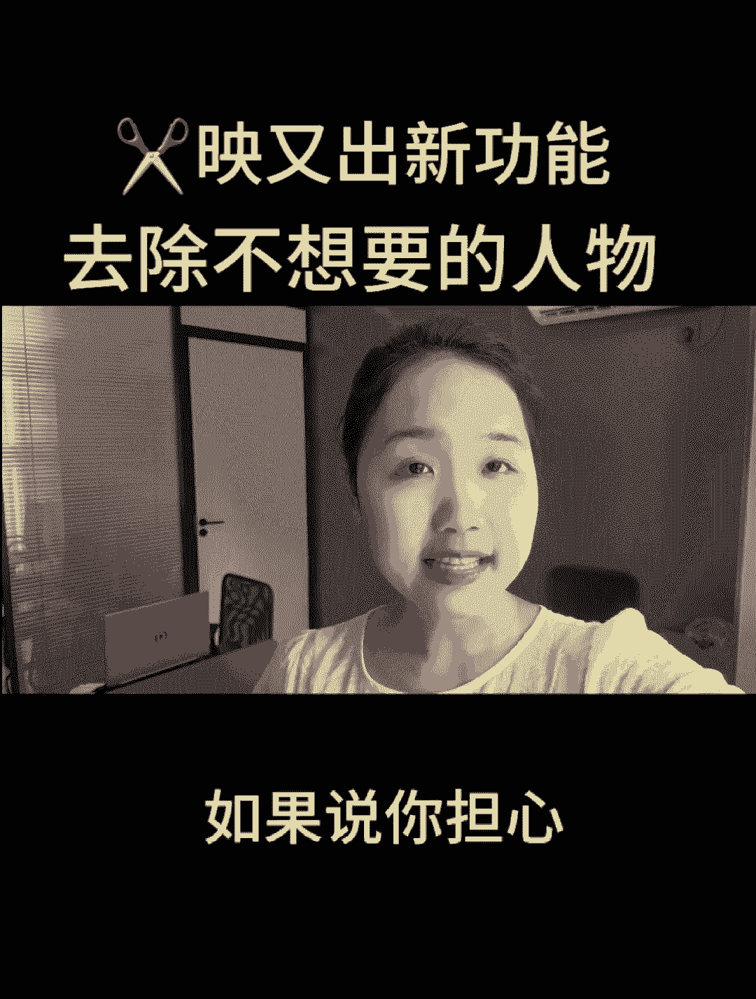
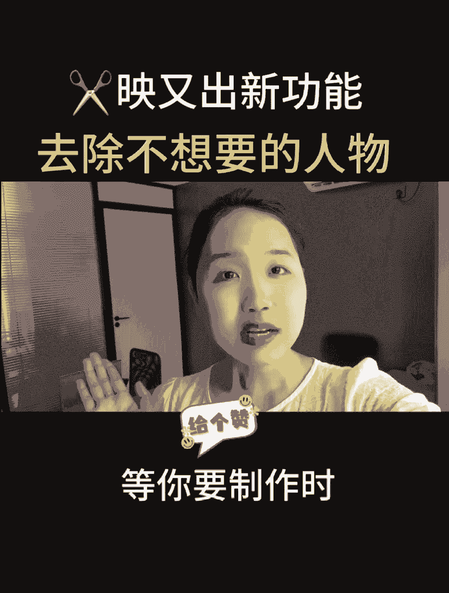
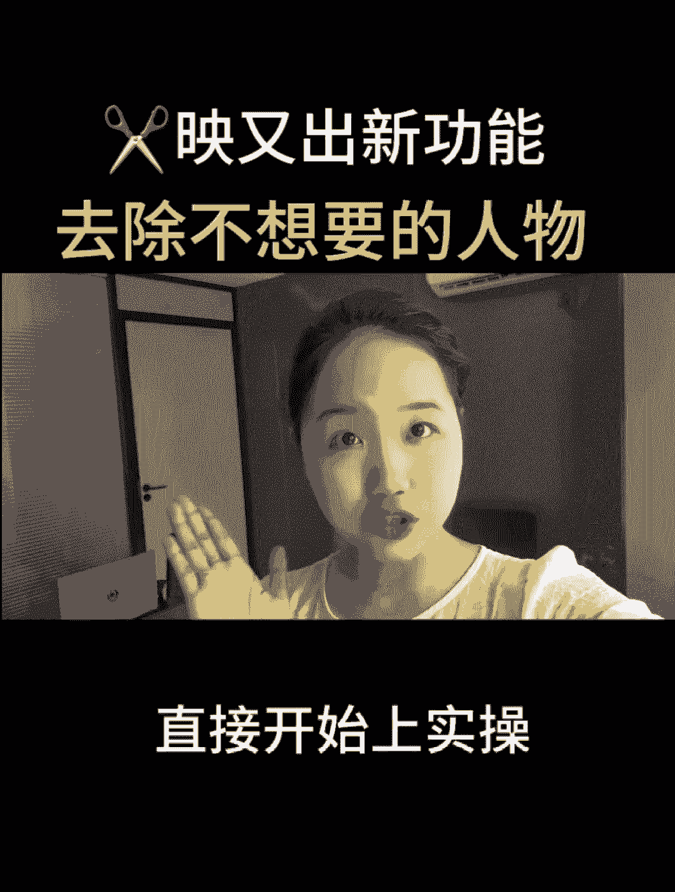

# 2024年全网最干货的新媒体运营教程，自媒体运营系统课(包含了剪辑／起号／短剧推广／头条各种玩法）抖音短视频零基础入门到精通，吊打一切付费课！ - P19：去除视频中不要的人物 - 果粒橙小米粒 - BV1gVxWekEdC

剪映新功能去除不要的人物，免费又好用，剪映呢又出一个新的功能了。

只需要呢十秒钟的时间，就可以把图片中不想要的人物给它去掉，目前这个功能呢完全免费，如果说你担心看一遍记不住的话。

可以先点个爱心收藏起来，等你要制作时可以边看边操作。

那我废话不多说，直接开始上实操。

首先呢我们打开剪辑软件，点击开始创作，我们选中我们需要去除人物的照片，点击右上角的小圆点，接着呢找到右下角的高清给它添加进来，接着呢我们选中照片来到下方的工具栏，往左边滑，找到我们的局部重绘。

我们直接呢点击进来，这是我们的一个新功能来着，那我们可以直接呢消除我们想要消除的部位，在这里呢我们点击的是消除，来到这里之后，我们就可以开始涂抹我们想要消除的地方，比如说我们想要消除这个人物，对不对。

我们呢可以直接把它划掉诶，把人物给它消除掉之后呢，我们在下方就可以直接点击开始消除了，而且现在这个功能呢是完全免费的，点击开始去除，那么花个十秒钟的时间呢，它就可以制作完成了，大家呢都可以去试一下。

现在呢可以看到我们的人物呢，是完全已经被被去掉了，给大家看一下前后的对比，这是我们前后的对比，可以看到使用这个功能之后，消除之后的画面是非常完整的，没有任何的消除痕迹的，接着呢我再教大家另一个玩法。

比如说我在画面当中，比如说我们这一个白云，对不对，我们想把白云换成飞机，那么我们可以直接呢用下面这一个功能，咱们呢给大家演示一遍，下方的工具栏呢，一样的找到咱们的一个局部重绘，点击局部重绘。

在这里呢我们直接对我们对应的画面，比如说这一个地方对不对，我们直接给它画出来，然后呢在下方呢给它输入换飞机，直接选点击换飞机之后呢，我们呢点击右下角的开始生成，那么花个十秒钟左右的时间呢。

大家可以看到我们头顶上方，是不是飞机已经换了，而且我们的一个缓释呢也可以进行到一个选择，咱们的飞机给它添加进来之后，比如说我们想要在美女旁边添加一个小狗狗，那该怎么进行到一个处理呢。

相同的操作下方点击局部重绘，选择局部重绘之后呢，咱们直接在美女旁边呢给它画一画，画一个圈圈，接着呢咱们直接在这里输入换狗狗好，输入成功之后，点击右下角的开始生成，花个十秒钟的时间。

大家可以看到咱们的狗狗呢就已经生成成功啦，接着呢我们的右下角点击应用，那么现在咱们可以对比一下，没有狗狗之前是这样的，有狗狗之后是这样的一个画面，这个功能是不是非常的神奇，有意思呢。

如果说你也对剪辑感兴趣的话，想要学习更多的剪辑技巧和方法，你可以给我点个关注啊，只要是我的粉丝可以在后台给我留言，一个六啊，扣一个六，我看到之后呢，我会自己整理好的一些新手入门指南，和一些经验玩法。

还有一些剪辑技巧都给大家进行到一个分享，那么最后呢也不要忘记给我点个关注。