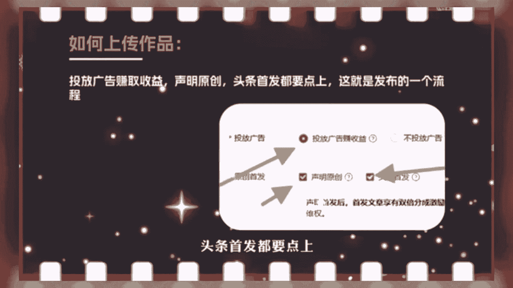
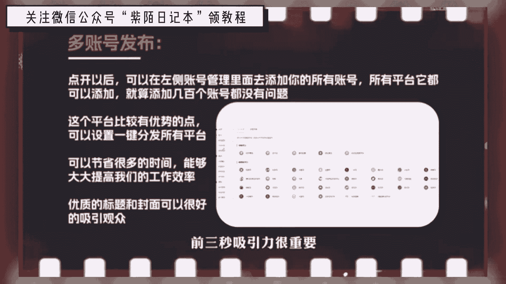
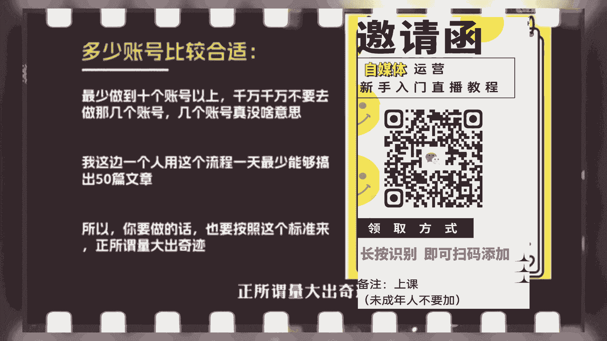

# 2024年全网最干货的新媒体运营教程，自媒体运营系统课(包含了剪辑／起号／短剧推广／头条各种玩法）抖音短视频零基础入门到精通，吊打一切付费课！ - P1：今日头条图文玩法 - 果粒橙小米粒 - BV1gVxWekEdC

今天分享的是今日头条图文类型的玩法和细节，首先手机所需要的软件有今日头条，青岛西瓜视频电脑软件小火花，这个是做自媒体比较实用的软件，如果说长期做自媒体的话，一定要去好好利用它，注册账号。

可以通过手机版的今日头条，或者西瓜视频去注册，因为有的手机今日头条是没办法注册的，这种情况就可以通过西瓜视频注册，注册成功以后再去头条登录就可以了，记住一定得是实名的，正规手机号，要用正规三大运营商。

联通移动电信这些，不然账号一注册就废了，这也是我这边测了几十个账号得出来的结论，这些坑我们都踩过，注册以后必须得去实名认证一个手机号，注册一个账号，多账号批量运营，可以让家里人亲戚朋友帮你实名。

因为这涉及到以后的账号，提现的银行卡，实名是谁就要提现到谁的银行卡里面，不实名的账号是发布不了作品，一个人一天操作10~15个账号，我这边操作熟练的同事一般四小时就能搞定，刚开始弄可能会稍微慢一些。

这个很正常，需要慢慢熟练，账号要切记一点，一定要去开通文章的原创，头条的首发以及文章的创作权益，就这三大点一定要去开通了，不开通的话，你发1万个视频都没什么收益，这一点是很重要的。

不然的话你努力都是白费的，就算几千万几个亿的播放量，你也没有什么钱赚，第二点，作品发布领域的赛道，我这边主攻三大领域，三农体育奇闻，每个领域里面去做两到三个账号，比如说三农可以做两到三个账号。

体育可以做两到三个账号，奇文再做两到三个账号，当然账号越多越好，这要看你手上账号的数量，它和抖音一样，每个账号都要保证作品的垂直度，发了一个作品，这个账号以后就一直更新这个类型。

比如现在发的是体育类型的作品，你就要去发足球，排球之类的，比如现在做的是奇闻，那么就可以一直去发科普类型的作品，还有一个重点，如果说你账号目前流量还算不错的情况下，一天发布作品的数量最多不要超过八个。

为什么，如果你发布再多，因为账号播放量好了以后就会隐形限流几天，这是每个平台都会有的机制和规则，爆了之后必然会限制流量，如果目前账号流量很一般，你报的很少，那每天发布作品的数量就不要超过三个。

这是我这边测出来的，再多发的话，可能你作品就白做了，因为会隐形限流，第三点找对标作品和账号，我们做的不是视频类型的作品，主要以文章和图片组成的图文为主，这是我整理好的同行账号，可以直接拿过去。

用拿三农举例，先去平台搜索，我举例其中一个账号的名字，进去以后，随便点开一个作品去看一下，看这个作品做头条和西瓜，它标题是很重要的，直接决定你的作品能不能爆西瓜视频，还有一个好处。

不论是你观看什么类型的视频，它右侧都会给你推出相关类型视频的素材，这也导致我们的选材和取材是源源不断，用之不竭的，目前三农有三个比较火的话题，就是养老金新型骗局和拆迁政策，目前关注度比较高，流量比较大。

单价也比较好，通过拆迁新政策能搜到很多相关的视频，随便点进去一个，如果说想长期在这个行业生存，你必须得不断的找对标账号和对标作品，在它的右侧就能找到这个在前面已经说过，再就是复制它的标题。

打开一个新的网页，去度娘搜和这个话题相关的资料和一些简介，当然我们做的是图文，而不是视频，用小火花软件去生成想要的文章，用手机号去免费注册一个就可以了，进入后台以后，找到GPT工具。

进来以后点击长文写作，然后把刚才那个短标题粘贴到这右侧，它会根据你左侧的标题生成一篇很长的文章，所以左侧的标题一定要写的完整性好一些，我弄的这个就太简单了，你们可以通过网页去把这个标题。

搞得稍微完整一些，我又重新弄了个标题，再生成一次，即便左侧的标题一模一样的字，它每生成一次右边的内容都有些区别，因为像这种方式不止我们自己操作，也有不少同行用这样的方法弄出来的文章。

也会涉及到相似度比较大，所以要多生成几次，需要把每次生成的内容全部复制下来，通过两到三天去拼接成一个，这样就没什么问题了，因为每次生成的内容字数也就大几百，需要把它们拼接起来才可以，每次生成完以后。

你大概去浏览一下，感觉内容不错，那就把内容存下来，感觉不好，重新生成就行了，因为它每次生成的内容都是不一样的，你不浏览的话，可能有些很垃圾的内容也被你整理了，到时候你发出去文章阅读量是不可能起来的。

一般你可以通过三篇拼接成一篇，拼完以后要去检查一遍，看看语句是否通顺，细节决定成败，切记一点，他这个软件有一个毛病，首先其次最后另外这些词一定要删除掉，这些发到平台上可能会影响你的作品，甚至会违规。

全部检查完，然后语句字数都觉得没有什么问题，那就可以接着搞下一篇了，如何去上传作品，进入头条后台点击创作文章。

然后去把你的内容粘贴到下方，粘贴好之后可以去重新检测一下。

看一下作品有没有违规，有错别字修改好就可以，到这一步的时候，还需要去配一些图片，比如新型骗局，那就打开网页去搜索农村新型骗局图片，这几个字一搜一大堆，去选几张吸引力比较高的图片，也可以去观摩一下同行。

看看他们在用什么类型的图片，咱们就去找类似的，切记一点，图片千万不能有水印，有水印的就给它裁剪一下，或者通过截图把有水印的地方过滤掉，一篇文章配个三张图片就够了，把图片放在自然段之间。

再就是标题不能原封不动，直接用，要改一下，并且改的标题要有一定的吸引力。

图片这个地方要选择三图投放广告赚取收益，声明原创头条首发都要点上。

这就是发布的一个流程，我们这边账号比较多，不可能一个网页登录这么多账号。

所以这时候还会用到小火花这个软件，点击管理后台，点开以后，可以在左侧账号管理里面去添加你的所有账号，所有平台他都可以添加，就算添加几百个账号都没有问题，这就是目前这个平台比较有优势的点。

可以设置一键分发所有平台，做自媒体要合理化的利用这个平台很便捷，虽然这些功能是收费的，但这个钱花的很值，因为可以节省很多的时间，能够大大提高我们的工作效率，标题还要做到一个点，就是要和你的内容息息相关。

不能说驴头不对马嘴，单纯只做一个标题党绝对不行，那样会被下架作品，还有标点符号要正确使用，不能用英文代替，我们都知道做短视频内容前三秒吸引力很重要。

但像我们做图文，优质的标题和封面可以很好的吸引观众，多少账号比较合适，最少做到十个账号以上，千万千万不要去做几个账号，几个账号真没啥意思，我这边一个人用这个流程，一天最少能够搞出50篇文章。

所以你要做的话，也要按照这个标准来，正所谓量大出奇迹。

以上就是今日头条图文玩法，有什么不明白的问题可以找我聊聊，感兴趣的朋友可以直接去实操好了。