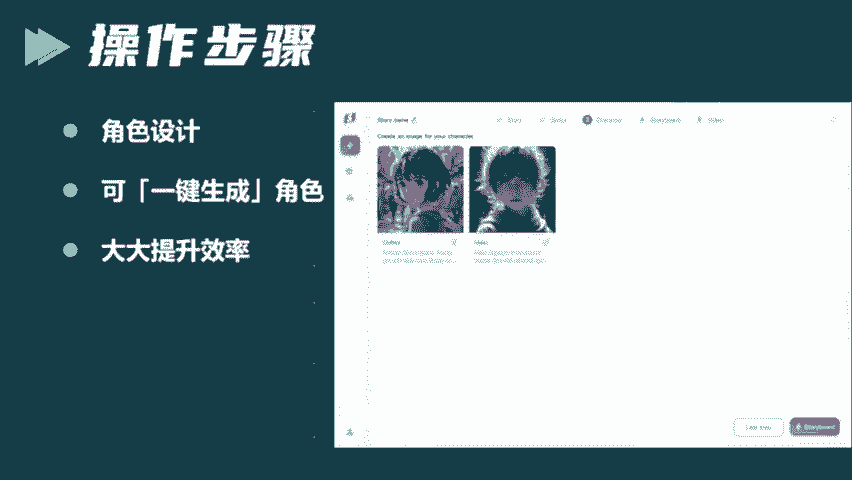

# 2024年全网最干货的新媒体运营教程，自媒体运营系统课(包含了剪辑／起号／短剧推广／头条各种玩法）抖音短视频零基础入门到精通，吊打一切付费课！ - P1：短剧AI创作 - 文武生小五 - BV1pe2vY8E8w

🎼人家奋斗要努力这词说的酸逗分不斗不炸炸了兄昨天短剧圈彻底天了。因为AI可以全自动创作短剧了，就在昨天呢世界首个AI短剧平台skys上线了，这一上线不要紧啊，短剧圈就炸锅了。

业界里边都说呢这是一个革命性的工具。我们都知道呢，短剧是近几年增长最快的影视领域，你去看看短剧的那些播放量，你就知道了，非常的受欢迎。尤其是用AI创作的短剧呢，现在各个平台啊，基本上都有流量的加持。

因为这种形式啊确实非常受欢迎。而且各大平台呢都在抢夺短剧的这块蛋糕。但是昨天这个全自动创作短剧的平台已经上线，可能对于短剧这个赛道来说就是一次重新洗牌了。

因为会有更多的普通人加入到这个短剧的创作领域当中。好，下面废话不多说啊，直接给大家演示到底应该怎么用sky来创作短剧，建议啊点赞收藏一下内容比较干，回头呢慢慢学。😊，🎼首先呢我们打开s这个网页。

打开之后，其实你可以立马感觉到啊它这个AI短剧的创作平台跟其他的之前咱们用到的这种AI平台有本质上的区别。很明显你能感觉到，像原来我们用到的这种AI平台呢，一般的话是以图片或者文字或者视频生成为主。

但它就不一样了。你在它界面上你也可以看出来，它有很多版块组成。从一开始的剧本生成，到角色的定制，再到分镜头的设计，再到视频的拍摄，所有的功能集合到一体，它完整的复制了整个短剧工业化的流程。

也就是任何一个普通人，只要你提供一个创意。sos就能够帮你完整的制作出来一部短剧非常的方便。但是我们都知道其实短剧收视的关键啊，就是看的人多不多流量怎么样，那最重要的呢就是它是不是有一个好的创意。

然后呢把这个创意呢给它变成一个爽文的剧本这个剧本是最关键的。包括咱们看电视剧其实也一样，真正这个电视剧的评分怎么样，其实最关键的。😊，🎼这个编剧编的这个剧本好不好看啊，至于演员的演技呀，包括导演怎么样。

这些都是次要的。但是scaros他厉害就厉害在他负责文本创作的这个大模型是受过专业训练的，他更加懂得怎么样写出有爽点带流量的这种剧本。你需要做的呢就只是输入一个概念，或者说呢故事的一个创意。

然后呢选择一下你创作的类型啊。比如说你是情景剧也好，武侠剧也好，系统就会自动给你生成一份符合要求的剧本，而且呢结构非常的完整情节也非常丰富。另外呢你也可以啊上传现成的剧本，对吧？你不想让他去写。

那么你上传现成剧本，让AI呢帮你去润色优化，提升这个剧本的专业度可读性啊，包括一些爽点流量点，这些都是可以的，真的是功能非常强大。那说完了剧本我们接下来来说一段啊，就是你在剧本生成完了之后。

那么接下来呢他还有一个非常厉害的模块就是物色演员，也就是角色的设计。这些角色都可以一键生成，如果不满意，你还可以去替换。就是你剧。😊。

🎼里边出现了多少角色，它就可以帮你自动生成相应的角色，而且是一键生成。这样的话就大大提高了这种创作的效率。有了角色之后，它会根据你剧本里边的内容，然后生成这种分镜头的图片。

然后呢把图片和这个文本呢还对应起来。这其实就形成了分场景的镜头，还有呢分场景的脚本。当然你如果对它生成的这种分镜头，那某一个镜头呢不太满意，那么你也可以呢点到里边去修改这个文字啊，比如说某些场景对吧？

它显示错了，啊，它在商场里边实际上呢应该在一个滑冰场里边，那你就可以把文字呢改成滑冰场。然后呢，人物的动作啊等等都可以修改，你只要修改了文字，它这个场景呢，分镜头的这个图片就能够自动调整。

而且非常的高清细节非常丰富，最重要的是它的角色和场景，它是有一致性和连续性的，就不会说你换了下一个分镜头，你换了下一个情节，那么你的角色和场景都变了，这不会出现。那么上一步分镜头设计好了之后呢。

演员啊角色也就定下来了。那么接下来要进入实拍的阶段了。😡。

🎼现在啊AI影视的发展呢最大的瓶颈其实也在这儿。你会发现其实常规的做法呢，用皮卡啊或者run位生成的这种动态效果，其实槽点非常多，什画质对吧？包括他的角色的动作幅度其实是比较小的。

而且呢很多不合理的地方。比如说有时候你车辆在运动吧？但是它车轮没有转，或者说水流的时候，它的水花是静止的人物的口型对不上表情比较僵硬等等啊一系列的这种问题。但是sos完美的解决这些问题。

它的视频非常的连续，而且呢生成的场景和人物呢更加的生动一致。最关键是它还支持1080P60帧这样的高清视频的输出，真的是体验感拉满了。

而且你去用s啊或者说可灵等等你去创作的时候个视频它生成的要不就是10秒最长的60秒，但直接达到了180秒的市场。这个对分镜头的表达来说完全足够用了，实现了一个非常大的突破所有的流程成果都是一键整合的。

你只要提供一个创意可以快速的生成最终的一部短剧还有一点非常厉害，就是。😊，🎼会根据你的剧本描写的这个情节啊，是悲伤的呀，是欢喜的呀等等。然后呢给你匹配背景音乐和音效。你作为创作者来说。

在平台上只需要点一个按钮就一键添加就OK了。就这么简单，怎么样是不是非常的简单粗暴啊，有了这个工具啊可以说每一个普通人都可以用AI来创作自己的短剧了。而且短剧这个东西现在流量非常大啊，非常的受欢迎。

你只要结合我刚才说的AI啊去研究一下，相信呢每个人都能够掌握。关键是啊他昨天刚刚上线，这是一个妥妥的信息，就看谁能够做第一个吃螃蟹的人。那么关于一个短剧的号做起来之后。

实际上它是非常值钱的后端的商业化模式呢，我给大家提供了这三种。一种的话就是你可以走付费订阅制。那因为现在很多平台啊，他都支持呢把一些你的作品的打包啊，整理到一个专栏里边那么专栏的话。

你开通一个付费的功能，很多人呢他是愿意看你的付费章节的。再一个的话呢短剧流量这么大，你也可以吃一些平台相关的一些流量的效益啊，比如说创作评成计划啊，中视频等等。当然后续。😊。

🎼你肯定也会收到很多商务的合作。OK这就是今天给大家分享的这个妥妥的信息上。好，那么最后呢是关于刚才提到的这个scars这样的一个超强大的全自动创作短剧的神器啊，我把它放到了评论区，大家呢低调使用。

OK今天的干货就是这些了，我们下期再见，这么多年，我一直在努力，我一直在奋斗，什么奋斗。😊，你说的好听。😡，还不如说玩命的向上爬。😡，往上爬也是奋怒，说的没错。

