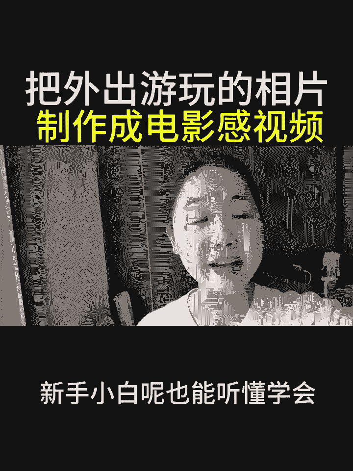
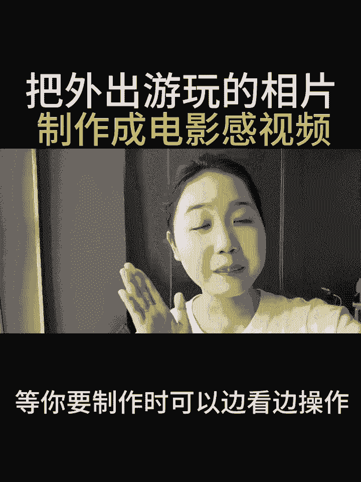

# 2024年全网最干货的新媒体运营教程，自媒体运营系统课(包含了剪辑／起号／短剧推广／头条各种玩法）抖音短视频零基础入门到精通，吊打一切付费课！ - P20：照片做成电影感视频 - 果粒橙小米粒 - BV1gVxWekEdC

出去游玩的照片制作成电影感视频，简单又好看，今天呢我来教大家，把外出游玩拍摄的照片，制作成一个这样的电影感，高级视频，操作呢也是非常的简单，新手小白呢也能听懂学会。

如果说你担心看一遍记不住的话，可以先点个赞，点个爱心收藏起来，等你要制作时可以边看边操作。

那么我废话不多说，直接开始上实操，首先呢打开剪辑软件，点击开始创作，在里面呢我们选中一张风景图片，接着右下角点击添加，添加进来之后我们点击相册，把时间轴呢给它往后延延长在大概十秒钟左右。

接着呢把时间轴回到开头的位置，咱们需要往里边添加一个音乐，在下方呢点击左边的返回按钮，在里边找到音频的工具，点击音频找到音乐，在音乐里边有许多的音乐可以供我们选择，我们可以根据自己的喜好进行到一个筛选。

比如说我们选择这一个选中好之后点击使用，那么音乐就添加进来了，接着我们把时间轴往后挪，可以看到音乐呢是非常长的，这时候呢我们点击音频，再次点击音乐，点击分割，把多余的部分进行到一个删除。

接着呢我们在下方点击返回的按钮，来到下方工具栏当中，往左边滑动，找到比例的工具，点击比例在里面我们选中的是九比16，勾，选上之后呢，点击对勾，接着呢我们可以看到视频当中上方是空着的。

这时候我们点击素材双子，把我们的一个素材进行到一个放大，让它撑满我们整一个视频，接着呢我们点击返回，在这里我们点击照片，直接呢在开头的位置给它打上一个关键帧，打上之后，我们接着把我们的照片呢给它。

往右边进行到个拖拽，让我们白色的框框跟红色的边框重合，接着呢把视频挪到结尾的位置，挪到结尾的位置之后，咱们直接的A把我们的素材呢给它打上，第二针，接着把我们的照片呢从我们挪往左边滑动。

滑动到白色的边与红色的边重合，接着松手，第二针打完之后，一样的回到我们一级工具栏下方，工具点击返回，在我们的工具栏里边找到贴纸工具，点击贴纸里边呢直接搜索，比如说搜索江南，搜索江南之后。

里边呢有出现我们许多的一个字体，我们直接选择一个江南，选中好了之后呢，直接把它拖拽到我们的诶左上角，放着不动，咱们呢也可以搜一个电影感，直接点击搜索，咱们可以看到里边呢就有许多的一个电影感。

相关的一个贴纸，比如说我们选择这一个电影感，选择这一个选中好了之后，我们呢可以给它进行到一个处理，可以给它进行了一个放大，可以给它进行了个放大，当然呢也可以直接搜索一个江南水乡之后呢。

我们可以选中这一个江南古镇，选择江南古镇之后，我们点击取消，点击对勾，把我们的江南古镇呢可以挪到我们右下角，接着我们把这一团水雾呢可以挪到我们江上，远一点的地方，那接着我们给它添加好贴纸之后。

我们依次的把我们的贴纸的时间轴给它拉长，跟我们的主图上下对齐，把贴纸全部的跟主图对齐之后，接下来我们给画面添加一些高级的特效，在下方工具栏点击返回，再次来到下方工具栏当中，找到特效的按钮。

点击特效里面呢找到画面特效，在这里呢我们可以直接搜索一个下雨特效，搜索完成里面呢就有许多，比如说我们这第一个搜索下雨，那么它就会有一个下雨的特效，接着呢咱们点击取消，点击对勾。

咱们点击这一个下雨特效的时候，下方呢有个作用对象，直接点击作用对象选择全局，接着呢咱们把时间轴给它往前拉，让它上下对齐，接着咱们用相同的方式呢找到画面特效，在里面呢搜索烟雾，搜索烟雾了之后。

我们点击搜索，那么它就会出现一个烟雾的特效，直接呢点击烟雾，选择烟雾了之后，我们呢点击调节参数的地方，把我们的不透明度呢给它调整到50，调整到50左右，接着呢我们点击返回，添加完我们的烟雾特效之后。

点击取消，点击对勾，接着我们在画面特效里面搜索模糊开屏，那么咱们在这里呢直接把这一个模糊开屏呢，给它勾选上之后，我们点击取消，点击对勾一样的，把我们这根模糊开屏的一个时间轴呢，跟我们的主图对齐。

我们的烟雾特效也需要跟我们的主图进行对齐，把特效添加进来之后，下方呢点击返回，点击返回，跟着老师一起找到文本的小工具，点击文本选择词别歌词，点击词别歌词，点击开始匹配，那么我们的一个歌词呢就识别出来了。

咱们呢可以对我们的歌词进行到一个调节，我们把我们的贴纸往上滑，就可以找到我们的歌词了，点击歌词之后，我们可以把歌词进行到一个放大，缩小下方呢有一个样式，选择样式之后呢，我们可以选中字体旁边的样式。

在里面呢有排列，我们点击排列可以选择竖排，竖排了之后，我们可以把它放到我们视频的左手边，接着呢跟着老师一起，我们在文本里边选择一个我们想要的颜色，比如说我们自己选择的是粉色的，或者是其他颜色的。

都可以供我们自己选择，那我自己的选择是一个黄色的，接着选中好之后，我们旁边呢点击动画，点击动画，这里呢在我们的入场动画里边，跟着老师一起找到打字机啊，这里有个打字机，直接点击打字机。

接着把我们这个时间轴呢，拖拽到2。5秒的地方，接着点击对勾，那咱们这个歌词呢就做好了，如果说你也对剪辑感兴趣，但是呢又不知道通过什么方式，在平台上获得一份创作者的分成的，可以给我点个关注，点开我的头像。

私信我留言，一个六，或者扣一个六，那么我看到之后呢，会把自己整理好的一些新手指南，变现方式以及经验玩法分享给大家，接下来呢给大家看一下成片效果，我要去看的最远的地方，和你手舞足蹈聊梦想。

