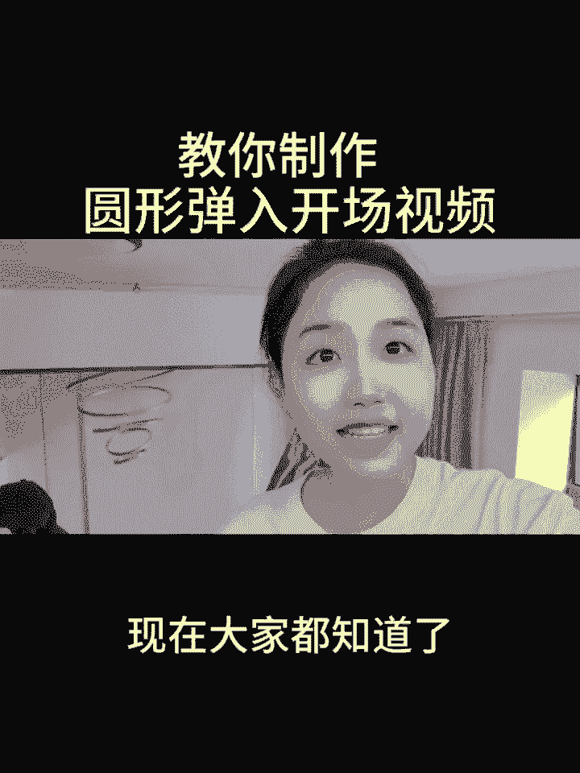
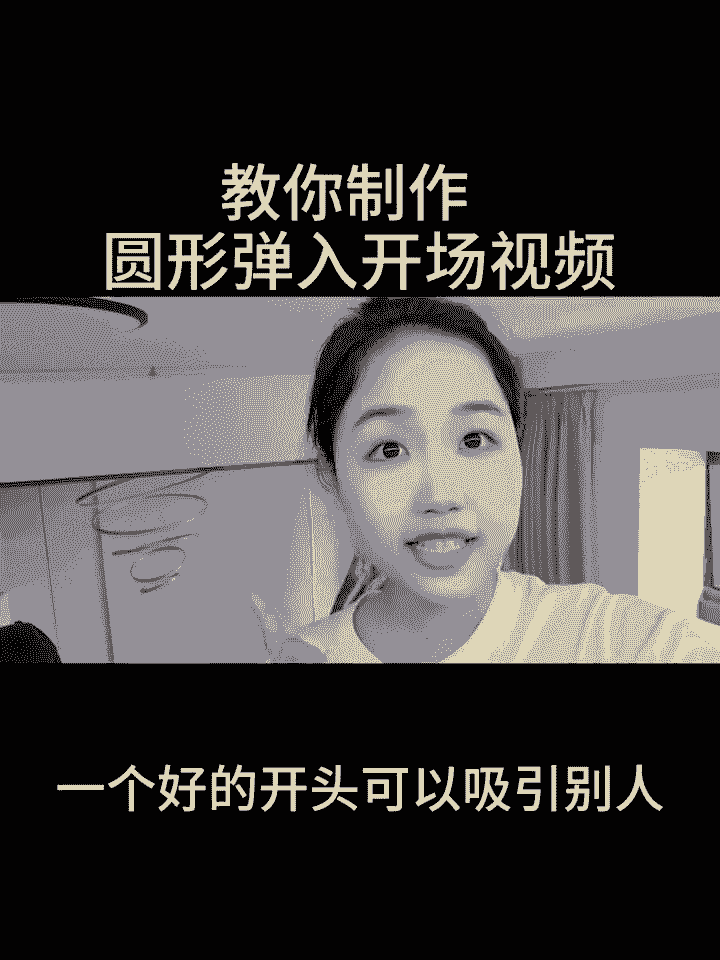
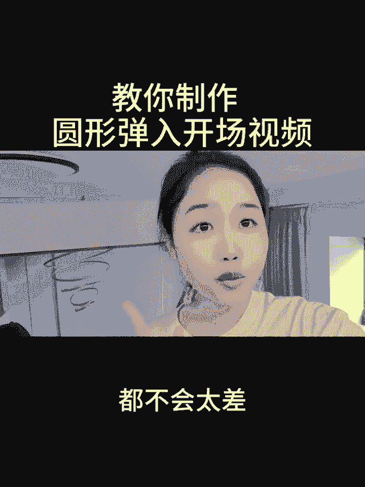
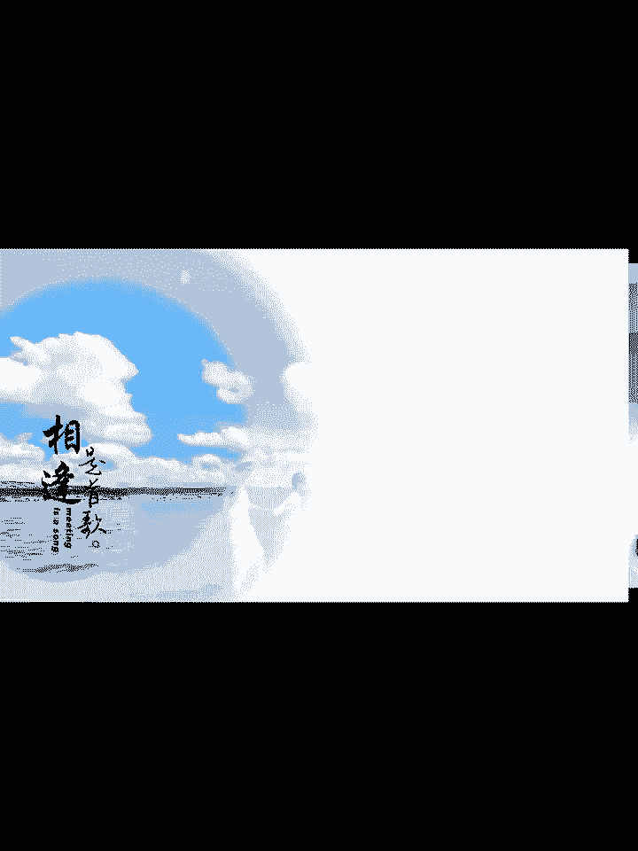
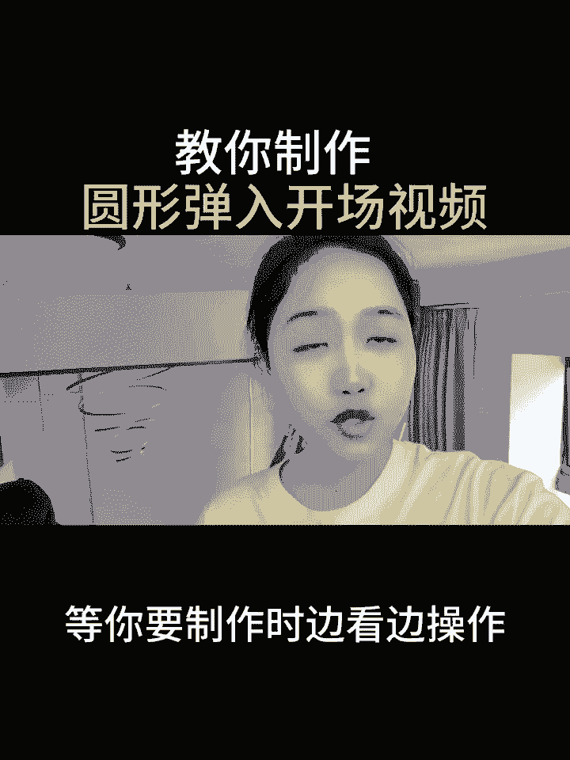
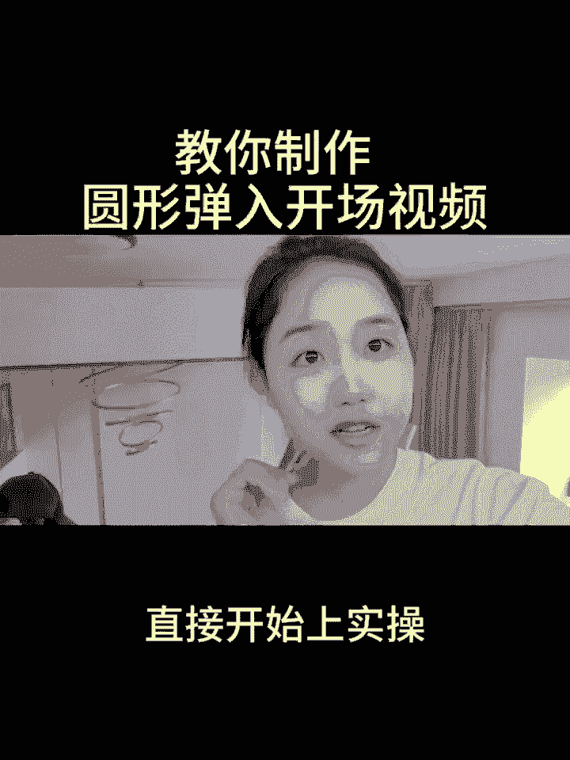
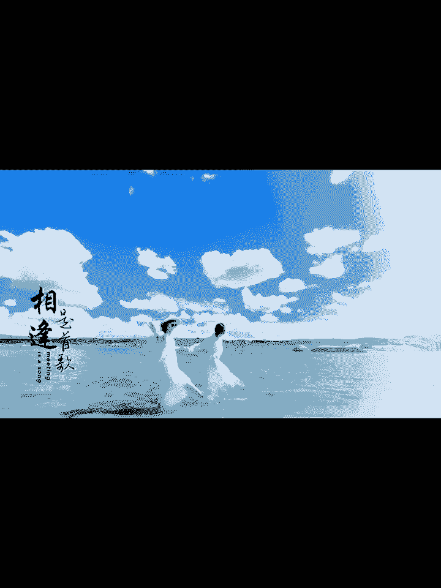

# 2024年全网最干货的新媒体运营教程，自媒体运营系统课(包含了剪辑／起号／短剧推广／头条各种玩法）抖音短视频零基础入门到精通，吊打一切付费课！ - P21：圆形弹入开场 - 果粒橙小米粒 - BV1gVxWekEdC

教你制作圆形弹入开场，播放量翻几倍，现在大家都知道了。

视频的开头是非常重要的，一个好的开头可以吸引别人。

留住别人，那你这个视频的点赞量和播放量呢都不会太差。

今天呢教大家制作一个圆形弹入开场视频，接下来我将带你手把手实操。

如果说你担心看一遍记不住的话，可以先点个赞，点个爱心收藏起来，等你要制作时边看边操作。

那么我废话不多说，直接开始上实操。

首先呢打开剪辑软件，点击开始创作，在里边我们在视频栏目里边，勾选出我们想要添加的视频素材，接着右下角点击添加，添加进来之后，咱们呢把原声给它进行关闭，跟着老师一起在下方的工具栏当中往左边滑动。

找到背景的小工具，点击背景，这里边我们选中的是在这里，我们选中的是画布颜色，直接呢选中第一个的白色，选择完之后，右下角点击对勾，接着点击右手边的返回，点击我们的视频素材，在下方呢往左边滑动。

找到我们蒙版的小工具，点击蒙版之后，在这里跟老师一起点击圆形，咱们的圆形蒙版添加进来之后，我们两只手指能摁住我们的屏幕，尽可能的给它进行到一个缩小，缩小了之后，我们接着把这一个圆形呢给它拖拽。

放到我们视频的左下角，放着不动，接着呢把时间轴给它挪动到开头的位置，打上第一针的关键帧，接着我们把时间轴呢往左边滑动，滑动到一秒钟的位置，给它打上第二针的关键帧，接着我们拖拽圆形的素材。

把它拖拽到我们视频的左侧，接着我们双指呢，把我们的这一个圆形呢给它放大，放大到这个程度之后，我们接着把时间轴呢往后挪挪到两秒钟的地方，接着再将我们的圆形蒙版呢给它放大，接着呢我们把时间轴呢往后挪一秒钟。

再接着把我们的圆圈给它进行到一个放大，每隔一秒呢咱们都给它进行到一个放大，直到第六秒的时候，把我们的蛋呢全部的都给它放完，接着呢我们在下方点击对勾，接着呢在下方工具栏往左边滑动，找到复制的按钮。

点击复制，点击复制之后再点击一次复制，接着我们选中视频，在下方呢工具栏往左边滑动，找到切画中画的功能，点击切画中画，那么第三段视频素材也是一样的，往左边滑动，找到我们的切画中画，接着呢。

我们把复制好的素材呢给它挪动到前面去放好，直接呢给它挪动到跟我们的原视频上下对齐，前面这一段呢也是一样的，接着我们需要对复制好的素材进行到一个调整，我们把时间轴呢挪动到一秒钟的位置。

接着把第一段复制的素材呢给它长按，放到一秒钟的位置，接着呢把时间轴呢挪到第二秒，把第二段的视频素材给它，放到我们的第二秒的位置，接着时间轴呢往左边滑动，来到我们的末尾，多余的部分呢，我们给它往回拉。

让它跟我们的主图上下对齐，第三段素材也是一样的，往回拉跟主图上下对，接着我们点击主图的视频，在下方工具栏当中往左边滑动，找到我们的不透明度，直接呢点击不透明度在里边。

我们把不透明度呢直接呢调整到30左右，接着点击对勾，点击第二段视频，素材下方的不透明度呢往左边滑动，找到我们的不透明度，点击不透明度，我们把它的一个诶进度条拖拽到60，接着呢点击对勾。

接下来呢我们把时间轴回到开头的位置，在下方呢点击返回，把下方工具栏呢往右边滑动，找到音频的小工具，点击音频，点击音乐，选择一首我们自己喜欢的音乐，比如说我们这一首音乐给它添加进来。

添加进来之后把时间轴呢往左边滑动，来到我们视频尾端的地方，点击我们的主图，接着点击我们的音乐，点击分割，把多余的部分进行到删除，那接下来呢我们点击返回，给它添加一些好看的贴纸，进行到个装饰。

比如说下方工具栏呢，我们先把时间轴回到开头的位置，下方工具栏往左边滑动，点击贴纸，在这里呢我们在上方直接搜索我们的一个贴子，比如说搜索黑色文字，搜索黑色文字了之后，咱们可以看到里边呢。

是有许多的字体可以供我们选择的，比如说我们选择这一个选择好了之后呢，咱们点击取消，点击对勾，在这里呢我们需要把贴纸的时长呢给它拉对齐，以让它跟我们的主图上下对齐，接着呢回到视频最开始的位置。

把我们的贴纸呢给它调整放到这里，接着呢我们给贴纸添加一个动画，在下方工具栏呢点击动画，把时长拉对齐了之后，接下来呢我们给贴纸添加一个动画效果，直接在下方呢点击动画，在里边呢找到一个渐显的动画效果。

点击渐显，接着呢，我们把下方的时长给它拉动到两秒钟的位置，点击对勾，如果说你对剪辑也感兴趣，但是呢又不知道通过什么方式，在平台上获得一份创作者的分成，可以给我点个关注，点开我的头像，私信我一个六。

或留言一个六，那么我看到之后呢，会把自己整理好的一些新手指南，变现方式以及经验玩法分享给大家，那接下来呢我们给大家看一下成片效果，我要去看得最远的地方和你手舞足蹈聊梦想。

