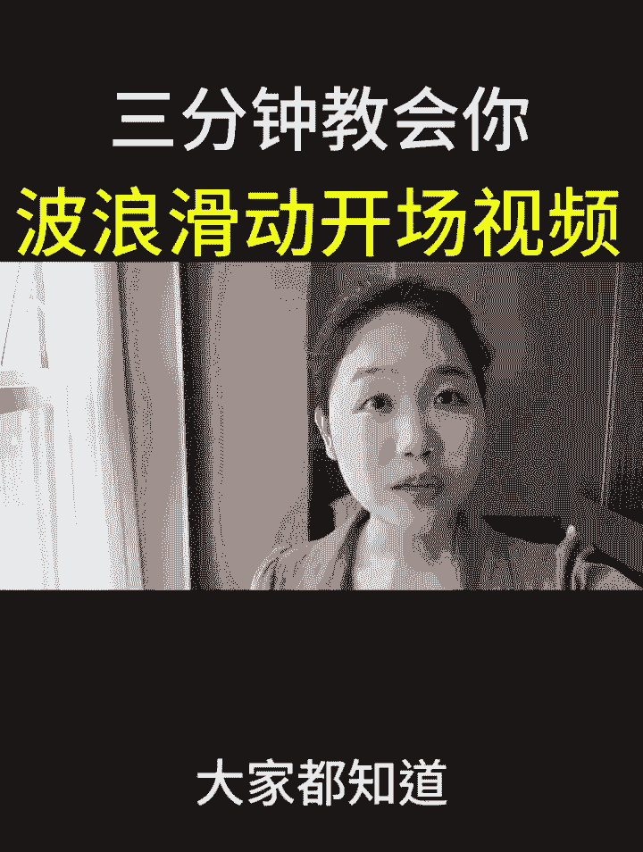
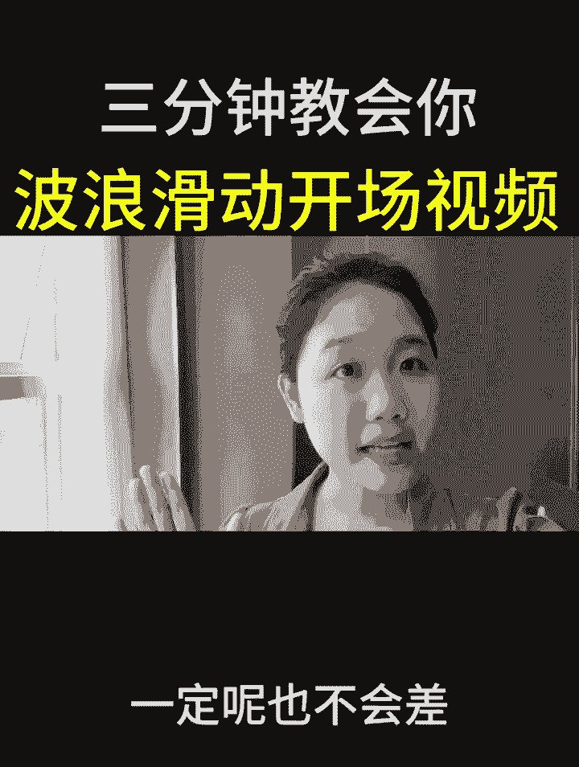
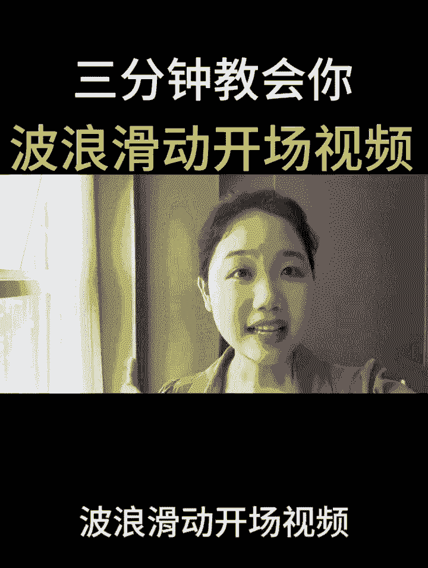
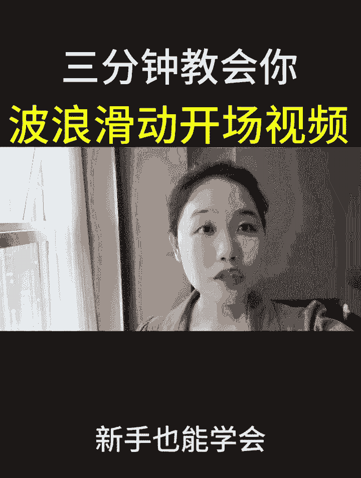
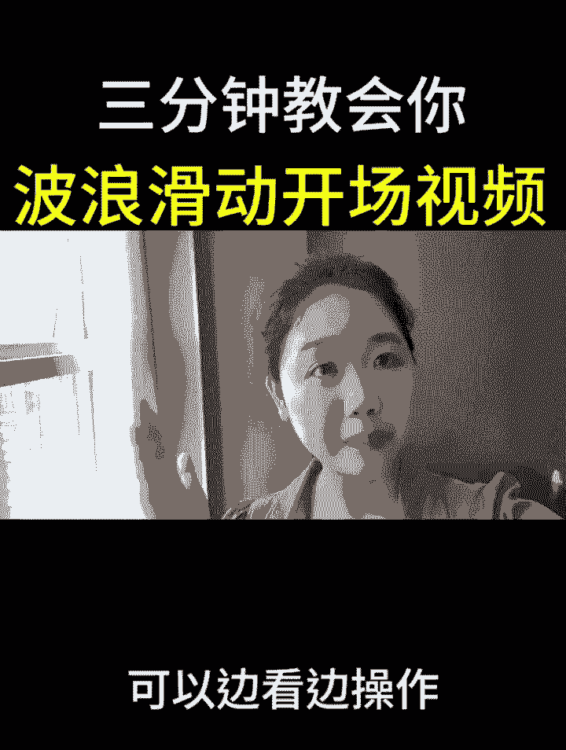

# 2024年全网最干货的新媒体运营教程，自媒体运营系统课(包含了剪辑／起号／短剧推广／头条各种玩法）抖音短视频零基础入门到精通，吊打一切付费课！ - P22：波浪滑动开场 - 果粒橙小米粒 - BV1gVxWekEdC

教你制作波浪滑动开场播放量翻十倍，大家都知道视频的开头是非常重要的。

如果说你视频开头那几秒钟能够吸引人的话，那你这个视频的点赞量和播放量，一定呢也不会差。

那么今天呢给大家分享一个波浪滑动开场视频，接下来呢就花3分钟的时间来带你实操。

新手也能学会，学之前呢别忘了先点个爱心收藏起来。

等你要制作时可以边看边操作。

那么我废话不多说，直接开始上实操，首先呢打开我们的剪辑软件，点击开始创作，在右上角找到我们的素材库，点击素材库里边呢，我们选中第二个黑色的素材，接着我们在右下角点击添加，添加进来之后。

我们把它的时长延长到五秒钟左右的距离，添加完成之后，我们在下方呢点击返回，把时间轴呢拖动到开头的位置，我们来到下方的工具栏，找到文本，接着呢直接点击文本在里面呢找到新建文本，那么我们在这里需要找到一个。

找到一个波浪线的符号，那么我们在这里呢找到我们一个波浪线的符号，这里有个波浪线的符号呢，直接选中它，接着我们这个有个键盘，点击返回，在我们的字体里边找到一个竖放大镜，在这里我们找到放大镜之后呢。

直接选中放大镜，在里面呢输入我们的星际黑，搜索，星际黑的字体，接着我们在下方点击搜索，搜索出来之后，我们直接点击第一个星际黑，接着我们点击关闭，点击对勾，接着呢我们需要把我们的素材进行到一个放大。

直接给它进行那个放大，放大后移动到这个位置呢就可以了，接着呢下方工具栏当中找到复制，我们可以发现它就复制成功了，复制成功之后，我们呢把素材给它往下滑，调整到一个调整到一个这样的位置呢就足够了。

接着呢我们把接着我们点击返回点击对勾，然后呢我们点击返回来到工具栏当中，找到贴纸的工具，我们点击添加贴纸，在里边的搜索栏里边，直接呢搜索白色圆形的贴纸，直接点击白色圆形。

那么可以发现里边就有一个白色的圆形的图案，直接呢点击这一个贴纸，接着呢我们点击取消点击对勾，接着呢把我们的时间轴稍微进行到一个放大，把时间轴呢给它拖拽到1。5秒的位置，接着呢点击我们的圆形贴纸。

接着呢点击我们的圆形贴纸，在里边找到一个关键帧，直接呢打上一个关键帧，打上关键帧之后，把我们的圆形贴纸呢给它拖拽到屏幕外，接着我们把时间轴呢拖拽到视频开始的位置。

接着我们把圆形贴纸呢给它拖拽到中间的位置，然后我们双子呢给它进行到个放大，让它覆盖住我们整个画面，接下来我们把时间轴拖拽到1。5秒的位置，选中第一段波浪线，接着我们给它打上一个关键帧。

我们接着选中第二段波浪线，同样的打上第二个关键帧，接着呢我们再把时间轴拖拽到素材的末尾，接着呢我们把下方的素材呢直接推出屏幕外，我们再接着点击第一个片段，点击第一个片段之后呢。

我们一样的把我们的素材呢给它推出屏幕外，像这样子呢，我们的一个波浪形的素材呢就已经做好了，接着我们选择导出，接着呢我们点击开始创作，在右上角有点击素材库在里边呢，我们需要在上方搜索我们想要搜索的素材。

比如说我们这一次搜索旅行，那么里边出现的素材呢都是跟旅行相关的，比如说我们选中这一段素材，选中了之后，右下角有个添加的按钮，点击添加，添加进来之后，第一步我们先选择关闭原声。

那接着我们需要把刚刚做好的波浪形效果，给它导入进来，那在下方的工具栏当中往左边滑动，找到画中画，点击新增画中画，直接呢把我们刚刚做好的效果图给它勾，选上右下角点击添加，添加进来之后。

我们需要把我们的效果图给它放大，双子呢给它撑满我们整一个屏幕，接着在下方我们找到混合模式，点击混合模式里边呢我们选中的是绿色，绿色，选择好了之后，直接点击对勾，那么接下来呢我们可以添加一个贴纸。

来装饰一下整个画面，我们呢点击返回，再点击返回，在下方工具栏当中找到贴子，找到贴纸之后，在里边呢，比如说我们搜索一个旅行，搜索旅行了之后，我们在下方点击搜索，那么我们可以看到里边呢。

就出现许多跟旅行相关的，我们可以往下拉找到我们想要选择的一个贴子，比如说这一个贴纸给它勾选上之后呢，我们点击取消，点击对勾，我们可以把贴纸呢放在合适的位置，比如说把贴纸放在我们的A右下角之后呢。

点击我们的帖子，把它的时间轴呢延长，让它跟我们的素材呢进行到一个上下对齐，贴纸添加完毕了之后，接下来呢我们给它添加上一个好听的背景音乐，我们呢回到一级工具栏找到音频，直接呢点击音频。

找到第一个音乐的按钮，在这里有许多的音乐，点击我们的VLOG，可以发现里边呢有许多的音乐，比如说我们选择这一个音乐，点击使用，选择完毕了之后，我们呢看一下它的时间轴，多余的部分呢直接给它进行到个裁剪。

点击音乐，把多余的部分进行裁剪分割，那么整个视频呢就已经制作完成了，稍后我导出来给大家看一下成片效果，如果说你对剪辑也感兴趣，但是呢又不知道通过什么方式，在平台上获得一份创作者分成的，可以给我点个关注。

点开我的头像，私信我留言，一个六，或者是扣一个六，那么我看到之后呢，会把自己整理好的一些新手指南，变现方式以及经验玩法分享给大家。

