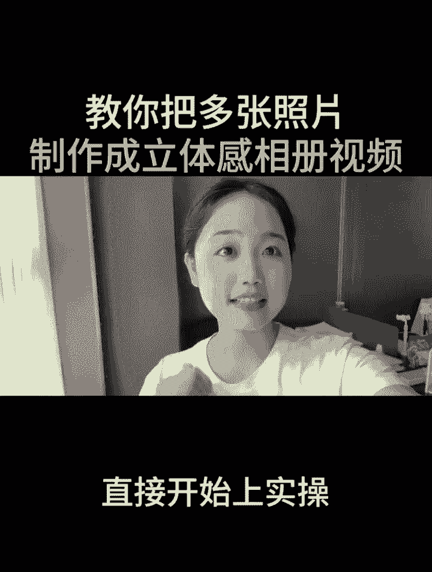

# 2024年全网最干货的新媒体运营教程，自媒体运营系统课(包含了剪辑／起号／短剧推广／头条各种玩法）抖音短视频零基础入门到精通，吊打一切付费课！ - P23：把相片变成立体视频 - 果粒橙小米粒 - BV1gVxWekEdC

把多张照片制作成立体视频，谁做谁火，今天呢给大家分享。

怎么把多张照片制作成一个立体感的视频，你是不是也遇到了出去游玩，拍了很多好看的照片，但是呢不知道怎么发才不会千篇一律，那接下来呢我会手把手的带你做一遍，学之前呢别忘了先点个爱心收藏起来。

等你要制作时可以边看边操作。

那么我废话不多说，直接开始上实操。

首先呢打开剪辑软件，点击开始创作，在这里我们需要选中五张照片，可以根据我们自己的需求选择，选好了之后，右下角点击添加，添加进来之后，我们需要对比例进行一定的调整，下方工具栏往左手边滑动，找到比例的工具。

点击比例，在这里选中的是九比16，勾选上之后呢，右下角点击对勾，接着我们需要给它更换一个背景，下方工具栏，找到背景两个字，点击背景在里面呢找到画布模糊，选中它之后呢，我们直接选中第二个模糊的背景之后呢。

左下角有个全局应用，点击全局应用，那么就能够应用到全部的片段，右下角打个对勾，接着我们点击返回，在这里呢我们需要给它添加一首好听的音乐，下方工具栏往右手边滑动，找到音频的工具，点击音频，点击音乐。

在这里呢我们可以根据自己的需求选择，比如说我们选择这一首歌，点击右手边的使用，添加进来之后呢，把时间轴挪到结尾的地方，多余的部分呢我们需要点击音乐，点击分割多余的地方进行删除，做好了之后呢。

时间轴回到开头的地方，在这里我们选中第一张照片，下方工具栏往左手边滑动，找到特效的工具，直接呢点击特效，在这里选择的是这一个玩法，点击玩法了之后呢，这里面有许多的一个分类。

我们在这里呢上方工具栏呢往左手边滑动，找到分割，在这里面呢选中立体相册，点击立体相册，那么它就正在处理当中，处理完成之后，它就会变成一个立体的相册，接着呢咱们点击对勾，接着呢我们选中第二张照片。

下方工具栏找到特效，点击特效，点击玩法，接着选中分割，在下方工具栏呢找到立体相册，那么它就会生成一个立体相册的感觉好，接着呢点击对勾，我们一共呢有多少张照片，就处理多少次，用相同的方法。

比如说选中照片之后呢，下方找到玩法，点击玩法之后呢，这里找到分割，直接呢点击分割，接着选择立体相册，那么它就会正在生成当中，当所有的相册都添加立体特效之后，我们呢点击返回来到一级工具栏，找到特效的工具。

点击特效，在这里找到的是画面特效，点击它之后呢，我们可以在里面呢找到氛围的特效，点击氛围，那么可以把它往上拉，找到我们想要添加的一个特效，比如说这一个春日樱花的特效，直接呢选中它。

接着我们在这里点击对勾，添加完成之后呢，它的时间轴呢需要给它延长，我们摁住它白色的小边框之后呢，往后边拖拽，让它跟我们的主图呢上下对齐，做好之后呢，我们把时间轴回到开头的地方。

可以给它添加一些好看的贴纸，在这里呢下方工具栏点击返回，再次的返回，在里面呢往左手边滑动，找到贴纸的工具，点击贴纸，在上方的搜索框里面呢可以搜索花朵文字，花朵文字搜索出来之后呢。

比如说我们要选择这一个轮子，给它勾选上，勾，选上之后呢，我们可以挪动它的一个位置，比如说把它挪动到我们的左上角，放着不动，接着呢点击取消，点击对勾，那么它的一个时间轴呢一样的摁住它。

白色的小边框往右手边滑动，让它跟我们的主图上下对齐，做好了之后呢，我们需要给它添加一个音频音效，那我们需要把时间轴呢拖拽到第二张照片，最开头的地方停下来，接着下方工具栏呢点击返回。

再次的返回下方工具栏呢找到音频的工具，点击音频这里找到音效，接着我们直接呢在上方的搜索框里面呢，搜索拍照两个字，搜索完成之后呢，我们可以选择一个我们想要选择的声音，比如说我们的第一个勾选上之后呢。

点击使用，那么现在呢我们可以听一下效果，随着我们视频的播放，它就有一个拍照的快门声，接着跟着老师一起选中我们的音效，下方工具栏呢找到复制的工具，点击复制，这样着，我们长按把它拖拽到这一个照片开头的地方。

接着点击照片，选中复制一样的长按，把它拖拽到下一张照片开头的地方，那么最后一次点击我们的音效，点击复制长按之后呢，把它拖拽到最后一张照片开始的地方，那么我们的一个音效就添加好了。

但是我们可以发现我们照片和照片的中间呢，它是有一个转场的，在这里有个白色的小边框，我们呢可以选中它之后呢，可以添加一个转场，比如说我们在这里呢把它往上推，可以呢去找到一个推进啊，点点击推进的转场。

点击推进的广场之后，我们可以往下拉，在这里呢有全局应用，点击全局应用，那么它就能够应用到全部的片段了，接着呢点击对勾，那么我们的一个立体相册的一个视频呢，就已经制作完成了。

稍后我导出来给大家看一下成片效果，如果说你对剪辑也感兴进去，但是呢又不知道通过什么方式，在平台上获得一份创作者的分成，可以给我点个关注，点开我的头像，私信我或留言我一个六，那么我看到之后呢。

会把自己整理好的一些怎么去剪视频，以及怎么通过这种视频去变现，赚到收益的一些方式分享给大家，那接下来呢我给大家看一下成片效果，忽然有一阵风闯入我的眼中，是不是你的思念在翻涌，我却握不住风，这像是一场梦。

