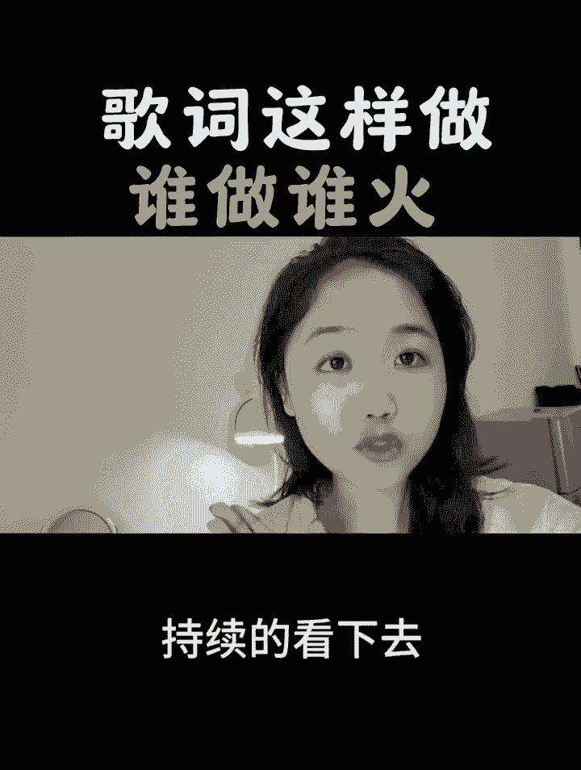

# 2024年全网最干货的新媒体运营教程，自媒体运营系统课(包含了剪辑／起号／短剧推广／头条各种玩法）抖音短视频零基础入门到精通，吊打一切付费课！ - P24：不用会员也可以识别字幕 - 果粒橙小米粒 - BV1gVxWekEdC

歌词这样做，谁做谁火，一分钟学会，今天呢教大家制作一个谁做谁火的音乐视频。

其实像这样的一个音乐视频呢，只要别人喜欢听这首歌，就会把你的视频呢持续的看下去。

你呢也可以赚取一个稿费，那接下来呢我会手把手的带你做一遍，学之前呢别忘了先点个赞，点个爱心收藏起来，等你要制作时可以边看边操作，那么我废话不多说，直接开始上实操，首先呢打开剪辑软件，点击开始创作。

在这里我们需要呢勾选的是视频，勾选视频之后呢，我们把一段视频素材呢勾选上，右下角呢点击添加，把视频添加进来之后，我们需要选择关闭原声，把原声关闭了之后，下方工具栏呢往左边滑动，调整一下它的比例。

点击比例之后呢，选择的是三比四的比例，那么我们可以发现视频的旁边啊是黑色的框框，接着呢我们可以给它进行调整，两只手指呢摁住我们的一个视频，给它进行一个放大，让它撑满呢，我们整个图片撑满图片了之后。

接下来呢可以对视频呢进行调整，我们直接呢把它往下稍微的拉一下，那么我们的一个视频呢就调整好了，调整好了之后直接呢点击对勾，那做好了之后，我们需要把音乐呢给它添加进来，下方工具栏往右手边滑动。

找到音频的工具，点击音频直接选中音乐，在这里有许多的音乐可以供我们选择，上面呢也有许多的分类啊，我们可以根据自己的喜好选择，那比如说我们有想要搜索的歌曲，也可以直接点击搜索，比如说搜索彩云之南。

搜索彩云之南之后，那我们呢可以把我们的试听一下咳，彩云之南好比如说我们想要添加这一首歌的话，右手边有个使用的按钮，直接点击使用使用，添加进来之后呢，我们呢把时间轴呢回到结尾的地方。

回到结尾的地方了之后呢，把多余的音乐呢进行裁剪，直接呢点击音乐下方工具栏，点击分割，把多余的音乐呢进行删除，删除了之后把时间轴呢回到开头的位置，回到开头之后呢，点击返回，在下方呢找到文本的工具。

点击文本，我们需要把歌词呢给它识别出来，直接呢点击识别歌词选中开始匹配，但是呢我们的识别歌词呢是需要会员的，那么今天在这里，老师就教大家一个怎么免费识别歌词的方法啊，直接呢歌词识别出来之后。

选中我们的歌词下方工具栏，找到编辑字幕，点击编辑字幕的工具，接着来到第二行歌词的地方，在它最开始的位置呢，点击它之后，它会有一个黄色的光标，接着在我们下方找到一个打叉啊，直接的给它删除好。

那么我们的一个歌词呢都放到一句话里边了，接着我们一样的点击第二句歌词开头的地方呢，点击删除每一句话，歌词的开头呢我们都需要删除啊，每一句话歌词开头的地方都点击删除，删除好了之后之后呢。

会出现一个全选的工具，点击全选，接着呢这里有个拷贝啊，我们可以直接选择拷贝，有些同学手机上是复制，也是一样的，直接呢选拷贝之后呢，我们把这里啊右手边有个删除的按钮，垃圾箱直接呢点击删除，删除完成之后呢。

点击对勾，接着我们把歌词呢回到开头的位置啊，时间轴回到开头的位置，下方工具栏找到文本的工具，点击新建文本，这里面呢直接呢长按把我们呢文字呢给它选择，贴贴给它贴贴进来，贴贴进来之后。

咱们需要对歌词呢进行调整，每一行把这一大串歌词呢变成一行一行的歌词，直接在彩云之南的后面呢，点击它之后，它会有个黄色的光标，接着右下角点击换行，接着呢在我心方向啊，在这中后面呢给它点击换行。

然后呢孔雀飞去呢点击换行，咱们呢把所有的歌词都点击换行完成了之后呢，那接下来呢点击我们的字体，可以选中我们的一个江湖体，让它整个字体呢变得好看起来，字体选择好了之后呢，可以跟着老师一起点击样式往上滑。

找到我们的排列工具，直接呢点击排列排列里边呢，我们可以呢把它往上滑动，然后下方会出现一个行间距，行间距呢我们可以稍微的拉一下，我们可以看到，那么我们的一个歌词的行间距呢，是不是就已经拉开了。

拉开了之后呢，点击对勾，我们的一个歌词呢就已经调整好了，调整好了之后时间轴啊，咱们呢摁住它白色的小边框往后拉，让它跟我们的主图呢上下对齐好，直到拉到上下对齐之后，我们呢回到开头的位置，在开头的位置。

我们可以发现我们的歌词呢它是不会动的，那如何让它动起来呢，这时候我们回到开头的位置，给它呢打上一个关键帧，打上一个关键帧了之后，我们直接呢把歌词呢往下拖拽，拖拽到剩余四行歌词的位置呢，停下来。

接着呢我们校方的工具栏往左边滑动，时间轴呢回到结尾的位置，在结尾的位置呢停下来，这时候呢我们直接呢把歌词呢给它往上拉啊，一直拉给它往上拉，拉到我们这一个歌词呢，就是升一级啊，就这么多的时候停下来。

那现在呢我们给大家看一下我们的一个效果，彩云之南，那么接下来给大家看一下，我们的歌词是不是随着时间的播放，慢慢的往上滑动，慢慢的往上滑动了呢，好那做好这一步了之后，我们接下来呢给它添加上一个动画效果。

让他整一个画面呢变得更高级起来，好下方工具栏呢找到样式的工具，直接呢点击样式，这里面直接选中我们的动画效果啊，点击动画之后呢，咱们把它往上拉，在这里呢我们找到一个卡拉OK啊，直接选中卡拉OK。

选中之后我们可以发现随着我们音乐的播放，我们的这一个动画效果呢，也在慢慢的跟随音乐一起动好，那我们选好了之后，下方呢其实呢也可以改变我们的一个颜色，我们可以自己根据自己的需要呢选择好。

我们比如说直接点击对勾了对吧，做好了之后呢，如果说你想要添加一个歌词呢，有边唱边消失的一个效果，那又该如何去制作呢，直接呢选中我们的视频条，选中之后下方工具栏往左手边滑动，找到复制的工具，点击复制。

那么复制出来的一个视频呢，在下方工具栏找到切画中画，点击切画中画之后呢，它就变成画中画图层了，接着长按我们的画中画，把它呢往前推，让它呢放到我们开头的位置，这一个做好了之后呢，我们直接点击我们的画中画。

接着在下方工具栏呢往左手边滑动，找到我们一个蒙版的工具，直接呢点击蒙版，在这里面直接选中的是线性的蒙版啊，点击线性，点击线性蒙版之后，我们呢可以把它稍微的往上挪一点，留一点点空间。

接着呢我们这里有一个羽化，直接轻拉我们的一个羽化，让它有一个融合的一个效果，轻拉羽化之后呢，我们在这里呢打个对勾，打完对勾之后呢，下方会出现一个层级啊，我们直接点击层级，点击成绩之后选择的是顶部。

做好了之后呢，给它打个对勾好，那现在呢我们的一个歌词呢就有一边往上走，一边慢慢消失的一个效果了，看到没有，慢慢的消失，慢慢的消失的一个效果了，做好了之后呢，那咱们接下来呢给他把歌名呢给它添加进来。

下方工具栏呢点击返回，再次的返回，找到文本的工具，点击文本，在这里面呢选择新建文本，那比如说我们这首歌的名字呢叫做彩云之南，我们把彩云之南的名字输进来之后呢，我们可以点击样式。

比如说可以选中我们的这一个黄色的字体，选中了之后呢，我们可以给它添加一些动画效果，右手边呢点击动画，接着呢，我们在里边呢具有许多的动画效果，可以供我们选择，那比如说我们选择这一个。

比如说我们选择这一个渐显的效果，选中了之后，时间轴呢下方时间轴给它拖拽到每三秒，拖拽之后呢，给它打个对勾，接着呢我们可以把这一个时间轴呢给它延长，让它跟我们的主图上下对齐，做好了之后呢。

我们可以调整一下我们这一个名字的位置，可以呢给它放到中间的位置，稍微的双子可以它进行到一个放大，那么我们呢点击小键盘返回点点击对勾，那么整个视频呢就已经制作完成了，稍后我导出来给大家看一下成片效果。

如果说你对剪辑也感兴进去，但是呢又不知道我们把视频剪辑完之后，怎么发布到我们的平台上，获得一份创作者的分成，那么你可以给我点个关注，点开我的头像，私信我一个六或扣一个六，那么我看到之后呢。

会把自己整理好的一些新手指南，变现方式以及经验玩法分享给大家，接下来给大家看一下成片效果，彩云之南，我心的方向，孔雀飞去，回忆悠长，玉龙雪山闪耀着银光秀色，丽江人在路上。

