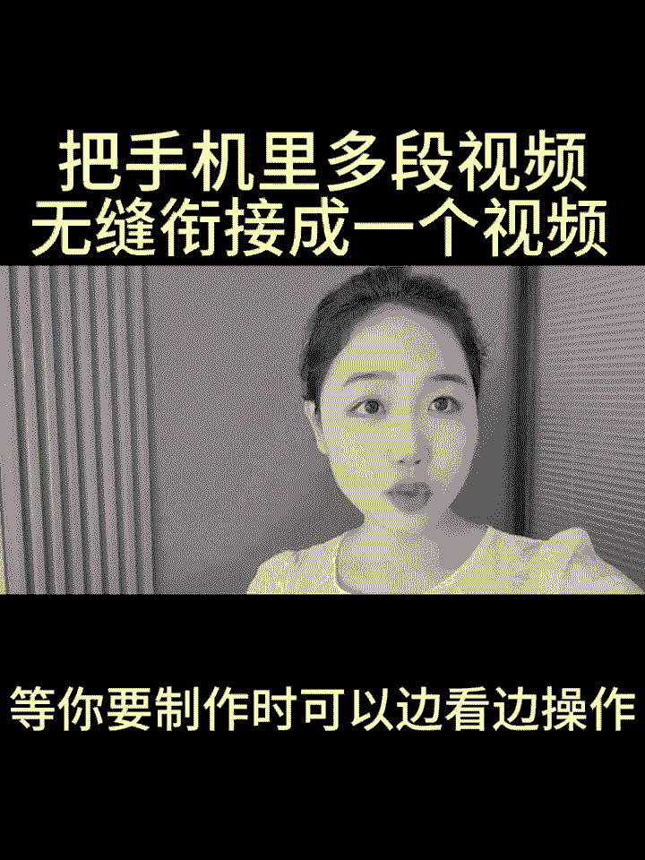

# 2024年全网最干货的新媒体运营教程，自媒体运营系统课(包含了剪辑／起号／短剧推广／头条各种玩法）抖音短视频零基础入门到精通，吊打一切付费课！ - P25：多个视频融合起来 - 果粒橙小米粒 - BV1gVxWekEdC

把多个视频无缝衔接起来，融合成一个视频，如何将自己手机里面的多段视频。

无缝衔接成一个视频呢，只需要关键帧加混合模式就可以做好，如果说你担心看一遍记不住的话。

可以先点个赞，点个爱心收藏起来，等你要制作时可以边看边操作。

那么我废话不多说，直接开始上实操。

首先呢打开剪辑软件，点击开始创作，在我们手机里面找到视频，点击视频，视频栏目里边勾选上三段，我们提前准备好的视频给他依次的勾选上，勾选上之后，右下角点击添加添加进来，第一步关闭原声。

我们把手机往左边滑动，找到第二段音频，点击第二段音频下方工具栏往左边滑动，找到切画中画，点击切画中画，接着长按素材，把它往前拖拽，直接把视频拖拽到两秒钟的位置，接着我们点击视频素材。

在这里呢给它打上一个关键帧，接着我们在下方找到混合模式，点击混合模式，把进度条呢调整到零，接着我们点击对勾，校方一样的把视频条往左边滑动，滑动到四秒钟的位置，停下来，打上一个关键帧。

接着在下方工具当中点击混合模式，在这里直接把进度条拉拽到100，我们接着点击右下角的对勾，接着呢我们把时间轴呢往左边滑动，找到第三段视频素材，点击第三段视频素材，校方工具栏，找到切画中画的功能。

直接点击切画中画，接着呢把我们的视频素材往左边滑动，拖拽到四秒钟，把时间轴呢放到四秒钟的位置，接着长按视频素材，把它呢推到四秒钟的地方，接着呢点击视频素材，给它打上一个关键帧，下方找到混合模式。

直接把时间轴呢调到零，点击对勾，接着再把时间轴拖拽到六秒钟的地方，点击视频素材，找到关键帧，点击关键帧，把下方找到混合模式，点击混合模式，直接把它调整到100，调整完成之后，时间轴往左边滑动。

把我们的视频时长呢跟我们的主图对齐，直接呢给它往回拉，第二张素材也是一样的，直接的让它跟我们主图上下对齐，对齐完成之后，把时间轴呢挪动到开头的位置，下方工具栏点击返回，再次点击返回，找到音频的工具。

点击音频，找到音乐，点击音乐之后，里边呢有许多的音乐可以供我们选择，我们呢可以把它往左边滑动，找到我们的舒缓，点击舒缓里边的音乐呢，比如说我们选择这一个第二个直接点击使用，添加进来之后。

把我们的视频呢往左边滑动，把多余的地方呢直接给它删减掉，在这里点击我们的素材，时间轴呢就会自动的往回拉，接着点击下方的音乐轨道，点击分割，多余的部分点击删除，如果说你对剪辑也感兴趣。

但是呢又不知道通过什么方式，在平台上获得一份创作者的分成，可以给我点个关注，点开我的头像，私信我一个六，或留言一个六，那么我看到之后呢，会把自己整理好的一些新手指南，变现方式以及经验玩法分享给大家。

那接下来呢给大家看一下成片效果，我们总会绕啊绕绕啊绕绕几千里路。

也望向归途。