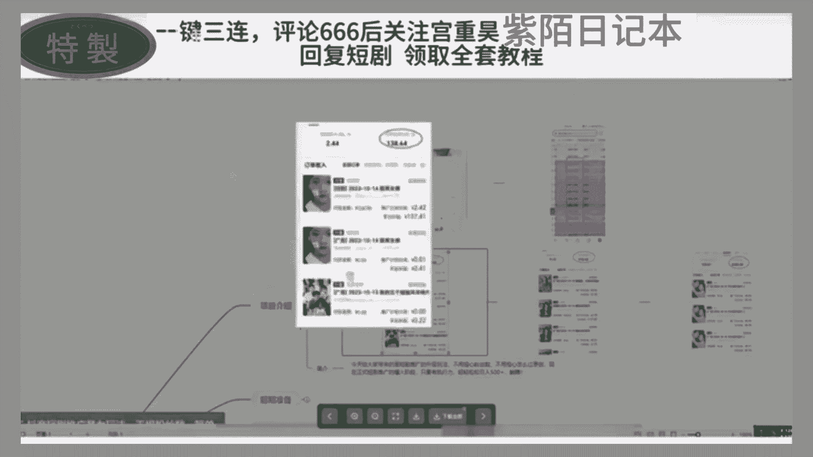
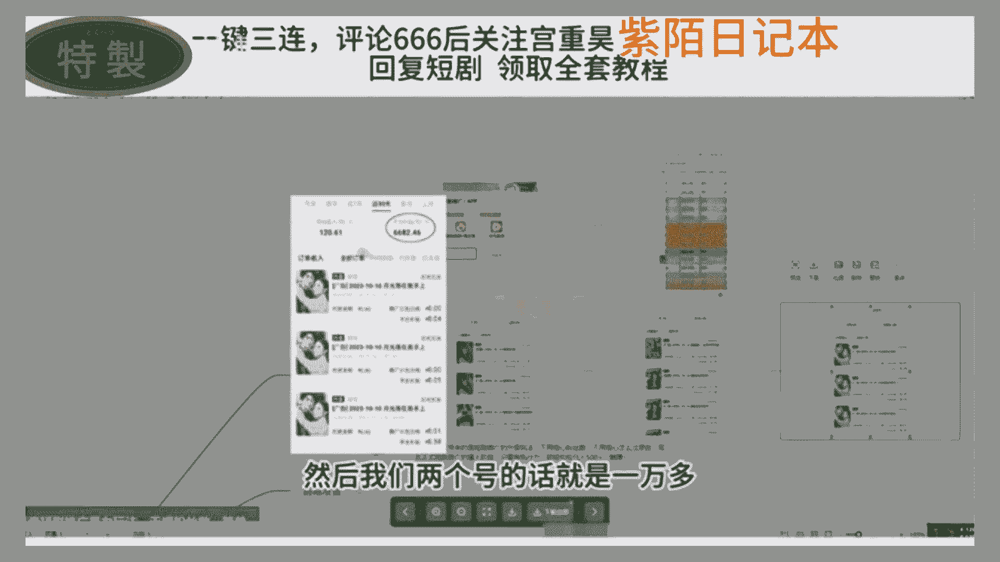
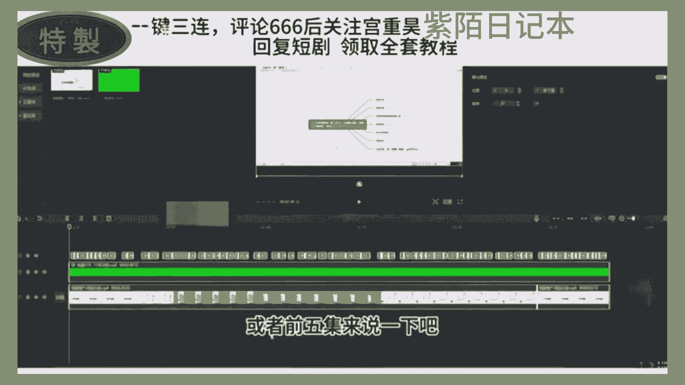
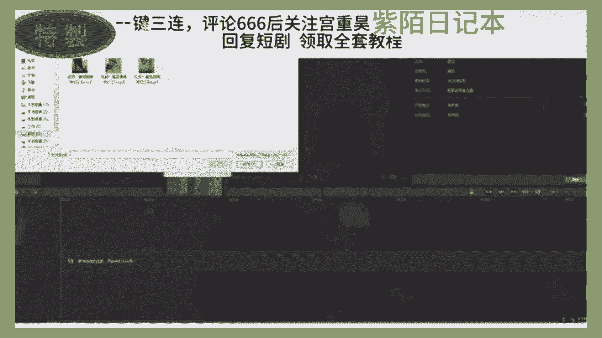
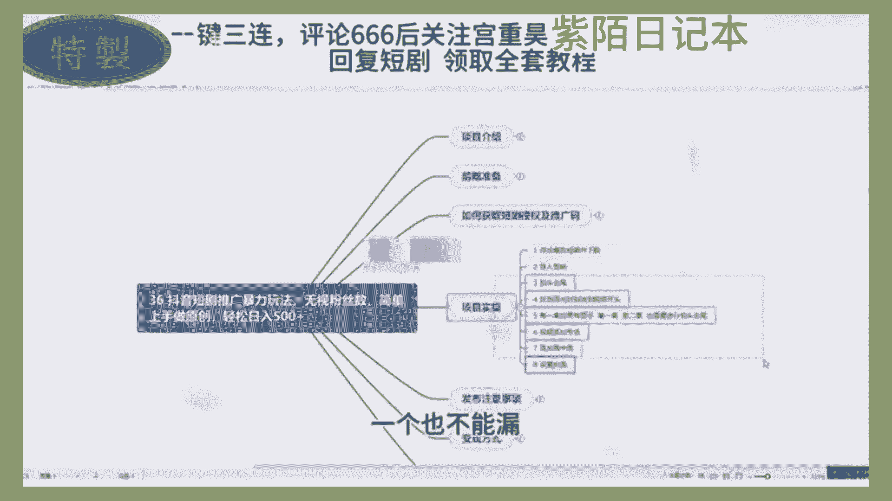
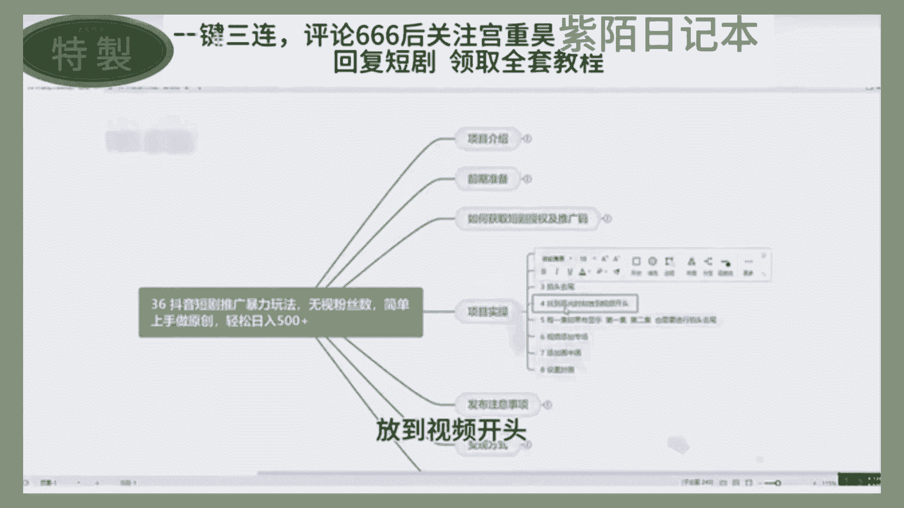
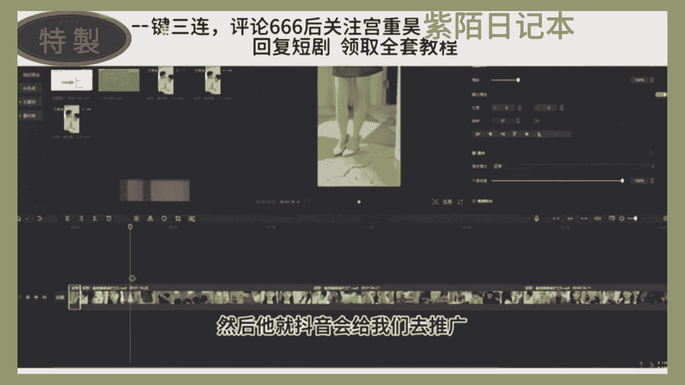
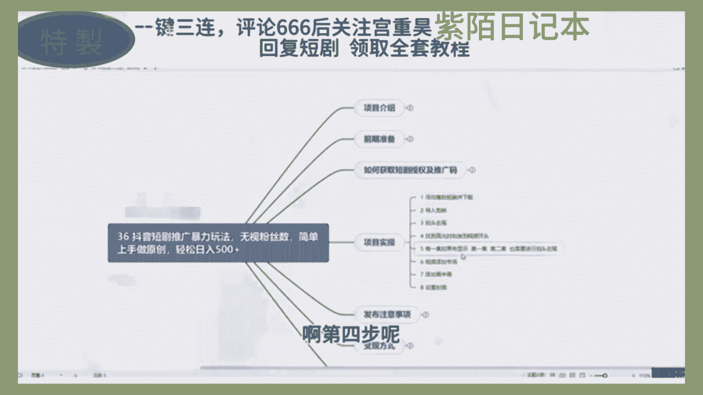
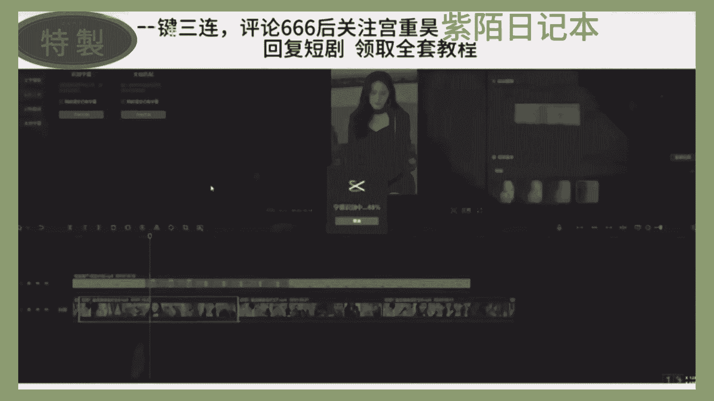

# 2024年全网最干货的新媒体运营教程，自媒体运营系统课(包含了剪辑／起号／短剧推广／头条各种玩法）抖音短视频零基础入门到精通，吊打一切付费课！ - P2：短剧推广玩法 - 果粒橙小米粒 - BV1gVxWekEdC

我家徒四壁，除了成功，别无选择，如果你现在三无，没有本钱，没有人脉，没有特长，听我的，一定要做点副业，增加自己的收入，跟上这个时代的生活，那不知道做什么没有关系，我都帮你研究好了。

今天的分享一个今年最大的蓝海项目，短剧推广，这也许是你在新的一年翻身逆袭的机会，如果你错过了小说推文，错过了直播切片，那这个刚开放的短剧分销玩法，千万别再错过了，我们来先看案例。

就这样的视频你肯定有刷到过吧，几分钟一集的视频连载，剧情呢有点像小说，又有点像影视剧的感觉，非常的抓人眼球，这个呢就是短剧，短剧呢是今年突然爆火的一种新的剧情形式，目前呢已经形成了很大的市场规模。

咱们呢就通过混剪切片和解说的方式，把一些高潮的片段内容展示出来，吸引用户来宣传这部短剧，当用户看到兴起的时候戛然而止，很多人呢就按耐不住。

就会根据你的视频推荐，去到看剧的平台去付费观看了，别人花钱买了后续剧情的观看权限。

你就能够拿到这笔钱的分润，有付费收益的60%到80%不等，如果你的视频上大热门了，有个几百万的播放。

可能一条视频就给你带来十几年的一个工资，都不止，明白吗，别怀疑谁会买啊，我知道了一个短剧公司，一部短剧就赚了上千万，咱们不生产短剧，咱们就推广这个玩法呢，我们团队呢做了20多天。

产出大概有2万多的一个收益，那操作上呢也不难，新手小白呢也能够快速上手，同时呢很适合影视号来转型去做短剧，对账号呢也没有要求，零粉丝就可以申请挂载权限，那授权呢也是免费的，目前呢做的人还很少。

可以抓紧入局，早布局早开始，那入驻平台的详细流程，以及具体的实操视频教程，就是怎么去推广，才会有钱拿，我已经整理到了我的工具箱里，刚更新的还热乎呢，想了解的评论区回复短剧推广到助理发视频，教你这么喊。

他不会出来的，你说不会在爱情里犯错，也说过会永远的爱我，那项目是抖音短剧推广，暴力玩法，无视粉丝数，简单上手做原创，轻松日入500加，首先我们去看一下项目介绍，看一下我们这个团队做短期推广的一个效果。

首先大家可以看一下这个短期推广，它最高的一个收益是5万5万块钱，然后这个是平台给我们的一个提成，60%到70%投，我一般的话都是65%以上，65%到70%，所以说平台对我们这个短期推广。

做的扶持力度是非常大的，只要我们有这个执行力，并且按照这一课的流程去做，我们会拿到一个很好的结果，然后看一下我们这个学员做了一个结果。

这都是当天的收益，当天这位学员是100多块钱。

然后这是另外另外一个学员的，另外学员是500多，都是一些当天的收益，然后这个呢是另外一个学员，近30日就是一个月等于收益，比大部分人打工赚的钱都要多，这还是一个账号的，如果说我们去批量做矩阵的话。

一个月7000块钱，然后我们两个号的话就是1万多。

三个号的话就过万，过2万了，就目前这个抖音，现在对短期推广扶持力度非常大，所以说大家要抓住这个机会，然后给大家讲一下我们这个项目的一个简介，今天给大家带来的是短期推广的升级玩法，不用担心粉丝数。

不用担心怎么过原创粉丝数，有些人就是很苦恼于我没有1000粉丝，我没法做，通过这节课你就可以获得一个零粉，能做抖音推广的一方法，而且这种是暴力的玩法，不用去操心或原创问题，只按照这个方法来做。

韬韬作品全部都是原创，然后现在呢正是抖音短剧推广的爆破阶段，只要你有执行力，轻松轻轻松松就能日入500架，是一个躺赚模式，非常暴力，有玩法，而这个项目的话，我们是以项目介绍。

前期准备讨一个大家最关心的问题，就是如何获取短剧授权以及托码，还有项目实操发布的一些注意事项和变异方式，围绕这几个方式来给大家做一个，详细的展开描述，这节课给大家讲一下。

做我们短期推广这个项目的前期准备工作，首先呢我们需要两个东西，一个是我们设备的相关东西，还有一个是账号的相关东西，设备的话我们需要一部手机，不用电脑，不需要电脑，苹果和安卓的都可以，其他的没有什么要求。

账号的话，我们这些有很多需要注意的细节，大家一定要注意一下，我们会从四个方面给大家讲一下，分别是注册账号，还有雅号账号一个打造，还有一个怎么去找对标账号，以及对外账号TV的一个展现形式都是什么样的。

嗯好我们先看一下注册账号的话，建议大家使用流量去注册账号，并且用流量去运营账号，不要去连接了WIFI，并且呢要保证一金一卡一号，不要去随意的切换账号，然后这里边推荐大家去用流量卡玩这个项目。

流量卡的话他月租比较便宜，并且呢他那个流量是非常多的，有的流量卡19块钱或者是15块钱，他就有上百G或者是几10G，所以说流量卡非常划算，第二部分呢就是我们的一个雅号账号，注册完之后，我们需要进行养号。

养号的分为两个步骤，第一步骤就是搜索相关的账号，因为我们账号账号刚注册完之后，肯定推荐里边没有那些相关的账号，所以说我们要要去直接进行一个搜索，并且适当的点赞，收藏和彩蛋，还有第二的就是第三天。

我们去修改账号的一些信息，就是账号打造访问了，并且发布几条作品，观察流量的情况，这里给大家演示一下，比如说这是我刚注册一个账号，然后推广页里，推荐页里面肯定是没有，这些玩具推广相关的东西。

所以说我们要直接搜索玩具推广，然后点视频，直接搜索短剧，然后这个点视频，然后就可以这个看了，然后下边你就直接这么像推荐业主的下滑一样，所有都是短剧，这是我们方式好，并且就是点赞。

然后看到好看的话就去进行一个评论，然后并且收藏或者是转发，然后这个下单的话单独给大家说一下，下单就是比如说你在刷推荐页的时候，看到一个有人在直播直播的话，正好他那个直播间里的有个一块钱。

就是他在为他的直播间在流量，然后可以进行一个下单，这样会升升高，我们就会正好有权重情况，然后第三天的话就是我们去需要修改账号信息，然后在这里边给大家说一下，账号信息怎么去修改。

那就涉及到这个账号有一个打包打造的话，我们分成演示四个方面，头像名称，个人简介，还有背景，然后分别给大家都说一下，头像的话，推荐大家去看贝贝账号，然后这一段给大家有三个推荐的头像。

就是看起来比较个性一点，或者是符合你自己的一个人设，女生的话就是设成女生的头像，男生的话设置成你的男生的头像，找宝图也可以，然后或者是什么波短剧，什么说电影拳这种打法也可以。

看他这个特像可是很多用的都是动漫里，大家用去需用你的动漫方向就可以，还有名称的话，这也没有什么过多的要求，就是要彰显出你是来做什么的，比方说你是做短期退款的，你要起一个什么什么短剧，比如说小猫短剧。

小花短剧或者什么什么爱追剧，什么时剧场这些都行好，第三个就是个人简介，个人简介里边需要大家注意的，注意的有几个点，第一个就是我们要也是和头像和名称一样，就是代表出我们是做什么的。

这里就是日更精品上头短剧，有喜欢留波关注吧，这是引导也有关注，而这里边呢就是也是在短剧更新中，好感谢点赞和关注，也是引导有点赞引导的关注，这是第一个需要大家注意的点，另外一个就是我们可以进行一个引流。

但是这引流有一个说法，就是我们粉丝数必须达到10万或者，15万以上之后，你才可以在这里边进行一个联系方式的填写，要不然肯定会对你的账号带来不好的影响，比如给你进行一个降船降降重。

降完重之后JO你账号里没有什么流量，所以说这个是大家需要注意的一个点，然后第四个的话就是背景图，背景能糊，背景图的话就是可以找同行去下载一下，然后这一个id大家准备有两个，比如说他这种的话点一下。

然后点下载就直接保存到我们的相册里面，玩玩这个，然后我们点一下，然后再点击下载，直接用空昂的就可以好，剩下的就是一个对标账号，然后这里边给大家列举有三个对标账号，然后这三个的话都是做的非常好的，三个人。

大家可以去抖音上去专门搜索一下这三个人，然后按照人家的一个古方式进行一个模仿，另外一个就是给大家说一下，我们怎么去找这边账号，对标账号，对标账号获取的话，比如说我们搜索出来之后。

直接直接在这放大镜里面搜索，搜索完之后我们点的是他，他就是我们的一个对标账号，找对标账号，第一个需要注意的点，就是就看他的粉丝数和作品数，如果说他的作品数是女王，说她是1万个，那他有20万粉丝。

这种的话，说明他作者作品肯定是不好的，1万的作品拍成了20万粉丝，基本上就是你他的作品有100个到200个之间，20万很正常，然后200个到400个作品之间，然后是40万到60万。

这种是比较正常的一个对比，所以说大家就要去找这样的账号，然后他就是我们的一个对标了，对标之后我们可以点下面这个小箭头，下边这些都是一些我们的自备账号，然后根据我刚才给你说的那个规矩，那个规则。

然后去找他是否是符合咱们的一个自备账号，如果符合的话，就要去研究他的作品，在哪些方面是值得我们学习的，所以说这这个账号，我们大家按照这种方式来找的话，一天都能找上50个，赌100个赌好。

这节课就给大家讲到这，然后这些东西大家都要去实操一下，只有实操过了之后，才能明白其中的是怎么进行一个嗯打造账号的，这节课给大家讲一下，我如何去获取短剧的授权以及推广码。

飞一课给大家讲一下我们的一个项目实操，我们拿到短剧素材之后，怎么把它变成国际的原创作品，按他这个来举例吧，就是我要去推广这个短剧，然后他这里边会给我们一个项目说明牌库，我们直接去复制吧。

被我打开我们这些展台看一下，他是还要记一下这个多多剧场，然后记一下他这个名字什么时候来打工，记完之后，我们在这里可以寻找寻找，因为他这里边很多短剧我们需要去掌握，他这个上面窝汇总表单后。

下面的话都是各个剧场的一些短剧，所以说我们要去找到一个多多剧场，这本不好找，然后给大家推荐一个好找的一个方式，就是往下找，他这有个汇总表单，项目名称，然后我们去找我们的多多短剧，多多剧场。

就这个多多剧场，然后代号走好没有，他也是60到70%，他这有链接，点击过去就跳出来了，看他这个第一名，他若是按照这个收益的一个高低顺序排序的，他第一名就是他，所以说我们要去推网，这里边就有一个榜。

百度网盘的一个素材，然后大家也要去看一下他这往后表，最后边有没有这力推高转化，如果有的话，我们去做，如果没有话，我们不做，那，好我们点一它，把它这个素材保存到我们自己的百度网盘里面，好我们保存。

好保存完之后，我们在电脑上面才下载一下，然后封面他也给我们准备好了，好我们进行一个下载，他一共40多集，我们全部都下载一下。

有点慢哈，有点慢，我看到他下来了，我们先用前三集或者前五集来说一下。

首先呢我们就是打开剪映，打开了剪映之后，把素材导入进来，好我们就来678来说吧。

678打开，然后把封门拖下去，好把分门图也下一下。

然后我们就把六第六集，还有第七集，第八集全部导入进来，第七集第八集导起来好，在做我们这个实操之前，我先首先给大家介绍一下，我们给一些实操步骤吧。

第一步就是寻找爆款短剧并下载，只有我们已经做完了，导入剪映做完了，然后呢，后边的都是我们一些进行原创的一些技巧，这些技巧的话大家一定要保存一下音乐。

不能漏们，要每一步每一步的去添加，然后给大家说一下，掐头去尾是啥意思，掐头去尾，你就看他一开始，还有这第六集，我把音量调小一点，看他这就是有个第六集有个开头，我们只需要把这个开头给他去了就行。

好这回又没有第六集了，我们把他直接点这个按键或者是快捷键，CTRL加B也行，然后把他给删了，大家看一下，没有任何影响，我们只是把他那个开头给去了，因为我们要去做一个将近20分钟。

或者将近30分钟的一个道具，如果有他那个的话，就很影响观感，比如说这个如果说喊他有他那个开根号，我们会去看看到一个什么样的结果，嗯别人说了一个有什么问题吗，结果呢直接咔带着琴了。

就是很看着很多很多很麻烦，所以说我们要让他连贯起来，比如说开场吧，他这说，有什么问题吗，然后到第二集了，到第二集之后，他这有又有一个有什么问题吗，所以说这两个我们要先保留一个，因为我们是掐头去尾。

第一个片段我们已经掐头了，但是没有趣味，所以说我们要把第一个片段里面，那个有什么问题吗，他去了，好那我在这删除我，然后第一个看片段，我们就掐头去尾弄好了，然后第二个片段进行一个掐头去尾，好那这是弄。

我把前面那个给他删了，大家看一下，这是不是就已经连贯起来了，连贯起来之后，我们又去去搞第二个轮秀，嗯嗯好，现在的话我们就是因为这个第二段和第三段，他这个最后和这个第三段开头没有重复。

所以说我们第二个就不用去尾了，然后还有这个第三个，我们进行一个插头，就是把这个第八集给他去了，好了，然后我们直接裁剪，就是有时候你会裁剪出，就把他一句话改去了，或者两句话改去了，没有关系，就连贯起就行。

让我们看一眼，看是不是很连贯，所以说没有关系中没有关系，然后第三个我们就是进行一个趣味，等他转身了，然后我就直接点难把这也杀了，然后如果说后背有第九集，第十集，第1月第11集，全都是按照第一遍。

按照我这个方法来过滤一遍，只是掐头去尾，让还要进行一个连贯，连贯起来之后。

那我们又进行一个接下来的操作，找到高光的时刻，放到视频开头。

这是啥意思，比如说这个是我们第一集啊，我用这短剧肯定是从第一集开始演的，对不对，所以说我们要找到一个很高光时刻的开头，这个没有高光的，然后我们去找一另外一个，就拿这个吧，这个事苗染轻了吗。

这就相当于是高帮的开头，我们就直接给他踩肩一架，好在这，但我号抖抖，我们来登哥登哥，整完之后把电车复制一下，复制完之后把它放到开头，快来看一下效果，这个不连贯没有问题啊，因为开头我们就是要做一个数据嘛。

做一个用户停留的数据，然后我们开头有个三秒，三秒四五秒，然后这个开头的一个停留数据我们做好了，做好之后，然后他就抖音会给我们去推广我们这个视频了。

然后第四步呢。

就是刚才我说的进行一个掐头去尾，就是如果说还有第一集啊，第二集，第三集，第四集进行一个掐头去尾的，那些啥不连贯的或重复的都快删了，尿尿都快删了，要不然呢用户看起来很麻烦，我看第一集看着还挺好看。

然后第二集的话一看看出来了，这不连贯的，然后很多人就走了，不想看了，然后我们带这些就是中间要加一个转场，因为我们现在看起来就是不连贯嘛，看他们这个都是有一个转场，容院的李加一个转场在这，他这有个动画。

动画有分人入场和出场，我们直接选一个入场动画，到这里边，大家随便选就行，还有给大家一个建议，就是选的时候一定要选那些动作少的，比如这向下甩入就直接向下丢一个动作，但如果左左右抖动的话。

拍摄看到没有使劲在抖抖好几遍，这说们不要用这种就用啊，就用这种是一个动作，直接让他向下甩入，枪上手轻微抖动，就这种感，然后大家一个动画市场，这就可以了，那看一下好物间传借一哥转场，而这动画沙有点有点吵。

我们刷稍微足一点暖意，往后拉开，这是不是阵容好多了就好多了，然后这我们给他加一个动画，向下甩动，这样也可以也可以，然后怎么去批量添加呢，就是我们全选，然后点击，卡他这种手机也可以啊，手机也可以，这样的。

没有办法，就是全部手机都可以，然后大家用手机套动法就行了，点击动画，然后再选一个，就是要等全部都选上，制作完成之后，我们需要进行添加一个画龙，画，画中画什么意思，给大家看一看。

只有我们还需要导入另外一个另外一个素材，比如说我们老爹这个素材白夜素太臭，我们才不敢拉他阿拉臭，现在不是什么都看不见了，没有关系啊，他这有一个滤镜，是一个滤滤过，混合模式是个绿色，我们选择绿色。

然后把无片无不透明度给它调到一个五或者六，就是4~6的一个位置就行了，Hello，大家好，然后把他这个音频把音量键关了，一瓶静音，让他静音了，而这种其实它并不影响用户去一个观感。

但是我们又通过这诱惑扎一层驱虫的效果是吧，然后如果说大家不放心的话，我们还可以这么做，还可以这么做，给大家说一下假有关野针观叶针是啥，就是应有个位置在一开头砍甲，有关叶针扎观叶针之后呢。

比方说开眼了有五秒，然后我们把后边这个就这个画中画移动一下，然后呢再来五秒再一张，那这待在一动一动，就让后边那个东东西一直在动着，平时看不出来，但是这样的话抖音他又根本检测不出来，然后这个画中画的画。

就是推荐大家去实际生活中去拍摄，就比如说你去拍一些人流啊，拍一些车流啊，或者拍一些高楼大厦，去城市啊，去农村拍一些，还要说洞啊，鸭子啊，鹅啊啥的都可以拍，然后直接放这，让我们直接走，让他每一帧动起来。

动到最后是一个非常好的人驱蚊效果，哈哈除了全换完之后呢，你们可以去改一下他一个字幕，改字幕怎么去改呢，给大家说一下，就是看浅了，浅了，他这一个写了他这一个之后，这边有个蒙版的功能。

点击蒙版选择第三个镜面，然后上面有一个反转，然后呢给大家来一个瘦下一点，把他这自己的字母挡上，绑好之后呢，我们在画面这个基础里面，有一个最下面个个体填充，我们点模糊，然后随便选一个。

这样的话它就不是一个黑色的，就是一个这种像马赛克一样。

这种话就是会影响观感，然后我们再重新来一下，识别增幅。

看他现在已经识别完字幕了，识别完字幕之后，我们把识别好字幕，把它放到这个背景模糊的地方，然后给大家改一下这个颜色啊，改一下字体啊，就是多多来点感动，看黄色比较显眼或黑色的蓝，黄色的表可以它放大一点。

蓝大一点，看我们这里周全部都应用，这样的话就做到一个很好的一个驱虫效果，然后我们大概看一看，一看到这引人入胜的一刻开头局面，然后又开始演了考研，到最后他这每一次的每一集的完事之后，能够进行密的衔接。

那这块以前就好，然后大家就建议大家十级或15级，20级进行一个这个全部的一个点击一下，点进来之后，因为他整部剧不是4月1集嘛，然后我们剪了20集之后，他还想看后边，那么他就得去搜索他们一搜索。

然后在这个平台上一看，然后我们就有收益了，就这么着一个道理，另外一个到最后才盖亚蜂蜜蜂罩，刚才我们不是已经保存好了吗，然后我们进行一个导入封面，汤姆杰克早进来挡牌加了飞开头，然后打开看一眼。

这个最好短一点一秒，或者是不到一秒的时间就加了这，然后这就可以了，然后呢我们就可以直接导出了，就直接给挡住了，哎呦这就是你们做完了，做好了奖座。

一共试这八部哎呀，可以截图一下，或者说一会我给大家放到项目资料里边，看到这八布来操作八布的时候，我给大家说的就是需要获取一个推广码，然后进行一个扫描链接了一个挂载，他这里没给大家演示演示一下。

首先呢我们就是进到这个右抱里边，把这个天空马蹄一个保存，保存完之后，我们就要去抖音，在这里边就发拉进里面进行一个搜索，然后把我们这二维码识别一下，点一继续访问，然后我们创建一个链接。

标题中泰标题要推广结束，可以随便写到十几或者1~20，这些都可以随随便写，然后标记的推广账号就是自己的抖音号，然后进行一个创建推广，到我这一下输了，等胖姐给我，然后这个链接已经挂载了，我们点击一击挂载。

然后呢根据他这个提示点击这儿，然后换成自己的视频，然后点击加号，就比如说这个是我刚才用电脑做出来，那个视频啊，然后点击确定，然后他后边这个呢就可以删了，给我删除留好，然后我们点保存，点击下一步啊。

这又可以了，这周已经把链接挂上，我们直一点发布就可以了，然后发布的时候大家要一定要记得，就是打开标签，在这里面你要打个标签，是我刚才我在这里边系列的三个标签，就是一起看短剧。

短剧推网好的短剧推广抖音短剧，第三个，把这三个按照我这抄上就行啊，然后再点击发补票传就发布好了，别人点击这个链接去看的时候就有这收益了，后面牛市给大家总结一下，并且跟大家说一下这个变现的方式啊。

变现怎么变现，我们主要靠两个变现，第一个就是去进行一个平台的一个收益，我们可以多平台分发，比如说快手啊，抖音这样的平台，他们都是允许去分发的，所说这视频做完之后，我们就可以抖音发一个快手发一。

尽量要保持一个收益的对付最大化，然后并且大家推荐大家去做一个矩阵，做矩阵的话，收益也只会更多，另外也只是进行一个知识付费，因为粉丝多了抽，比如说5万了，10万了，每天看你的作品的人就会很多。

所以说你可以在主页挂上一个拜师什么什么的，然后进行一个收徒变现，一单可以收他600块钱，800块钱，这样怕就是有很暴力，但是需要你前进的一个积累，沉却要把这张二沉淀下去，还能粉丝呢保的还多一点。

然后在主页儿进行一个自己的联系方式。

一个挂载，谁他妈还没有点副业呀，这么多年，一直千辛万苦，只为了爱在挣扎，这么多年，一直用尽所有，却赶不上你的变化，其实我总像个孩子似的，永远都不会长大，无奈你还是走了。

