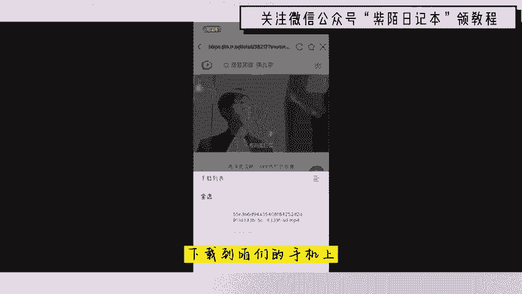
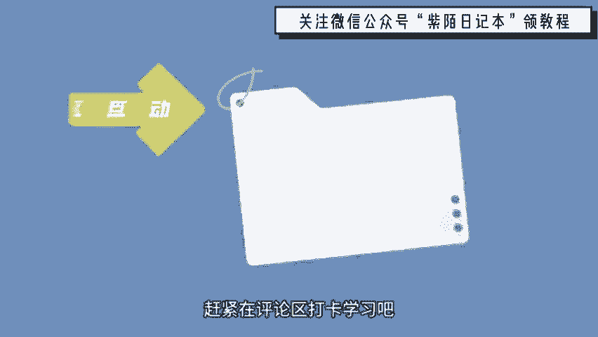

# 2024年全网最干货的新媒体运营教程，自媒体运营系统课(包含了剪辑／起号／短剧推广／头条各种玩法）抖音短视频零基础入门到精通，吊打一切付费课！ - P4：剪映思维培养 - 文武生小五 - BV1pe2vY8E8w

🎼在本期视频开始之前，请问能先给个三连吗？啊，你要白嫖啊，那就给个免费的赞呗，谢了，这对我真的很重要。嘿，你是否想学习剪辑，却不知道从何下手呢？是否对于一些后期专业术语一头雾水呢？是否翻看了大量教程。

学习了各种软件操作后，新建者必定能剪出精事大片，结果最后呈现出来的却是一坨奥利给呢？不要着急，不要害怕，来来来看这里根本原因是因为你学习的大部分教程，只做入了软件的学习，却忽略了对于剪辑思维的培养。

软件熟悉了，可真正实战时还是头脑空空。而林接触小白光学习剪辑思维，完全不会软件操作，也是无法将各种想法落实下来的。做自媒体最核心的是什么呢？是剪辑文案拍摄话题运营吗？是定位吗？那我今天告诉你四个字无限。

😊。

素材。那不懂无线素材的呢就不要再做自媒体了。什么是无线素材呢？就是找到一个能够源源不断更新，并且能产生优质内容的题材。那举一个例子，为什么抖音1400万粉丝的期段，在2020年转型做教育呢。

他自己说的做搞笑段子太消耗身体了，1。80的身高体重只剩50公斤。类似的宠物剧情搞笑段子再好的创意，再留个剧情，做大半年就会大脑枯竭。那每天熬夜想内容头发都要掉光了？自媒体呢竞争激烈。

如果说呢没有一个高质量的内容更新，粉丝马上就会对你失去兴趣。那么有哪些是无线素材呢？樊登读书海量的好书呢永远都不会枯竭。数码汽车测评，只要那些数码汽车公司不倒闭。

那永远都不会愁素材旅游祖国的大好河山呢一辈子根本就走不完。美食中华美食博大精深，上到米其林下到路边谈，365天天天不重样。我呢有一个爱奇艺账号是专门做国外影视作品剪辑的。国外电影电视剧呢一更新。

我就躺在上面做二创赚钱，那赚的不多。去年呢也收入了28万。那其实呢在B站上也有类似的账号，国内呢很多人肯定都不知道可以看国外的电影和电视剧，他们呢就会倾向于看电影解说。

比如说像前段时间大火的一个优鱼游戏，这个视频最早的播放量呢是有700多万。那按照这个1万播放量30元来计算的话，这样的一个视频就给这个up主带来了21000元的一个收益。

而这个up主呢直接涨到9万的粉丝。那这个up主的名字呢就叫做漫步均人，大家可以去看一下。那其实呢自媒体的操作并不难。但是呢如果说没有人带着你，你就会感觉非常难。考虑到咱们很多朋友啊应该都是新手。

那我准备哪份自媒的直播课程，那么们就可以学习我肯定可分享给你他每个视频呢播放量都不低。这个呢还是一个小的up主，那像大一点的up主啊，就有这个木鱼水星，都是B站的百搭up主了。所以说呢你要记累一点。

不剪辑别的平台独家的版权和VIP的内容去剪辑国外的影视作品，那大家呢完全不用担心这个侵权的问题。即便是侵权呢找过来了，那我们呢直接删除就可以了。那今天咱们来给大家说的话呢，就是一个最简单的做法就。

🎼把国外的电影电视剧视频呢直接下载下来，然后呢配上中文的解说和字幕就可以直接发布了。那这个做法呢其实也是可行的那接下来我就教大家呢如何去进行一个操作。首先呢去下载一个万能联播的APP下载好了之后呢。

我们找到这个溜娜，然后呢再点击这里的人人视频，然后就可以看到各种各样的电影和电视剧，我们随便点击一个韩剧，找到一个好评度比较高的，点击播放呢就可以直接播放了，在旁边有一个下载按钮。

这样我们就可以直接把视频下载到咱们的手机上册了。如果说呢你觉得很麻烦的话，也可以直接用手机自带的录制功能录屏下来。那视频的文案呢，我们可以直接去参考豆瓣上的一些影评。

也可以直接在百度呢搜索一个叉叉分集剧情。那有很多这样的分集剧情，我们可以进行一些参考。配音的话呢，我们可以去搜索配音神器，找到一个合适的电影解说的声音。比如说呢像云飞情感男生，没要努力。

因为想去的地方很远，想要的东西很贵，喜欢的人很优秀。

🎼的白发朋友的约定怎么样？那这个视频的声音还不错吧，这个过程啊听上去很简单，也非常可行。那么会有一些问题去发布到什么样的平台。那这些平台呢都是可以的那我呢就以爱奇艺为例子，我这个账号的收益呢。

这个月是在1。7万左右的那虽然不多，但是呢多做几个号几万的收益呢还是有的。只要你能想到的，我这里都有，相信我这套课程将会是全网最易懂最全面的小白专用课，赶紧在评论区打卡学习吧。那我们下个视频见，拜拜。

