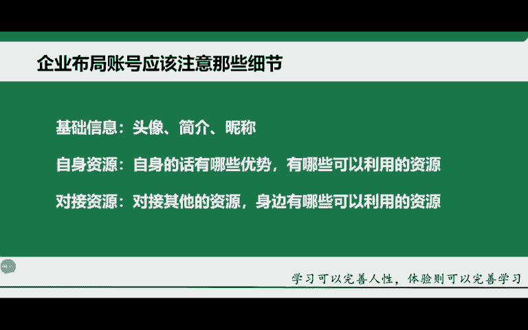
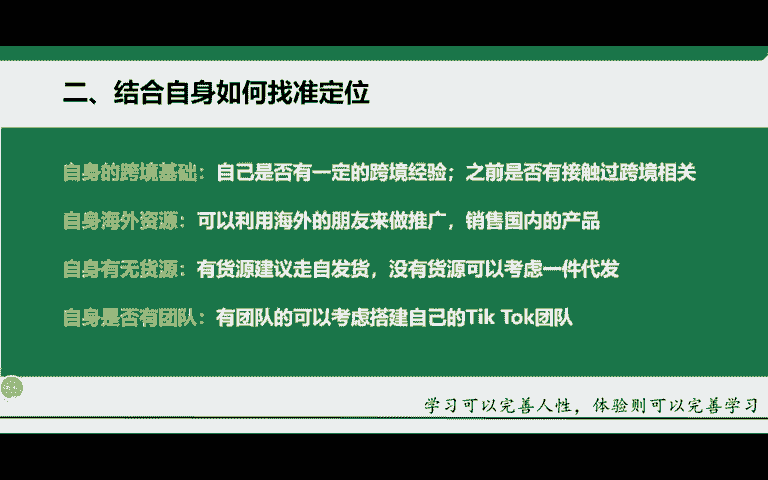

# 2024年小白如何从0到1做跨境电商外贸副业？｜ 3万字吐血分享，保姆级教程！拒绝内卷，出海赚美金【tiktok跨境电商 独立站  Facebook】 - P10：19.结合自身如何找准定位 - 嘉哥冲 - BV1EBtfeFEXw

那，接下来给大家去讲一下这个结合自身的一个优势啊，找准定位啊。我在前面刚刚讲过，我相信有一些同学他本身就是没有什么资源的啊，或者说也没有什么优势，甚至说连这个跨境他都不知道不了解啊。

那这种情况下的话怎么办呢？啊，首先考虑一下就自身的一个实际情况啊，是否有一定的这个跨境经验，为什么呢？因为你有跨境经验，你再去做这个TK那就好很多。因为你有跨境的基础，对吧？有跨境的基础，有跨境的经验。

相对来讲，比如说后期的一个物流后期的一个发货，后期的一个这个呃退换货啊，以及这个选品等等。那这些的话你都是有跨境相关的对吧？你都有基础，对于你来讲，那其实这些都是一些啊基础的性的东西啊，你有了解对吧？

你至少做起来会轻松很多啊，那再一个的话就是身边有没有海外的一些资源。什么叫海外的资源了。比如说海外的一些朋友留学生啊，或者说海外的一些客户啊，长期和。

做了一些客户来帮你去推广自身的一个产品啊，销售到这个海外去啊，将国内的产品销售到海外去。因为你有这样的优势，别人他没有啊，别人他没有。如果说别人要有这个资源，那肯定得需要花钱。

所以这就是你自身的一个海外资源的一个优势啊，还有的话就是有无货源。那很多同学会想啊，老师我这边没有货源就没有办法去做这件事情的话，可以啊，无货源有无货源的这个打法，有货源有有货源的这个玩法啊。

所以说不要把这个事情讲的太绝对啊，很多同学他一提到货源就非常的这个害怕啊，老师我没有货源，我怎么办啊？这个都是小问题，我们做跨境，我们做踢开，最重要的是什么？最重要的是选品，而不是说货源跟物流。

很多同学他会一想到发货，一想到这个货源，他就头疼啊，其实这个都是小问题啊，你作为跨境，最重要的一个点就是选品，你的品选好，至于后期的发货，至于后期的这个货源，他都就迎刃而解了啊，迎刃而解了。

所以说最重要的是选。而不是说物流跟货源，所以这些都是呃都是同学所没有必要去担心的东西啊。所以说后期的话一定要记住，你有货源，你就可以走自发货。就两个点，有货源，你就走自发货，没有货源。

你就考虑走一件代发啊，就走一件代发，或者说后期的话，你做东南亚这一块的话，我们有这个东南亚的这个海外仓啊，你可以考虑走我们的这个东南亚的一些产品啊，再家记住我们这边的话，只有东南亚这块啊。

那第二个的话就是自身是否有这个团队啊，首先为什么要讲这个团队了。如果说你是单个人啊，单枪匹马来做这件事情的话，他你自己的一个时间能力都是有限的啊，你没有办法在短的一个时间内有一个很大的一个效果。

那当然如果说你自身有搭建团队。比如说你之前就是做跨境的，有优势，有自己的一个团队啊，这个下面有好几十号人啊，二三十号人。那这样的话你可以考虑搭建一个属于自己的一个TK团队。那这样的话。

你就可以有很好的一个分工。什么呢？有做账号的，有去做带货的，有去做直播的啊，有去做选品的等等，分工明确。这样的话对于你后期运营这个TK它是有很大的一个帮助的。因为什么？

因为如果说你是单个人一个人来去运营这个东西的话，那相对花了时间跟精力要特别长啊，不是说你短短的一两天或者说两三天一两周就能把这个事情做好的啊，所以说很多东西都需要你自己去经手，你自己一个人来做啊。

所以这个就是有无团队的一个优势啊，那结合这四个点的话，大家可以思考一下。那我这四个点到底有哪些是我有的，哪些是我没有的。然后呢，节省自结合自身的一个实际情况，然后得选择后期要去发展的一个定位啊。

要去发展的一个方向，这个是很关键的啊，一定要想清楚。不然你这后期来讲的话，其实呃对于这块发展的话是不太有不利于你自己的啊，不利于你去发展啊。首先的话一定要想好自身的一个定位。

至少你在后期应该朝哪块去走啊。当然我。后期也会针对你们每一种情况啊，给大家去做详细的一个规划啊，就是应该朝哪块去发展啊。

