# 2024年小白如何从0到1做跨境电商外贸副业？｜ 3万字吐血分享，保姆级教程！拒绝内卷，出海赚美金【tiktok跨境电商 独立站  Facebook】 - P13：22.海外文化调研解析（英日） - 嘉哥冲 - BV1EBtfeFEXw

🤧英国。

英国的话相对就是在他们那边啊，就是它室内的一些暖气供应啊，就是在这个冬天也会在这个外套，在外面穿个外套加个T恤啊，相对来讲还是比较暖的啊，相对来讲需要暖的。所以说你一定要记住啊，在英国来买的话。

这个T恤啊，是完全可以的，也就是说什么一年四季都可以销售啊，一年四季都可以销售啊，就是通用的一款产品啊，T恤就是我们国内的话，你像我们国家就是中国啊，大部分的话可能都是在夏季才会穿这个T恤啊。

但是在英国就不一样了啊。还有的话就是夏雨偏多啊，一些有关防雨的这些呃产品都可以去卖啊，比如说雨伞啊，还有雨衣啊，这个防雨的一些保护车衣啊等等这些保护措施的这些防雨的啊，都可以去卖啊，都可以去卖啊。

就是说这些功能的话都是有关雨的啊，就是能够防雨的这些东西都西都是在英国人眼里啊都是不错的一款产品。

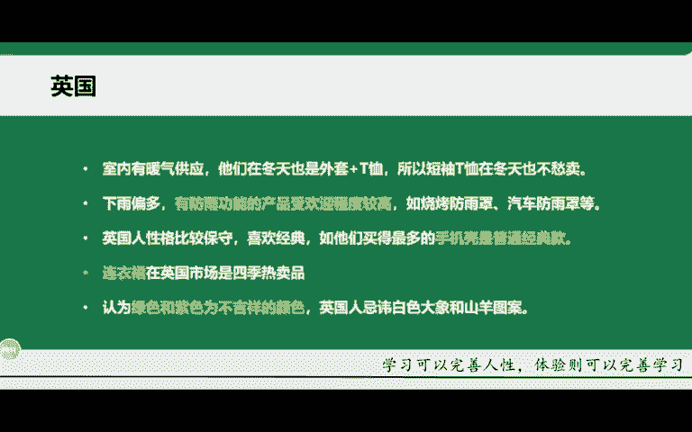

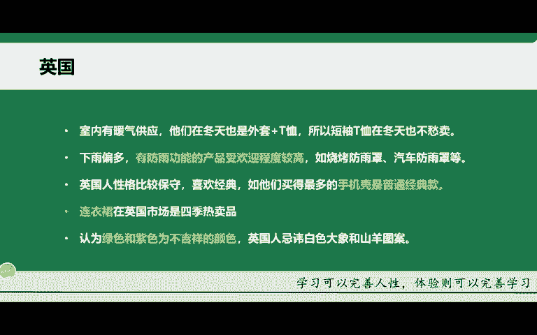

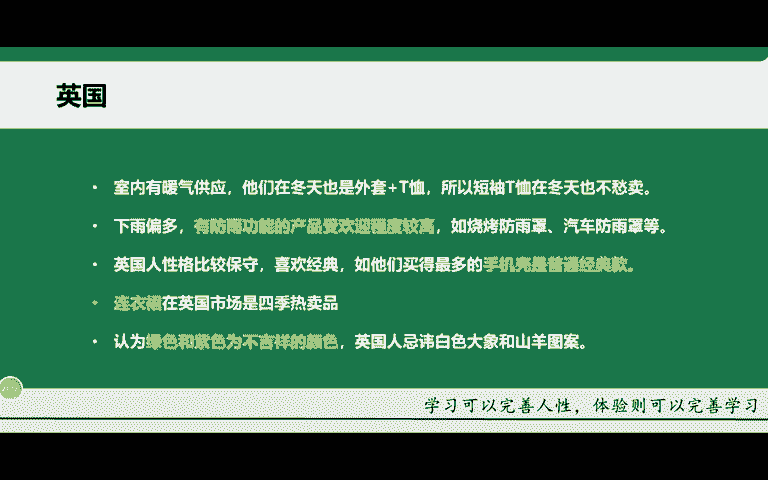

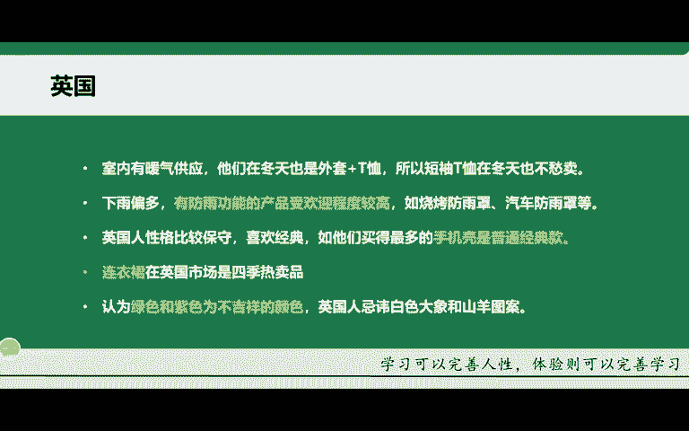

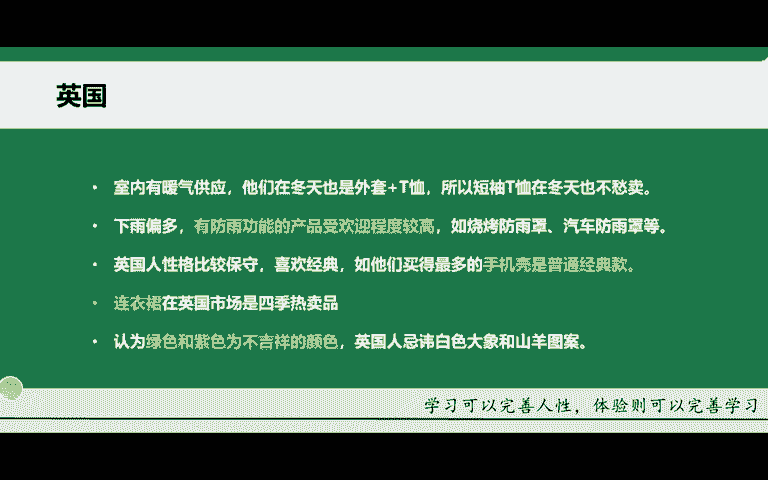

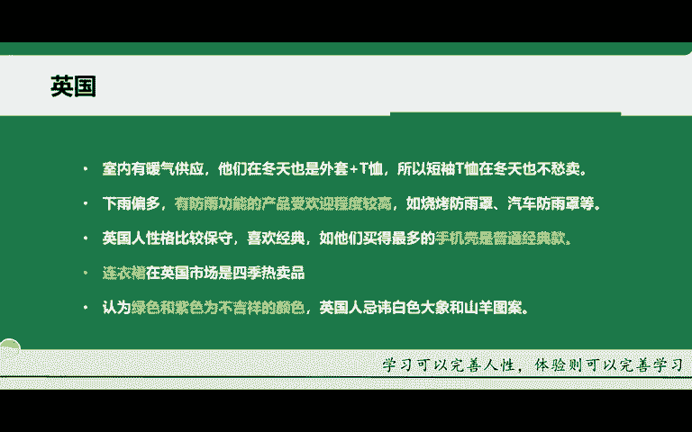

对吧。还样的话就是比如说这个性格它比较保守啊，这是通过市场调研啊得出的性格的话比较保守，也喜欢比较经典，买一些更多的就是普通款啊，普通经典款的啊，这样的话你们要记住啊，你们在选这个产品的时候。

如果说针对于是英国的一个市场。那你们的这个选的一款产品就比较偏复古一点啊，偏偏偏老旧一点啊，经典的这样的一些产品给他们啊，还有的话就是连衣裙在英国的市场的四季都是热卖的一个产品。

那就跟前面的T恤是一样的道理，对吧？男士的话它穿T恤啊，女士的话就连衣裙嘛，对吧？因为它本来就是有是室内有暖气的一个供应啊，一年夏季的话穿的都比较单薄啊，所以说这个就是一个呃服饰类的啊，服饰类的销售。

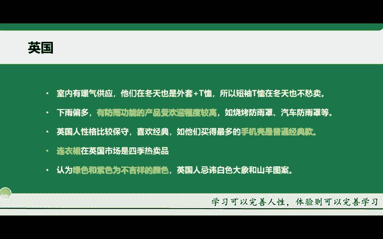

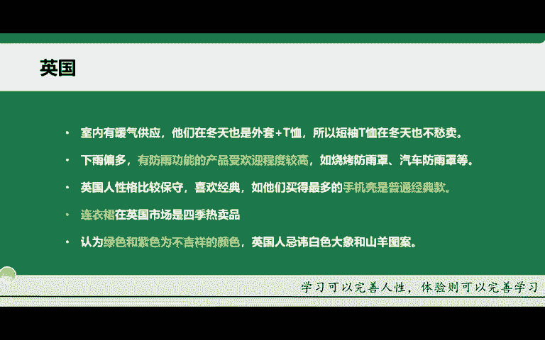

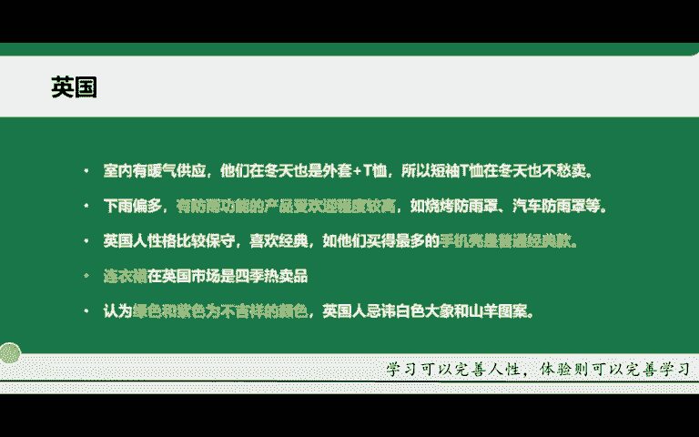

再一个的话就是颜色啊，这一款的话，很多同学可能都不知道，或者说不了解啊，在英国人眼里认为绿色跟紫色它是不吉祥的颜色啊，所以说你在卖这个产品的时候，就不要去设置这两款颜色啊，绿色跟紫色啊，因为特别聚讳嘛。

对吧？这个如果说你是把这两款颜色放上的话，它可能不就本身这个产品它特别喜欢。但是因为因为你的这个颜色啊，导致他不喜欢，对吧？

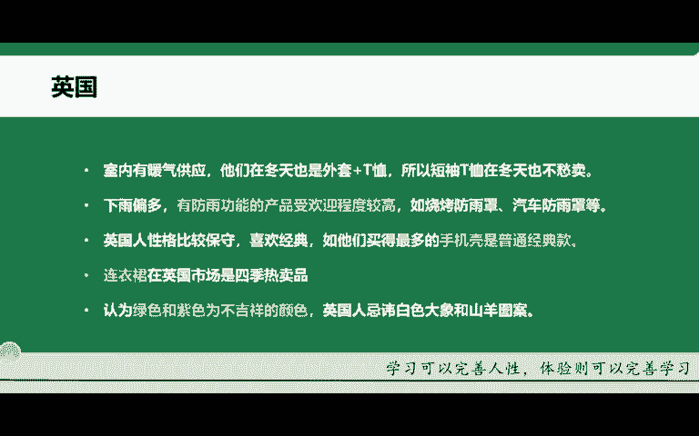

英国人的话，他忌讳白色大象跟这个山羊的一个图案啊，这个的话大家也可以记一下。如果说你的产品上有这样的一个呃图案的话，也就不要去销售了啊，因为它严重会影响你的一个转化啊，严重影响你这个转化。

这就是英国人的一些生活习俗啊，包括他的一些文化。

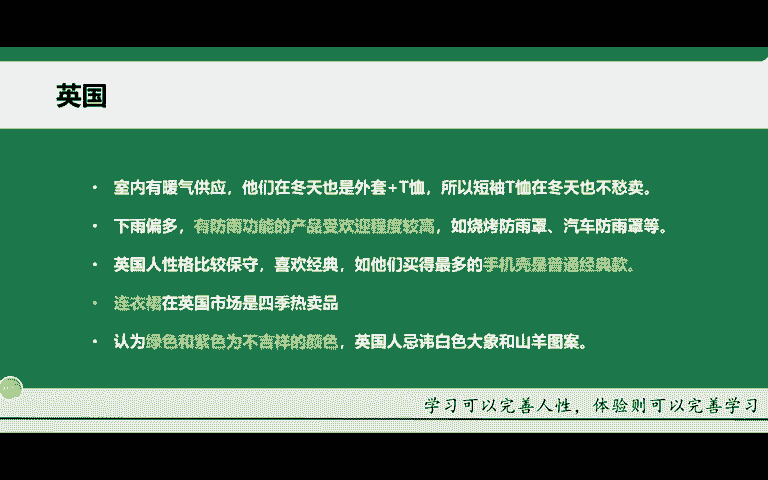

再给大家去讲一下这个第三个市场啊，日本啊，因为日本目前的话来讲是没有小店的啊，但是它你可以去走独立站啊，或者说其他的一些方面啊，它也可以啊。日本的话，除了这个本国的节日以外。

它对西方的一些国家也是节日也是特别热衷的啊，每年的这个开学季的话，大概就是4月份啊，所以说23月份的话，我们可以去筹备去4月份销售的产品。比如说我们可以去卖一些学生用品啊，学生用品啊，什么叫学生用品了。

比如说笔纸啊，还有一些书本等等啊，这些都可以啊。而且的话这个日本的公司普遍在12月份都会发放3到4月份的一个年终奖啊，12月份他发放年3到4月的年终奖，也就是说他现在有钱了啊，有钱可以去消费了嘛，对吧？

还有很长的有梅雨季节，他们喜欢买一些雨衣啊，还有雨靴等等啊，这些也是一样的，还有一些这个手电筒啊，晚上用的手电筒啊，而且的话他们那边是这个岛国地震也特别多啊，他们防灾意识也特别高。

你可以去买一些有关这个防灾的啊，就比如说防地震的这样的一些用具啊，周边产品啊，周边产品都可以去做啊。而且的话他们针对于这个品牌化的话是比较高的啊，品牌化，尤其是你的这个标识性。

就是品牌化运营的话是特别好。为什么我在前面要给大家去强调这个品牌化以及这个企业企业的一个布局，就是因为这样啊，他们对品牌的话是特别忠诚，忠诚度特别高，而且退货率也特别低啊，回购率也特别的低啊。

回屏率也低啊，所以说但是他会关注这个产品的一个细节。什么叫产品的细节。比如说你的包装标签啊，甚至说购物的一些凭证啊，票据等等。这些他都是比较关心的啊，这就是他们日本人的一个习惯啊。

日本人的购物的一个习惯。所以说一般如果说产品质量差的话，你在日本的话就不要去卖啊，销售不了啊，销售不了这个的话，他日本的网民也特别喜欢节日促销，什么叫节日促销了。比如说你在固定的节假日做一些促销活动。

比如说半价啊，打折啊，或者说打8折打5折啊，或者说有赠品。啊，等等。那这些的话他们也是非常热衷的啊热衷的。比如说你这款产品原本是卖个19块啊，19美金啊，这个日元啊，19日元。然后呢，你打个折对吧？

打个8折或者是打个5折，或者说买多少，你给大家有另一款产品的赠送啊，这种的话促销活动，他们是特别热衷的啊，所以说这就就是美国英国以及日本这三个国家的一些购物习惯啊，当然还有其他的一些国家。

老师在这里就不给大家去做一一的详细讲解啊，因为国家太多了。那主要就是你这几个国家给大家做举例，然后讲解一下啊，那后续你们要去了解的话，也可以在上网啊，查找对应国家的一些人物习惯啊，购物习惯啊。

相对于产品的一些喜好等等啊，都可以去查得到好吧，那这里我就不做过多的一个讲解。