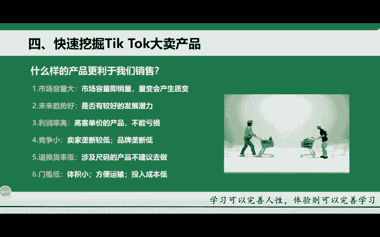
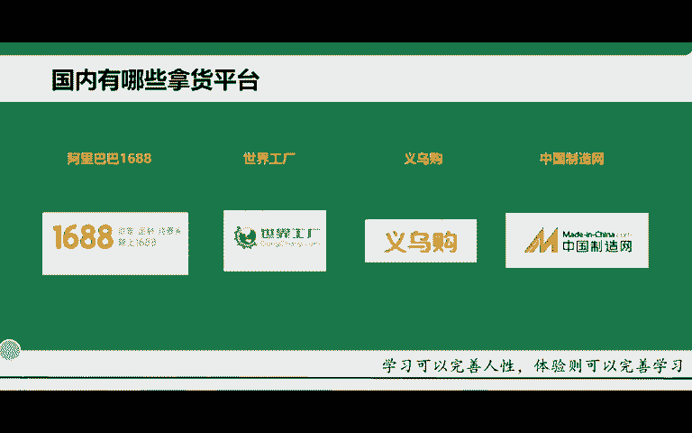

# 2024年小白如何从0到1做跨境电商外贸副业？｜ 3万字吐血分享，保姆级教程！拒绝内卷，出海赚美金【tiktok跨境电商 独立站  Facebook】 - P15：24.快速挖掘Tik Tok大卖产品 - 嘉哥冲 - BV1EBtfeFEXw

OK那第四个的话给大家去讲一下如何在。提干上去找到我们的想要去销售的一款产品，就是大麦的一款产品啊。首先要符合以下6个点啊，大家去讲一下。第一个就是市场容量一定要大。为什么呢？

这个容量也就市场的这个容量及销量啊，因为量变它会产生质变。如果说你的这个产品连销量都没有容量都没有。就是市场需求不大。这种情况下，你在买这个产品其实是很难去买的买得了的。当然不能说排除这个一部分产品啊。

不能说太绝对。当然有一些这个新的产品，它也能够去出类拔萃啊，一下这个杀到这个top千十，也有可能，但是几率很小很小。除非你是有很多的这个达人去推，或者说你是烧了很多的广告，不然的一个情况下。

这款产品很难直接一下就上来啊，它需要时间的沉淀。那第二个的话就是什么未来趋势，什么叫未来趋势呢，一定要看好这个产品它在后期的一个发展潜在能力啊，如果说后期的这个产品。这个销量销量不行。

或者说购买没有人去购买的话，那这种产品就不要去使用啊。比如举个很简单的例子。那这款杯子我要去买的话，这款杯子在后期的两个月3个月，甚至说两年三年内，它销售销量怎么样，要做这样的一个预测啊。

看它潜在的这个销量怎么样啊。第三个的话就是利用率啊，什么叫利润率，就是我们不能去做亏损的产品啊，我们的利润要有获得啊，还要高利润率要高，你每一个产品，比如说啊我卖出去的产品，我有个七八十啊。

五六十这样的一个收益啊，不要算高了，这已经算低的了。一般的话就像我们去选这个产品，至少呢它的这个利润率要高个3到5倍啊，就翻个3到5倍啊。当然你高客单价的产品就是在销售上面肯定会跟别人有所这个差距。

因为高客单价的产品，它用户也会去做对比。所以说在这里就有一个呃产品的一个价格定价啊，就一定要适中啊，也不能说太过高。也不能说太低啊，但至少的话我们不能做亏损啊，你不能说我天天在这里去呃带货在卖产品。

结果发现结结算下来之后，我自己都是亏的啊，那这个你就等于没做啊。第四个的话就是竞争小，什么叫竞争小。首先第一个的话就是买家垄断较低啊，卖家垄断较低。就是说你这个产品的话，卖家比较少啊。

很很多头部的一些品牌或者说一些商家当然都没有去做这款产品啊，只有你自己在做。那这个的话相对来讲垄断比较低。你可以用大量的账号去推这款产品。这样的话把这个市场全部给他抢占下来啊。

也就是说后面所有的这个用户他都你在你这里去购买。这样的话就相当于你直接垄断了这个市场，而不是别人啊，那如果说这款产品已经有很多的卖家在去卖的。而且的话有很大的这个品牌方也在去打算推这个产品啊。

这种情况下的话，你再跻身于这个产品当中，其实是很难去寄身进去的啊，所以说这个竞争的话也是一方面啊，这个就是退换获率低的产品，涉及到一些产品的尺寸尺码的这样的一些产品不建议去卖什么尺寸尺码。

比如说衣服包包啊，衣服最典型的就衣服它有尺码。有大小啊，有颜色，因为呢他退换退的货率比较高啊，换货率也比较高。因为他老外买过企这个产品之后，发现啊他身子穿不了你这个产品太小了啊，尺码对不上。

他肯定要换的啊，要么然他就直接会退啊，所以说这样会严重影响你的这个呃成本啊，严重影响你的成本，你退换货，你自己得去付物流啊，付物流。那如果说你这个客户沟通一下，他不退换货还好。如果说退的话。

他会直接让你去付物流啊，而且你也收不到这个客户的钱，因为他会直接退款啊，所以这个就一般情况下不要去买一些有关尺码的，你就只有这一款产品，这一种颜色直接给他啊，他想换也没得换，对吧？

所以这就是一个退换货率低的一些产品啊，然后去讲啊。第六个的话就是门槛低，门槛低的话，只要就是这三款第一个体积小啊，体积小是为了我们方便运输嘛，对吧？体积小，相对应的物流成本也就低了啊。

而且我们投入的成本也就比较低了。这个方便运输啊，体积小了，我们的物流成本低然我们方便运输，打包的话也比较好打包好打包，对吧？找一个小小的四方盒，然后我们就把这个东西能够装到里面去啊。

这样的话就方便于我们去来进行一个产品的运输啊。啊还有的话就是投入成本低，投入成本低的话，首先第一个就是我们物流的投投入成本相对比较低。因为你作为一个新手的话，如果说在前期没有货源的情况下。

你材料大购大量的一个产品，你成本压的特别高啊，所以说我们作为一个新手前期的话投入越低的情况下怎么办呢？就是找一些价格比较低的产品，而且呢去做一个投入啊，价格比较低的产品。比如说国内卖个五六块啊。

或者说三四块啊，然后我们在老魏那边的话买个19美金，29美金这种啊，赚的中间差价就特别高啊，所以说这个就是我们在前期的话考虑一些低客单价啊，这个低客单就是我们采购的低客单价的一些产品啊。

然后我们投入的成本相对比较低一点啊，所以新手来讲是。要好起步的。如果说你一上来就买高客单价产品，其实是特别不好的啊，所以说你们要有一个过渡啊，先从低客单价去入手，后面再造高客单价啊这样一个过程。

那再给大家去讲一下这个国内的一些拿货的平台啊，因为有很多同学说老师我没有货源，我怎么办？我上来去找货对吧？那首先的话给大家推荐这几个啊，也是老师经常去找的一些货源啊，你像国内的这个阿里巴巴啊。

1688啊，我们经常去拿货啊批量性的啊，然后还有的话就是世界工厂，还有这个义乌购中国制造网等等啊，这些都是可以去拿货的啊，你像国内的拼多多有时候我都会去拿啊，拼多多有些产品是真的便宜啊，大家有用过的。

应该都知道。而且的话它这个产品质量也还不差啊，近两年来拼多多相对来讲还是比较好一点的啊，去这个前几年的时候，有人说这个拼多多卖的就是塑料品啊，这个产品真的很拉的啊。

但最近这两这两年过来随着这个平台的规则啊，慢慢变严格的。而且的话这个呃品牌化也慢慢上来了。所以说拼多多相对来讲里面的产品还可以啊，至少的话你拿来去给老魏老魏他是认可的啊，不因为你这个产品的质量导致。

推货啊，所以说这个拿货的话相对的这个平台还是比较多的啊，你直接1688啊，或者说这个国内的拼多多都行啊。那当然下面我也会给大家去讲几个其他的一些网站啊啊，我在这里给大家去有做列举啊。

可能这个字相对来讲比较小啊，不过你们都一个人看得清啊。如果说你们看不清的话，到时候我把这几张图放到那个知识在线文档里面啊。然后你们可以针对性的去搜索啊，针对性搜索这个的话都是一些外贸货源的网站汇总啊。

都是经常有一些这个呃厂家去拿货啊，我们也会在上面去拿啊，针对性的包括每一些这个分类啊，类目，我都给你们写的比较清楚啊，讲去之后，你们自己去找就行。好吧，然后这节课的话就给大。

