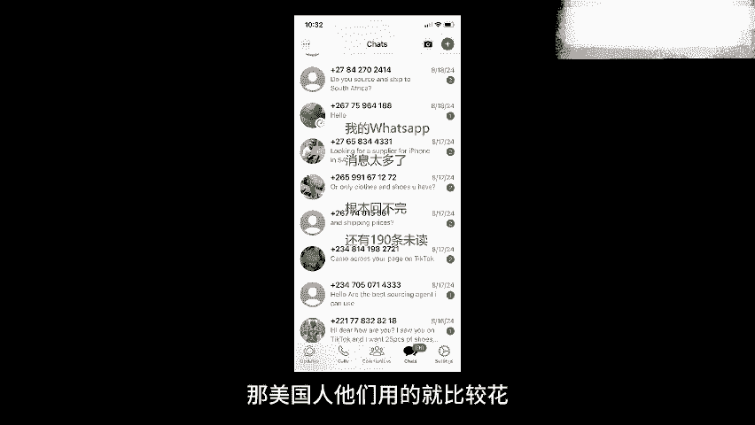

# 2024年小白如何从0到1做跨境电商外贸副业？｜ 3万字吐血分享，保姆级教程！拒绝内卷，出海赚美金【tiktok跨境电商 独立站  Facebook】 - P1：如何从0到1做外贸副业？｜ 3万字吐血分享，小白也能实操的外贸保姆级教程！拒绝内卷，出海赚美金 - 嘉哥冲 - BV1EBtfeFEXw

🎼到今年3月份的时候，我也整天很焦虑，经常凌晨三四点还睡不着，刷着手机上的负面情绪视频，明明这些视频让我很难受，但还是忍不住刷这种情绪一直持续到4月9号。因为那天我尝试的一个新方向，终于给到了我正反馈。

希望燃起来了。这个方向就是外贸。是的，过去几个月，我一直在苦苦探索外贸方向的机会。因为现在是个人都说啊国内太卷了，外国市场大，我们得向外卷，但是向外卷，往海外卖东西赚到了这件事到底难度如何。

听别人用嘴说，总感觉不是很靠谱。那作为一个实战派，我直接零基础零经验亲自下场做外贸，用了3个月的时间取得了一些小成绩。那这个视频就是我最近几个月的外贸工作汇报。客户一美国洛杉矶吸尘机客户。

现在已经帮客户定制好的logo和包装正在等待他的5000美金打款。如果他打款的话，我会赚到1000美金。客户2澳大利亚服装客户现在已经付款了152。😊，🎼买了一个样品，我带他逛了广州的三个服装工厂。

并且获得了他的超高评价。客户3，南非体育用品客户，这个客户已经陆续给我打款了1000多美金，而且现在完全没有停下来的趋势。以上这三个客户。

我的获取方式分别来自于facebook独立站以及tktok那本期视频我会详细分享我在这三个海外平台的引流方式和销售方式。其实我之前一边做一边就在朋友圈顺手分享过。

最近就开始有从来没接触过外贸的同学按照我讲的方式成功在facebook获得了询盘，或者tktok随手发一期视频，就50家点赞，还有做了一个独立站一个月就收款了1200美金。那这些案例让我有信心。

我今天讲的这些方法是真实有效的那我们正式的干货分享开始与画面上这个时间节点。如果你比较着急的话，可以直接跳转。那我这里在给完全没有任何外贸经验的纯小白同学多啰嗦两句啊。你听完我的话。

自己判断要不要看完这个视频。我知道出海赚 dollar。🎼听是一件好陌生好恐惧好麻烦的事是吧？相信我我懂你的心情。我在几个月之前也是对外贸对跨境一窍不通，需要时刻给自己打气才能坚持下来。

但是呢你现在感觉陌生恐惧麻烦，不恰恰证明这是一件护城河很宽的事情。这是一件没有那么卷的事情。现在国内各行业用恶性内卷形容绝不为过啊，谁能想到现在国内电商领域最赚钱的项目，竟然是仅退款和抛运费险。

没有办法，只能往外走了。除了中国14亿市场，还有国外的56亿市场等着我们发掘上面这句话你可能最近听无数人说过，但我不是一个打嘴炮的人，我是已经悄悄躬身入局几个月了，而且真的赚到do了。

那一句话总结我这三个月的感受，就是国外市场也卷，但卷的这个程度啊远低于国内，相比国内国外流量真的很好搞啊，facebook我陌生人私信了三个人就成了一单tkt我顺手发的一个。🎼视频直接带来60个询盘。

就是询问产品，要买产品的以及独立站，我花了20块钱就能拿到一个优质的要亲自来中国参观工厂的B端客户的询盘。也许下面我说的这句话有点夸张，但我有强烈的感觉，它会是未来十年的主旋律。

那就是属于中国年轻人的大航海时代即将被迫来临。如果有的选，谁不想在舒服的老家和熟悉的人做轻松的事赚钱呢。但只要你还不想躺平，想多赚钱，想给自己和家人越来越好的生活，那去做外贸或者做跨境电商。

绝对是值得严肃考虑的方向了。为了做这期视频，我是实打实的在一线实操，花了4个多月的时间，和小10万块钱的成本，才整理出了这样一期精华内容，你可以看一下这个视频的长度，你就知道我做事的态度。没啥别的要求。

求大家提前点个赞或者点个收藏，谢谢大家对原创内容的支持。那我们正式开始。第一个平台，我们要讲facebookfacebook是一个和腾讯QQ差不多童年。年代的产品，那和QQ1样。

facebook也被产品经理塞进去了超级多的功能。其中大家看网页版facebook这个按钮叫做小组小组是什么？类似于在facebook里边内置了一个豆瓣小组，或者说百度贴吧。

在里边你按照不同的关键词搜索，会发现基于这些关键词，有很多人加到这个小组里讨论这个小组成员感兴趣的话题。比如你在里边搜无人机，那就是无人机爱好者们在里边讨论。

那当然如果你在里边搜义乌采购深圳采购浙江采购，你也会看到很多类似的小组，那在里边老外会发布自己的采购需求。那中国的外贸从业人员会在里边找海外有需求的客户。

大家可以看到在这些小组里有采购需求的老外会直接发帖子，说，哎，我需要一个这类的产品，或者我需要一个靠谱的在中国的采购中介，然后你就会看到评论区大量的人回复，我可以我可以我可以。你看到这一个一个的回复。

你就知道这行业它也是卷的这每一个回复的人大部分都是中国人。当然也有老外，为什么广州义乌这样的外贸发达的城市，有那么多的外国人，而且是常驻在这个城市，就是因为这些地方他靠近货源地，有大量的外贸的需求。

于是很多外国人也来到这个地方定居去做外贸相关的生意，往自己所在的国家或者自己相邻的国家倒卖货转差价，就比如广州有非常多的非洲朋友，你在义乌最多的是中东来的朋友，所以大部分并不是什么非法移民。

而是来做外贸生意的。O我们回到这个小组里边，当你看到一个老外的需求，有这么多的做外贸的人员在评论区回复的时候，你心里在想什么？就是如果我在这么几十条回复里，再加上一条自己的回复，真的有用啊。

我怎么才能让自己脱颖而出呢？这个也是我当时的第一想法。于是呢我额外做了一件事，那就是制。做了一个自我介绍视频，我在联系他的时候，直接把视频附上，他能通过视频看到我的专业性，看到我的经验。

看到我流利的英语，是不是就有更大概率选择我了呢？那说干就干，大概花了两天时间去义乌商贸城那边线下拍了一些素材，然后整理成了下面这样一个视频，这里简单放几个片段O视频拍好了，我把它上传到youtube上。

这不就有了一个视频链接嘛，于是我就直接在这个帖子的评论区以及陌生人私信窗口给这个有采购需求的老外客户发私信介绍自己叫什么名字有什么优势。这有一个链接是我的自我介绍，并且主动强调啊，我英语比较好。

我很熟悉你们国家的这个市场，然后就发出去了。是的，在facebook里边，即使你没有加这个人为好友，也是可以陌生人私信。这个也是有点像国内的QQ平台的。

你当然不可能每天给很多人发这个陌生人私信发太多平台会认定你为营销号，你给一个。也不可能发很多条信息，这个就是骚扰了。但是我就发这样一个带有视频链接的文案发给了三个客户。这个平台是允许了。

而且你可以注意到，当我把这个带链接的文案发出去之后，facebook平台会直接生成一张封面，而这张封面它是非常显眼的？因此回到开头那个问题，那么多人都在做这个生意，你怎么脱颖而出，别人都是纯文字。

那我就来一个视频嘛。那这样的一个升级版的陌生人私信，效果如何呢？我记得那天是凌晨0点的时候，我找了小组里三个有采购需求的老外，陌生人私信，大概只过了几十分钟嘛，就有其中一位客户回复了我。

他给我发了个链接，说哎，我需要这个链接里的车载吸尘器，你能帮我找到物美价廉吸力大的车载吸尘器吗？而且我需要可以定制logo，定制包装内容，于是我就直接在facebook里回应了他的问题。

后来经过更详细的聊天，这个客。户就付钱了，付了150多美金，先买了几个样品，然后确定好样品之后，又让工厂定制了包装，定制了logo。目前客户已经收到了产品，正在考虑要不要下第一笔5000美金的订单。

没错，虽然只是一个样品单。但是这个样品呢是在我陌生人私信了3条之后，就收获了一个回复，并且直接承担这个成交率还是挺抠的吧。就算你没有做过生意，你也知道三个成一个没有花任何成本，基本上就一个潜在的大单。

而且利润这一单如果做成，可以达到1000美金，还是相当不错的。那么问题来了，我作为一个刚刚开始尝试做外贸的新人，是怎么跟客户聊着聊着，然后客户就愿意信任我承担了呢。我觉得这里边有两个关键因素。

第一个因素是我不但是新人客户也是新人。很多你在社交平台上找到了要在中国采购东西都是小白之前都没在中国买过东西。那现在美国那边又有一个创业项目。非常火叫做drop shipping。

执译程中国这边的一件代发。也就是他们在自媒体上搞流量，但是呢想通过流量直接卖货变现，但是他们又不想花钱囤货怎么办？直接找到中国这边的工厂，在那边卖出去货了，让工厂这边把货发到美国本土。

这个是当下美国最火的创业项目，然后这时候电商领域朋友可能说了，靠一键代发，这都是45年前，中国电商人玩剩下的东西了是吧？怎么现在美国还在玩这个美国不应该是比我们更先进吗？此言差异。我觉得至少在电商领域。

中国领先美国至少4到5年的时间，就是从商业模式上来看啊，领先美国都4到5年，更何况世界上的其他国家呢，是吧？因此美国那边的想要创业的年轻人，他们会首选报什么课呀，报的是一件代发的课。

因此这类想要来中国采购东西的新手创业买家是非常多的。像我这个承担的美国客户，就是在一个叫做d shipping的。小组里找到的我个人加了很多小组嘛，我觉得这个小组还是挺优质的。

里边是有很多真实的客户的这是第一个原因。为什么我没什么经验，还能获得海外客户的信任，因为我没经验，海外客户也没经验那第二个因素，我觉得就是虽然我真实情况是没有经验，但是我可以装的有经验呢？

我之前经常在本频道视频里讲一句话，fake it to you make it先假装强大，直到真的强大，确实我在做这个视频的时候没有任何外贸经验，那你就很时尚的实话是说，虽然我现在是零经验。

但是我希望你能成为我的第一个客户，m new into this business，but i hope you can trust me开玩笑，哪一个美国客户会看到你说自己是一个新手的时候相信你。

因此我在我的视频里处处都在体现我有7年的经验，我有1000个以上的付费客户，我怎么敢说出口的呀，就是一咬牙役狠心就说出口了呀。因为你知道刚开始的时候，你不去进行经历的包装。

你是没有办法获得第一个用户的信任的。而且你可以看到我在视频里自我介绍视频里还展示了很多之前承单的截图。那这些截图哪来的呢？其实刚才讲的这一套facebook的引流方式。

是我在义乌找了一个师傅花了1万块钱，我直接肉身来到义乌，在他旁边租了个房，他亲手带我完成的这样一个流程。那我这师傅成了很多单，他有很多之前的聊天截图，各国家的都有，我就问我师傅。

我能不能在自我介绍视频里借用一下你的图片，他说可以，然后视频就做出来了，包括整个的采购流程发货收款打包，还有怎么联系工厂怎么去在这个过程中加价赚自己的利润，怎么算运费。

都是我这个义乌的师傅手把手交给我的。我相当于是旁边有了一个非常强力的助力，有啥问题都可以问，才成功拿下了这个第一单。那我这里也可以给大家更详细的说一下这个出单流程，就这个流程。

你在各种外贸相关书籍上是看不到，因为你去网上买的那种专业的外贸书，它全都是讲最最正规的那种大型的外贸怎么做。什么光收款方式就有9种。然后你要把一个东西卖出去啊，要什么报关清关运上船之后。

还要到目标所在国的那个地方去清关，还有各种税，就连你去查我怎么去开一个外贸公司，你就会发现哇，这个外贸公司注册出来，还得再去一个特殊的地方开一个什么美元账户，开完美元账户。

甚至还得申请个什么进出口的资质，还有什么出口退税，到底怎么算，怎么申请哇，一看到这些名词，这些知识，就感觉头疼，就想睡觉。这个也是我初期自己一个人摸黑探索的时候经历过的痛苦时刻。但是自从来到义乌。

我师傅交给我他的看家绝学之后，我师傅手把手带着我出单之后，我就发现跟我想象中的外贸完全不一样。因为。外贸两个字听起来是一个特别正规的特别大的生意。一看到这俩字就想到集装箱，就想到轮船，就想到大货车。

而实际我出完第一单后的感受就是真哪是外贸啊，这不就是个代购吗？只不过有的客户让你代购的东西稍微多一点，那代购是怎么赚钱的呀。就是有些地方他的产品价格比较便宜。我就从价格便宜地方的商家先买进。

然后加一个价格卖给海外的，需要这个产品的客户，就是这样。比如说这个要车载吸尘器的客户，我到哪去给他找车载吸尘器呢？1688呀，直接搜几个符合他要求的吸尘器，而且1688他是能直接搜到工厂的。

你是能加到工厂老板的微信的，你就跟老板说啊，我们这有一个美国客户，他看中了咱的吸尘器，咱这个店里各种型号吸尘器，有没有一个报价清单，excel表能不能发我一下，人家都会发给你的嘛？把不同厂。

不同型号的吸尘器整理成一个单独的表，注意关键点是厂家会给。你报一个价，比如说这个吸尘器是80块钱，那你在报给客户的时候，要在这个表里把数字给改了，你加个20%25%30%的价格，然后报给客户呗。

客户那边收到的是110块钱。然后当然你要给他换算成美金了。只要客户觉得O这个价格可以，那他就会先定一个样品样品通过国际快递发过去之后，他使用了一下，觉得O接下来就会买更多的。那怎么收款呢？

其实刚开始你在跑流程的时候，根本不需要什么正规的进出口贸易公司啊，开通美元账户啊，你就做个paypal就行了。payal是可以以个人名义注册的，上传个身份证，然后绑定一下你国内的工商银行卡，招商银行卡。

然后你就可以收款了。我知道payal他的手续费会比较贵，但是他确实是全球用的最广泛的支付工具。你现在刚开始就没有必要去纠结这一点手续费，关键是先把流程跑通。我当时就是pay注册好了。然后客户。喂。

那你这个定金还有运费怎么付啊，我就直接把配账号给他他就转过来了呀。钱转过来之后，我再用人民币付给厂家，把这个产品先寄到我住的地方，然后给客户哎派几个视频啊，这个产品没问题啊，然后整理一下，打包寄到海外。

那怎么寄到海外呢？其实市面上有非常多的国际快递的货代，什么叫货代呢？你可以把它理解成顺丰快递员，比如说你现在有一个快递要寄到国内的一个地方，你小程序下单，顺丰快递员上面把你的件取走。

然后那边就等着收货就行了。其实国际快递也是这个流程，只不过中间的过程很复杂，但是你只需要在一些快递平台输入收货人的地址货得类型重量，在这个快递平台充点钱，把这个货运到这个国际快递公司指定的一个仓库地址。

那这个仓库地址，你离得近的话，你自己送过去，离得远的话，你就再发一个国内快递，先把这个包裹。

寄到国内的一个仓库，然后后续所有的什么报关清关到了目的地之后的配送派送全都不用你管了。人家公司就是干这个的，你只需要负责把货放到指定的仓库，并且给钱就行了。从难易程度上来看。

真的没比你在国内发一个快递更复杂，就是运费贵了点，以运到美国为例。海运的话，一公斤得15到20块钱，得20到30天才能到空运的话可能7到10天就能到，但是价格可能会贵上5到10倍，所以看到没有？

收款注册个paypal就行了。国内银行卡也能注册物流呢，你去用市面上成熟的物流体系服务就行了。产品怎么找呢？用1688搜一下，你可以搜关键词，或者有时候客户会给你发一个图片。

他想要这个产品直接1688以图搜图，最种找到生产这个产品的工厂，那怎么赚钱呢？把工厂报给你的价格基础上加个23是再报给客户，是不是就是妥妥一个代购啊，这个就是外贸的最。

初级形态，外贸个体户就是赚这个差价的，唯一有难度的其实就是你要获得客户的信任，找到有相关需求的客户。那怎么找到客户，刚才我们也说了，在facebook小组里搜相应的关键词会有客户主动跳出来的。

你去陌生人私信他。那你怎么能增加你跟客户之间的信任的，做一个详细的自我介绍视频好了，就是这样一单就成了，这就是外贸啊，把国内的便宜的商品加价卖到国外，这完全符合外贸的定义，所以你现在感受如何。

在看我今天这个视频之前，你对外贸的印象，以及看完我这一段讲完之后，你现在有什么印象，是不是觉得好像起步还挺简单的，觉得简单的弹幕里做一波简单，是吧？任何一件事起步都是没有那么难的，只不过呢？

你在外贸书上看到了那些在你规模做大的时候，一切都要合规化了。比如说收款会有一些其他费率更低的。收款平台物流呢会有一些专注于某些国家更便宜、更安全的渠道。还有就是你贸易额增加了，你公司人数增加了。

可能才会涉及到什么出口退税啊，各种各样其他的步骤。其实如果你一个人干做一个外贸soho，意思就是外贸个体户。刚才我说那个流程就概括了你所有平常要做的事情。如果你觉得嗯好像没那么难，挺简单，可以接受来。

那我们继续讲下一个版块tktoktktok这个平台，大家应该比较熟悉了。你看这界面跟国内版本的都很像的。那我当时也是机缘巧合，一不小心把tktok流量给做起来了。目前我通过一条10万以上播放的视频。

单个视频引来了60多个询盘。所以询盘就是来询问你们这边产品价格，或者你可以理解成有意向付款的客户吧，这是一个外贸术语，大家可以在我的这个tktok主页看到一个置顶的比较熟悉的。视频没错。

这个视频就是我在facebook主页和在facebook里私信前在客户时用的那个视频，直接把它同步到tktok上。然后就没想到这视频刚发出来几十分钟吧，就一下子有1000多个播放量。

当时我tktok账号之前只随便发了几个视频都是几百播放了。但是这个视频最后已经涨到了破万的播放，而且持续在增加播放量，就仅仅是这样一个自我介绍视频就给我引来了十几个询判。他们有的直接在评论区问。

有的直接在后台私信，那私信我就跟他说，你可以加一下我的whatsapp或者留一下我的邮箱，跟他们后续在邮件里交流。那whatsapp你可以理解成海外版的微信。目前世界上使用量最大的即时通讯软件。

除了美国之外的其他国家做生意聊天，基本上现在都用whatsapp。那美国人他们用的就比较花，有人用facebook聊。比如说我刚才说的那个车载吸尘器客户。那有人是喜欢在邮件里聊。

比如说这样一个克罗拉多州的客户全程邮件沟通。😊。

那有一些经常在国内做生意做了很多年的，他们自己早就注册了国内版微信了，你也可以跟他微信聊，甚至还有人，尤其是年轻人居多吧。他们日常聊天用instagram的私信去聊。

还有一波人呢他们用苹果手机自带的那个短信服务聊。是的，就美国人他事儿比较多，通讯方式用的非常杂，但除了美国地区之外的，其他地方主要都是用whatsapp了。

那后来我也直接在我tktok主页放上我个人的whatsapp码，也会有人看到主页信息之后，直接过来添加问hello，我需要你的服务。那真正让我tktok视频有一个小包发了是靠这样一个视频。

是我那天在我师傅房间看到他在给一个海外客户的产品打包。那打包的过程，我就在旁边觉得哇，好清细啊，好细心呢，服务非常的到位是吧？我就旁边拿手机录了下来，录完之后我就把他发到了tktok上配了一个标题。

这就是我们怎么帮客户省运费的。然后这个视频。😊，播放量就很大，真的是全球各地的客户都来咨询先需要我们的服务。因为亲眼看到我们这个服务的细致嘛，很多其他的外贸公司他们没法做到这部戏，他感觉很新奇。

其中就有一位来自南非的小格，就靠着这一个视频，我的tktok粉丝量从300涨到了2000多。而tktok在你突破1000粉丝之后，是有一个功能解锁的，就是你可以在主页放一个任意网站的链接，而这个链接。

客户在主页一点是可以直接访问的，它不像国内的大平台之间相互屏蔽。在海外各平台之间跳转是非常流畅的。就比如我在我的tktok主页放了我的这个whatsapp页面的链接。

然后你只要一点他就会瞬间跳到我的whatsapp页面可以直接跟我私信聊天了。这个在国内做引流的朋友看到这样一个过程，应该会感觉非常丝滑是吧？但这个在海外其实是很常见的现象。那自从有了这个自动跳转的功能。

每天我的whatsapp都会有。😊。

私信的有要假发的，有要皮料的，有要包的，有要二手苹果手机的，反正就非常杂乱。其实大部分客户也没有办法很深入的跟他聊。不过有一个南非小哥，我觉得他诚意挺足的，也是急需要我们的服务，于是就在我这下了第一单。

这个南非小哥也是在他们南非本地的tktok上发图片发视频卖东西的，他到我这儿先采购。然后我帮他运到南非之后，他在他们当地线上售卖，其实也是类似于我前面第一部分讲到的d视频，一件代发的那种感觉。

从中国这边批量去进物美价廉的产品，然后在线上做流量，吸引客户加价卖给客户。那我当然在这个过程中，从工厂进货，再到卖给他也是加了自己价格的，加的不多，加了50%。其客户也问了很多其他的采购中介的。

觉得我这个价格还是比较实惠的。而且我这个打包啊啥的，确实从我师傅那学的非常的细致。

能帮他省很多运费，于是他就持续在这儿订货。到目前已经1000多美金了。像这样一个客户就是很典型的，你获取一次信任了。因为他本身也是做生意的嘛，他就会持续在你这订货，你就持续可以赚到差价。

所以为什么做外贸领域的有的人，很多做了几年之后，他是可以在某种意义上躺平的呀，就每天也不需要花很多时间工作，但是收入还可以一年挣个十几万20万，没啥问题。因为他前几年辛辛苦苦积攒了这些老客户。

只要老客户公司不倒闭，他就会一直在你这进货。因为道理很简单，国内外语言不通，又隔几千公里，他要换一个值得信赖的代购是非常麻烦的。所以这种客户B端客户啊，你获得一个后续能持续性的赚很长时间的钱。

那这个客户他只是买1000多美金的产品。那海外有没有大客户，他一个月买1000多万美金的产品的。有啊，国外的一些大的超市或者大的批发商，他们一口。后期可能就下几十万几百万上千万美金的订单。还记得7月份。

懂王遇刺的那一天，义乌这边的工厂直接收到一份400多万件衬衫的订单。那这种他不是凭空来的，是因为前面就合作，已经建立的信任，然后后面因为什么原因要加定，那不管他家定多少，你都是有的赚的，这个就是做外贸。

他前期是比较艰难，你要从茫茫的世界互联网中找到有需求的人，但是一旦建立了一次信任，然后这个客户持续的订购东西的话，后续是你是能持续赚到钱的。这个就是我是怎么通过tktok引导流的。

说实话真的就感觉做海外这些平台已经连续两个做facebook私信三个嗯，怎么就成了，做tktok随手发了四五个视频，那其中有一个还是之前在facebook发过的，只是同步过来。

然后就有一个报了10万播放，而且这绝对不是个例，我也关注很多同行他们发视频嘛，这种吸引海外B端客户的。很商业性质的视频内容。在tktok这样一个娱乐平台上，播放量是着实不错的。

而且你明显有一种老外啊没见过什么世面。他看到我们这工厂里机器的运转过程，看到我们这个繁华的市场，义乌这边的商贸城，深圳那边的华强北，广州这边的服装市场，那么多人那么丰富的产品都会哇这个地方买东西。

他有多便宜啊，我要在这个地方买东西，就我们在国内呆久了，其实是意识不到的。中国制造这一整套配套的体系，工厂档口还有各种市场在外国人眼里都是很稀缺的存在。哪个人不想要物美价廉的产品的。

哪个人就甘心被高价的产品收割呢。所以当他们看到直接来自中国货源地的视频的时候，是很容易产生要购买的冲动的。这个就是在tktok上去引外贸客户，他之所以能成他背后的一个大的逻辑。

那有了前面服务美国客户的经验。

现在在服务这个南非客户流程都一样了，就是流量来源不一样，发货的时候包裹的大小不一样。就在我录这期视频的时候，还是这个tktok又给我推来了一个德国的客户，他也在我这儿先买了价值160多欧元的产品。

所以到目前为止，美元欧元都已经收到了。那接下来我们再来看第三个平台，独立站看我是怎么通过这个平台收到澳元的独立站是个什么东西先给大家介绍一下啊，就国内大家买东西一般是淘宝天猫拼多多，这种电商平台买。

但是海外客户，他们当然也有亚马逊这种大的平台了。那很多人他也是愿意相信一些单独的网站的。比如说这个网站就是卖一个手工艺品，是这个手工艺的艺术家，他自己建的一个网页，上面就这一个产品，就一个购买按钮。

在里边买海外客户也是非常愿意的，这个有点像什么啊，有点像在公众号时代。😊。

一个有几十万粉丝的公众号博主，他想卖点自己的周边产品，比如说卖个T恤，卖个自己写的书。那他把这个产品上架到有赞里，上架到微店里。这个有赞这个微店，它本身的平台属性就没有那么强。

他更多的是让每一个人都能拥有自己的一个店铺。那海外的人他更加的独立自由一些。而且他们对电脑网页端的使用率其实还依然是非常高的。所以自己申请域名自己建立一个自己的页面是很常见的一种现象。

就好像我们国内你开一个公司，你得有一个地方介绍自己的团队吧。只不过现在很多这种小微公司，他不去建一个网页了，3W点什么什么点com了，而是直接申请一个微信公众号，在公众号里放上自己公司的介绍产品的介绍。

这就成为公司的门面了。但海外他们没有微信公众号这样一个产品，还是最原生的3W点多少多少点com。那这个网页网站就是自己建的那这样一个网站自己建有什么好处呢？其中最大的好处就是自由啊freedom。

因为你把你的产品上架到亚马逊，上架到那些大的电商平台，你肯定要遵循这些电商平台的规则，动不动啊，违反个什么规定，就把你下架了，把你款项冻结了，就感觉非常不自由。

那这个时候你自己建网页自己用一些市面上有的插件搭出来一个支付系统，理论上说你卖啥都没人管。那这个页面流量从哪来呢？主要是两个渠道。第一，买流量啊，谷歌每年收几百亿美金，它是收的啥，都是广告费。

你可以直接交钱给谷歌广告平台，然后输入一些关键词，以后，全球有任何一个客户用谷歌搜索这些关键词的时候，都有可能把你的网站展示到他面前，他不就点了嘛。点击完之后就有概率看你的产品购买啊。

只要你赚的钱比你花出去的谷歌广告费多，那就可以持续的去投这个钱。当然除了付费获得流量之外，你自己建的这个网站，如果运营得当，里边有。😊，一些什么干货呀，页面非常多呀，在做一些搜索引擎优化呀。

是有可能获得谷歌搜索引擎的免费推流的。因为你在谷歌搜，不像在百度搜是吧？你搜个什么关键词，一整页都是广告，谷歌它还是会免费的推一些真正的优质的网页的那到底推谁的网页呢，看谁的网页质量好，关键词命中的多。

然后停留时间长，那就推谁的网页，而且这种网页一般以自建的这种网页为主。如果这个不是自建的，而是用的那些大型垄断企业，它给你提供的这种网页链接，免费流量给的就比较少，所以主要就是这两个原因。

一、卖产品的时候可以很自由。2、除了付费流量之外，还会有一些免费的流量，然后独立站是深受海外商家喜欢的一个产品。那这个独立站怎么做呢？市面上有很多建站工具啊。

其中最流行的一个叫做wordpress这个wordpress平台就是把那些原本需要你。前端代码的这样的一些过程给小白化了，给简化了。你只需要进行一些拖拽，安装个什么插件，就直接能创建自己的网页了。

熟悉了之后，创建网页难度跟你写一篇微信公众号文章没什么本质区别。那现在你看到就是我建立的这个网页。大家可以看到最开头第一页和最结尾，最后一页我都放上了一个表单。那这个其实就是一个最简版的独立展。

甚至它都不能被叫做一个独立站。因为大家平常看到了那种一个公司一个产品的介绍，它会有很多页面，很多栏目的。而我这个就是一个页面，然后上来就让你填表单。

它更多的像是一个商业里叫做落地页landing page置，是直接面向转化用的。客户搜相应的关键词，然后看到我这个页面点进来，你看我这个表格上写的什么，如果你需要定制你的工厂旅行，你可以直接填信息。

把邮箱填上我后台就直接能收到它的信息。收到之后我就可以持续的通过邮箱跟他聊，或者是加一下whatsapp。去聊了，这是一个直接指向后端转化的这样的一个页面。而且这个页面的流量就是在谷歌广告平台去购买。

我原来以为你在谷歌广告平台上买流量是不是非常复杂，是不是得有一个海外客户是不是得有美元账户，美国信用卡才行，后来发现根本不是就他这个平台是有中文版，而且支付的时候，你是可以用支付宝扫码付的。

而且我只是用邮箱登录了一下，他就允许我开始投广告了，想想也正常，你是伤感着给人家送钱的，他把整个流程弄得很复杂，这显然是不合理的，是吧？所以我当时就是报了一个课，整个建站的复杂流程啊。

还有这个投广告的时候买关键词的一些流程啊，一共是六节三个小时的课程嘛。其中广告投放就一节两个多小时设置好，我希望买的15个关键词之后，那时候是下午3点钟我就去睡觉了，睡了一会儿5点的时候。

突然被手机振写邮箱里收到了一个。

陌生人的来信充完钱之后，仅仅两个小时，我的这个网页就已经有人浏览，并且客户也留下了资料。那目前这个网站我总共充了500多块钱，大概有2000多个曝光和200多个点击，最终填写资料询盘的客户有二十几个。

因此每一个询盘客户，他的成本大概是20多块钱。而且注意你看我这个页面在介绍什么？是如果你想要来中国参观工厂，我可以帮你定制行程，但凡填资料了，是真心想来中国的那这些都已经花了几千块钱机票飞到中国的人。

他承担的概率是高还是低呢？那果然我这个独立站在建立一个月之后迎来了第一单成交是两个澳大利亚的客户，他们加到我的whatsapp聊天之后，由他们的一个中国朋友代为支付了200块钱定金。

并且最终付了1800人民币的陪同参观费，或者说翻译。

费吧，并且呢这个澳大利亚客户还在当场花700块钱购买了两件衣服的样品，然后他本身支付不方便嘛，于是就由我代为支付。他现场给了我150澳元auralian dollar。那我做的其实就是根据他们的需求。

提前在16巴巴上在广州地区找了三家不同的服装工厂，提前联系好工厂的工作人员，然后我租了一辆车，让司机带着我们去逛了这些工厂过程中，我充当翻译，并且向他们客户在中国做贸易的一些基本知识。

当然都是现学现卖了。因为那个时候我已经在义乌待了一段时间了，从我师傅那学了很多，我就把我师傅教给我的一些东西，以及我师傅的一些经历，就硬说成是我的经历。然后翻译成英语，跟这些客户聊客户还是很满意的。

临走的时候还请我在广州最高级的餐厅吃了一顿大餐。在吃大餐过程中，这个澳大利亚客户就跟我说，当时他们在谷歌上搜嘛，搜了很多提供类似服务的采购中介。另外两个人跟他聊起来都感觉有点奇怪，主要是英语水平不太行。

而他最终为什么选择了我的服务呢？因为我在跟他聊的时候，给他发了一个youtube视频，这个youtube视频是我详细的给之前的一个新加坡客户规划的在深圳、广州地区逛工厂的一个行程，我直接在白纸上手绘。

然后一进到底全英文讲述我们的行程。只不过当时我做的这个视频发给新加坡客户了，客户觉得我收费有点贵，就没来，结果没想到这个视频发给这个澳大利亚客户，客户一下子就觉得我靠这货专业啊。

你看之前他带客户游览这规划行程做的多明确，而且英文这么好，沟通肯定没有障碍，于是就选择了在我这边付钱了。我也期待后续这个澳大利亚客户可以定更多的衣服，让我赚更多的差价。

O以上就是我通过facebooktktok以及独立站三个不同的平台。过取三组不同的客户的过程，不知道你听完的感受如何呀，觉得做外贸是简单还是难。那我做下来会觉得没有我预想的难。因为做过生意的都知道。

在前期获取流量的时候，你如果能在一个平台获得流量，并且完成一单的成交，就已经是很不容易的了，就相当于一个流程跑通了嘛。那我三个月的时间在三个不同的平台，分别都跑通的流程。

这让我觉得整体上海外各平台的获取流量的成本和难易程度还是比较容易的。因为我是既做过国内生意，现在又做了海外的生意，我是有这样一个客观的对比的。那这三个平台我个人体验下来。

我觉对没有说我做的时候是很轻松的呀，肯定中间也有很痛苦探索的时候，你比如说独立站建出来有很多询问的，但是就是没有真的愿意付钱的，是这个站建了一个月之后才出现了第一个付款的，跟每一个客户交流的时候。

客户问的很多问题我都不太会，那怎么办？只能自己去找师傅问呢，或者是去问周围的朋友获得。

一些答案就整个聊单的过程啊还是挺煎熬的，甚至是有点困难的。但是他的这个难不是令人绝望的那种难。它是麻烦的那种难。什么叫令人绝望的难的。高考数学最后一道大题。那数学不会是真的不会。

你在想是100个小时也想不出来的。但你做外贸的时候，因为他流量还是相对比较好获取的。只不过他有些成不了单嘛，成不了单很快就会有下一个人又可以聊起来了。我们中国制造这个产品在国际上需求量是非常大的。

老外都是主动要来我们这儿买东西的。像我刚才讲了这么长时间的这样的一个代购的工作。其实他的正式名字叫做采购中介。

英文叫做soururcing agent agent是中介source做名词叫做源头做动词叫做采购sourcing agent就是采购中介。就刚才在听的过程中，大家有没有一个疑问。

就是为什么这些老外他不自己去1688上联系工厂，然后让工厂直接给他发货呢？

还需要这样一个中间商这样一个采购中介去赚他一笔差价呢。这个也是我刚开始的时候很疑惑的一个问题。后来我当面问我师傅，师傅跟我说，很多海外客户，他要采购的东西是很杂的。因为几乎所有的产品都是中国最便宜。

他想一口气把很多产品都运回国。比如说他想买10个杯子，五双鞋，8个手机支架，再加上十部二手iphone手机。那这不同的厂家，他提供的是不同的产品，如果他让每一个厂家都直接把货发给他。第一。

厂家一般都很忙的，他没有办法给这种小单的客户提供很细致的啊，给你拍视频质检啊啥的，而且这一单一单的都送到国外，他的运费是比较高的。但是如果能有一个国内的地址，把这些不同领域的货，全都聚集到一起。

然后再打包仅仅实实的包装好，一块运到国外，这个运费会降低很多很多，而且你有了一个国内这边的中介。就可以要求这个中介给你提供。比如说拍照质检的服务啊。如果质量不行，你要再退回厂家，再换一个新的呀。

因为如果这个货经历了20多天的船运都运到海外了，发现质量有问题，你怎么退货呀，这个成本太高了是吧？所以有问题直接在中国这边就解决好换好，因此就需要这么样一个负责任的采购中介来做这件活。

那我刚才说的直接加价的这样一种方式，是采购中介赚钱的一种方式，还有一种方式是什么呢？就是有些海外客户他也知道1688，他也知道淘宝，甚至还要知道拼多多的，他直接在1688上选好了一个什么产品。

他想要买这个产品，于是他就把这个产品链接发给你，说我想要这个产品，然后呢，因为这个时候客户已经知道出厂价格了嘛，你就没有办法再给他加价了。

于是就可以按照整个这个销售额成交额的百分比来收你的服务费一般都是5%。如果金额很大，一下子的客户买几十万的对吧？你稍微再降一价。降到3%2%，这个看你自己的这个卷的程度了啊，像这种就是收佣金。

收百分比佣金的方式，两种模式都O。并且第二种模式不代表你就必然不能赚差价了。客户虽然找到1688店铺了，但是客户不会说中文呢，你会说中文，你一个电话打给这个1688店铺的老板，或者说他们的销售员说啊。

我们这客户一下就买你们100件这个产品啊，咱虽然现在标的是95，能不能再让一点，能不能让到92，我这边直接就付款了。那商家很有可能就答应了，那你是不是就可以吃掉中间3块钱的差价了。客户虽然也不知道。

但是呢我觉得这个钱赚的是非常合理的呀，甚至还有一些海外的客户，他是帮自己公司采购的，他想吃点回扣，就要求你把这个采购的价格写的高一些，跟实际价格之间那个差值。

你返一部分给他这种事情你预店客户多了之后都会出现的，所以在一步待了两个多月，自己做外贸，并且轻眼看着我师傅做外贸之后。我有一个明显的感觉，中国制造真的太牛逼了，仅仅是帮海外客户做一些很机械的拍拍照片啊。

检查一下质量啊，打打包啊，就可以赚差价。就证明我们这个产品在世界上有多么的能打，就即使被赚一手差价赚两手差价倒卖到国外，他依然是受欢迎的。

所以我就觉得自己之前没有很好的意识到自己身边其实有在国际上这么能打的资源，一直没有利用起来。好了，到这里我们讲了三个不同平台，我是怎么引流和成交的。

我着重想向大家传递的一个点就是外贸这件事你都不用把它交外贸，它就是个代购，给老外客户的代购，是不是就觉得轻松多了。它本身的流程不复杂，复杂的事情你都可以花钱，让别人替你做。

你只需要解决的就是获得海外的客户的信任。那海外客户在海外的这些社交平台上广泛分布facebook。谷歌tktok只要做出适应各个平台的内容，获得一些海外客户的咨询。

是很容易的，具体后面能不能承担就看你聊天的水平了。那这个东西就非常复杂了。我们这一个视频肯定讲不完。下期视频带大家讲，好吧，可以先点一个关注，我争取尽快出下一期视频，外贸他没有那么难。

但同时呢我也想专门用下面这一部分讲一讲整个探索过程中难的部分。因为你看别人做总是觉得很简单。但是我自己做的时候还是有很多时刻，觉得很难的。因为我估计到这里，很多同学看完之后觉得我靠我也能做。

但你先看完下面这一部分内容再做决定啊。首先第一个难点，大部分来询盘的客户，最终都是杳无音信的。因为他来问一问又不要钱是吧？很多客户他会直接给你发个图片，说他想要这款产品，然后你屁颠屁颠的帮他找到了。

还跟厂家那边跨下海口说啊，我这客户要要很多单。你这边底价是多少。一开始我就是这么每一个来询盘的都会跟厂家那边聊很久，结果发现客户就是来随便问个价格，你把价格报给他了，他就再也没有。

消息了，所以后来我就慢慢迭代成客户要这个产品价格是吧？我就直接1688上给他搜一个，我也不会真的很详细调研这个产品到底有没有更低价，先给他报过去，看他有没有反应。如果没有反应，就证明他是随便问一问嘛。

吧？那后面这客户就不需要持续跟进了，你花费的精历是最少的那还有一类客户他上来给你发一个表，他一下子要100多种产品的报价，这种很多新手就会觉得哇一下子是大单是吧？这样能成了一下子赚多少钱。

后来我师傅跟我说这类的客户要谨慎筛选，就不是说不去接这种需求啊，而是说你多问几个客户的问题，比如说他要这么多产品就问他你是在哪个国家做什么生意啊，然后大概每年有多少的这个出货量啊。

后您公司的名字叫什么呀，是吧？对你多问他几个问题，你看他愿不愿意回复你真正有采购需求的，他会回复你的，但是有一些他就是随便问问价格，甚至有可能就是你的外贸同行，他假装成一个老外。

他来骗你这这个报价excel表。😊，想花时间去整理这个excel表，他就装成一个老外让你来做，都是有可能出现的。所以我在初期的时候就经历了啊一个挺大的客户要了很多品。然后问了很多很多问题。

然后我也都很尽心尽力的回答，表做的也很精致漂亮，发给对方了，聊了好好的，突然有一天就断联了，已读不回了，这种挫败是经常发生的。很有可能你聊20个30个不同的客户才能最终成一胆，这个概率。

大家要做好心理准备。那第二个难点就是你在跟客户沟通过程中，因为面对的是各个国家地方的人，你想要获得当前这个国家，这个客户的信任，纯线上通过文字去聊，是很有难度的。因为你换位思考一下啊。

对方可能只是在众多tickktok视频中发现了一个你的自我介绍。本着试一试问一问的这样一个态度加过来了，咨询你了。他其实这是对你还是没有任何信任的。而他跟你的。对话界面就是冷冰冰的一个聊天框。

而whatsapp这样一个聊天APP它不像国内的微信，国内微信它是有朋友圈的。你通过制定朋友圈，通过你历史的朋友圈是可以展现出一个鲜活立体的人设的那客户国内加了微信一看一眼你朋友圈就知道啊你做了多久你是不是很专业。

因为过往一年两年朋友圈，你很难全部都是造假的是吧？所以在国内的微信里成交，是有朋友圈这样一个优势的。但是在海外你用whatsapp的时候，它的企业版是有一个类似于朋友圈的功能的。

但是那个功能非常的不起眼，就还是得纯靠这个聊天页面一句一句的聊，我也痛苦思考了很久，怎么在这个界面里展现自己靠谱后来我发现了一个方式就是你不能只发文字，因为文字这个东西传递不了感情，传递不了信任。

所以我就开始给对方发语音，当然是用英文了。比如说我会说 un to。

person，就是哎我是unity，我这个发个语音给你问个好，也证明一下，我是个真人啊，这个人跟你在tktok视频里看到那个音声音是一样的啊，让他感觉到他是在跟一个真人聊天，而不是一个骗子聊天。

然后我还会给他发一些视频，比如说他要电子类产品，我就直接给他发一个视频是我在华强北啊，逛电子市场的时候的一些画面。然后我就说啊我经常在华强北逛我们这边都是一手货源，在发这个视频的时候。

再给他配个话外音来证明这个视频是实时发的。然后我就发现你发了这些内容之后，虽然你单方面给他发内容的数量会很多一下子好多文字，好多语音，好多视频，但是其实对方是不反感的。你听我讲完，你就会发现我靠。

这个东西好像挺需要语言能力的。我英语不好，口语不好，我怎么用语音用视频来获得对方新人。你看这个就是难点2啊，我师傅他本身是初中学历，英语口语几乎为0，他只能通过翻译软件，用文字。跟客户交流。

所以他聊的就比较辛苦嘛，他是纯靠每天熬到2。3点获取了初期的一些客户的。而且很多客户都是那种很难缠的客户。那我这边因为有这样的一个外语能力，在初期快速建立信任上就比较有优势。

你像我从tktok引来的两单一个南非的一个德国的客户，都是当天24小时之内直接就打钱的这两个客户在头24小时内，我再跟他聊的过程中都大量的使用语音视频，像跟这个德国客户聊，他上来跟我说，哎呀。

我英语不是很好，那我说没问题，你给我发德语也行，我大学的时候呃学过一点德语，其实早就忘完了是吧？他给我发德语，我就把他丢到翻译软件里，你能听懂，然后后面为了证明是吧？我这个服务德国客户有经验。

我就给他发了一句德语的语音。这个这句德语的中文意思是如果有任何问题，随时欢迎你来问我。那他的德语版本，就是下面这个音频。

B of has custom make gun of。对，这是我亲亲口说的德语在谷歌翻译上啊，听了十几遍模仿出来的。你看这个德国客户可能在网上已经找了三五个不同的采购中介了。

那你说有多少个采购中介那么说一句，哎，还算能听得懂的德语给他的，大概率就我一个人是吧？所以他选的光速就直接付款了。这个就是你有语言能力，语言天赋，在做外贸的时候上线会高很多。因为你很难想象。

一个客户花10万美金，100万美金。然后他的付款对象是一个他都没见过面的，他都没听过说话的一个人，但是呢英语不好同学也不要灰心，我师傅就真的是纯文字聊天，英语零基础。

纯用翻译软件用了一年半的时间就积累了50个新客户以及十几个长期的客户，每年保底挣个20多万还是没有问题的。这个就是第二个难点。如果你语言能力比较差，出去的时候会比较辛苦。那第三个难点就是海外平台的。

使用的麻烦程度是有可能超出你的预期的。就比如说tktok这个平台。你手机里插着国内的sim卡是没法用的。你不但要改手机的IP，还要改时区，还有各种各样其他的设置，即使这样也有可能因为各种各样的原因。

这个账号注册不下来，或者注册好了之后没有办法关注人，或者可以关注人，但是发出来内容是零播放这一个一个的难点，都需要你1。1点的去克服，包括whatsapp这个平台，毕竟是一个国外平台。

他在注册的时候有很多运营商的那个手机号是收不到验证码的，理论上你可以用国内的中国移动，中国联通，中国电信收验证码的方式注册这个平台。但是实操的时候会发现哎中国联通大概率收不到中国移动可以收到。

但有时候也收不到。你即使换了一个海外的sim卡，它也有概率能收到，也有概率收不到，所以就得试验。一旦你发现啊怎么收不到，特别抓狂。后你手边有没有其他的手机号的时候，你就会特别抓狂。

就被这一个点卡住了这个就是。做外贸的第三个难点，你对海外平台的不熟悉，会让初期的时候举步维艰。不过你横向看一下这三个难点，是不是大家做任何新的事都会有类似的难点。是的。

只不过你如果是在国内做一件新的事情，至少他的语言环境是熟悉的，至少他的账号平台是熟悉的，你立即就能开始做了。那海外的话，语言的不熟悉以及平台注册方式的坎坷，就是会直接淘汰掉可能7八0的参与者。

那这也是为什么外贸领域都这么长时间了。他依然还是能赚到不错的钱的。外贸行业在各行各业都在裁员降薪的时候，是我知道的唯一一个你听不到什么裁员降薪消息的一个大的行业。因为就算一个公司解散了。

那里边的人稍微学点怎么引流，怎么服务客户自己就能做个体户了呀。那海外有50多亿人，他们的购物需求是需要国内人去满足的呀，认真做的基本上。都能承担。像大家平常都会调侃说，哎呀。

找不到工作就得去进厂打螺丝了。你有没有想过这个保底工作打螺丝是谁提供的？现在国内内需不振，外贸数据增长依然是非常强劲的，很多这种打螺丝的岗位都是外贸工厂提供的呀。

因此只有当我深入了了解了这个行业才意识到，我们国家整个GTP里可能3分之1左右的份额都是靠外贸拉动的。而我作为一个赚钱博主之前竟然没有意识到这一点才刚刚开始探索，实在是有点不应该。

不过呢现在我把这块知识算是补上了，这里也分享给大家了，希望能给大家一些启发。