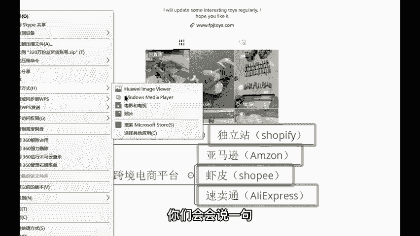
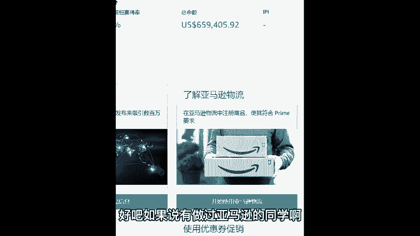
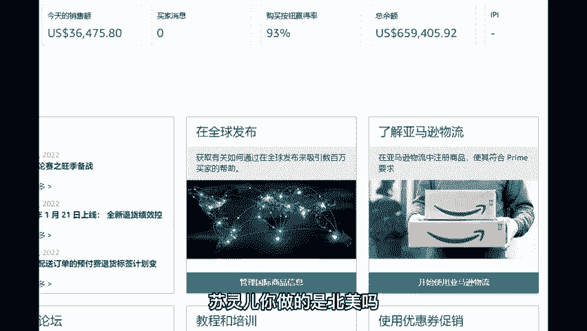

# 2024年小白如何从0到1做跨境电商外贸副业？｜ 3万字吐血分享，保姆级教程！拒绝内卷，出海赚美金【tiktok跨境电商 独立站  Facebook】 - P27：15_电商带货：有货源模式 - 嘉哥冲 - BV1EBtfeFEXw

下来我们来讲一下这个带货它的一个概念，它的一个具体的流程是怎样的。问一下你们，你们是有货还是没货？😊，你们自己有没有东西可以卖的，有的打个有没有打没有啊，有的同学你可以把自己的东西。

把自己想卖的东西说一下。😡，有没有自己想要卖的东西？😡，你肯定更希望卖自己的货源呢，是不是老师我有鞋子，我有裤子，我有袜子是吧？我想卖到海外是吧？也行啊。😡，这个不是不行，可以啊。

我可以教你如何去卖袜子。😊，对。饰品对啊饰品可以，而且的话呢还非常的不错，市场非常好。嗯。我看一下啊。视频没有大多没有是吧？我看到还有还有有的有的，你卖的是什么呀嗯。有的。好，先有两个都讲一下哈。

那有的同学的话呢也有那么一丢丢啊，但是的话呢还相对于较少。那我就讲一下，你先讲有眼镜行吗？眼镜的话呢比较的。😊，呃，因为我们做的是跨境的嘛啊，海外的嘛，这个你如果说在店铺里面和人家去聊这样的一个数据啊。

你可以卖眼镜框，可以卖眼镜框。知道吧这个还是可以的哈好，那像这个有货源具体该怎么玩？首先你得要有一个载体。各位载体，就是你现在比如你想要卖眼镜框，你不可能说直接去卖，那怎么卖嘛？是吧？

你挂到这上面怎么挂挂不了，所以你也要有一个载体。这个载体呢，就是店铺，你得要有一个店铺像独立站、亚马逊、虾皮驻卖通，这几个。😊，跨境电商平台，你得要去注册，注册好了之后，把你的商品上架到这个店铺里面。

再把这个店铺的链接挂到这个主页的下方，你就可以去卖自己的东西了。这个流程呢就是这样啊。那像这个有货源的同学啊，我跟你讲啊，这个转化率很高。虽然说你现在的话呢可能听起来哎呀还还要注册店铺啊。

但是的话呢等到你们赚到了这笔钱之后，你们会会说一句真香啊，来给你看一下。😡。

这个的话呢是老师我的一个带货的一个账号哈。😊，我给你看一下我这个带货的一个账号，然后给你看一下转化率的情况。

啊，给你看一下这个转化率的情况，这个不需要花什么多少钱，几万几双，不需要啊，亚马逊也就200多块钱的月租就够了。你开这个店铺，我记得260。😡，260啊。260块钱一个月月租注册一下这个店铺不需要装修。

😡，知吧不需要装修啊。😡，嗯。啊，那我我做的也是亚马逊，我做的也是亚马逊，直接把这个亚马逊的店铺链接挂到这上边上方。挂到这上方之后，来，我们来看一下这个视频，我们先看一下我的账号，我带货的结果怎么样。

对，39。99美金。😡，呃，大家好，我是凯文，给大家展示一下呃，我这个300多万的一个粉丝账号，然后带货的一个情况哈。呃，首先先给大家介绍一下，这里直接可以去放亚马逊店铺的链接啊。

就是我这边带的是关于呃颜料啊等等一系列的一些类似的一些产品哈。这个具体是什么，我就不便多说。呃，给大家看一下这个账号的一个播放量情况呃，第一个视频两个置顶的分别是2000多万2500多万和2900多万。

将近3000万了哈。其他的播放量一般般啊也不是说特别的高，这个是最新发的，然后19万的、32万的呃，470万的还有1600万的呃，150万的是吧？这种视频的话呢是比较常见啊。

500万国外的人还是蛮喜欢这方面的一些视频的哈。😊。

嗯，就这样吧。嗯。😊，好，那像这个视频的话呢，就看完了哈。看完了之后的话呢，你们想不想看一下我这个店铺的链接挂到这里，我到底能赚多少钱，它的转化率怎么样？想不想看一下这个店铺想看的打个响字，好吧。😊。

想不想看一下，老师啊，我注册一个店铺，我卖自己的东西，我能赚多少钱？😡，想看是吧，我挂的是亚马逊，我刚刚看到有一个同学的话呢，也是做亚马逊的，是不是那个叫都灵儿啊，灵儿，你也做的是。😊。

是吧这个亚马逊是吧？嗯，我也做的亚马逊啊，好巧啊好巧啊，我给你看一下哈，看了之后的话呢不要激动啊，这个看了不要激动哈。😊。

如果说你在上面的话呢有播放量，但是没有呃你在上面的话呢做了这些操作，但是没有赚到这个收益不是平台的问题。说实话不是平台的问题啊，是我们的运营操作出了问题。好吧，如果说有做过亚马逊的同学啊。

应该一看到这个店铺，你就能看得懂是什么意思了啊。来。😡。

我刷新一下，这个的话呢是真金白银啊，它直接的话呢就是钱呐。各位，你做的是北美吗？苏02，你做的是北美吗？我做的也是北美，好巧啊，我做的也是北美。但是的话呢日本、澳洲日呃日本、澳洲、欧洲我都有在做啊。

我都有在做。然后我给你看一下。😡。

我给你看一下我的情况，我挂了一天，我直接把这个链接挂到这个主页下方挂一天有多少3600036475啊，36475美金。😡，啊，真的懂的同学才他才知道这个到底有多么爆炸啊。如果不懂的。

你们就看得到有多少钱。真的，你们做过亚马逊的同学，你就知道这个到底是有多么的暴利了啊。一天的话呢，232072，此时此时此刻不应该是有点什么欢呼声吗？啊，一天挂这个链接挂在上面。😡，啊，挂在上面啊。

这就直接23万。我我跟你讲哈。😊，嗯，未来的话呢，你们的账号起来之后呢，你还可以去做到一个坑位费的一个操作。😊，就比如说我现在我的这个账号起来了是吧？我可以去找在那个同类型的一些产品。

我可以把这个位置让给你，我一天收你20万。😡，你给我20万出了多少单，不归于我管，我只要发作品。😡，哦，我给你挂一个星期是吧？哎，20万我挂一个星期出了多少单是吧？呃，不管我啊。

我也不不不不去管什么其他的，是不是我收你20万的一费费用，就这么简单啊，这个也是蛮暴力的一种变现的一个玩法啊，坑位费。嗯，这个的话呢是当天的啊，当天的话呢来咱们再讲一下这个总余额。

总余额的话呢是这个月截止目前的。😡，总于截止目前的对销售额啊，这不是纯利润啊，你不要那么惊讶啊，659405来转换一下人民币。😡，659405转换成人民币的话呢，有419万。这个店铺的话呢。

纯利润是在50%到60%。50%到60%，你去抛除抛抛除啊那些成本，抛除物流，把这些东西全部抛除掉。剩下咱们的话呢一个月200多万左右。😡，啊，1两200多万左右。对，利润还是很高的啊，可以吧，各位。

😡，好，那像这个我自己的话呢做的时间哈，做国际呃国际抖音17年做这个。😊，对，这个亚马逊的话呢也是在18年左右啊18年左右。因为我发现这个东西能够结合到一块，有专业的术语，它叫做把公共流量转为私域流量。

😡，资域流量。就是换个说法哈叫做导流。哎，你们能听懂吗？导流就是把这个平台里面的那个流量啊给它导到我们的一个。😊，店铺里面本来的话呢，我们的店铺呢自然流量就那么一丢丢，一天的话呢。

也就十几二十个流量看到我们的产品。但是这种流量太少了呀，那怎么把这个流量变得多一些呢？那就是把这个产品把这个店铺挂到这上面。你要做的就是把你的一个播放量搞上去，搞上去之后。😡，你说有这么高的播放量。

你不点这个链接，别人会点啊，别人不点，你会点啊，是不是？那这不流量就大了吗？这不流量的话，那不就起来了吗？是不是就这个意思啊，这个就是有货源，有货源的同学呀。😡，你想要做这个你得要有货源啊。

你想你想做这个，你得要有货源，知道吧？

