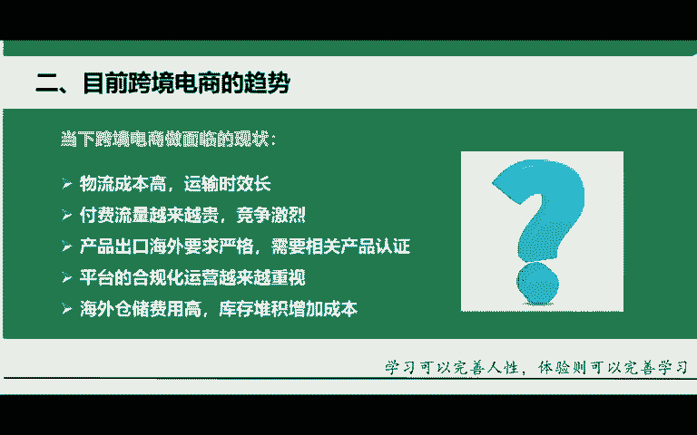
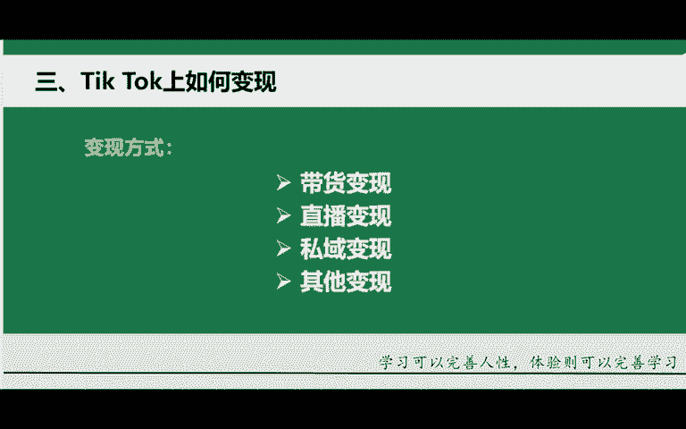
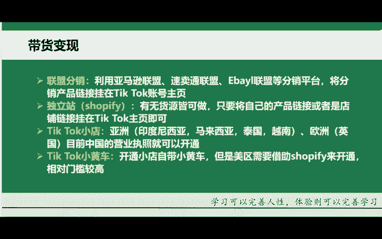
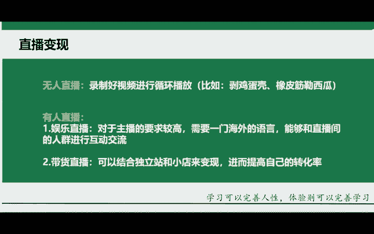
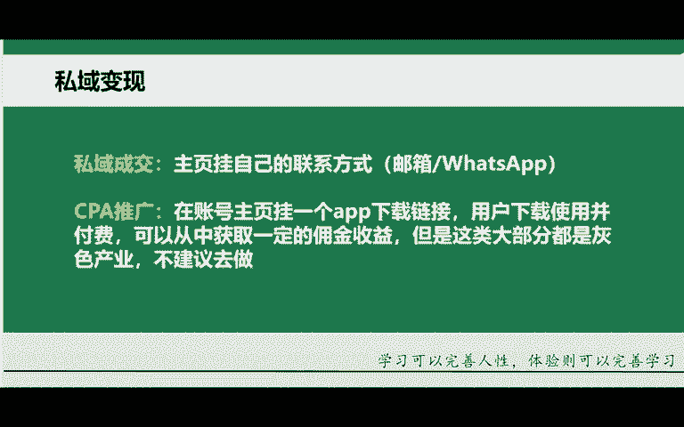
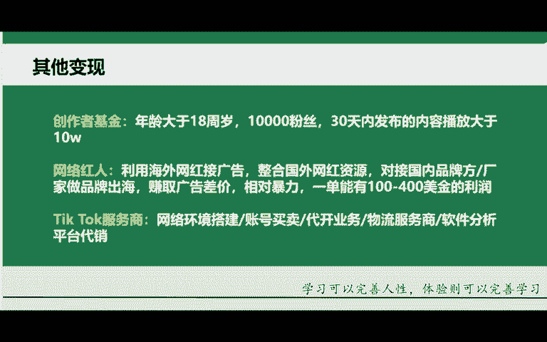
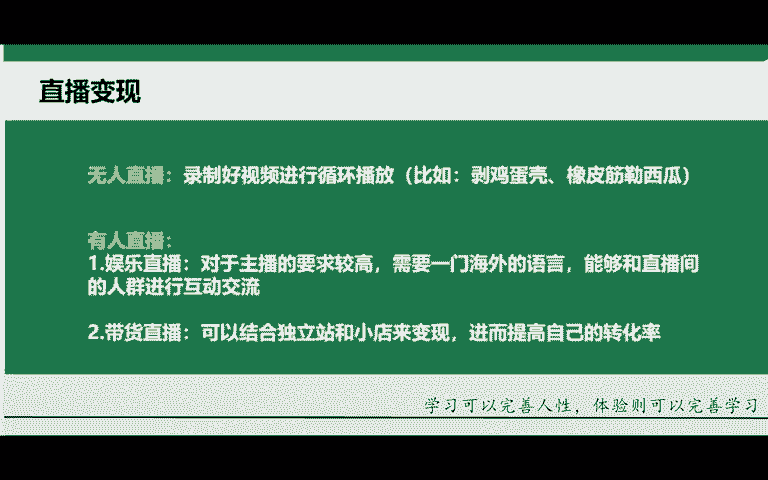
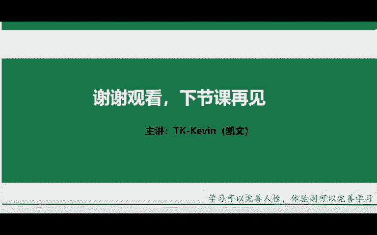

# 2024年小白如何从0到1做跨境电商外贸副业？｜ 3万字吐血分享，保姆级教程！拒绝内卷，出海赚美金【tiktok跨境电商 独立站  Facebook】 - P4：2.Tik Tok上如何变xian - 嘉哥冲 - BV1EBtfeFEXw

来，咱们接下来往下讲。讲重点，国际抖音该如何去做到一个变现呢？它的变现方式啊会变的多一些。变现首先带货、直播、私域或者其他变现，咱们一个一个给大家做了一个分享。

首先先讲第一个带货变现。讲带货。首先有一个联盟分销，利用亚马逊联盟、速卖通联盟或者说易贝联盟等分销平台，将分销产品链接挂在你的国际抖音tkt的一个账号的主页就可以了。第二，独立站 shopping拼贩。

😡，你有货源也好，没货源也好，你都可以去做这么一件绍。你只要将自己的产品链接，或者说是店铺的链接挂在tktok的主页下方就可以了。这第二个，第三，kt tiktok的一个小店。

亚洲、印度尼西亚、马来西亚或者说泰国越南，这几个地方的小店都可以开。但是你得要有本土的营业执照。什么叫做本土呢，本土的话呢，就是在当地的营业执照。你比如说你有印度尼西亚、印尼马来西亚的营业执照。

泰国的营业执照。那可能对于有些同学来讲，门槛会比较高。那还有一个是欧洲，欧洲的话呢，就是英国目前咱们中国的营业执照就直接可以去开通英国小店。所以对于大部分同学来讲，英国是我们当下的不二之选。😡。

这是tktk小店。第四tktok的呃tktok的一个小黄车开通小店，它是自带小黄车的，小黄车是什么？视频左下角有一个小黄车，刷着刷着视频，它就会弹跳出来。😡，但是的话呢。

每区你需要去借助这个shopping fair来去做的一个开通啊。那shopping fair的话呢，它是一个独立站。嗯，相对的话呢，门槛会比较的高一些啊，你得要先去开通一个独立站。

才能够说开通这个小黄车。这个就是带货挂链接、带货，或者开通国际抖音小店来做到一个带货。

来第二个。第二个的话呢叫做直播变现。那直播的话呢分为两种。第一种的话呢叫做无人直播。你录制好视频之后呢，你进行一个循环播放。你比如说像我们在国内抖音上刷到的。哎，在放成龙的电影，在放李连杰的一个电影。

很在放某某某谁的电影。那对于这个电影来讲，那咱们不能够说直接的去放啊，这个东西的话呢，是涉及版权问题，涉及版权。而我要告诉大家的是他背后的逻辑，就是你可以去放一个东西，放什么呢？比如放视频。😡。

你可以放什么剥鸡蛋壳的呀，比如说橡皮筋勒这样那个西瓜的呀等等一系列的哈，往这方面去想很多，你可以进行循环播放。而外国人呢，他有一个习惯，就是给小费，你在睡觉之前，你把录制好的视频放到直播间一直循环播放。

第二天起来，你可能就是有百80块钱的一个收益，这就是无人直播。好，还有一个是有人直播娱乐直播，那这个对主播的要求他是比较高的哈，他需要一门海外的语言，就比如说你得要懂英语，你不懂英语。

那你确实只能够在这个屏幕面前对着这个屏幕啊巴巴，那不行的那人家不会给你送礼物的。嗯，你要能够和这个直播间的人群进行互动交流，人家才会给你送礼物。😡，第二，带货直播你可以结合独立站或者小店来做到一个变现。

进而提高自己的转化率。你可以直接在你的直播间去展示这个产品。如果说他们需要，你就引导他们在你的视频，在你的直播间下方小黄车直接可以选择做到一个购买。😡。

好，这个就是直播变现。还有一个啊思域变现。思域变现的话呢，就是把主页挂链接的那个位置，不要挂卖货的一个东西，不要挂卖货的链接，挂成你的联系方式。你比如说邮箱whats up啊，这些的话呢都是还可以的。

😡，哎，你能够说去挂facebook或者说youtu啊，上面的话呢，这个联系方式也可以就是去做到一个相互的引流。你可能两个账号，两个三个社交娱乐账号都能够火起来。嗯，还有一个是CPA的推广。

在账号主页挂1个APP下载链接呃，用户下载并且使用，而且付费了，你就能够从中获得一定的佣金收益。但是这一类呢大部分都是灰色产业哈，不太建议大家去做。嗯，账号的话呢很容易和谐啊，来再讲一个其他变现。

其他变现就是大家可能熟悉的创作者基金。首先各位年龄的话呢要大于18周水。这第一个要求。第二，你要有1万个粉丝。第三，你的账号作品30天内发布的内容要播放量大于10万以上。这就是创作者基金。😡。

收益的话呢，现在一般卖。一般般。然后还有一个是网络红人利用海外网红接广告，整合海外的一个资源，网红的资源，对接国外的一些品牌方，厂家去做品牌出海。你赚取广告差价相对暴力哈。这个就像你们在国内。

这个就像国内同学们刷到的一些视频，视频中央的话呢，它是不是穿插在一个广告。如果说你能火起来，那你就能够说有品牌方联系各位。那这个一单的话呢，这个利润还是蛮高的。嗯，还有这个tkt的服务商。

比如网络环境搭建买卖账号代开服务和这个物流服务商软件的一个分析平台的代销。像这些的话呢都是可以去做的一个变现渠道。那变现渠道比较的多啊，未来的话呢，咱们会将一一详细的去做了一个讲解。😡。

那像今天的话呢，咱们这些内容呢，就先给大家去做的一个分享了。咱们未来还有非常多的一些知识和内容啊，这只是第一节课，先给大家来去讲解一下未来你要去朝着的哪一个方向去前进，哪一个变现渠道去发展。

这个咱们一堂课一堂课去做的一个学习。咱们会见分享的。😊。

