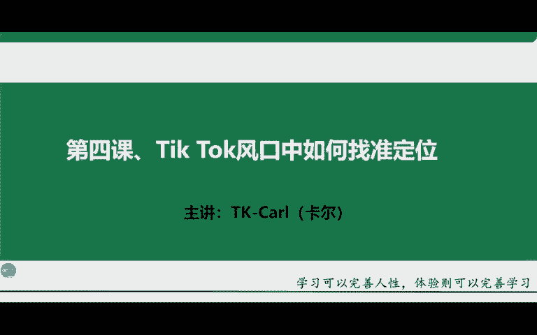
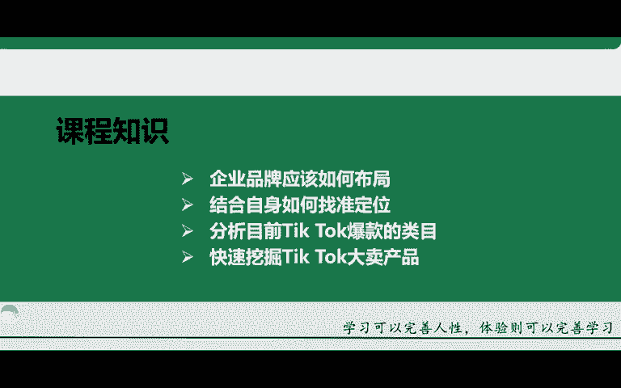
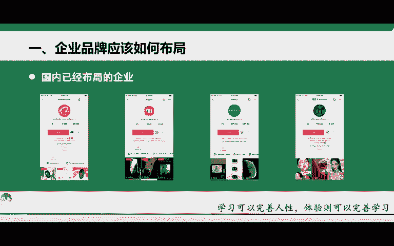
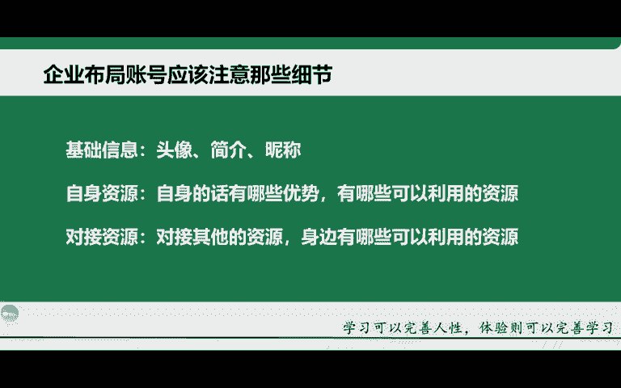
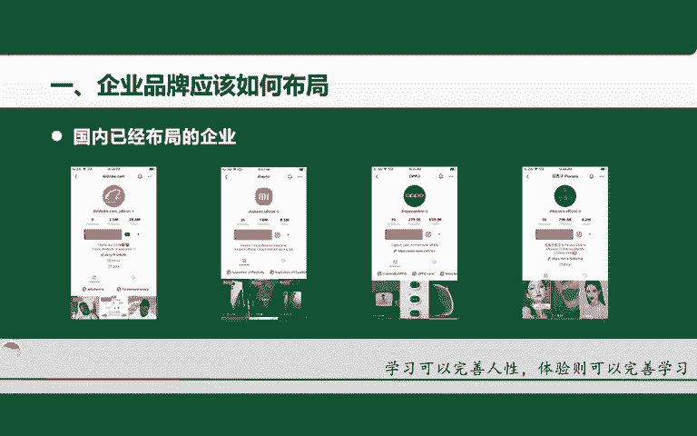
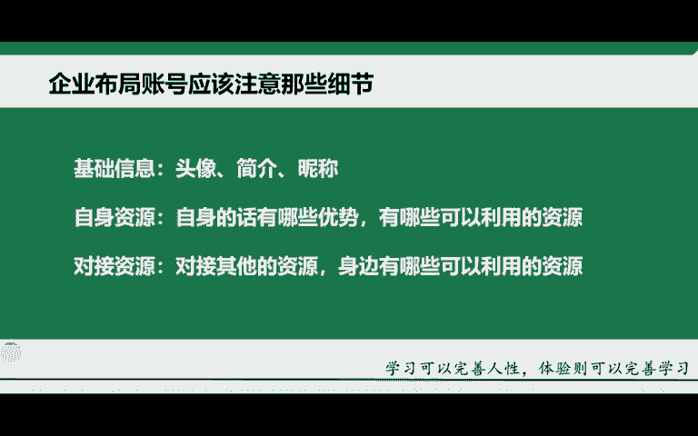

# 2024年小白如何从0到1做跨境电商外贸副业？｜ 3万字吐血分享，保姆级教程！拒绝内卷，出海赚美金【tiktok跨境电商 独立站  Facebook】 - P9：18.企业品牌应该如何布局 - 嘉哥冲 - BV1EBtfeFEXw

第四节课，tktok风口中如何找准自己的一个定位啊，那这节课的话主要分为以下几个点大家开始讲解啊。那第一个呢第一个点的话就是企业品牌，应该如何去进行一个布局。第二个的话就是结合自身找准这个定位。

也就是后期所发展的一个方向。那第三个的话就是目前在TK上的一些爆款的一些类目啊，第四个的话就是快速找到TK上的一个大卖产品啊，那这个节课的话是相对来讲前期是比较重要的啊，为什么这样讲。

因为你如果说对于自己没有一个更深刻的认知定位不明确的话，你对后期的这个内容运营，其实有很大的一个弊端啊，所以说一定要找准自己的一个定位很关键啊，就是后期到底适合自己怎么去做哪些产品啊。

或者说怎样的一个发展模式啊，这些都需要自己后期去做一个定位的啊。

那首先的话讲第一个点就是企业啊，我们应该如何去布局我们的一个TK账号啊。那目前的话给大家在这里列举了这么4个，就是已经在海外布局的我们的国内的一个大品牌啊，大品牌啊后第一个的话就是阿里巴巴啊。

大家都知道对吧？第二个的话，小米第三个的话就是这个oper啊，第四个的话就是花西子啊，那你看像国内的这些知名品牌已经早已在TK到开始了布局啊，那为什么要去讲这个点呢？也就是说证明TK。

他目前的一个趋势是非常好的啊，国内的很多知名品牌客户，他都能够看到这样的一个发展前景。所以说他早已经在开始布局了。那我们如果说学有些学员他是一些知名的一些品牌商啊，或者说是一些工厂商家啊。

那我们也可以做这样的一些品牌布局啊，就是把自己的一个品牌给大家推广到海外去啊，是非常好的啊。因为你当这件事情，如果说已经成熟了，你再去做自己的一个品牌。牌化运营，那其实是很难去做的啊，因为现在目前来讲。

它的这个品牌化运营啊还相对来讲比较简单的啊，就是整个的市场还不够饱和啊，还不够饱和。所以说我们有很大的一个空间去发展啊，很大的一个空间去发展。那首先的话再给大家去讲一下这个注意的一些细节。

首先的话，我们的这个头像简介昵称啊，一定要专业，跟你的这个品牌化息息相关。就像我前面给大家看到的对吧？这几个品牌，你会发现人家的这个logo跟这个下面的账号的名称都息息相关啊，非常的有强关联性。

让用户第一眼看到啊，这个就是某某某品牌啊，一定要有这样的这个标识啊，所以说我们的头像我们的简介，我们的昵称啊，一定要跟你的品牌化，或者说你的这个产品化要强相关啊，这样的话才能够有独特的标识。

用户第一眼就能够看到你这个产品跟你的这个账号啊，能够记在心里啊，这个是哪个哪个品牌，哪个哪个产品，对吧？那第二个的话就是自身的一个资源啊，先想一下自身的话有哪些优势啊，能够结合利用身边的哪些资源啊。

那第二个的话就是对接资源。就是说你身边没有对应的一些资源之后，你可以去利用身边对接到一些。

资源啊对接到一些资源。比如说呃海外达人啊，或者说海外的一些服务商模特啊等等，或者说一些这个网络活人帮你去推广自身的一些产品也可以啊，或者说一些代运商服务等等啊，都行。那自身的话，比如说我有工厂。

我是一个产品啊，我主做这一块产品，我有自己的工厂那你可以教你自己所做的这款产品，以这个品牌化的形式去出口啊，就是出往海外啊，所以说先想一下自身的话，有哪些这个优势啊，有哪些这个可利用的一些资源啊。

我相信大部分同学的话，他都是没有任何资源的啊，但是没关系，但这个品牌化运营，我在这里还是要给大家去讲的啊。我相信有一些同学他是有自身的这样一些优势的啊。因为我之前教过的一些学员，他就有啊。

比如说他自家有工厂啊，而且的话他也在海外有一些相对应的呃海外的一些人类资源啊，就是一些留学生啊，还有一些这个海外的一些品牌方啊，他都有。这个很高的很好的一个合作啊。

那对于他进行一个自己工厂的一个产品出海的话是完全有利的啊完全有利的。所以说先想一下自身的一些优势有哪些啊。

