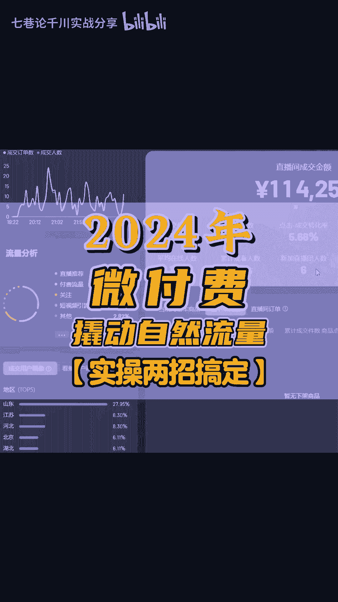
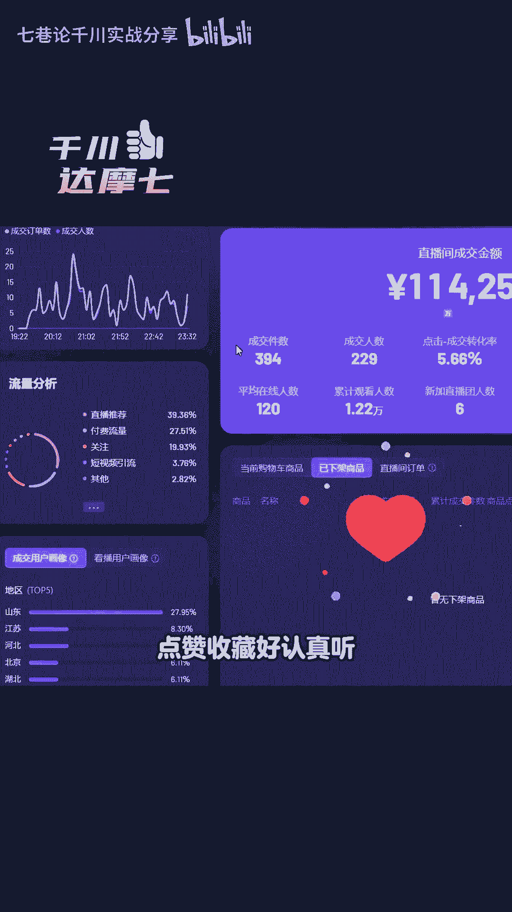
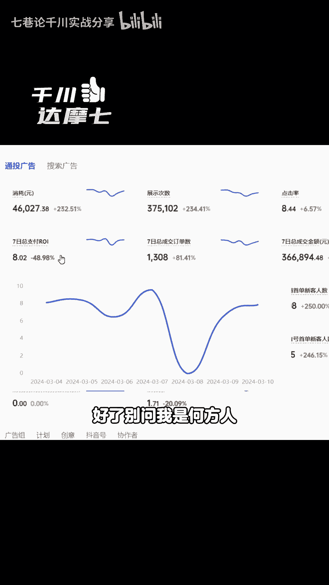

# 2024年微付费翘动自然流量（两招起号） - P1 - 七巷论千川实战分享 - BV1A1421Q7c9

2024年微付费怎么去撬动自然流量。

也就是我们讲的轻付费，怎么去带动自然流，付费呢是一定能带动自然流的，毫无争议，也就比如说看这个直播间的流量构成，大家可以看一下付费流量27，对不对，直播推荐39对吧，这个就是付费带动自然流的一个直播间。

大家可以看得到，那么具体怎么带呢，我下面讲的两个点是撬动自然流量的核心，建议，兄弟们点赞收藏好，认真听，以防你要做的时候找不到了。

首先你投付费呢，你要选择签穿，随意推这个东西没用，因为投到后面流量越费对吧，说投随心推的啊，带动自然流的基本上都扯淡，都签穿好吧，这是第一个，第二一个呢你想要带动自然流量，在下面你选择投千川的时候。

那么在这里选择直播间画面，也就是我讲的直投，因为直投它对应的是直播间的数据，你只有通过投这个直播间画面，你才能够去带动自然流量啊，维护费去带得动，明白吗，第三个点看过来啊，千川主要有四种计划对吧。

托管通头行为兴趣啊和人群包计划，这是大家常用的啊，投过千川的朋友，你可以去问一下这四种计划，通透和托管我们称之为收割计划而行，为兴趣来和人群包，我们称之为建模计划，对不对，用哪种计划呢。

你就要去看自然流量的分配原理，你要这么看，我问大家一个问题，第一个自然流量是按照标签推流的吧，你的标签越精准，那么推的流量越精准吧，你才容易接得住自然流吧，如果你的标签不精准，就算平台给你一波测试流量。

你完全接不住，对不对，那平台下次也不会给你自然流的呀，这个是实话呀，所以标签越精准，你越容易接得住流量，那么打上最精准的标签，那么问一下大家一个问题，在千川里面大家都投过托管通，投行为兴趣和人群包。

哪一个计划的流量最精准，留恋最精准的计划，成交的标签是不是最精准的，对不对，人群包吗，没问题吧，第二个点，那叫赛马平台，为什么给你推这安流，那是因为你的数据比同行好，比如说你1000个厂关。

你只能卖个3000块，别人1000个厂关对吧，别人能卖个1万块钱，那么今天你是平台，你会给谁推流，肯定是给这个UV价值高的吧，那怎么样去做到诶，同样的流量差不多的，然后你卖的比别人多呢。

如果人货场同等的情况下，那么就是他的流量精准，是不是他卖的就比较多嘛，UV价值就比较高嘛，所以第二个东西，那流量最精准的还是人群包计划，所以呢用人群包计划很容易通过赛马，是不是，所以有一句话。

千川投人群包计划，直投才是带动自然流量的核心，所以大家比如说看一下先前看的这个数据啊，带动自然流量，你们看他投的计划是什么，一个是新成长五，一个呢是通透支付对吧，就是新成长五，就是人群包的第五个计划。

我讲的成长期的，对不对，通头大概大家都知道，所以你带动自然流了之后，后面呢也可以用通透支付RY去收割，就比如说你看成长五的RYS7啊，通透的RY40，所以大家知道了吧，好了，别问我是何方人。

