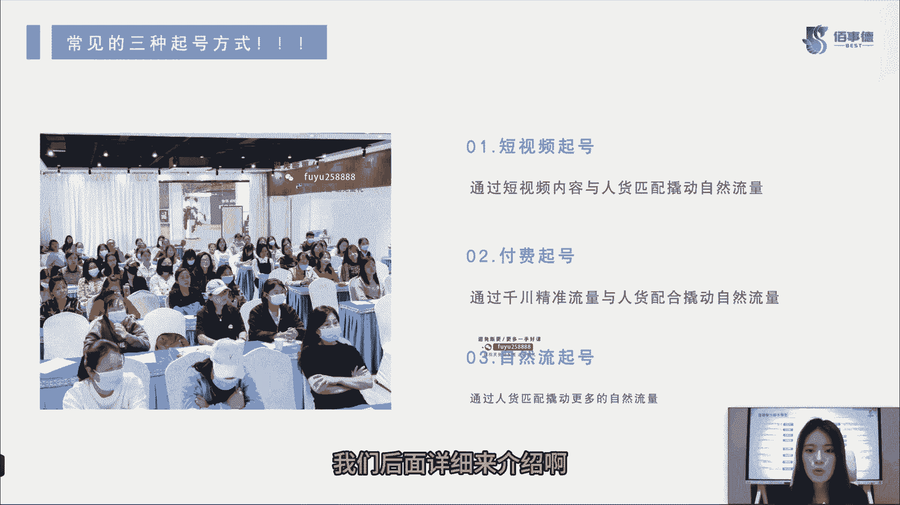
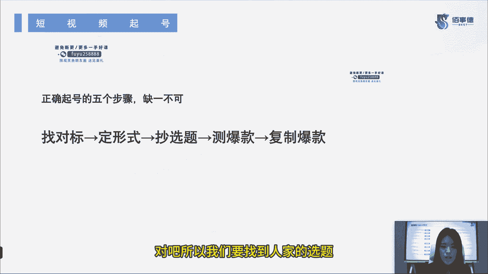
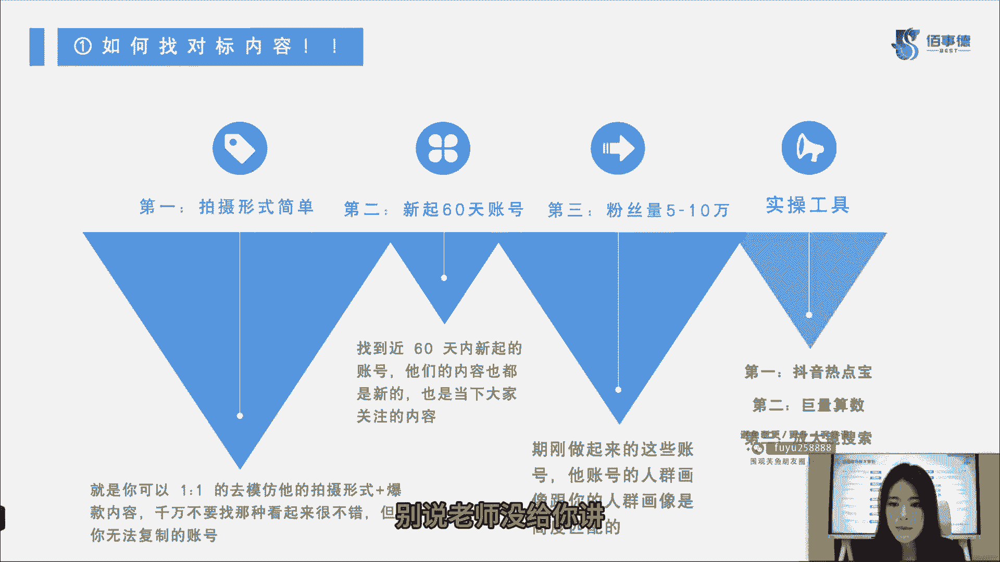
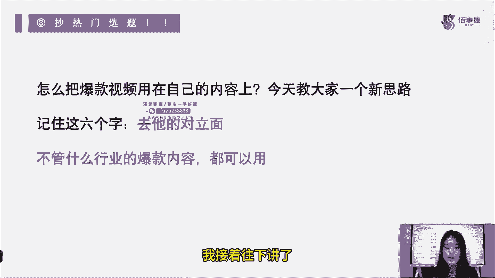
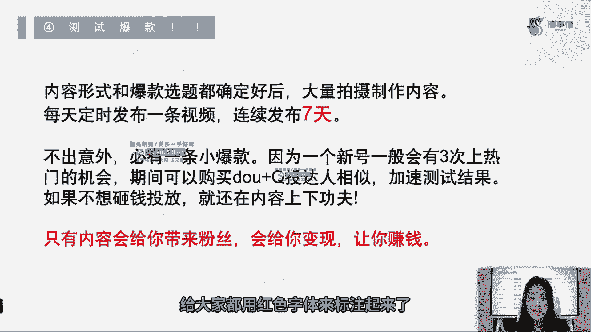
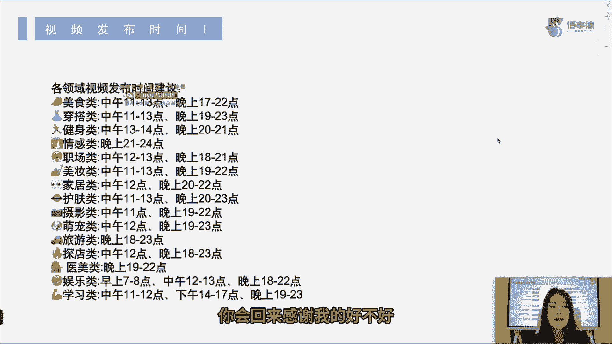
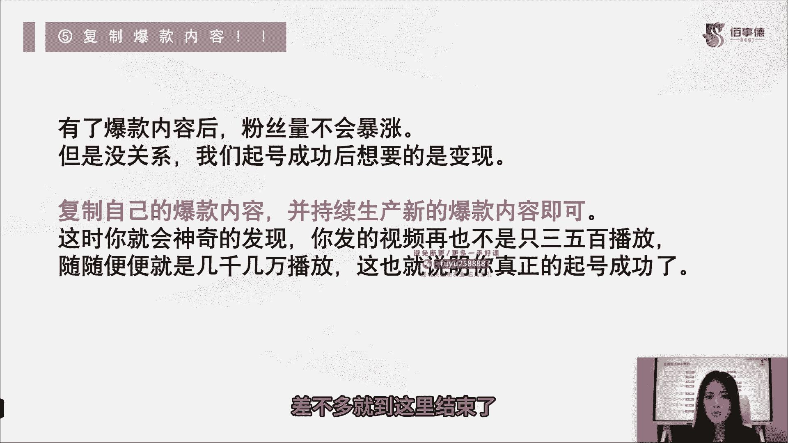

# 2024年抖音直播带货起号全攻略课程教程 - P1：1：第一节_常见的三种起号方式_ev - 念念好课 - BV1M74TefE5m

哈喽同学们大家好，我是百事德直播电商学院的讲师六六老师，今天呢我和大家一一起来看一下，2024年抖音直播带货起号的全攻略，我们的课程呢会分为12节的内容，来给大家录制，内容很多很丰富。

希望大家能认真的听下去，那么我们抖音直播带货起号全攻略，都包括什么呢，给大家说一下啊，主要是给小白来看的，主要教大家怎么零粉起号，那么账号权重怎么去看，团队怎么样搭建数据，如何分析。

教大家去拆解撰写直播话术，高告诉大家抖音账号怎么来去做截流玩法，也给大家讲一下我们新版的鱼塘起号方法，也包括什么呢，AB链加上短视频，加上鱼塘实操日不落等等一系列的内容，我们课程版权归属呢。

是归属于我们百事德职业技能培训学校的。

所以有任何问题呢，也可以在我们百事的官方的账号上，去找我们的客服，首先来跟大家做一个自我介绍，六六老师的本名呢叫高原，然后呢，我现在是专注于抖音直播，带货和短视频账号的拍摄，当然我也有自己的个人IP。

叫直播带货主播六六姐，大家有兴趣的话可以去看一下，那我废话不多说，直接开始进入我们的课程内容。

好我们第一节内容就是三种起号方式，那常见的三种起号方式都有哪些呢，有很多人啊可能从小白开始就想来做账号，但是不知道应该怎么起号，那么今天老师来给大家讲一下三种起号方式，常见都哪三种，第一种短视频起号。

短视频起号指的是什么，指的是通过短视频的内容，和我们后期的人货匹配来撬动自然流量，那么第二种呢就是付费起号，付费喜好是什么，指的是通过千穿的精准流量和人货配合，来撬动自然流量，那么第三种呢也是最难的啊。

我们叫它自然流起号，自然流，起号是通过人货匹配来撬动更多的自然流量，这三种方式有没有发现一个特点，不管是短视频起号还是付费起号，是不是都是和自然流量有关的，我们不管怎么起号方式是什么。

最终的目的都是要撬开它的自然流量，打开流量通道，我们才能算起号成功，那么后续呢也会给大家讲，这每一种起号方式都应该怎么去做短视频呢，给大家讲一下，很简单，顾名思义啊，就是拍视频来起号对吧，人货匹配呢。

后面我会给大家讲付费型号呢，我们也就顾名思义了啊，就是说我们用一点点这个超能力是吧，来进行我们的这个起号模式，第三种呢，就是完全我们不需要花费任何的这个金钱啊，也不用去拍任何短视频。

直接通过直播来撬动自然流量，那这种也比较难，为什么，因为需要你的人货场匹配的很好，后面呢我们也会给大家详细的讲解一下，好那这三种起号方式，大家先简单了解一下，我们后面详细来介绍啊。

短视频起号正确起号的五个步骤都是什么，那我们先来看一下第一个内容找对标，第二个内容定下你的形式，第三个内容超选题，第四个内容测爆款，第五个复制爆款，听上去是不是非常简单，其实实际操作起来呢。

也没有大家想象中的那么复杂哈，那我这里面要给大家讲一下，定形式定的是什么，定的是你的表现形式，定的是你的拍摄形式，能理解吗，既然起号方式已经定了的话，那么我们这个形式啊就一定要找准它。

因为我们也能看到抖音上面啊，我们的自媒体博主，我们的短视频博主各种形式不一样，他们的变现形式也有区分的，所以说我们这个形式一定要确定好，我们是用哪一种表现形式，来拍我们的短视频的好。

那么第二点要注意的内容呢就是抄选题，注意啊是抄选题，而不是叫你去抄内容，因为什么我们是有这个重复率的抖音不是傻子，你如果内容和人家一模一样的话，你这相当于抄袭，人家不会给你流量的。

那么我们要抄的就是选题，为什么让大家抄呢，也是因为大家刚开始做短视频的时候，一定是没有什么拍爆款的能力和眼光的对吧，所以我们要找到人家的选题来进行模仿好。

我们接着往后看，如何找到对标内容，这个内容其实挺复杂的，给大家讲一下，首先第一点，拍摄形式一定要简单一些，为什么，因为你可以一比一的去模仿他的拍摄形式，和他的爆款内容，别忘了我们是小白啊。

我们不是这个呃老手，我们不是成手，我们是小白，所以说大家千万不要去找那种看起来很不错，但是你根本没有办法复制的账号，有很多大V啊，博主人家200万300万的粉丝，你觉得他的东西很好，你很想借鉴。

可是别忘了我们做不到，因为我们这个团队有限，我们的预算有限，所以说我们尽量找自己能做好的，能做到的去模仿他，那么第二点呢，我们要找一个新起60天之内的账号，为什么呢，这种号呢他一般都是新号。

找到这个近60天内起的账号，他们的内容基本上也都是新的，也都是大家当下关注的内容，也就是说此时此刻我来复制他曾经打爆的爆款，在这60天之内里，也会有其他观众来接受我的这个爆款内容，所以说呢热度还没过。

在这60天里，它的内容在现在来讲我也同样适用，这是我们第二点，第三点，粉丝量五到10万，为什么呢，这个期间啊他刚做起来这些账号对吧，那他的账号人群画像跟你的人群画像，一定要是高度匹配的。

那粉丝量五到10万呢，也就足以能够证明，他的账号其实是在新号里面算比较成功的，我们找的话，其实要找这种比较成功的可复制的账号，你说你找一个和你一样做了两个月，然后呢就几百粉丝的，他没有什么参考性。

证明它内容不够好，他的内容不够爆，那么这种账号呢我们也不能说把忽略不计，只能说他的参考程度非常非常小，这是第三点啊，粉丝量要看一下，大概过万破万对吧，五到10万是最好，那破万呢我觉得也可以，但别太少了。

第四个就是我们实操的工具了，我们实操工具都有什么啊，比如说抖音热点宝，比如说巨量算数，比如说我们的放大镜搜索这些等等，都是我们找到爆款的一个工具，其实这些东西非常简单，抖音直接相当于给你开卷，放给你了。

抖音热点宝里什么火，你就可以去拍什么，巨量算数里哪个数据好，我们就可以用哪个，对不对，放大镜搜索，我们可以看现在的人都愿意去搜索什么，对不对，也是一样的热点，也是一样的爆款，所以说这些工具啊。

我们要把它灵活地运用起来，这其实就相当于是抖音，给大家的一个开卷考试了，你说卷都给你开了，你说你还不会做，别说老师没给你讲。

是不是，第二个刚刚说了，我们要确定表现形式，那么对标账号你所有视频看一遍，找一个你能模仿并且能够超越的表现形式，为什么说能模仿呢，我刚刚也说了，我们的目标啊，不是说仿照一模一样的账号是吧。

我做一个克隆羊，多立出来也没什么意义，是不是寿命还很短，我们目标是什么，最终目标其实是要超越它，形成我自己的一个独特风格来，因为你们总有不一样的地方好，那这时候你要确定我们现在这短视频确定好了。

表现形式之后，确定谁来拍，比方说我团队里面有美感的是一个女孩子，那是不是就应该由这个女孩子来拍，毕竟形式已经确定了，画面好看也比较重要，对不对，那么第二点怎么来拍，其实还是同样的道理。

表现形式已经确定了，我们应该怎么去拍摄出来，我是说我是用一个相机来拍是吧，我还是用手机来拍，我是拍那种诶转场比较华丽的呢，还是说我这个转场稍微有一点点就可以了，剧情类的呢。

还是说只是带货类的简单的视频呢是吧，这表现形式是确定好了啊，第二点怎么拍也确定好了，第三点拍给谁看，其实这个就是你的对标用户了，你的用户是谁，我如果我的用户啊是一个30~40岁的男性。

那么我拍摄的这个画面应该是什么样的，对不对，内容应该是什么样的，大概心里有一个数，这一类人喜欢看什么，是不是大家要先提前研究好啊，其实拍给谁看，不光是说诶我只要定好目标就可以了，也不是的。

你其他所有的内容都要跟着你的目标来走，比方说我是拍给宝妈看的，那这个宝妈喜欢看什么，她肯定喜欢看宝宝的东西，给宝爸买点东西是吧，我们确定好了，他是什么样的人群，他喜欢看什么，那么我们第三点呢。

这也就能确定好了，这确定表现形式一共有这三个，谁来拍，怎么拍，拍给谁看，这三个很重要的啊，很重要的，因为第三点相当于是你的对标的精准用户，这些用户是能给你升单的，能理解吗，你最后变现靠的是谁呀。

靠的就是你的精准用户，对不对，靠的就是你的客户群体，能听明白吧，好能理解的话，我们往下来了啊，好第三个抄热门选题，有很多人说老师我不会抄热门选题，这个选题里我只能想到这个人的内容点，可你又和我说。

不能完全的模仿抄袭，那怎么办，老师怎么把这爆款视频，我应用到我自己的内容上啊，好今天老师来教大家一个新的思路啊，记住这六个字，去他的对立面不是骂人啊，就是告诉你去这个账号，他给的你内容的对立面。

不管是什么行业的爆款内容都可以用，我跟你们说，这个其实就是你一个小思路，不要说哎老师，我其实我都不理解它的对立面，没关系，只要我们能产生讨论的内容，都是有热度的内容，只要有热度了，那你的账号就有流量了。

所以说告诉大家去它的对立面去来做内容，不管是什么行业的爆款内容都可以适用，一定要记住这句话，如果你想做好一样内容，一定要记住，找到爆款之后，它的选题我们找不到另一个维度。

那我们直接去它的对立面去做就可以了，能理解吧，超热门选题很简单，我接着往下讲了。

测试爆款，那么也就是说我们内容形式和爆款选题啊，我们都确定好之后，我们就可以开始拍摄制作内容了，每天我们定时发布一条视频，连续发布七天左右，如果不出意外的话啊，每七天里面必会有一条小爆款。

比方说前面啊都是几百个播放量，那么后续可能会变成，有一天会变成几千的播放量，这一天呢可能是第四天，可能是第五天，因为为什么呢，一个新号一般会有三次上热门的机会，能理解吧，那这期间呢找到这个小爆款之后。

我们就可以购买斗家啊，投这个达人相似来加速测试我们的结果，如果你说老师我不想砸钱来投放，我觉得没什么意义啊，我觉得我不想靠这个花钱来的流量来测，我这个爆款怎么办，那你就要在内容上下功夫。

可能说今天的内容需要有点变化，内容我要做得越来越好，越来越丰富，越来越多的人愿意看我这个有干货的内容，那么你的这个内容呢总有一天也会爆的，但是不要浪费我们这个新号的新手保护期啊，在抖音里面。

我们信号是有一个新手保护期的，一般情况下来讲，信号没有什么问题，是不会出现权重类的大问题的，也就是说你如果连续发布垂直类的视频的话，你确实这七天里你会有一条视频小爆，那么我还是建议大家投一下抖家。

然后呢告诉大家，只有内容会给你带来粉丝，粉丝会让你变现对吧，你变现了，我们就能让你赚钱，所以说测试爆款其实七天就够了，重要的内容呢，给大家都用红色字体来标注起来了。

大家一定要理解，一定要去看，一定要去做啊，那我们接着来看视频的发布时间，有很多同学说，老师我这个七天每一条视频用同样的时间发，好不好不好，为什么呢，因为你不太确定这个时间段，有没有人愿意看你的视频。

我们的视频内容啊的确是垂类的，垂直的，也就是说内容是相似度差不多的，比方说做美妆的就只做美妆，做美食的就只做美食，但时间不同，你对应的人群也不同，对不对，也就是说你类目不同，你对应的时间也会不同。

那么我这时候呢会给大家一点建议，因为有很多人啊，你这连续七天，你可能今天是早上七点到八点发，那么可能明天就是中午11点到12点发，那没准儿，这七天里你都测不出来一个准确的时间。

所以我给大家缩短一下大家的这个测试范围，好吧，给大家一下建议，当然这些建议啊，都是我们百事得自己亲自测出来的，很可能对你的账号来讲其实并不适用，我们只是提供参考价值啊，好我来给大家说一下美食类。

我们一般在中午11点到一点，晚上五点到十点，这我就不用多说了是吧，毕竟它是吃的，可以理解吧，穿搭类的视频一般也是在中午11点到一点，晚上的七点到11点，那么健身类的视频呢一般都在下午啊，一点到两点。

晚上八点到九点左右，情感类我就不用多说了，一般都在夜间晚上九点到零点这个时间段里，职场类呢，比方说有人想找工作的啊，职场类的我们一般在中午12点到一点，晚上六点到九点，美妆类的视频呢。

可能相对来讲我感觉固定一点，大概是中午11点到下午一点，晚上的话呢七点到十点左右，家居类的视频，一般在中午12点或者晚上八点到十点，为什么，因为家居类啊，一般都是我们这个啊30岁左右的宝妈在看。

护肤类呢，也是我们女孩子啊，其实大差不差，和美妆类大概也就是在中午11点到一点，晚上八点到11点左右，摄影类呢，摄影类大概在中午11点到晚上七点到十点，这个时间段，萌宠类在中午12点，晚上七点到11点。

旅游类啊，一般在晚上六点到晚上11点，但是还有一类就是旅游类，带大早，早上的五点钟到六点钟左右，为什么，因为有很多人现在他不提前做攻略，他早上诶刚刚起床，然后呢这个时间段来做攻略，那探店类的视频呢。

一般都是在中午12点到晚上的六点到11点，医美类一般都是在晚上啊七点到十点左右，娱乐类的视频啊，我们这一类指的是泛娱乐，我们一般这一类的视频，可以选择在早上七点到八点，中午12点到一点，晚上六点到十点。

这一类内容比较泛啊，所以说这个时间段呢我们也要求的比较广一点，无所谓，学习类的视频呢一般都在中午11点到12点，下午两点到五点，晚上七点到11点，另外要跟大家说的是什么呢。

如果说哎我就是想避开高峰点的话，老师怎么办，那避开八点钟到九点钟这一段高峰点，其实大家也看到了，我们总结下来最热门的点也告诉大家了，大主播的高峰点呢就在晚上八点到九点左右，我们也尽量把它错过去。

这个一定要大家截图保存啊，如果说有一天你真的是我不知道几点发视频了，哎我这视频时间我实在找不准了，你把这条记下来，你会回来感谢我的。

好不好，来往后看，复制爆款内容，有了爆款内容之后，粉丝量可能不会暴涨，大家一定要理解这一点啊，但是没有关系，我们起号成功后，想要的不是粉丝量，而是什么变现，变现就是我们能赚钱啦。

所以说你可以复制自己的爆款内容，并持续产生新的爆款内容就可以了，我们可以抓住这爆款内容的一个点，不停的去给他做延伸，那其他延伸的各个点都有可能是新的爆款内容，这个时候你就会神奇的发现。

你发的视频不再是三五百的播放，随随便便可能就几千几万，到这个程度，也就说明你真正的喜好成功了，那么我们第一节这短视频起号的内容，差不多就到这里结束了，后面的内容呢也会持续的给大家分享。

