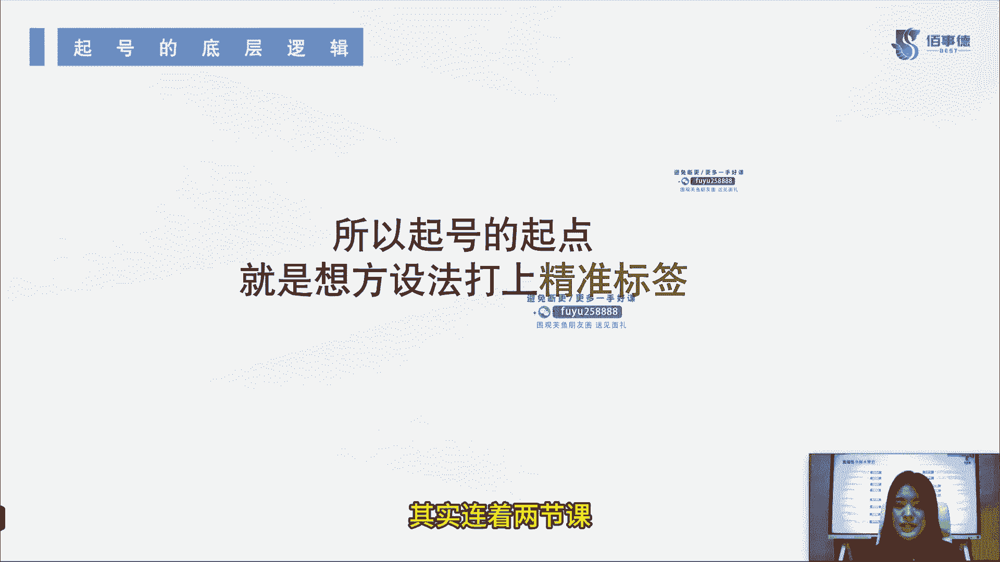

# 2024年抖音直播带货起号全攻略课程教程 - P2：2：第二节_起号的底层逻辑_ev - 念念好课 - BV1M74TefE5m

哈喽大家好，我是百世德职业技能培训学校的六六老师，那么上节课呢我已经给大家讲过了，短视频起号的逐个步骤，今天呢我接着带小白来继续学习抖音直播。

带货的各项干货，我们来往下进行，第二节呢我们主要讲的是起号的底层逻辑。

要想起起来哈，我们必须要懂得哎这逻辑是怎么玩的，起号的底层逻辑都有什么，首先第一个有它的停留模型，停留模型指的是什么呢，停留客户的画像和数量，还有你直播间的推流速度，根据我们的停留模型呢。

抖音会给你进行更多人群的再探索，那么我给这个停留模型啊起一个名字。

大家这个可以记一下啊，潜在用户，第二个呢是成交模型，成交模型是什么呢，成交的客户画像和数量，直播间的推流稳度和准度到底是什么样的人，买了你的商品，那么根据你的成交模型。

抖音系统会给你的整个人群来建一个模板，目的是给你的账号打标签，推送你的精准曝光流量，抖音系统呢也会有一个数据测试，测试你是否能承接得住他给你的这些流量，那么我们上节课讲到了一个，我的内容是拍给谁看。

那拍给谁看，这个内容呢可能比较泛，主要可能是我们的停留模型，加上我们的成交模型，但在这里底层逻辑里，我们把它分为两个。

那刚才说了，停留模型是我们的潜在用户，那成交模型就是我们的精准用户，因为他购买了我们的商品，说实话我们的商品就是给这样的人准备的。

比方说他是30岁到40岁，或者40岁到50岁的，在小镇的中产，那么我们的标签呢可能就是小镇中产，女士或男士等等不同的，那么基于直播间的推流逻辑，我们可以利用我们的停留模型，触发我们的极速流量。

打开我们的流量通道之后，人进来了，再来依靠呢，我们抖音系统的成交模型。

来修正我们精准的推流，也就是说停留模型不一定全部都会买，但是我成交的模型一定是哎，这些人买了我的商品，它就是我的精准用户的，所以说我们要修正一下我们的这个停留模型，把它变成我们的成交模型。

完成我们的旗号停留模型是给大家打开流量的，成交模型是让我们的流量给我们来做变现的。

逻辑，就这么简单，能理解了吗，能理解的话。

我们继续往下进行了哈，第二个呢就是赛马罗赛马逻辑啊，顾名思义，其实和这个比赛跑马是同样的道理，它是讲的什么呢，同层级同赛道意思是什么，意思是讲啊，我们去从同层级，同赛道里面的这些账号去做对比。

那对比什么呢，对比的就是我们右边给大家看到的这些数据，比如说电商数据，比如说转化率，比如说我们的平流平均时长，比如说我们的互动率，比如说我们的承担率，UV价值，还有粉丝参团啊，这几样数据以下的这些内容。

谁的数据做得好，那平台就愿意把流量推送给谁，能理解吗，比如说同样我是A啊，这边还有一个账号B，我们两个同层级哎都是新号，同赛道卖的都是美妆，那么我的账号的转化率和我们的平均停留时长，还有我的承担率。

还有我的互动率，还有我的粉丝私家坦率都远远高于这个B账号，那现在平台来了100个，我们的这个停留模型啊，来了100个我们这个流量，那他应该给谁，他肯定会给我，能理解吗，可能他98个都给我了。

剩下两个他分给了B账号，这就是我们的赛马逻辑，那现在起号逻辑已经给大家讲了。

都已经有了，那么我们到底应该从哪开始，起号的起点是什么，是想方设法打上精准标签，其实连着两节课啊。

都给大家提到了这个标签的内容，它到底有多重要，是不是来我们接着往下看，如何高效的来打标签给大家看一下啊，如果你有老号或者有曾经的一个大号的话，你可以在直播间里直接导入这个100~300的。

精准目标人群的粉丝到你的新号，这些粉丝呢他能影响你的开播推流的人群模型，当然不要告诉他们什么时候开播，也不用分享给他们，能理解吧，开播前一段时间，你这引流关注上就可以了，这是如果有老号，如果有大号的。

我想建新号，比方说我想打矩阵呢，怎么办，你可以这样去做第二个呢，比方说老师我没有大号，我也没有老号，怎么办，那你就在开播前发3~5个视频，我们筛选出数据比较好的视频，就投200的抖加投什么。

投精准相似达人10~20个，能理解吧，就找到我们之前的对标账号，也就是说投他们自定义自定义，我给大家讲啊，都需要投什么，一定要记住了，性别年龄24小时涨粉，然后开播前30分钟再投200。

精准相似达人还是10~20个，这时候投什么自定义性别年龄，这时候投的不是24小时了，投的是两小时主页浏览，投这些内容，你们真正开始投的时候，你就知道我这是在说什么了啊，如果说你都我都没开始投过抖价老师。

我不知道你在说什么，这个你先不用听，投的时候再回来看这个视频，我就告诉你了，怎么去投，非常简单，第三点，如果我们开播之后有了一部分的极速流，半小时左右，我们有1500个场关。

这时候我们就可以投100的随心推了，说老师半个小时1500场光还可以呀，怎么还要投随心推呢，随心推为的是撬动更大的自然流量进来，还记得我们第一节课说的吗，付费起号目的不也是撬动自然流量吗。

所以说大家这个时候可以不要心疼钱了啊，投100块的随心推投什么商品，点击精准达人10~20个，然后再投100的随心推投什么投下单，投一小时，精准相思达人10~20个场关打开了再为付费，你说老师。

我现在300~500的厂关几个小时，能不能打位付费呀，没啥用，能理解吗，为了撬动自然流量，你说你自己自然流量压根一点都没有，你怎么去撬动它呢，是不是，所以说我们场关打开之后再打一点点微付费。

如果说场关压根一点没有，你这个时候不是微付费的事了，首先要么你账号有问题，要么你就敢打千穿了，你这个品就没法有自然流量，能理解吗，如何高效打标签，我已经给大家讲完了，跟大家说的就是如果说你想投随心推。

你还没投过的，你肯定听不懂我刚才在讲什么，但如果你已经投了的，不知道怎么投的，或者你准备要投的，你现在看我的，你会有很大的收获的，我们接着往下讲了啊。

起号的两个阶段，第一个阶段拉流量，刚我也说了，是不是来看我们上一页说什么场关打开。

在维付费，不管想干嘛，是不是都得先把场关打开，那流量是不是就是我们的厂关呀。

好拉流量怎么拉呢，利用我们直播间的引流款，来拉升我们的直播间在线人数，直播间在线人数是什么，是停留模型触发我们的极速推流，我们其实是有一个流量的啊，抖音有流量池的突破，流量池之后会有一波极速流进来。

包括你刚开播抖音也会给你一波极速流进来的，那么我们怎么拉流量，怎么让他们留住，就是用引流款让他们留在我们的直播间做停留，好做完停留干嘛转正价，利用爆款转化我们的极速流量，怎么把它转化掉。

把它转化成我们的成交模型，把它变为我的精准用户，建立起我精准的推流模型，那以后呢，抖音就知道原来是这部分人愿意买你的产品，那么我给你也就推相似的这一部分人，当然他买不买不确定，但是模型是不是更精准了。

可能一开始他给你推20~40岁的人群是吧，但是你发现哎成交的是20~30的，那么后续他再给你推的模型，可能就是20~30的了，好这是我们起号的两个阶段，不多说了啊。

不赘述了，接着往下讲，喜好的各个阶段都应该是什么，首先第一个打开场关能理解吧，一场直播下来啊，你不要说我播了六个小时就200的场关，100的场关，那太少了，大部分时候都是大零蛋啊。

是不是打开场还多少500~3000左右啊，因为是新，咱们也不奢求太多的这个场关，第二个阶段冷启动，3000到1万好吧，3000已经过了啊，我们这场关已经过了，现在呢有一部分这个我们转化也转化完了。

我们现在还是接着冷启动，是3000到1万的场关，什么叫冷启动，我做这个账号没有进行任何付费的启动，起号纯自然流，这个叫冷启动，能理解吧，好那么我们第二阶段，比方说也过了，我们现在场观能达到1万左右。

那我们接着吃，要付费稳定他一下，因为可能诶我今天转化不好，明天万一就没到1万呢，是不是，所以说我们要付费来让它稳定一下，稳定的是什么呢，稳定的是我们的精准流量，而且呢保证我们每天的数据有一个小递增之后。

它后续还会再往上涨，好那接下来到我们第四个视频爆发期，3万到5万，那我们视频这个时候不不断的堆，不断的堆不断的堆诶，我变成一个有权重的账号之后，视频呢它也有一定的浏览量了，对不对。

也就是说我们的账号逐渐往成熟发展了，我们账号有一定的权重了，粉丝有一定的基础量了，这个时候肯定会有很多人看视频嘛，包括有很多人是通过视频来进入直播间的，那么这个时候呢我们的场馆一下子打开了。

可能打到3万到5万左右，这是我们的第四个阶段，第五个阶段成熟放量期就在5万以上了，能理解吧，当然啊我说的这些阶段啊，直播时长肯定不是说只有半个小时，一个小时的能理解吧，现在一般啊稳定的成熟的直播间。

一个主播直播时间大概在4~6个小时呢，所以说你自己看一下，比方说我四个小时的直播时长，然后我现在场馆大概在多少多少，你可以大概看一下你现在到哪个阶段了。

好我们接着往下讲了，那么我们起号起起来的标准是什么呢，给大家看一下，首先第一点能稳定的卖钱，就是我每天都有出单，这比较稳定啊，比如说我今天有明天没有，我今天卖200单，明天一个人没有，一单没有。

那你这可能没起起来号玩的对吧，正常来讲，第二天会给你推流的，第二个有稳定的精准流量，注意啊，不是有稳定的流量，是有稳定的精准流量，因为精准流量他是给你买单的用户，对不对，好，再往后直播两小时。

自然流场关突破1万能理解吗，那你这个时候你就可想而知，那我实时在线人数是不是都得有几百几千呢，最起码几百肯定是有的吧，第四个连续稳定3~5场，这3~5都是这些数据，没啥问题的话。

那你这个账号是不是就已经提起来了对吧，因为我们数据也做了递增嘛，好第五个标准正价出单，整体转化率大于1%，一定是正价出单了，不再是我们之前的亏本啊，或者说我们为了引流拉流量，为了要爆款款。

我们把这个成本把它往下压了，全是薅羊毛的来的对吧，那你这个流量你说精准吗，它也不精准啊，所以说好奇起来的标准，意味着，你正价出单的整体转化率一定要大于1%，而且一定要是正价出单好标准给大家说完了。

大家可以对号入座一下啊，如果说我们现在正在迷茫期，不知道我账号稳没稳定呢，可以看一下这个标准好，那我们第二节的起包逻辑内容呢，也就给大家讲完了，后面呢还会给大家接着分享其他的小白直播。

