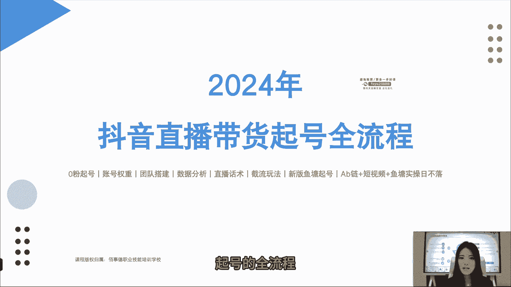
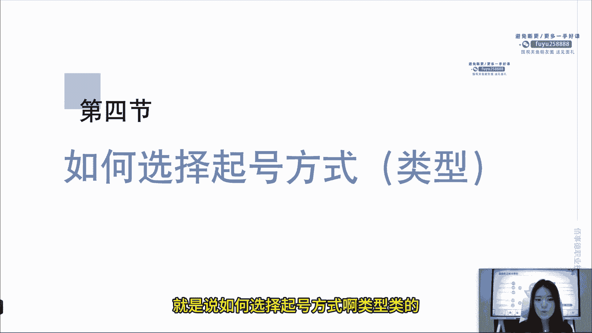
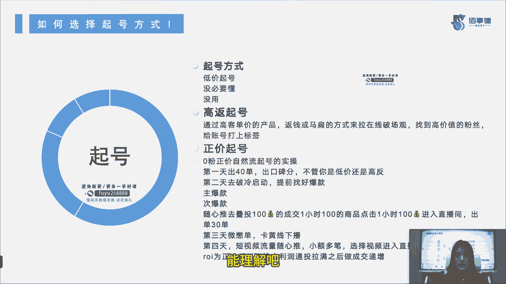
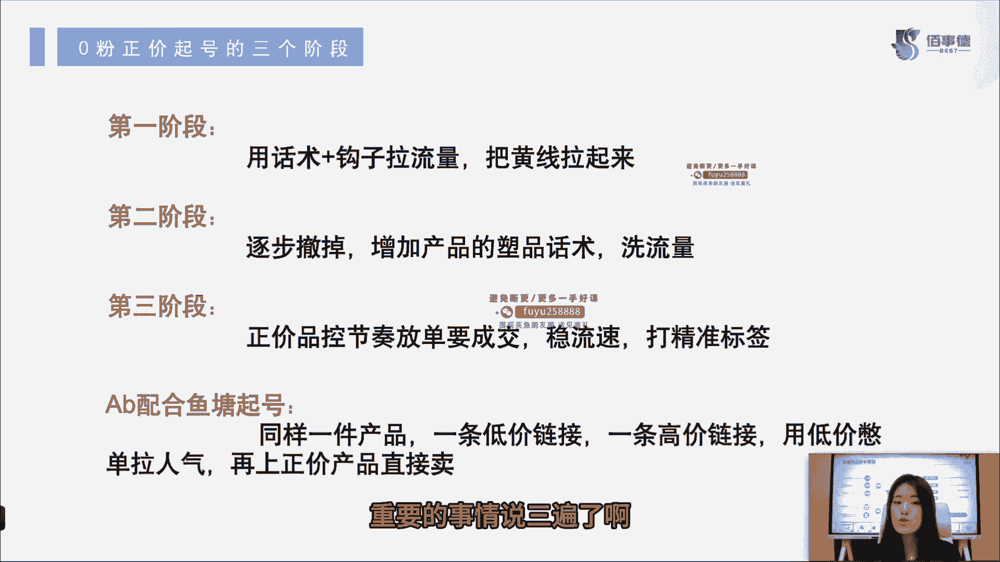
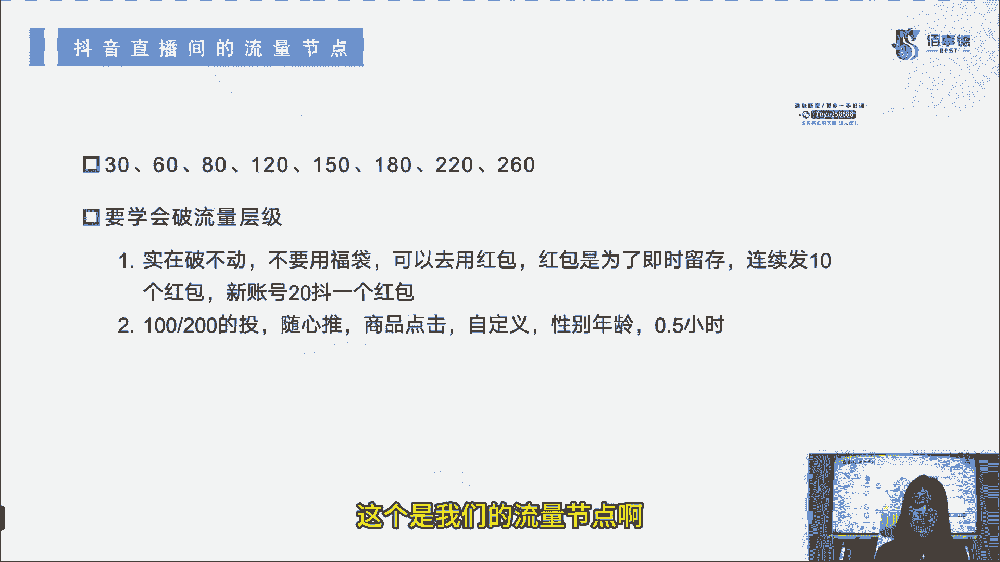
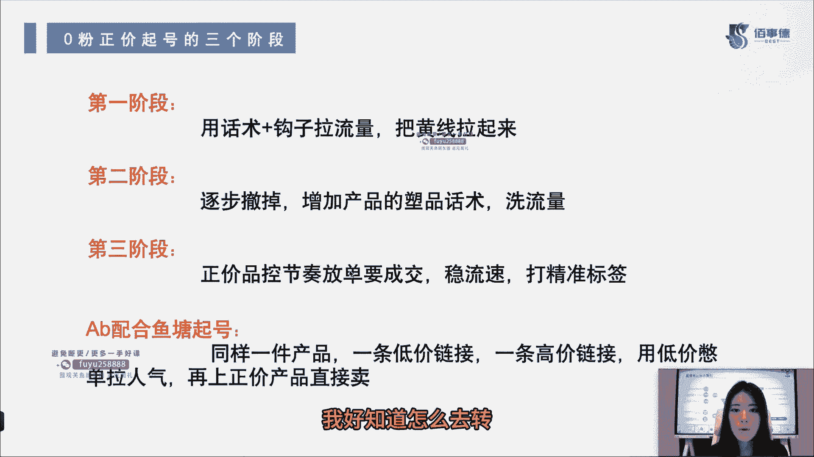
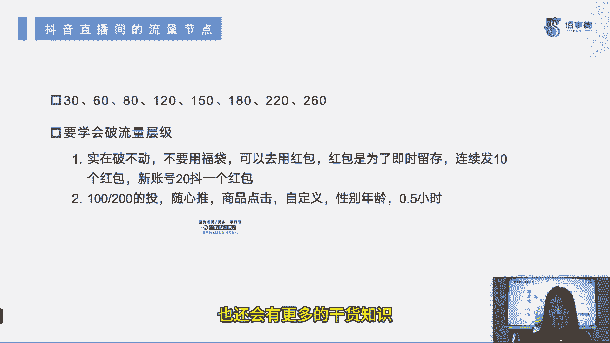

# 2024年抖音直播带货起号全攻略课程教程 - P4：4：第四节_新账号如何选择起号方式_ev - 念念好课 - BV1M74TefE5m

哈喽同学们大家好，我是百事德职业技能培训学校的六六老师，那么今天呢我带着大家一起来，接着看我们的2024年抖音直播，带货起号的全流程。

小白们跟我继续往下学习啊，我们的第四节内容好，那么第四节内容呢就是说如何选择起号方式啊。

类型类的起号方式里面呢有一个低价起号，也是很多人问的，哎老师什么是低价旗号，在这里啊，我给大家讲，就是大家没必要懂，因为没有用，能理解吗，所以说这低价起号我们忽略不计，以后也不要再有人来问我了啊。

老师怎么低价起号，这个没什么用的啊，你起不起来号的第二个高反起号，什么叫高反起号，通过高客单价的产品返钱，或者是麻扁的方式来拉我们的在线来破场关，找到高价值的粉丝，给我们的账号打上标签，这个叫高反起号。

是我们直播过程中的起号方式了哈，能理解吧，什么叫码贬啊，我也不用多说了，你们大概看这个字能知道啥意思啊，小白们，第三个也就是正价起号，正价起号呢也是我们现在比较常见，比较常用的零粉正价自然流起号的实操。

第一天呢就去出单，40单的话就会能出来，你的口碑分，不管你是低价还是高反，第二天呢我们去破这个冷启动，也就是说我们把冷启动破掉，需要微付费了，我们提前要找好爆款，主爆款是什么，次爆款是什么。

然后是做什么呢，随心推，我们去叠投，叠投多少，第一步先投个100的成交一小时，第二步再投一个100的商品，点击一小时，第三个再投100的进入直播间，出单30单左右啊，第三天微微跌单卡黄线下播。

第四天短视频流量随心推，也是小额，多笔选择视频进入直播间的承担测试ROI的，如果RY为正，那么千川直接卡利润啊，通头拉满之后做成交递增，很多人说老师我不会投钱穿，我不知道怎么去看利润啊。

不知道怎么去付费，没关系，我们后面呢百世德也会给大家讲怎么去付费，起号怎么来投钱穿，这些呢后面都会教大家不用担心的，这就是我们的这个起号方式了，低价起号没必要懂高反起号给大家说了，主要是通过码贬的方式。

是不是，第三个就是我们最常用的正价起号，那么我们后面呢会涉及一点点付费内容，如果说第一天出不了40单怎么办，没有关系，我们可以先提前养鱼，或者说实在实在出不了，那我们就尽力了好吗，能理解吧。

这个地方我不再赘述了。

往后走了啊，零粉正价起号的三个阶段都是啥，第一个阶段用话术加钩子来拉流量，把我们的黄线给拉起来，第二个阶段逐步撤掉，来增加产品的素品，话术来洗我们的流量主要是什么呢，塑造我们品的价值啊，是不是。

那么第三个阶段是什么，正价品控节奏，放单要成交，稳住我们的流速，来打上我们的精准标签，标签这个事啊，好几节课一直都在说了，我就不再赘述了，大家都知道精准标签是啥了哈，打精准标签稳流速，不需要再赘述了吧。

这第三个阶段是不是很重要啊，那么AB链配合鱼塘起号是什么啊，给大家说一下，同样一件产品，一条链接是低价链接，一条链接是高价链接，两个链接在直播过程中来回转换，给用户造成一种价格的反差感。

我们管它叫ab链接，那么我们到底怎么去用它呢，用低价来憋单拉人气，再上正价品来直接卖，有的啊是由低转高，有的是由高转低来拉流量的都有，看你的货，你的品需要怎么来去配合它能理解了吧。

但是我们这回说的是正价喜好，所以我们用的是低价来憋单，再上正价来直接卖低价品，这时候你说放单吗，不放的啊，各位兄弟姐妹们，不放的，能理解我的意思不，我们只是用它来拉流量，是不放单的。

嗯重要的事情说三遍了啊。

我们接着往下进行了，那么抖音直播间的流量节点都是什么呢，给大家说一下，30人，60人，80人，120人，150人，180人，220人和260人，这几个数一定要记住，这几个流量层级挺难破的。

还有什么流量层级比较难破，0~20人，有很多人现在还是个位数，开播来找我，老师哎呀，怎么办，我们直播间流量额个位数，那你人货场可能也真的出问题了，我们回去找找问题。

那么我们小白们一定要学会去突破流量层级，如果实在是破不动，老师哎呀，就20多人，三神是真上去了，怎么办，30人到60人也真上不去了，怎么办呀，老师你说我80人，我怎么就破不了百呢，没关系。

但是这个时候我们不要用福袋，可以去用红包，红包是为了及时留存的，连续发十个红包，新账号呢是20个抖币，一个红包啊，还有是什么呢，我们可以100或者200的投小店，随心推投什么呢，商品点击自定义性别年龄。

然后投0。5小时，也就半个小时，100或者200的，那么投啊，这个目的是什么，再给大家最后啰嗦一遍，这个的目的也是为了撬动更大的自然流量对吧，这样就能破流量层级了，能理解了吧，这个是我们的流量节点啊。

要学会去突破它，那么AB鱼塘啊，我们现在说的是正价起号，给大家插一个我们题外的啊，也是我们的AB链，还有什么呢，由高价转低价的可能啊，我们这个低价链接才是我们的正价，那么我们高价突出的是什么呢。

突出的是我们品，对不对，突出一下它的价值，比方说这口锅原价其实我卖啊，我就准备卖79块九的，但我可不可以给他做一个，299或者229的链接，来说一下我这锅其实有多么多么好用，你说我在直播间里。

我总得夸夸我自己的产品吧是吧，我各项内容诶，我塑造品的价值的时候，我全都说出来了，我就让别人觉得，这口锅确实就值299或者229，可是呢我跟大家说了，今天啊我们就是福利或者怎么样啊，有活动为了留住人。

是不是本着我们大家薅羊毛的原则，给大家就直接开价79块九，这时候再转换链接，这个是由高转低的玩法，能理解吗，但你一定要记住，不要是说我原本这个锅就卖299的东西，哎我今天为了拉点流量。

我一下把它跌破底价，79块钱卖了，好是有很多流量也来人了，诶成交也给你成交了是吧，大家都觉得非常值，但你要知道这些人成交的都不是你的精准流量，为什么他们全部都是来薅羊毛的，你说你亏价卖这么多东西。

你标签标签没打精准，你光来了一波泛流量，薅完羊毛，人家走了，不会再来买你的锅，第二次，你说你这个旗号算成功吗，肯定不算啊，对不对，流量也没洗明白，钱钱也没赚到，你说那我直播的意义在哪呢。

所以说大家一定要想好怎么去用，到底是由高转低还成低转高好吧，这是ab链接的问题啊，以后呢也不再给大家强调这个AB链接，鱼塘喜好的问题了，所以说大家现在一定要记清楚，记牢了，把这个逻辑给他搞明白。

后续你自己在直播的过程中啊，我真的需要用到这个高价低价转换的时候，我好知道怎么去转。

我好知道我话术怎么去做好，那我们第四节的内容呢就到这里就讲完了啊，内容其实看似不多，但是需要大家去思考的东西很多，所以说啊建议大家真正有了实操过后呢，可以再回头来看一下这第四节课啊。

好知道我们这个玩法到底应该怎么样去玩，我们接下来呢也还会有更多的干货知识。

