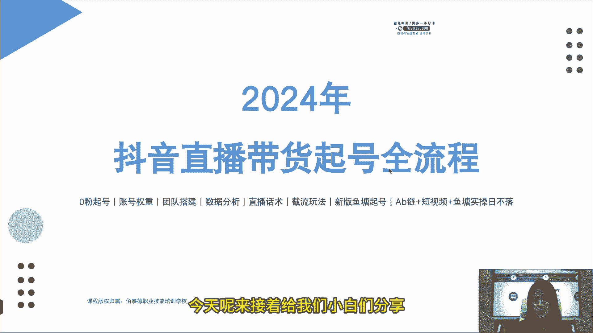
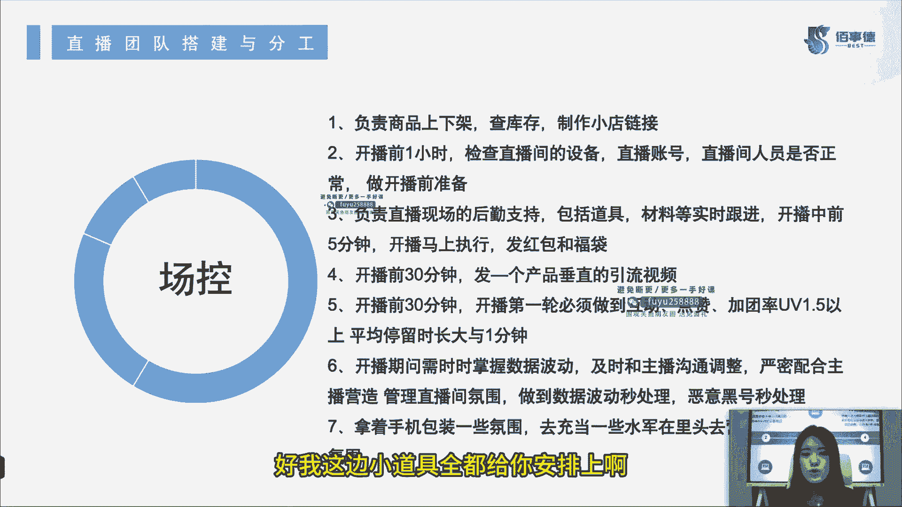

# 2024年抖音直播带货起号全攻略课程教程 - P5：5：第五节_直播团队搭建与分工_ev - 念念好课 - BV1M74TefE5m

哈喽大家好，我是百事德职业技能培训学校的六六老师，那么今天呢是我们2024年抖音直播，带货喜好全流程的第六节课，今天呢来接着给我们小白们分享抖音的直播。

带货干货，我们接着往下看，那么我们的第五节内容呢，就是我们的直播团队的搭建和分工，要知道啊，要做好一场直播，肯定是要有很多人的，可能站在镜头前的只有主播一个，但是直播的团队呢其实有很多的分工。

所以我们接下来往下看一下，好，首先第一个呢就是运营，运营在直播团队里啊，首先我觉得他是一个比较重要的角色，因为除了主播之外，这个整个啊我们的幕后，最重要的这个人就是运营了，那运营需要干嘛呢。

他需要懂得选择主播，因为它是整个账号的搭建者，相当于良禽择木，而也就是说我们的运营要懂得哎，我直播间搭配什么样的主播好，应该选择一个什么样调性的主播，这是我们运营需要做的第一件事。

那第二件事呢就是需要懂得培训主播，我们要知道这个主播的优缺点是什么，比方说这主播表现力很强，那他可能口播不是特别好，那我们可以就针对这个主播的口播来进行培训，那比方说这个主播不会逼单，不会T单。

那么我们就重点培养这个主播，逼单和T单的这个转化能力，第三点，要懂品控，要懂爆品，要懂牌品，也要懂测品，说白了人货场都和你运营有关，是不是主播培训完了，你得看我货了吧，是不是看一下我们的品控怎么样。

能不能打成爆品，如果说哎我们这个油油品啦，我们拿了很多品一块来的，我选了很多，那么我们怎么去排品，是先是这个引流品啊，还是先是爆品啊，到底是怎么样的，符合我们直播间调性，这个品能不能爆，怎么去测。

也是我们运营应该做的，第四点，要懂得付费，要懂得数据，根据我们数据的变化来调整直播节奏，也就是说运营其实它在整个直播过程中，它都是有一个大屏在看的，现在呢很多主播他也会看。

那我们管这一类主播叫运营型主播，他会通过这个直播数据变化，来调整自己的直播节奏，其实这样的主播是现在啊，我们目前所有的主播里面最顶的一种，能理解吧，好第五点，运营需要什么执行力强。

要善于捕捉平台的新规则，今天平台出了这个词儿就算违规了，那么我们的运营一定要及时告诉主播，我们这个品今天这个词儿不能说，因为平台有新的规则违规了，或者说马上到315了啊，这一段时间内。

平台一定会更规范我们的这个主播言行，你在直播过程中，你是不是不能说这个我们功效类的东西啊，以前可能还说一个掉肉肉，紧肉肉紧致我们的肌肉也好啊，这些话，但是可能在315期间，平台不允许你说。

那运营你要及时提醒主播，叫他不要违规，捕捉一下我们平台的新规则是什么，第六点要懂得拆解同行的玩法，同行是怎么玩的，可能人家就爆了呢，是不是，那运营你要知道我怎么去来拆解它。

我来测一下它这个东西是怎么报的是吧，我善于借鉴和复制，最后复制到我们自己的直播间，并且呢我们有自己的主播嘛是吧，形成一个自己的调性啊，第七点求知欲要强，时刻居安思危，不是说我今天直播数据好。

明天直播数据好，我连续五天直播数据好，以后也会好的，毕竟我们不是大牌子，不能做到人尽皆知，那么我们就需要稳定我们的直播模型，稳定我们的直播数据，这些不是说运营天天坐在那，什么都不管就能完成的。

运营要有一定的求知欲，时时刻刻，我们要知道怎么样去不断的提高我们的转化，哪怕是千人直播间，我们有一天也会变成万人直播间，万人直播间有一天可以变成10万人直播间，说不定哪一天就做到头部了，是不是。

那我们也算是头部运营了，第八个管理要果断，要懂得带领团队复盘，团队哪里出现问题及时复盘，下播之后要用运营的火眼金睛，一下就看出来今天直播问题出在哪是吧，要怎么去改善，这都是运营需要做的。

我的分工好，那我们接着往下看，编导编导主要干嘛呢，第一点完成人设的确立和内容的规划，不管是直播也好啊，还是我们这个短视频也好，都要制定一个账号的阶段性运营方向和计划，作为编导来讲，你就是这个账号的导演。

他接下来要往什么方向发展，是你这个导演来决定的，第二点，编导也是他最重要的内容，我觉得啊是短视频的内容和策划，包括选题内容，脚本和分镜等等，这些都是由编导来做的，要编要踩，然后呢你还要把这个视频拍好了。

剪好了，统筹短视频拍摄工作，今天这个主播有没有时间，是不是，那我是不是需要找一个，同样符合我产品调性的主播，来进行这个工作拍摄，那比方说今天我们这个拍摄工作已经完成了，可是呢账号内容不理想。

那我是不是应该换一种方式拍摄，我也需要通过我自己的个人努力，去找点爆款来呀，这也是编导的工作内容，第四个按时高效地完成视频剪辑，内容一定要按时发布，一个成熟的账号，内容发布的时间是固定的。

那么我们的内容到底什么时候发布，这个也是编导来定的，是不是这个需要你来发，一定要按时高效，因为我之前也说过了，内容才是王道，才会带来流量，所以说内容好不好，全看你编导了啊，第五点。

根据视频数据的结果复盘优化，持续进行短视频内容策划，今天这个视频数据不好了，我们是不是要换一个，今天你在直播间里做这个场景，那可能观众不买账，我平时都看你直播了，我看你短视频时，我就想看点别的。

我可能就需要换一个场景，那我今天这个产品哎大家都看腻了，购买力也差不多到这了是吧，明天马上要转品了，编导应该干嘛，我应该拍摄新的产品的预热视频了吧，是不是，所以说持续进行，我们短视频内容策划也非常重要。

这是我们编导的工作内容，接下来看一下我们主播啊，主播东西比较多了，主播是什么呢，他是我们一个直播间的门面。

对不对，主播就是我们直面用户的第一个人，只要不是特殊产品或者特殊的直播间，一般呢都会选用咱们高颜值的这个靓男俊女。

但是我刨出什么特殊直播间，比方说工厂类型直播间，你这时候放一个俊男靓女进去啊，你这一一进去一看，哎，你这不像是工厂的人。

那你可能就没什么说服力，那这种直播间他可能是说服力大于他的观感性，那可能哎这个时候你这个俊男靓女啊，靓男俊女，你就不适合在这直播间待着。

是不是还有什么呢，身高体重要符合产品特点，我就卖大码女装的，你说我找一个90斤的小姑娘去给我剥合适吗，肯定不合适啊，所以说这个啊也是很重要的。

还有什么呢，口头表达能力一定要强，应变能力要强，抗压能力要强，主播需要有自己对产品和直播间的独特见解。

你能够主导或者能够参与选款卖点，归纳产品展示方式，直播玩法策划复盘优化等等事项。

你主播其实都要会的，这也就是我说的，为什么现在都在培养运营型主播，你光靠平播的主播，你一点数据不会看，你到后面都没市场的，你就是这样的话。

你运营也会骂你呀，包括我们现在很多人，我们没有这么大的团队，主播集是运营，是不是有这样的，我相信屏幕前的你肯定有的啊，所以说我们主播要有要具备这些能力。

而且还要有优秀的状态调整能力，语言表达能力，并且能够善于总结，持续优化自己的一个能力，这个优化自己表达是什么呢。

当然是你各方面的各种能力，包括你的话术问题呀，包括诶比方说我今天我觉得状态可以再好一点，我的话术可以做的更好一点。

是不是，甚至我有自己个人的驱动性，我可能不太会选款，那么我跟我的运营自自己，我们两个商量一下，怎么去再选款，然后我自己怎么来做一个直播脚本。

这些都是你主播该做的事情，那在直播过程中呢，主播一般出现的问题是什么呢，在线人数激增的时候，没有办法承接流量，直播间的节奏出现偏差。

黑粉出现的时候，你的临场反应，还有粉丝提出专业性问题的时候。

你可能没有办法解答，产品介绍卖点的时候是错误的，而且是很混乱的。

特别是服装穿搭出现了明显问题，这个时候观众是不买账的，你穿的不好看，人家凭什么要买你的衣服呢，在直播间里号召你的粉丝的能力很差。

人家给你粉丝做不了数据，就证明你这个主播话术和表现力，一定一定有问题，还有什么呢，催单B单付费能力弱等等，各方面的问题可能都会有。

这些啊，都是在直播过程中可能会出现的问题，当然这些也是主播应该持续优化的一些能力，关于主播的分工呢，其实很多也很杂。

因为主播说实话在这个直播间里很重要，你相当于是卖这个产品的推销员，怎么样把我的产品卖出去，是你需要考虑的第一样的内容。

但是就是这个怎样去卖，他又分了很多很多的小点，你可能都要知道，所以说我们主播要想成为一个好主播，真的很困难，所以这些点呢大家一定要去想，一定要去看，如果说自己有不满足的地方，一定要及时的去调整。

每一个人，我相信啊，只要迈出了第一步，都能成为一个好主播，最难的就是你去尝试的从0~1的这第一步好。

接下来我们看副博，哪怕你说有的人啊，我从主播干起，对我来讲跨度太大，那我可不可以从副博干起，可以的，跟着一个好主播去学习，是不是你进步最快的方式呢，那么复播在直播过程中充当了什么。

充当的就是你主播好闺蜜的角色，我这时候灵敏度要很高。

激情度也要很高，我配合度更是要非常好的，优质人才才是复波的不二之选，可能没有那么多技术性的东西，但是要求我的状态是实实在在拉满的。

那么在主播介绍吃力的时候呢，我要制造话题，我要烘托气氛，主播在停下来的时候，我要把我这个停下来的内容，我要帮主播补上去，粉丝跟主播说，要看细节的时候，我要第一时间把产品给到近景。

我就需要帮着主播来跑前跑后了，对不对，那么在做福利的时候呢，富国是要干嘛，详细介绍规则和抽奖的操作，相当于其实直播间的整个流程和操作，你复播要比主播还要了解，主播也会有失误的时候。

这个时候你副播要及时顶上。

你们两个就是好闺蜜，你要帮你的好闺蜜来擦屁股，直播间的粉丝有任何问题都要冲到第一线，快速解决，明白吧，因为术品可能不用你，但你说我能不了解品吗，不可以，主播要了解的东西你都要了解。

但只不过可能是我们能力范围跟主播还跟不上，但是我的脑袋一定要灵活啊，我现在粉丝面临的这些问题，直播间发生的所有问题我都知道怎么样去解决，这才是一个好的复播，那么复播在直播过程中会出现什么问题。

大家可以自己对号入座一下啊，激情不足，没有办法吊起直播间的氛围，死气沉沉的是吧，第二点和主播配合不佳，要么就是太有自己的主观能力，要么就是太没有事情的辨别能力啊，没有问题的辨别能力。

还有呢产品细节展示不清晰，优惠券发放不及时，主播这个时候想要留人了，告诉你发放优惠券，你鼓捣20分钟你都没发出来，这时候人是不是全走了，还有什么呢，问题回答或者解决的不够及时，主播在奖品过程中。

他不可能时时刻刻都盯着公屏，一直不停的在看，然后还不停的回答问题，那他是机器人主播，今天说哎，我们今天给大家包邮，还带运费险，是不是来把这个道具直接拿上来了，包邮还带运险险，结果你给的是一个错误的道具。

那传递到误错误等等问题是不是不应该发生的，但是这些啊都是复播，可能会在直播间出现的问题，为什么呢，因为你需要做的工作啊比较繁杂，可能呢会有出错的问题，所以说这个时候复播一定要听清主播在说什么。

你也是全程要跟着直播走的，脑袋一定要灵活，动作一定要快，一定要敏捷，东西放在哪儿，你腹部要比谁都清楚，那粉丝提问的问题应该怎么去解决，你也应该要比谁都清楚，话术哪里出现了问题，你也要背的比谁都熟。

主播在停留有卡顿的时候，你才能及时的补上去，产品的卖点，你也要像主播一样熟练，才可以粉丝用户有问题的时候，你才能熟练的解答它。

这是我们复播的工作内容和这个分工，可以理解吧，我们接着往下看。

接下来就场控了，场控负责干嘛呢，就是我们说的中控啊，现在有很多人啊，就是出去面试，就说面试中控，为什么呢，因为前段时间在抖音上非常火的。

就是我们电商捧哏，不知道大家都知道不啊，电商捧哏他们就是去面试这个了，说这个很适合话多的大学生，但实际上中控这个活真的有这么轻松吗。

你真的是在直播间喊喊就能有钱赚吗，肯定不是的啊，我们正常的场控是干嘛的，首先要负责商品的上下架，要查库存，要学会制作小店链接，懂吧，这是技术性的问题了，不是说我们光喊喊口号就行了，第二点。

开播前一个小时要检查我所有直播间的设备，为什么叫场控场景的控制，控管人就是你直播账号，直播间人员是否正常，开播前该如何准备对吧，场控你看一下我的这个账号还能开播不，我今天这个小店分数够不够。

不会被封了吧，我直播间设备还能不能用，这是我们场控的问题，第三个负责直播现场的后勤支持，包括我们的道具材料实时跟进。

在开播中的前5分钟，你要拿着设备干嘛，你要拿着电脑要进行发福袋，发红包，留住观众，这是一个成熟的直播间，前5分钟需要做的事儿，上上人嘛，对不对，我可能主播不是上来就开始奖品的，我们得给人一点进来的时间。

第四点开播前半小时要发一个产品，垂类的引流视频，这个也是场控来做的，那引流视频谁拍的，是我们编导拍的对吧，那第五点开播前半小时开播，第一轮必须要做到互动点赞，加团率UV1。5以上。

平均停留时长大于一分钟，这个你场控就是要和运营去沟通了，第六点，开播时间内需要实时掌控我们的数据波动，及时的去和主播进行沟通。

进行调整，严格严密地配合主播营造管理，我们直播间的氛围，这个时候人多了，直播间氛围应该是什么样的，人少了，直播间氛围应该是什么样的。

对吧，我没事，我还得喊两嗓子，对不对，这都是我们场控该做的，做到数据波动秒处理，也就是说我一看这数据有问题了，哎运营告诉我这边数据有问题。

主播应该调整什么了，比方说要调整话术，我场控马上知道我应该去做什么，是不是，比方说哎我们要换一个套路啦，好我这边小道具全都给你安排上啊。

主播你不用担心，如果说你需要帮忙喊啊，你需要我们的电商捧哏，是不是我这时候也可以帮你喊两嗓子，如果说现在是需要鱼塘禁渔好，那我就一个人负责几个水军，如果这个时候啊有黑粉恶意的黑粉，恶意黑号也得秒处理。

因为整个这个电脑在我手里，是不是我能看到每个人发了什么评论。

然后呢，我还负责上下加链接，所以说这边哎如果有黑粉评论了，主播马上给我一个信号，我这边马上把这个黑粉给他删除掉，或者把他拉黑掉，第七个呢，拿着手机包装一些氛围去充当一些水军，能理解吧。

就是我们所说的电商捧哏了，我们来营造一个氛围，这个一方面是直播间内的氛围，一方面也是就是我们手机里，屏幕里看到的这个氛围，当然了，水晶手机意思就是说哎，比方说主播问有没有人想要好，场控面前摆了六台手机。

每一台都马上打，想要想要想要想要，这就是我们直播间的氛围，也就是我们的水军，这是我们场控的工作内容，好我们接着往下看了啊。

投手投手也非常重要，而且找到一个好的投手很困难，所以说很多运营都自己兼任投手，或者有很多主播啊，他就是运营也会，他投流也会的，现在大家都是属于斜杠青年，都是多类人才了哈，那投手的主要工作是什么呢。

工作内容就是为直播间投放广告流量，不管是直播间的画面，短视频或者是引流短视频的准备和发布，或者还是巨量千川和抖加的投放，你都需要做好及时的输出，你一定要切记啊，要跟主播同频，你要懂主播，懂产品，懂牌品。

那所以说为什么说很多运营也是投手，因为他这些他都懂，优秀的投手一定要会控流速，知道流速的轻重缓急，比方说人流量少，这时候主播着急了，可是你身为一个投手，你就知道此时此刻不适合投流，那你要知道诶。

我怎么去跟主播说，对不对，我知道这波流量是什么时候来，我知道什么时候该去投，然后呢现在应该做什么，现在可能就是稳住现在的人，我们把他留住就好了，这就是你投手也应该干的事情，拿捏好整场的流量配比。

到后期流量上来的时候，要跟主播进行沟通，要他能接得住流量，还有运营一块沟通，今天投多少，明天投多少，后天投多少，你要对这个直播间也有非常清晰的认知，是不是这个直播间比方说承载不了5000人。

我就做不到千人在线，因为这主播能力也不行，我们的频可能也不行，那我才知道我应该投多少呢，大概能烧出去多少，我ROI大概能跑到多少，这是这个投手对这个直播间，还有他自己的一个认知啊。

这是我们投手的工作内容好，那关于直播团队的搭建和分工就这么多，你们也需要看一下诶，你需要打造一个直播团队，我需要几个人，一般来讲啊，一个直播团队可能三个人就够了，就像我说的，有很多人身兼数职主播。

他既是这个产品的拍摄者，他又是这个产品的营销者啊，那可能我们的编导呢就是我们短视频的策划，拍摄等等一系列的，或许他还跟着点儿场控对吧，那我们的运营和投手呢就可能是一个人。

也就是说最少最少一个直播间的团队搭建，至少需要三个人，如果说我一个人来做这个事的话，那我还是建议你找到靠谱的搭档之后，再来做直播，因为你一个人，你一边上下架链接有点困难，还要去进行直播。

还要去拉黑粉丝啊，什么这些等等，一系列的场控问题可能会比较麻烦，这就是我们直播间团队的问题了啊，不再过多赘述了。

还有其他的干货呢。