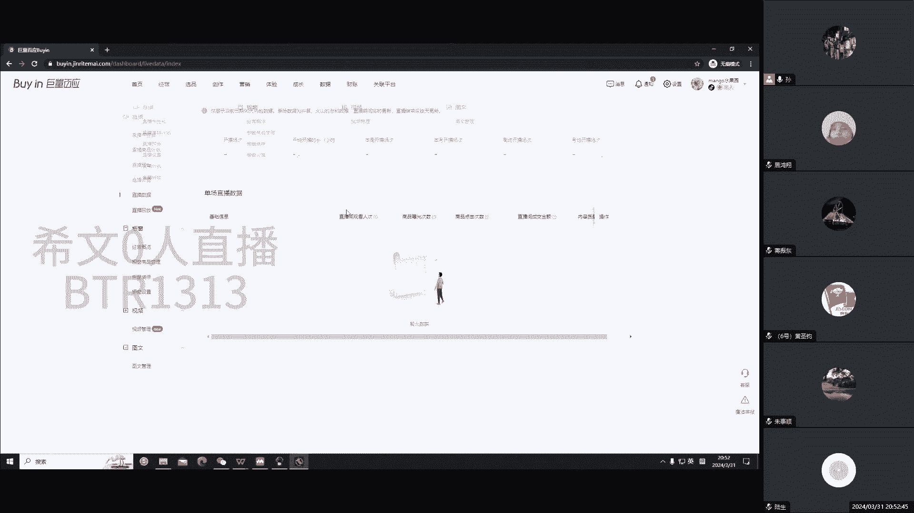
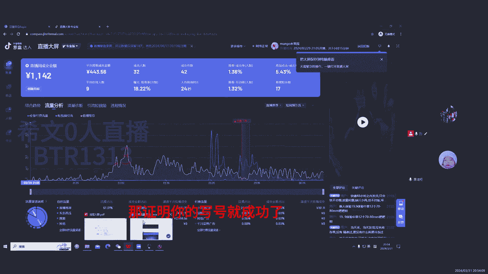
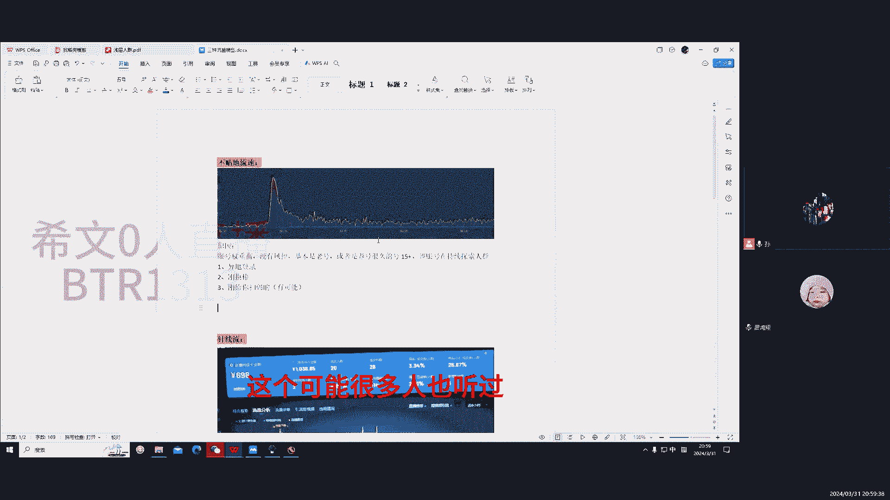
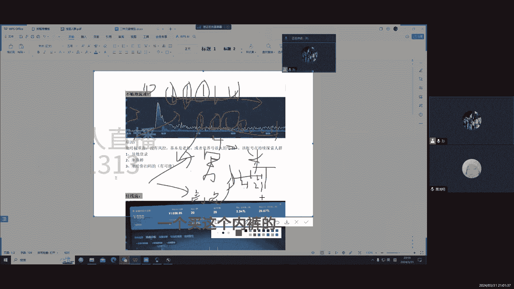
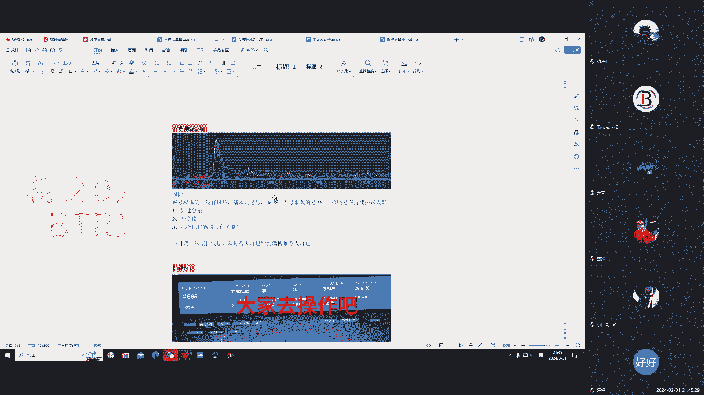

# 2024年抖音直播起号无人直播起号的基础流量模型，保对你起号有帮助！ - P1 - 无人直播中的纯白 - BV11M4m1R7Rs

第六数啊，大家我也看了啊，这个就是不贴地对吧，就偶尔会有一个一两个贴地的，无所谓啊，无所谓啊，总体来说它都是沿着这个最低的这个线啊，去去去去用了，然后那个呃就是这个哈，另外一个就是这个呃针线流啊。

我们说这个针线流，这就可能大家经常见啊，这大针线流啊就隔几个来一个啊，上来再下去，或者是密集度比较高的Z线轴啊，这个我们称为ZZ线轴，另外一个就是我们说的断流啊，断流啊。

这个都是我们四大实账号中运行的一些现象，给大家截图看了看，就是有有推荐，但推荐推荐啊，突然有着很长的一段时间没有推流啊，这一两个一两个的这个假流量推进来啊，或者是直接就上去之后再也没有流量啊。

这个是断流啊，就是嗯基本是这三种流速啊，就是我想问一下，就是大家还有没有，就是不知道怎么看这个流量在哪了吗，给大家看一看啊，这个流量模式在哪看啊，嗯就我们正常播正常播对吧，我们在这里会有一个大屏啊。

会有个大屏监控，还有一个大屏数据啊，我们点大屏数据，然后看看这个。

大屏数据啊，大家是来专业评里边，专业评里面有个流量流量分析，来流量分析之后啊，这个就是我们整体的这个整体的，这个这个流量啊，流量模型在这里，然后那个声音能听到声音吗，大家反对，那就是你的麦的问题啊。

那哥们卖的问题，所以呢这个流量模型就是这样啊，在这里看在这里啊，就是在我们正常进来，可能是不是这个不是这个流量啊，是综合趋势啊，然后我们点击流量分析啊，这里面可以选对吧，我们看自然流的全部自然流对吧。

所以我们全部自然流嘛对吧，主要看直播推荐嘛对吧，付费流量也可以看都可以看的啊，所以说这个大家都都可以去点进去看一下啊，这是我们正正常的一个一个版图是吧，就是我可以给大家讲这三种模型。

你遇到了怎么打怎么打，怎么去解决这个问题，尤其是做污染啊，做污染你怎么去把这个这个东西给它解决掉，解决掉啊，如果说你能解决掉，那证明你离信号就成功了啊。

稍等我看一下信息啊，看是不是有人没听到啊，应该是这个小哥回复了，应该是他的问题，我们讲第一个不贴地柳树啊，这不贴近流速，它的原因就是他的账号权重比较高啊，没有什么风控这种的，基本就是养的老号。

但是一场没开播过的啊，我没说，我没说开播了，就是你用那个抖音号用了很长时间对吧，实名认证了也很长时间，然后包括你有购买记录啊，然后有这个呃等等啊，这个关注啊，每天活跃在线啊都有啊。

然后这个我们认为其实老号的权重比较高啊，另外一个就是养了很久的一个号，大概多久呢，四五天以上，四五天以上啊，或者有的人养号养的很好，七天也能够也能够，这个主要是看你养号的一个呃。

一个这个一个一个思维在里边对吧，然后这个另外一个这种流量，绝对不可能是处于风控的，也不可能属于一，也不可能属于那个异地登录的，对吧，二那个刚换完了，当然是刚给你扫码了，基本也是也这几种啊。

不可能达到这种流速，不可能达到这种流速，什么叫地登录啊，啊你说让你哥们儿少一个号，他在南京啊，你在河北或者河南或者在北京，然后他就把那个伴侣的二维码直接给他了，然后他就这个这个什么了。

他就给你上网装上了，这个肯定是异地登录啊，包括这种换码抖音号的，就比如说南京呢，他用这个验证码登到你北京的手机号上，我们说这是一定的路啊，这账号通常是封控的，就是你不能说就是这个这个模型啊。

然后另外一个就是刚换绑的啊，什么意思呢，你比如说你这个手机，A手机换到了B手机上对吧，你或者是这个一哥们的号啊，然后那个挪到了你的手机号上啊，我们说更换保障啊，然后或者是你有一些其他的行为在里边呢。

你比如说一啊你的手机号的变动对吧，也称为换绑是吧，你底层的这些绑定的东西再换，比如说你绑定的微信啊，绑定了这个呃支付宝号啊，嗯银行卡号啊，手机号啊，换了啊，基本也是风控了，不可能出现这种模型的。

另外一个就是康康给你扫码的呃，有可能出现这种东西，有可能出现有可能会流量很差，你比如说我们一个新的电脑，新的电脑我买买回来了，啥都下得好，大驴下载好了，你说这哥们呃，尤其是什么呢，就是你用的这个号。

他没有在你们家的网络上呆过，也就是你比如说我扫码登录的这个号啊，他没有连过你家的WIFI啊，没有使过使用过一个区域网，对于这个网络它是很陌生的，它是它是很陌生的，然后另外一个就是这个。

就是那个就是我刚才说的这个，你知道你干嘛，哎这个你过来扫个码啊，你喝着喝着酒上扫个码来扫个码，然后那个其实他也没在你家刷过几回，你家的WIFI要扫码了，不可能达到这种哎，有可能达不到这种程度啊。

基本就是你还是就我没推荐，就是你登的这个号，你要养完号之后，第一你不要环保对吧，啥都不要动啊，然后那个也不要让这个你朋友乱给扫码对吧，你这个异地登录啊对吧，这种很很容易出现风控。

尤其20年之后很容易出现风控，这个包括异地登录，这个也有相关的政策啊，抖音出来的政策，大家去看一看，这些东西都是打击矩阵式工作室的啊，这个抖音也发现了，有很多人搞无人啊，搞半无人啊，他打举债，我靠对吧。

一拖几一拖100啊，那账号怎么来，都是号商那里拿过来直接用的，所以说他们也要从这几个方面去给你规避掉，规避掉哈，呃回归正题来啊，我们继续讲这个流速，其实这个又是流速呢，这个我们说这个流速是非常好的。

我们起这个号成功率非常高，然后你在相关的节点去投流，投对了，那你这个账号恭喜基本是能够打成功的，然后这个账号是在持续的，就给我们来的，意思就是呃那个这个账号在持续的探索人群，持续的探索人群啊。

然后他是我之前讲过啊，这个可能很多人也听过。

我讲这个人群啊，判断人群什么意思啊，比如说他一次给你推十个人啊，我再讲一遍啊，不要嫌我唠叨四个人啊什么的，什么类目的都有啊，就是这个人他喜欢他，他想买什么类目的，就是你比如说我最近想买男装啊对吧。

他就认为我急切的想买男装，可能就给我安排进来了，当然这个也有想极限买买女装的，也有买其他的，这四个人，四个人之后放到你的直播间里，看你的直播间的反应，数据反应对吧，如果说你的直播间对他有一定的反应。

或者是让他停留了三秒对吧，多给你点个赞或者直接下单，这个都是你这个直播间对于这个流量，流量的一个模型做出了一个动态反应，那如果说你比如说我买当中的哎，这个直播间吸引我点个赞，或者吸引我停了很长时间。

那他就知道哎，你这个你这个直播间多半是卖男装的啊，卖男装的啊，然后后续再给你一波流量，然后这个流量假如十个人是大，大概有四个人都想买男装对吧，那四个人买男装的款式是不一样的，又想买西服的。

因为又想买短袖的，又想买买袜子的等等，又买买内裤的，然后其中啊有买西服的，对于你这个直播间做出的反应做出了反应，哎，就怀疑你这个可能更适用于这个西服，这个拿着这个西服品一看你。

然后同时它会关联你的商品数据啊，商品数据去总结一下你这个人群包啊，基本的人群猫相当于现在是半清晰的状态，半清晰的状态，然后持续的再给你写，多给你整到下一次，第三次啊，再给你推一波流。

四个人有四个买西装的，两个买短袖的啊，一个买这个内裤的。

然后看看你的流量的做出的反应啊，所以说我们成为这个账号持续的在探索人群，接触中，然后这个这个号啊，这怎么去打啊，我们说微付费去打，微付费未付费，当然有的人说啊，我也在偷偷微服费，流量流量也差不多。

为什么那个他咋的了，你这直播间就没有了对吧，你看我们这个也偷偷留了对吧，呃也也透露了为什么，为什么我们这个为什么，我们这个没有没有没有压着直播推荐走，大家有没有分析过，就是你投流的这个节点。

必须是你在流量起来的前提下再去投流，保证你的直播推荐有开头也去打打这个微付费，这样的话你的直播推荐才不会被压到手，让然后这个这个这个这种打法，就是其实有很多啊，有很多。

比如说现在我们这也是属于我们陪跑的内容啊，这个嗯我不能讲太深啊，讲太深，那个对于一些陪考学员就太亏了啊，我只能大概给你们过一下啊，你比如说这个我们的的原理是用微付费去打定。

去定这个这个这个直播推荐的人群，知道吧，我们用微付费的这个人群成交密度啊，来给到直播推荐啊，来洗掉这个直播推荐的人群，让直播推荐的流量啊更精准更精准呢，随着这个粗大啊，然后他也会持续的抬头。

然后直播那个微付费也起到了关键作用，但具体怎么打，什么时间节点打，打几笔，这个我不讲啊，因为我今天这个这个到了这个陪跑的时候啊，有消除啊，来给大家重点讲这个东西啊，怎么剪电脑，这个很关键啊。

那个你比如说现在我们打碎星退，有几种方式下单成交对吧，包括RY啊，然后等等啊，怎么打，打哪些打多样，老师什么节点档对吧，有些东西很关键对吧，什么我们要打几笔，什么叠头对吧，这个东西还是放到后面去讲啊。

我主要是讲这个后边的啊，这种大家遇到这种情况对吧，怎么去解决这个问题对吧，你比如说针线流他的原因，第一个我们怀疑这个账号的权重比较弱，没有养好对吧，你这个账号没有养好，就上去干了啊，不行，我回信息。

嗯然后第二个就是有换绑风控了啊，你这个以上我说的节点，你可能之前都做过啊，在一个周内啊，有可能都做过这些事，那你一个种类再去开播，往往是这种这种状态，可能密集度会高一点，但也是真限流。

时不时的给你推一个人来，时不时的给你推两个人来，这种我们是最难打的对吧，你直播推荐不抬头，我们也不敢打付费对吧，这种我们为什么不能打出付费啊，你们想我们直播推荐的人数是多少，你们想一下这个问题对吧。

我这个真限流肯定是没有这种流量，直播推荐的流量在前期，比如说我们以这个为节点，在前期退的人数要多对吧，他可能总得亏的人啊，也就十几个，那你打付费口子开的太大，那必然会压着直播推荐走。

或者是直接给你把直播推荐压没大，那是我们往往不想要的对吧，这种我们说这个洗的话也没有说特别好洗啊，当然啊就是也有也有啊，就是我们现在打的一种方法，就是出现了这种针线半针线半天地的流速啊。

我们这一般都是打几笔啊，拉两场，基本这个流量从他拉到了他，然后再打付费，再定位人群啊，就是我给大家排个顺序，都是这样，就是它就是断流也要首先变成在线流，它在变形变成不贴地流数。

就一步一步的去操作这个东西啊，不可能就是说你从断流直接给你干爆啊，那个概率很小，不说没有，不说百分百没有，这概率很小，概率很小，那这种我们去怎么办啊，我们去怎么办啊，第一个我们说是把简称。

它显示出去用浅层浅层激活你的流量，流量对吧，第一个第二个打搜索流，用搜索流，有刺激刺激自然流，对吧，第三个就是这个恰当，OP强打不配，做笔录笔接头，截图嗯，但这种往往就是拉的可能拉的长。

不是说一场两场都拉爆，可能需要多少，这么长，多层，然后另外就是我们要提前关注，对于风控，对于风控我们要提前规避啊，尽可能的氧化也好，良好，另外一个就是我忘说了这些，做这些一些步骤的前提下。

一定是在你的品在你的品比较好的话，在你的品比较好的基础下，屁股上啊，去做这些动作啊，然后选配要选好，这种正能量并存的，不要权不增加啊，不要选50家，如果说50加的这个这个这个品啊。

可能我们要拉两场才能拉回来啊，尽可能的不要选，不要选嗯，因为你如果说选了，有可能会带来假流量啊，但是你假流量来了之后，虽然你的这个针线轴可能不变成针线了，但是你去矫正人群的话，可能需要一个过程。

往往这个过程是非常难熬的啊，然后这个我讲啊，就是我们遇到这种情况怎么弄啊，比如我们这个微服费是深层打浅层吧，简称从付费人群包，给到直播推荐，好这波，好吧，直播推荐吧，直播推荐推荐吧，进气包啊。

那个有一个是申请啊，直接打这个成绩，其成交密集度啊，从那个用付费来定这个成交人群画像，来把人群画像给到直播推荐的那些画像啊，来刺激直播推荐的成交啊，然后来从而定位你直播间的分析模型啊。

基本是这个是未付费的一个思路啊，然后那个这些流呢，因为我们没办法打这个微服务费啊，你比如说这个我们说第三种啊，这个我说我不想第三种情况下对吧，我没办法没办法打这个微服比，那怎么办。

我们只能从浅层来打县城啊，而且以前也听过很多课对吧，你比如说别人说的，别人说的这种，就是比如说像这个人货场，你的主播要点对点点对点就是前程啊，那前程包括什么呢对吧，我这个也给大家整理了一下哈，第一个哈。

你首先要看到把我们的一个这个，我这里也写了几个啊，一个是人群对吧，你你从上从下往上做啊，那么首先我们要拉停留对吧，进来的这个停留是吧，因为这个进来的瞬时停留很关键，它有一个代码的机制在里面对吧。

你的直播推荐对于用户的吸引度，叫其他直播直播间，它的对比是什么样的对吧，它有一定的赛马啊，如果说给你推十个人，一个人没留住是吧，一个人都不想看，直接给你发图了，那你这个流量会越来越差，越来越差对吧。

你证明你的直播内容很差啊，那我们这时候就换品换素材，换换数度，换一个一个的去解决这个问题啊，另外一个就是这个包括点击点击进入啊，你比如说这个我们刚才看的啊，呃我们去直播数据里面去看啊。

假如说我直播曝光1万个进场控啊，进进进进场内场外400个，你说这个你直播间是好还是坏是吧，人家是曝光1万次进来5000人，那你的数据肯定比不上人家了对吧，但同时你的转化人群也是不精准的。

所以说我们这个曝光曝光点击率啊，也要去增加，那怎么增加对吧，还是素材的问题，还是素材问题啊，然后那个草这个这个就是我刚才讲的，就是他就是顺势停留，打闯关对吧，然后另外一个啊我们做完这些，这是最基本的。

你做完这些再做什么，在做这个相关的关注互动是吧，关注和互动，就比如说我们经常看到一些直播间里边啊，今天我给大家放一个福利王炸对吧，今天啊大家只要买一号链接，只需要一毛钱啊，那你首先要给我挑个小一。

那我才能给你报名上啊，我才能把这个给你加上啊，你才能去付款，用麻痹的话术把人给拿捏住啊，然后这个这个是互动的，这个大家之前也肯定听过啊，这里不做过多的讲，比如说那个关注啊，怎么去拉对吧，一些变态话术啊。

毛笔画数啊，该用的就用对吧，嗯然后但是钩子啊现在20年不建议去用啊，不建议去用，因为这个举报多了啊，你容易违规扣分，挺厉害的啊，以前我们是打的龙，是三个钩子叠得上啊，呃1135全都是购置品啊。

一块钱的啊，一块钱的那个洗衣机啊，一块钱的电动牙刷等等吧，一块钱的短袖啊，就是主播就会说这个好像拍不了，拍不了，那你先给主播点点关注是吧，先给主播点点这个P5小一啊，你看一块再去看看，但这种多了。

现在这个购买的人啊，你知道这都是假链接了啊，所以说你容易得到举报投诉，那你直播间就被封控，所以说不建议用，还是用话术和你的素材去做这个方面，那你素材怎么做，我说素材怎么做对吧，你比如说我们去打打一个品。

老面包品对吧，那老面包品，你说你是去打这个短视频的老面包，讲解这个老面包的这个素材好，还是老面包的生产工献好那个生产流水线好，那肯定是生产流水线比较好，因为大家都没见过这个场景。

他只要在你直播间里停留三秒，看明白你是做什么的，你的直播间就会上一个档次，有了赛马，是你的直播间就会推更多的人群进来，再配合着你的话术去做关注，关注互动对吧，另外啊。

你比如说我们去看一些比较比较那个解压了，之前啊，就是呃大家去卖这个沃柑啊，那两个棒子啊，选三个框子对吧，那个根据大小它就会漏框里，为什么那个素材出来之后就爆了，就是因为浅层数据不太好。

第一大家不是不明白他干什么是吧，点进去看停留，然后随着主播去讲，还九块九五斤莫干，你买不买，你是不是有这种商品的动作啊，我们说商品点滴也非常重要，他只要点了你的商品，这证明你的商品是比较优质的。

如果说你的商品对于人都没有吸引力，那证明你这个品啊可能是不太好了，商品简介对于我们来说，是一个非常非常重要的数据，说品的好处啊，平的好快就是体现在这里，然后跟你说400个人是吧。

直播间里400个人推了400个场合吧，才十个人给你的商品，你说你这个商品是吧，影响的是多差，你要考虑第一个你的品的钱对吧，我们这性价比高不高，第二你的品是不是大家能接受的品啊，你别整一些稀奇古怪的对吧。

你整一些稀奇古怪的，你可能我们去打这个铁拳的时候不好打，挂挡人群受众面积太少了是吧，然后那个为什么我们23年提供，打什么杂货盘啊，今天还有人在群里问我货盘什么意思啊，这个懒得回答对吧。

你百度百度去抖音去看看对吧，那个这个我们打的还是最终啊，今年还是还可以，300年没那么卷，估计下半年就开始卷起来了，打的还是复盘的这个性价比吧啊你性价比高的，你比如说你同一件短袖。

你直播的时候你卖100，那隔壁直播间卖39，那你的人群会有他的人群好吗，不可能的，首先它的三点就很高了好吧，然后另外就是我们要继续往上打，这个是最终的一个目标，灯牌和礼物，有了这两个。

我们才能更好的去把这个用户给吸引到，这两个主要是为什么呢，这两个会标识着你的直播间的喜好程度，内容的喜好程度来提升它的速度面积，比如说你比如说这个我们知道娱乐主播啊，嗯刷礼物多的，打pk多的，灯牌多的。

他的往往在线就非常高的啊，你那个抖音还是以内容为主的内容为主的，所以说生那个付费的转化，往往有利于你人群的推荐啊，所以说这个也很关键啊，的时候就可以去麻饼对吧，你比如说我们之前卖小酥肉粉。

让他们去卡个粉丝灯牌去加到这个群里面，群里面有什么有教程对吧，你杂货的教程，你砸年货的教程，那你说你买的起输入粉，你要不要加，放个一毛钱，你要不加是吧，你要加的是吧，你要加的时候说我们的灯牌咔咔上。

礼物也咔咔上，那他直播间推推推的人有第一波很低的吗，之前大家也看过是吧，那几个卖车收入粉呢没有低于1000人在线的吧，刚开始打的时候对吧，这就是为什么啊，这就是为什么人群会持续持续不断的推，就是写成。

所以说这个，然后那个还是以这几个内容为主为主啊，这个是浅层的啊，我说打浅层的啊，你怎么去做啊，如果说你浅层真的是打的不好，我给大家说几个方法，一个就是你去弄一些比较好的话术啊。

尤其是针对我们中国人怎么去做啊，这个尤其是对于这个女装的，你去找一下女装的，比如说呢刚起号的，刚起号了对吧，我给大家看一下，你去录一个他的话术啊，小时候我们眼下打完了都打完，无人的话说，你看这个话术。

你看这个话术是什么，再点对点，大家看到没有对吧，用户1944或许都没有这个家人对吧，我看到你了，你来了之后就给我搭加个灯牌啊，给你支持对吧，安排一下安排一下安排什么，不要说得明白啊，不要说的太太明白。

容易判违规啊对吧，安排一下吧，可能这个194这个用户，大家直播间的人也很迷茫，可能是有福利对吧对吧，你对我，那我就多送一个，少送一个都没问题对吧，显现你的喜欢对吧，麻痹了对吧。

那第一是你喊住他拉停留了对吧，第二个小关小注，是不是我们说的这一步忠诚目标对吧，然后你给加个灯牌，是不是一步深层标是吧，那他打这个东西拉流量就会很快啊对吧，所以说这个话术也是我当时录的啊。

录的这个有些女装的话术确实很好很好，你录了之后，这个你去改一改，你可以运用在各种方面，你比如说我当时打半无人鞋的时候，我这个号已经做了好几万了啊是吧，你行的时候你把衣服改改，是不是就可以改成斜对吧。

早开早发货对吧，我看有个用户多少，我应该是没有删过，哎这不是修改后的，这个时候你看我也是有它对吧，然后我你怎么办，你去找人去录吧，你找人去录一个不就完了吗，我看他们给我录的放哪了，应该是在那个网盘里。

就是你找一个人去录吧，你录完你修改完，你说我变成钱了，你找一个人去录两个小时，差不多200块钱或者100块钱啊，那你的话术你录下来就可以分段对吧，它每一段和下一段是没有关联性的，用这种方式去码点好不好。

是非常好的对吧，我们说那个开播的时候，我们说这个办搞物理都要画话术分段是吧，我就控制控制我这一段就这一段，你看这一段和这一段有关联吗，没关联，我是不是在这一段话术我就给它分割掉啊。

我在这一段给它分割掉对吧，但同时它又起到麻痹作用，你花100块钱去录一个哦，对于你起号是不是就简单了对吧，另外一个就是另外一个，就是我们说你的素材很关键，有画刚要画树也很关键啊，话术很干净很关键。

然后那个你去录一个啊，自己去录，找人去录啊，你找不到，我这边也有啊，100块钱或者是200块钱都有啊，根据不同的主播的质量啊，有的主播我们说穿透力特别强，他不用讲话，再讲几句话，我靠这个太专业了。

你说有些主播在那讲的跟读稿子一样，你说对吧，对于拉停留好吗，不是很好嘛对吧，就是说这个好点的应该是200啊，差点的应该是100啊，然后再差点就没用了，再差你就自己录吧，你不舍得花钱，你就自己录好。

然后那个素材的话，尽可能的选一些细节的视频啊，你比如说那个我们打一些沃柑，为什么那个沃柑就是那个女的次沃柑，那个素材会爆是吧，为什么会流量好，他有食欲啊对吧，第二个就是大家想看对吧。

所以说他的停留会好一些，比那些就是在菜菜地里拿出来沃柑，咔咔给你切两半，比那个要强吧，以前老板大家都知道对吧，那女的一咬咔咔流水，那大家是不是想想看一点，那是更有食欲啊对吧。

所以说这个这个是这个应该是这个啊，所以说我们建议你就可以去录去录一下，也花不了几个钱，也没啥能用到，对吧啊，你你比如说你打水果打久了，那你就弄个水果的呗对吧，你后续就是换换证的问题吧。

啊拉起来你就挣钱了，不要在乎一百两百的，你挣起来你这对吧，你这个号就一千两千的去挣，这个是大家要懂得索取啊，嗯这个是这个啊这个浅层的啊，我就不做过多的给大家讲，大家去回去仔细听啊。

这个也就是大家说的就是半无人，我们去讲的，包括某某某某某老大对吧，这个狗办无人，我们认为他偷偷直播，他去讲的怎么去打雷货场很关键是吧，点对点很关键，竖屏花束很关键对吧。

那你的微码编VVVB站数据很那个画质很低，很关键是吧，你去找一找，尤其是刚起号的，你说呢啊这个话术是非常好的，大家就去怕的去听，遇到好的话术就录下来，去转一下作业，什么时候用到的啊。

有还有那种上面说的也挺好对吧，然后那个链了啊，我们说搜索流，我们怎么去打，这个和你的品有很大的关系，我们年前去打防滑垫，爆了这个东西你看不透流都会爆，每个直播间下不来400人。

我们知道南方的年年前下的小文档，南方的山比较多，你不不买防滑链，你爬山车子容易打滑，上不去啊，那这个有很多的广东的这个同志们啊，往北往北边的省份去走啊，北边的省份啊可能就领就比比较多。

它就会爬不上去是吧，所以说我们说打住所流啊，就是要和你的品位有非常大的关系，怎么去找，怎么去找，找一些付费的软件，比如考古价对吧，你去找一些啊，应该，搞一些这个我们说这个品的上升度热词。

尤其是搜索流比较高的，搜索度比较高的这种，你去找一下，肯定有肯定有，然后你去找一下啊，这个和你的品有很大的关系，另外一个我们说这个就是当地的，你有货盘，别人没有货盘的，你比如说樱桃是吧。

我们说你在4月份打樱桃和在5月份打樱桃，绝对是不一样的概念是吧，你去提前去考虑这个东西和五家具体怎么用，怎么去搜索这些点，大家去找一下靠五家的使用方法，这里不做过多的讲，就是这里的假的逻辑。

就是直播搜索流做的成交密度，做的成交，他会把你的人群和你的产品的关键词，会给到你的直播推荐进去，明白吧啊这个是这个，另外一个就是强打付费的贴图，这个也是我们回归到这个微付费去打。

就是强加的用深层去打打打打，这个人群会给他直播推荐啊，这样的话就有几个啊，一个就是有可能需要多场，一场两场拉不动，这里可能会需要很多钱，这种这种啊喜欢这样去搞的，有钱的去搞啊，也很暴力啊。

所以我们还是尽可能去解决这些风控啊，另外一个我们找到正题，继续讲断流怎么处理是吧，断流之前我们说这个一个是网络问题啊，没有听过我的网络课的去看听一下，没找到那一课的，找小杨哥，或者我发给你，你去看一下。

应该在我们九九群里也有，陪玩群里也有啊，我放了，第二个是账号问题，你换网异地登录，这些问题会导致断流，第三个就是说之前的直播的数据没有洗掉，导致于你数据很差，给到了现在这场数据更差，我给你推流了是吧。

那这个东西怎么办，我们也没有说特别好的解决方法，那总结出来两点，中国人的话，一个是一你电脑开播了，那就换换手机开播，手机开播了，手机了，换电脑，换句话绝对有流量，大家可以去试试另外一个画素材。

那如果还断流还断流，换音频还断流换品，一个一个去排查是吧，你把它换一遍，同时同时我们要求的养号，这几天你可以重点的去玩玩抖音，去多刷抖音，达到五个小时，加的这个日活三天吧，大概三天，基本就是三天。

今天第三天我跟你说，你还是打不了针线流，还是这样断流，这个就不要播了，不要播了，注销或者是或者是25天，放15天再去打啊，这是断流了没有没有太好的解决方法，你说你用浅层数据对吧，那不给你推人拉什么推流。

第一两个人能拉住吧，拉拉不住吧对吧，然后这个所以说我们只能去换换这些东西，去尝试把这些流量给激起来啊，可能说你的直播内容有问题，他也会断流，那你把直播内容也换掉，换素材对吧，还得有你，那你就换音频吧。

音频可能说用的人很烂，用的人多了，他也会这种，我们说这个之前啊，就是我讲过这个音频识别的那个课，为什么要分段，首先音频它会识别音色，还有主播的主播用的多了，那就烂了，第二个就是我们说这个这个换换品对吧。

也有品可能说这个品不好对吧，这个品第一热度很低啊对吧，你说嗯嗯要求你了，你现在去打去打雪地棉，可能说我觉得他是谁，那边总体人数比较低，你去打，你现在去打好打吗，不好打吧对吧。

那你另外这个品那纯粹就不给你吸引人了对吧，那抖音的力量是把这些能够购买的人群给到，让他去买一些好的品，另外一个你挂的品评分口碑分很差，投诉率很高，退货率很高，那你这个对吧，他会给你更多的人群吗。

不会的话，那抖音他现在要做成一个高端的购物平台对吧，那你说你他会让他这些人，比如说我们去旅游，一个大巴车拉着20个人去到景区的嘛，你说对吧，他这个品首先它是有一定的一定的价值在里面，也不是说毫无价值。

你说就卖一个木头棍，那人人会买吗，不可能的对吧，谁都不是傻子对吧，所以说你对于那种烂的品，抖音把那一车人拉过来了，他会把他会让让他们去买这些品吗，他买那些品，回头20年会不会都举报这个驴公司。

那驴公司还怎么做对吧，就是这么简单啊，然后那个还有一个就是你风控风控太严重了，你这个设备以前有重大违规，这第一个把你的设备网络洗一遍就好，换光猫啊，第二个这个号以前有中国重大违规。

那你把这个号三天之后开包养号，两三天之后开，或者持续三天，按照我之前的换，如果流量都没有记起来好了，你放放四五天，四五天之后再再再再尝试一次，如果还不行好了，原号注销吧，没用了。

把这个时间浪费在上边就没什么用了，换个号是吧，你身边这么多朋友挂个号去打是吧，然后重点呢，就是我们在这个拉这个号的过程中啊，我们还是要把这个号尽可能的去养好，比如说我们这个号是异地登录的。

我们尽可能的不让他D登录对吧，我们把这个手机卡拿过来，插到自己的手机上对吧，去好好的养号，玩抖音对吧，然后把这个时间控制在这个5月日活，五个半小时之内啊，这个是我们以上吧，就是这三种的流量流量模型。

我看我讲了多长时间啊，18分钟行，18分钟，这个我看多少人，好人还可以啊，最好做个答疑吧，这个对于这个流量模型这种处理方式就肯定，第一种我也不背，这个这个东西我不可能给大家讲的很像。

这个属于我们核心的东西啊，大家说这个搞自然流不更好吗，不投钱20年你就甭想这个东西了，除非你的品非常爆，你的话术主播能力特别强，用浅层打三层之间打起来，你可以那样，现在你去看所有的贷款直播间。

没有不微付费的，知道吧，所以说大家讲就是说用鱼也好，用于你后期也要用微服费，你知道吗，你不可能用于记起来之后，你不会不会付费的，你洗人就醒不过来了，现在23年可以，20年不可能啊，所以说这个有些人说啊。

我们是存档自然流的啊，怎么怎么样啊，一点钱不用偷的，不要信啊，扯淡扯淡了啊，然后你让他去去自己打个号，你让他给你一对一对吧，你看他打这个号，GMV包括这个这个流速能做到多少，差不多流对吧。

前期如果说你不定位人群，它的流速慢慢就会降下来的，流不贴地就变成正线了，知道吧，所以说要打过付费，然后那个针线流还是几个方法，一个是把写成是吧，等我们的前程目标是吧，我们做顺势进流众筹目标。

我们做观众和互动这个目标，我们做灯牌和礼物是吧，那怎么映射到我们的这个VN里边，第一个话术路和话术早日寻路是吧，第二个素材找西经的素材，第三个我们说这个品要好一点是吧。

呃另外一个就是这个解决这些流量搜索流啊，那我们就要强加对于这个品的选择啊，那品怎么去选客户家去点击一下搜那个商城，搜索那边去找一下这个东西，知道吗，你找一下这个东西，你加到你的房车里面。

放在一号链接或者2号链接，你的直播间流量不会很差，用搜索流的人群猫给到包括商品的词，在这里面注意啊，必须要垂直的，你不要搞一些，就比如说防滑链，你放在那个通品里边，你不要去搞人群洗不过来了。

你就要打锤子那种，找这种品去打，然后那个用它的人群毛去刺激你的自然流啊，第三个我们说强大付费啊，强大付费就是用付费的人群来定位，你直播推荐人群，来激活你这个这要需要低头一百两百三百啊。

就是三笔100的给他干进去啊，打不同的东西，有可能你打推荐打成交是吧，打下单都有可能这个东西是比较费钱的，比较费钱的啊，成功率不是说很高，不是说很高的啊，但是我们现在就是如果说出现这种强制限流。

我们一般也会打啊，看第二场就输啊，嗯这个大家也可以尝试你打三笔付费，打两笔付费，你本场有的成交密集度就是直播推荐的成交啊，你去看一下，看第二场的流出会不会更好一点对吧，我们再看第二场，如果说没有改变啊。

建议就是可能要多拉几场啊，也不要灰心啊，然后这个呃一般来说我们现在给学员打号，第一场出现电流的概率很大啊，我们也强调后背强大，后背第二天第二场流量就很好了，流量就好点了，所以说这个我们真打付费。

然后这矫正大概三场30场就能矫正回来啊，啊这个你要求大家去第一个，不要去搞一些别的啊，不要搞环保，就是一周之内或者四五天之内，都不要搞这种途径，两号也能好点就可以啊，断流的话。

我会说这个肯定是你账号有问题或者是断流，我举个例子啊，就比如说我们直播推荐才开始，很好很好，突然间断了，恭喜你马上要封号了啊，就这么给大家讲，马上换号了，你在你在你马上违规的时候，通常是要断流的啊。

呃前面的那些断流啊，就是你的设备账号啊，之前的数据没洗，大家去根据这些去做啊，然后电脑开了换手机，开手机开了，换电脑开，换素材，换音频，换品啊，实在拉不起来了，干掉我们换号是吧，不要浪费在这里面。

这以上金融玩法啊，然后那个行，那大家有什么问题问一问一问，咱一会准时结束对吧，好赶紧开麦啊，这个时间有限啊，你还听得到吗啊可以，我有个疑惑，就是我现在其实有一个自己直播的一个号，然后自己直播的号。

然后被点举报，封那种三天七天的这种号该怎么搞嗯，就谈点什么呃，就是违反什么他的那个啥就是违反他的规则，扣多少分啊，扣分不是我直播的号没没没扣分，24小时后开就可以了，或者是24小时后没有流量。

再放三天之后再开，他就连续三天七天的封，呵呵啊，那你就封了之后，就是封了之后到解解绑之后，就第二天开24小时之后，就是你这个解封之后，24小时之后开一场，你看你的流速，如果说流速紧急就不猛，就断流了。

你就下播，再等个三天你再开哦，还有一个就是那个如果说我有两三个号，同一个手机，如果这个号封了三天，然后再用这个手机同时开的话，另外一个号不行是吧，一卡1P这是什么问题，好会很容易断断了，是的是的好的。

我问题问完了，谢谢啊，其他的其他的还有还有还有10分钟，那个不做带货，做的什么小铃铛，小风车，这些会不会好一点，流量流量会好，如果说前期断流不推流，那就是你设备问题，就是这个就还是这个问题。

还是这个问题还是这个问题啊，电脑风控账号问题去解决一下，基本上不可能出现，你要如果说号都没啥问题，这些都没问题，不可能出现这种情况，那建议就是你出现这种情况，把这问题解决掉。

真人出镜播45分钟下或一个半小时下，那第二天你看流速，流速不好，再进行促进啊，流出好了对吧，流入好了，你挂不来，就这样解决，是因为你如果说出现这种情况，多半是因为你的号被监控了对吧。

所以说那个解决一下这几个问题就可以了，那接下来看看有没有问题，那是不是有那种就是搞娱乐主播刷音浪的那种，是不是容易气流一点，会多一些，我们说为什么是美女的那种老色皮的那种，为什么人群会更多。

因为这个流失会更好，就是因为就是因为这种情况啊，当然你要看赛道对吧，你如果说都搞那种，你看看能不能卷过卷的过，人家这里边有三款机制呢是吧，最近最近是不是不能公开了，最近不能公开了，公开你得多回扣啊。

哦我那我那个泪目哎呀，就是一举报就掉啥内幕啊，抹黑啊，差不多吧，你换换屏啊，一举报就掉，一举报就掉五黑，现在转思域吧，嗯播不了，现在基本上是思域吧，现在监控挺严格的，就刚才那个人给我问的那个问题。

我刚刚想到哎呀卧槽又忘了行吧，那个接待会吧，我想到一个比较重点的，重点的，不会再想想，想到之后再给大家讲这几种人群啊，这怎么打法，你整明白了，知道吧，就还好，打拼好几号是吧，现在啊对我刚才想起来了。

公开啊，我们公开用于什么呢，你比如说你去信号去开播，你没有直播热度，就直播那个助力，你公开一下，公开公开一直空开到给你的东西就可以了，不要有事没事的，有那个东西也不要再公开了。

只是公开的目的就是这个目的，我看那个好好好开麦，但是麦好像不好，有什么问题，你在群里问吧，那行那其他人有没有问题可以听到吗，可以就是延伸一下，刚才手机他不是说登了30个号码，然后如果是电脑呢。

电脑有问题吗，有问题，一机一卡1IPEIP很重要好吧，那电脑咋办呢，电脑刷新网络，打后台电话给他说你每次换号的时候，你打电话1686，你说让他从你后台，然后你的IP地址会换。

同时你要把这些直播推荐给卸掉，尤其是直播推荐有个文件夹是存放账号登录的，这个数据和QQ一样的，给它删掉对吧，好的是，行啊，这个有什么问题大家在群里问吧，那么今天也讲的，我觉得很白了啊，大家去操作吧。

