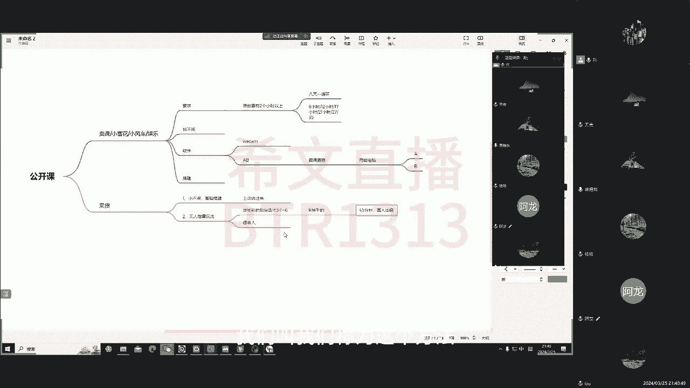
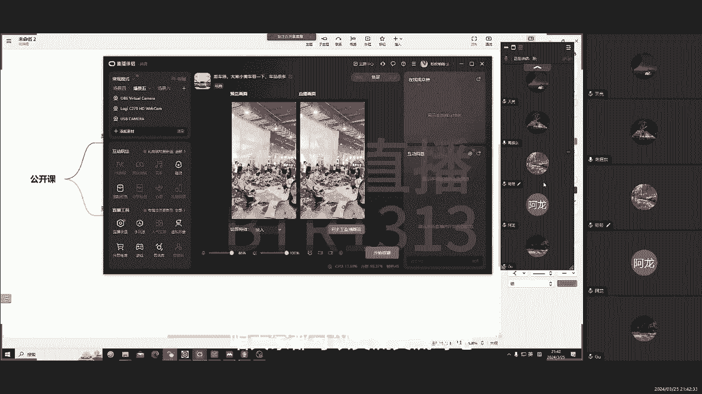

# 2024年无人直播妥妥干货，保证你不白听! - P1 - 无人直播中的纯白 - BV1ot421g7JT

都给你们讲讲完，然后那个小不点小不点儿，小红书来了四个学生吧，三个人在测，现在已经跑了五天了，连续播五天了，没啥问题没啥问题啊，又没下播，也没啥问题，反正那个有一些学员也听过我们之前讲的课啊。

那个讲了一些这个呃音频啊，这个怎么处理啊，啊为什么要处理音频啊，可能大家都明白了怎么回事了对吧，从那个检测员里上，我们就把这个技术给规避了啊，所以说今天再给大家讲一个无人增量的玩法，怎么玩这个玩法啊。

呃我测了几遍还可以还可以，但是有些人测他他也会弹啊，这个和你的录制的素材有很大关系，这里着重讲一讲啊，那个卖课的啊，我们先讲麦克的，麦克的第一个有要求啊，我们要原创素材两个小时啊。

当然这个原创素材你可以录是录了之后剪，但是需要你剪的非常好啊，把别人的变成自己的啊，那你就是被认为原创素材最好的方式啊，就是你比如说我们一般去卖小程序吧，小雪花吧对吧，大家也看过，就是什么找不同啊对吧。

就是打开那个小枣不同，然后下面会弹一个小雪花啊，让你去观看广告，知道答案或者是一些这个游戏类的，然后一堆画面问你这个人藏哪了，现在九个人找了八个人，另一个人藏哪了，有人知道吗啊想知道的答案呢。

大家点一下下边小雪花去点开看一看啊，这个观看广告30秒就能领到，这个就知道正确答案啊，有机会还抽取什么玩意儿，这东西都是怎么挣钱啊，但是赚取广告费啊，我们之前也做过一个项目。

我不知道有的学员有没有去了解过这个，TG清怪医馆，TG医馆那个馆主的，他配的这个小程序啊，天气年很火，就是这个嗯，比如说看手相的对吧，你自己的手相是怎么样的，你知道吗，你的秘密如何，点。

点开下方那个小链接去看一看你的手相如何，这个东西啊都是赚广告费的，知道吧，都是赚广告费的，在以前我们小程序有跑好了一个啊，跑好了一个有可能啊，一个视频爆了，有可能挣好几万块钱啊，实打实的我我也挣过啊。

这个但是这两年不行了，这两年不行了，这个就没有见过这么搞的啊，所以说这个当然这个技术也可以免费分享啊，如果你们想搞国外，明明教啊，这东西很简单，前几年玩的风口都封口啊，就是前几年也有那种做这个采访类的。

采访类的这种小程序的推广了，就是你喜欢什么样的小姐姐啊，你的有缘有缘人在哪里啊，然后问完之后哎这个视频下面就讲了这个呃，你想知道你的这个这个梦中情人在什么地方吗，点击下方那个什么链接。

怎么你20几岁能脱单啊，他就他就去查查，然后他就要看广告，看广告才知道答案对吧，其实那玩意都是坑人的对吧，但是你看广告就是有广告费用啊，有的时候看一次是一毛，一毛钱或者几分钱这种啊。

但那不那何不住它多呀对吧，你几万人点都多少钱了对吧，所以说这个呃小雪花也是一样的，小雪花也是一样的啊，我们之前再去做那种，然后就是这个你比如说呃我们去做一个这个。

我刚才说那个直播场景的搭建啊，我举个例子啊，大家都可以去模仿，然后那个去知乎啊，或者是淘宝去找一找小程序的厂家，小程序推广的厂家对吧，你去咱们聊一聊啊，他们可能200块钱给你租个摊位啊。

你就可以带他们的这个广告费了啊，然后你就可以挣钱了，这个这个东西现在来说还是比较无脑的，你去找这种游戏，抖音上也有很多小程序游戏叫找不同。

我就打这打这吧，扩展一下，找不同啊，或者是一些找找找找你妹的游戏啊，类似于那种游戏啊，你去录一个素材，你去录一个素材，你手机录屏对吧。

然后你就去到游戏里边啊，很多屋子对吧，我说有小房子啊，小屋子啊对吧啊，然后那个啊这里藏了一个人啊对吧，这里藏了个人啊，问你你图片上打上文字上，你后来剪辑的时候，十个人早才找了九个人对吧，那那个人藏哪。

你知道吗，然后那个你就录两个小时的啊，期间你在用剪映的时候配上你的话，你的话术可以重复用，是吧，你的视频素材每天都录录两个小时啊，你视频那个音频你就自己去录啊，自己用手机录啊，录两个小时啊。

然后把这个视频素材啊，和这个音频素材导入剪映里面，合成一个合成一个，这不就两个小时素材出来了对吧。

那你就去搞这一套，绝对帮你挣钱，四大四大各位我都没有收费啊，我都没给你们收什么费啊，本来这个群啊，以前几个群都是开始收费了啊，九十五九块钱就入群费，但是现在没有没有给大家收啊。

一个这种这种赛道大家都可以去尝试啊，如果是出问题或者随时来找我，随时在群里喷我对吧，就这么自信啊，别人都不讲啊，所以说这个素材就很好弄啊，要么就是你去带些课对吧，你谈一下在这个街舞的课，瑜伽的课对吧。

比如说养胃养生养生的课啊，大健康的赛道呢对吧，你去找一个人给你提供一下啊，找主播提供一下，你跟他谈是吧，你说你们在直播过程中能不能给我放个机位啊，过路两个小时吧啊，你给他装，给他装逼。

你说我们大概有100台电脑，我们都能用啊，就专门搞这个的，你只要提供咱们可以合作尝试尝试，他们就给你提供，他们就给你提供对吧，因为用两个小时的啊，怎么用那个那个每个素材用两个小时，我们准备八天的素材。

八天的素材，然后那个这八天一循环什么意思呢，就是你用完这八天的素材。

你就可以再用第一天了啊，举个例子，就比如说今天用第一天啊，这是A吧啊，B吧，C吧等等等，等，8年之后你又可以用A了对吧，你就不用动了。

然后再用B真有C啊，这样这样就开始开始播，哎我记得那个今天听课的那个这是念小嘛，这个头像是这个这个这个什么字幕啊，这个草地的这个我现在你之前咨询过我是吧，这个这个这节课你好好听啊，好的啊。

其实这东西比待会要简单一些，简单一些，但就是要原创素材，运动素材，为什么有个软件能拉几百个小时，或者几十个小时，是因为他们也不说一个数才能播到，播到永远永远啊，必须是在特定的时间段内。

这个六小时30小时，四小时，21小时，然后还有一个24小时，然后这个35小时，这样每到这个节点的时候，会有一次一次人工审查的一个这个节点，加强一次这个审查的一个机制啊，你在这个时间段内。

你给他换一个素材，知道吧，你换一个素材，你们你要么就下播啊，你如果想继续拉，你就给他换一个对吧，你就换一个再说，那个三个小时你再给他换一个，还能持续的往后拉，能持续往后拉啊，然后用的软件啊。

这个软件也比较省心，包括你剪辑这东西，说实话在我看来没什么难度，没什么难度，可能那个大家扛不住啊，还是那个没有人给你们讲过一些这个玩法，其实这个东西很简单很简单，每天我们我们也学过这东西，做付费学对吧。

那个我们带过面点课小刺客，当时开始学的时候，九百九十九六百九十九报一个班，当时那个报了班之后，别人都讲了，讲了几句话，诶你就是你啊，原来这么玩啊，这么玩我也能玩哈，就很简单了啊，他说那个嗯没什么玄学啊。

没什么没什么，我认为没有什么特特能技术，软件的话，也是用v car，一是用ABAB的话，就是我之前给大家介绍的啊，这个东西相对来说麦克要后悔啊，麦麦克麦克更稳，是什作文，然后它有什么特点呢。

它就是两台电脑，电脑，但是从A电脑它是有两个电脑，一个是A1个是B啊，然后那个它是从B端我去播放这个东西，A端来接收B端传到云端服务器里面，通过它有一些这个相位偏移啊，一些其他的一些处理，然后其他处理。

然后这个就导入到A端，A端接收之后，就开始进行这个嗯编程和替代和放播放啊，然后这个大概就是一个软件这么这么多使用啊，刚才回了个信息啊，不好意思，然后这个继续讲啊，然后这个B端他就去传素材啊。

A端就是你加NDINDI，它相当于一个演播厅的一个虚拟摄像头，建议来之后啊，你就在播伴侣直播就可以了啊，这个东西很简单啊，但是这个往往很多人也卖这个软件，有时候也卖这个软件啊。

这个他们没注意的一点就是和我们不同的一点，就是我们要加一个东西啊，RUT啊，这东西你用OBS，我用OBS给大家搭一下，一会看看为什么这个之前有人去卖这个嗯，卖这个定制版的OBS啊，我不知道有没有听说过。

有有没有踩雷光啊，嗯定制版的OBS就这东西，这东西啊，就RUT直接合成到那个，合成到这个OBS里面，其实它是什么东西呢，它是一个滤镜，这个滤镜只不过它滤镜加在你视频里面，是和你视频的底层是融合的啊。

不是说你在OBS里面加很多素材当盖板一样，它不是这样的啊，呃你加代码啊，抖音是能识别的到的啊，你不就是加了画中画嘛对吧，在底层素材上面多加了几层那个画中画吗，它是能识别到的，那你加那个玩意儿它不一样。

不容易那么识别啊，它是直接改成改变那个底下的一些配色，和这个底层的素材相互融合的，不知道有没有人用过这个还挺好用的啊，嗯现在那个宝子哥现在也不是，之前他们订的房屋，是不是这个东西吗。

现在这个我们菜单上的人越来越多了，他现在直接送啊，你直接说你这个你加他群，他就给你送的东西，这东西没有多少钱啊，这个九九好到50多，然后定制版的好几百，定制版的要更好，尤其是一些偏动态的啊。

比如说这个会更好一点，抗风我测过最长时间100多小时没下播，一点事没有啊，这个东西有条件的话可以去定制一个，淘宝上有去问一下啊，一般是游戏主播，这个是怎么发现可以的呢，一般一般是游戏主播。

他为了提升这个画面的质感，会加一个OBS，因为手机的这个这个手游直播啊，大部分是怎么去投到伴侣里面直接开播的啊，我举个例子，很多现在都是手机里面下个NBA啊，然后这个苹果手机看大家可以去看。

搜NDA能搜到，它是直接能和你的OBS能相连的，它是把你手机上的视频啊，能够录入到OBS里面，OBS里边再推流到直播伴侣中，直播伴侣中啊，这就是一个正常的，你说王者荣耀这个怎么去搭那种。

搭那种直播直播间，基本都是用这种方法，这种方法，然后那个后来他们为了提升画质感。

就在那个OBS端啊，我再给大家演示一下吧，可能想这个大家也能理解啊，我打开一下OBS，就我们之前做的一个素材，我就以它为例吧，以他为例吧，这是我底层素材是吧啊，然后那个我右击加滤镜啊，加应用LT对吧。

应LT2，我这个应用广告这个找到我们那个，找到我们那个刚才下载这个东西，我去用这个吧，会不会影响画面啊，你看他加进去之后，它的颜色首先就会变了，看见没变了，它有驱虫效果，他把把你的画面给去除掉了啊。

又有抗菌机神经检测的一个效果啊，这东西都买一个自行车，这个游戏主播他将这个他加一个NDI采集，他加一个采集，采集到那个手机员手机源的那个游游戏，然后到那个电脑端，电脑端它加RUT。

比如说你打王者荣耀或者打吃鸡啊，刺激战场，加深这种画面感啊，不会加深画面，才能吸引更多人停留嘛，对吧嗯，加完之后用LT就开始播了，后来他们发现有时候他们手机断网了啊，和那个OBS连不上了。

怎么还能还能播，还不不谈违规，后来发现好像那个嗯这个这个东西，ROT起到了一个关键性作用，后来他们就开始测啊，然后录一段自己的王者荣耀或者刺激战场，那个打游戏的这个视频对吧，我就怎么弄啊。

加上LT我直接往里面推，可不可以预测，可以5656天都不下，播，一点事没有，后来就发现了这个ROT驱虫的那个效果啊，它就在这上面，就是大家可以去用一下啊，用一下，当然这个技术啊，我最近没测啊。

我前两天这个医药费还测了，应该是没啥问题，然后那个公司之后可能可能还还还还有点那个，3。5之后我不知道规则改没改，大家都可以测一下，应该是没太大的问题，没太大问题啊，然后那个这是这是这个啊。

大家都记录一下，这个课程有录播啊，大家一会儿看一下嗯，然后看看这个翔哥，翔哥能听到吗，能听到你那个什么，你去对接一下那个学员叫陆生的，他那个联系我了，你搭一下快手直播间，好好好，可以可以。

然后整体就是这样LT的效果，大家可以测这个搞游戏，我们以前搞游戏主播啊，发礼物啊，采集的东西还是挺赚钱的，前段时间还有一段时间我们去搞什么呢，就是大家说棒棒糖啊，然后那个我去跑啊，跑多远。

你你指定跑多远，或者是刷一些美女贴跳舞了，这个东西不能白天测啊，一定要晚上上，晚上同行连举报都很少，白天妈的同行都卷死了，他妈天天学点举报，然后刷礼物就录录礼物嘛对吧。

然后那个你去找几个人给你录一个录一个，或者你自己录一个对吧，你录一个往山头跑的对吧，然后你加几个就加几个剪映里面剪一下，剪两个小时，加OBS里面加OBS里面加LUT，再往里面推啊。

往这个直播管理中再往里面推一点事没有啊，前一段时间我们都录完了，这个大家跟我说这个有钱的话，自己可以搞一搞，可以搞一搞啊，或者是现在大家都用什么记录呢，用UVBUVB录那个东西还是挺有挺有效果的。

AB啊，这个电脑这东西也要加，也要加ROTAB的这个这个A端和B端，和这个OBS基本是相似的，知道吧，无论你从谁那买的软件，它底层原理都是OBS，只不过他是整合了一下这个OBS官方网站的。

一些开源的软件包啊，NDI的一些开发者软件包，整合成了一个固定的插件，还有一些加上自己的一些手法驱动，书法家里边形成了我们现在用的KBKB软件。

那东西底层逻辑和连接，如果说我之前有给学员说，我说我说你们这个玩意儿嫌贵，你就自己研究对吧，去这个OBS论坛上，OBS论坛上有很多好东西啊，我不知道大家有没有去看过对吧，OBS现在还推出了一个。

它能审审查你的违规词啊，就是你录一段话，你播放应该申请几个字啊，然后那个你比如说麦克更稳这几个字啊，我不想让他说应该打上去，当这个你循环音频的时候，到了一个字他就不讲了，直接停了。

然后过了这两个字他又讲了哦，后边是后台，后台那个论坛上就翻墙去看一看，很多开源的好东西，所以说这个现在很多这个大大主播啊，或者是一些搞文字播培训的都卖的一些东西，很多都是那上面的啊，有什么说什么对吧。

但是不要告诉我这样接他们饭碗不好，然后那个有兴趣的自己去研究啊，我为什么我们AB还要卖钱呢，因为我们找到一个人，实话实讲，找到一个人去给我们打造这那个封装，这个软件花了一笔钱。

所以我也想把这个本给汇过来啊，就说要要要买，要卖一部分，当然你如果说有这个对吧，做软件的这个基础，那你们就自己搞一搞啊，然后我今天就不用ab给你展示了，因为今天我是在家里啊，这个只有一台电脑。

也不给大家演示了，后续的话让小杨哥给大家录一段，这个视频就行了，war我用VR去做VR也很稳啊，目前我们群里有一个卖迈克的啊，卖西西哈街舞的那个那个那个那个人啊，前段时间不是经常发，他一天播好多小时。

卖4000块钱对吧，他那4000块钱是纯正的啊，他卖课就纯挣钱，然后这个这个都是用的我们这套方法，它是杂付费的，你下好了微卡这个东西是五块钱一年啊，这东西下来之后啊，你首先把他摄像头替换掉吧。

这个我就不过多解释啊，你去买软件，他都有教程去看看教程啊，然后我举个例子，这个这个是我录的一个，录了一个人的那个一个视频对吧，但是这样的，那我怎么样才能把它导入到obs里面，直接就是替换插头进去吗。

可以替换三角形是可以的啊，因为我举个例子，我把这个本加起来，刚才我替换的是这个对吧，利用库存加油呦，草没推过来，被替换过来，我看一下怎么回事哦，可以了退回来了，然后你就把他给拉到。

所以有很多细节大家注意听啊，就是不是说直接倒过来就可以了，我就看我一步一步的操作啊，不懂就问我把它推进来之后，第一第二个就是我的音频要从哪进，我的第二个音频也要从哪进，不要用vb跳线了，知道有VV线。

有点危险，选项里面，你去看看他那个音频输入符合设备对吧，这个立体声就没问题了，我们来把里边把音频给他调调，设备可以了，播放一下，看有没有新进入，好一声音进来了，这就可以了，这样就可以了啊。

在这里就不用动了啊，首先保证你这个是原生素材啊，给他推进来就可以了，第二步第二步注意听啊，第二步我们看个视频，随便加一个，加一个加克吧，你把这个东西给它盖上，然后再加再加一些图片随便加啊。

有没有什么特别的要求啊，再加一个摄像头，这是摄像头啊，一定要真实像头加起来之后，我们调一调这个绿幕还是一样的啊，我们不调透明度，调透明度还是我之前说的震撼多雷的意思，不要调对吧。

正儿八经直播谁调谁谁调调这个知名度啊对吧，你调透明度肯定是牛模拟，这个不用讲啊，调相似度对吧，你把它调调完了，它也是一样的，调完了盖盖上来了，好同步过来，然后你要保证你，首先你要保证你开始开播的时候。

你要应该调来调上来，你同步一下，同步一下是吧，然后你再给它放到最下边，你再放到最下边，这不就是这个顶层是Z字像头吗，图片嘛，然后再加一个视频嘛，都盖在你最上面了是吧，在你预览画面中是这些对吧。

你直播画面还是那个你不信你看看我播放就行，好不好，记一点吧，然后抖音你什么呢，抖音你预览画面他不会检测你的直播画面，明白吗，所以说你这个加加加上面的东西，就是为了防检测，但它不会影响你直播的这个效果啊。

只要你一开始点开头部，另外一个还要加一个什么呢，加一个OBSOBSKOBSK一下，这一步很重要，这一步很重要，大家注意听了，OBS里边我们去加一些这个媒体源本地文件，这个是可以那个什么呃。

就是转播一些东西，一些直播画面啊，这个我找一个吧。

你和一个思念，这又来了个思思，就比如说我找他吧，他，我找到他那个什么，我找他一下那个，转播的那个，我这个我这个360服务器能转播吗，他有的时候不能转，这个号不能算。

继续转播技术，后来再给大家录吧，再再给大家录一期，就是你这里放一个转播的转播的这个视频，我以他为例子，你认为他是转播的直播画面啊，你给他推进来，B的应该加入BS，A都是那个什么都是那个连接。

都是那个什么都是ab电脑，之前用ab电脑测的比较多，那接下来之后你看你OBS在顶层吧对吧，你就这样播就可以了对吧，它实际上它检测的是你这个画面，这个预览画面里边的东西。

实际上你这个直播画面还是不受影响的，你看必须要满足是吧，直播画面你看你别人看到你手机，它是不受影响的，所以说你要保证你的预览画面，画面是不重复的就可以了就可以了，然后那个到了这个节点。

刚才这几个节点到了这几个节点，然后你怎么弄的，你给他调一调，调一调位置嘛对吧，你调一下位置，或者每隔一小时你可以调一下位置，如果说你有时间的话，你就该调，如果你没时间对吧。

大家都说这个放飞放飞双手去挣钱对吧，如果你没有，那你可能时间稍微久点，卡住六个小时之前你要调一次就可以了啊，你可以调一调，调一次，这就可以了是吧，或者删是吧，都可以对吧。

起码他他那个什么他是他是在对你上传的啊，他是不受你影响的，你看对吧，你什么你的直播画面永远是这个永远是这个啊，这就是我们说用V卡搭的这种方式啊，这种方式啊，然后如果说用用ab电脑了，就不用加这些东西。

我说ab电脑，我举个例子，大家把这个把这个东西默认为NDI啊，默认为NNDI就是这个我这个摄像头，因为AB电脑它就是NDA嘛，这个摄像头啊，然后上面的都不要上面的不要这样，这样都保留，这个都不干净一点。

这个也不用，这个也不用进场，有这个这个N我先删了，大家想想他就为N就可以了，不能改名吗啊还不能改名啊，大家想让他去为这个AB电脑就行了，AB电脑就这样放，就不用动了，在你的B端，你去把你的画面不对。

这个这个我讲错了，不好意思啊，这个N啊没讲错啊，这N就相当于你的av电脑，你弊端就不是会卡了，这就相当于是B端的OBS，你在obs里面你给他加一点，还是加加LUT加LUT啊，现在脑子不太好使啊。

加LUT你给他加上，你可以加两个或者加三个都可以，然后你给他推起来，推起来两个小时的原创素材可以可以随便播，然后那个达到六个小时，你给他换素材，你再在B端B站电脑，你再给他换掉素材就可以了。

你直接给他换个素材就可以了，他直接就过来了，他就过来了啊，明白基本就是这样啊，这个备课的就这一点行，针对于这个卖课的这种搭建方式，不可能讲的有点快啊，这个这个大家有什么问题就问一问吧。

因为这个这个这个方法也是之前很久的了啊，很久，但是现在前两天测了测还没问题，因为这个毕竟耐克的，能找到我这个比较牛的方法的人还很少，然后那个尤其是这个就学校的那个卖课的啊，你有没有听明白。

当然这个具体讲的很深啊，这个不方便给大家讲这么深啊，当然我们有更牛的一些玩法对吧，迈克的保证你会考很久会很久，那当然这都是付费知识了，就是说这个这个方法看起来简单，实际上细节有很多啊。

简能保证你考一段时间没啥问题了啊，如果说你细节做得好，基本不太可能会被封啊，行大家看看针对这个东西有没有问题啊，那个学校对于这个这个这个大家有没有问题啊，没有问题了，三农行，你这个你回去就试一试对吧。

你买个这个东西四五块钱又不贵是吧，你去去测一测，有什么问题，你给这里吧是吧，好的好的，谢谢另外一个小不点的，这个大家这回给大家讲过了，这次就没太必要讲了，有想了解的同志们，就那个什么看回放对吧。

看回放啊，另外就是这个新的啊，这个我们啊昵称五个人增长，实际上和大家说的，我身增量还是有一些不一样的玩法，就是我们读错了啊，你去录录这个别的平台，我打错字了，别的平台录话术录三个。

每每个不低于这个两个小时啊，当然就是等于六个小时嘛对吧，等于六个小时，等六个小时怎么用呢，怎么播吧，我给大家讲一下怎么用啊，就比如说我们我都删掉，我都删掉了，素材的话，往那边推。

这个大家都知道背景素材我找随便找一个吧，因为背景素材这个上回给大家讲过怎么处理了，这里就不给大家讲了啊，这个有又想去了解的，大家去看一看啊，这背景素材我就进来了，没啥问题，进来进来之后大概是这样。

你用这个OBS推个人就可以，没啥影响，把文件给删掉了诶，对某人给他加进来，这个铃木人上回给大家讲过啊，怎么去用啊，然后呢你去找你的播放器，去找你的播放器，我这里就用那个什么播放来来来，带有风影音。

大家都可以用风影音随便找一个吧，你给他录，这相当于是六个小时的素材对吧，录个素材，然后那个你去到这个举个例子啊，这三个这三个我都过来了，炸了一家放三天票，你如果第一次刷到我，你担心自己感到好货的。

然后那个这个就属于这个音频嘛，然后我给他删一删，给删一删，你就加这几个，加几个读取个文件夹，一会给外面测试，新建文件下载什么，新建文件夹，找一下这个，这个文件350的数啊，大概就只有这几个吧。

我举个例子，这些都是啊，你让他让他随机播放就可以了啊，慢慢挑慢慢挑，就必须是要有一点啊，就有一点你必须要录别的平台了啊，必须要录别的平台，不要录抖音了啊，尤其是刚开完播的，你不要去录。

如果人家肯定要回归啊，你说你录快手的就行了，快手的快手也有很多办公人的对吧，你快手的录快手上大概就录了几个小时，你你不要在意那种，就是这个品和他说的话不对称怎么办。

说实话你不到最后有几个人能够听你讲对吧，没有你只要把你小不点的这个自动回复设置好，基本没啥问题对吧，当然你去修路啊，找相同的啊，多找几找几个啊，呃我一般习惯找六个啊，六个每个录两个小时。

这就是12个小时到12个小时，然后那个你要放在那个播放器里面去给它播放，就给它播放，然后这里有一个细节是什么呢，你开播45分钟，这中间出现，不能促进进行促进互相控，然后这个你不用讲话啊。

你可以时不时插一句，对没错，好的就可以了，然后那个等15分钟之后你就走。

你全部的走就可以了啊，然后那个再次播放程度啊，你可能就是这样，你把它拉到最上面嘛对吧，那你的OBS你关掉吧，你这人先过一下风控嘛，过完之后来你给他拉上去，你让任某人代替你去直播。

然后你就可以开始持续续播了啊，这个方法我没测过，现实目前来说还可以啊，目前也挺稳的啊，但是这个这种方法，这个用的人也也也也不是很多啊，这个呃大家可能以前也听说过，也可能没听说过啊，这个是我们实测过的啊。

没什么进展太大的问题，有的人啊他可能撑过之后，他发现这个你去一个直播间里边啊，你听着他有他有三个音频啊，一个女的在讲什么，底层还加一个男的在卖衣服，最底层还有个音频，我们叫我们称为这个方法。

叫三音频叠加法啊，就是你用分别用三个不同的播放器去给他推，你看我这个是暴风影音吧，这个是迅雷的播放器吧，你再用一个这个QQ音乐了，你再下一个网易云音乐了，你分别给它加不同的话术，你给它加一段对吧。

你再去那个科隆音乐里边，你再给他加一个，加一个其他的，然后你再去网易云里面再给他加一个其他的，你把这个音频音量调大，把QQ音乐和网易云的音量逐步的调小啊，然后过几个小时啊，卡六个小时之前。

然后你把这个音量调小，把另外一个QQ音乐的调大，然后在获取管再换啊，然后这个在网易云里面把那个调大，把这个再调小对吧。

这个这个是三音频解解法啊，和这个就又不一样了啊，这个是相当于音频处理的是两种因素。

但整体的这个整体的搭建都是这样，整体的搭建都一样啊，我之前说过这个伴侣啊，还是检测的是你的音频，对于你的视频的检测可能没有那么严格啊，你只要做好驱虫，有人脸能过风控，那证明你就是基本面上的问题了啊。

然后那个音频的话就这样处理就没太大问题啊，如果说你实在不放心，你就用我们第一节公开课讲的那种小不点的，那基本也没啥问题，然后写了42分钟，今天讲的有点快啊，可能很多人也没听清楚，这个现在有什么问题。

大家都可以交流交流吧。

这个包括这个这两种搭建的啊，有什么就是不懂的，不明白的，再看看回放啊，再在群里问一问，就是这个包括麦克的这种啊，然后卖货的这种耐克的有几个细节啊，刚才讲的啊，回去这个办理那个回放，再好好看看卖货的那种。

这几个细节，主要是卖货的要注意一点音频的处理，你把音频处理好，这个就是你就剩下一半了啊，之前我们说过音频的解释，什么是它检测你的话术有没有循环转化播放，把你的话术转化为文字，同时筛选你的名词，它是这样。

所以说这个大家也去看一看啊，行今天讲课就讲到这里，大家看看有没有问题啊，我们等个12分钟，如果没啥问题，咱今天就到这过后的话，再给大家整理几节课，比如说这个一些这个自然流的，自然自然流起号的方法对吧。

就是我们说的灵活少井号，你怎么起对吧，或者是一些其他的一些玩法啊，但是这个过程中几何方法对于这个一你的场景，二你的品，三你的主播啊，尤其是你的主播，他要求能力还是比较大的啊。

所以后续也会给大家讲这种方法啊，嗯学到了一些核心玩法，就没办法给大家过过多讲了，那个不属于一些付费内容了，行大家看看有没有问题啊，那等个一分钟，如果没人问，那今天就到这。

行这个大家现在应该是都没啥问题吧，我看是不是大家都播的挺好啊，老公也做的很好，行那今天咱就分享到这吧，来过后我们有下一周的公开课的时候，再给大家讲别的东西，大家都去测啊，讲的这些方法都去测试对吧。

那个你抄过来，知道这个这个我讲的怎么样对吧，成本不足100块钱，买个微卡，15块钱半年吧，一年嘛对吧，那还需要啥就不需要啥了吧对吧，就是麻烦一点，这种方法就是有点麻烦。

你需要处理一些素材录或者录原创素材对吧，卖货的也是一样的，就处理音频嘛啊但这种方法比较稳啊，你要么你就钱遭点罪，要么你就身体遭点罪，反正就这两个方法，没有其他的好好好的办法让你挣钱对吧行。

那今天就分享到这。

