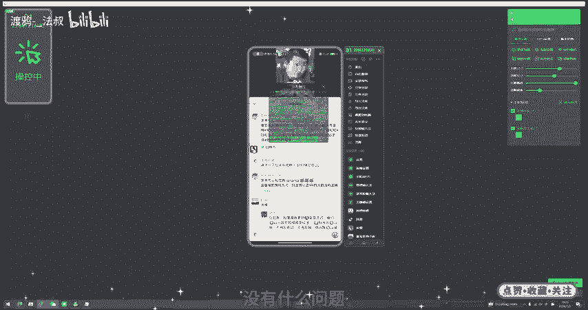

# 2024年渡鸦科技社最新发布视频号V3.0无限丝信曝光获客保姆级教程，日引流2000+目标精准粉 创业粉【获客必备 百分百送达率】 - P1 - 渡鸦-_法叔 - BV1c1sYeUEdm

。

多科技社群兄弟们晚上好啊。今天给兄弟们更新一下咱们视频号RP全自动私信评论截流脚本V3。0版本啊，这个是昨天咱们实操的一个数据打的这个私粉。当然这个咱们全行业都可以打。只要你在视频号有这个精准的粉丝。

你都可以用这个脚本去主动私信截流啊，一个视频号大概你一天频率设置慢一点，打个一两百条私信是没有任何问题的。那么如果你有1台设备，那就是一天打上千条这个私信截流啊，这个送达率还是很不错的。

只要你把这个钩子设置好，那么回复率还是相当OK的。🎼好，那么这个教程我会详细的教大家如何去设置钩子啊，怎么去设置钩子这个思路以及脚本怎么用啊，保姆级的实操教程，所以兄弟们一定要认真看到最后啊。

了解一下视频号如何去打私信截流，如何去打评论截流。好。那么废话不多说，咱们直接开始。🎼进入正题。好，首先咱们把这个视频号、私信截流脚本下载好了之后，我们需要打开这个无障碍权限啊。

注意咱们这个是免root的啊，只需要你打开无障碍权限就行。那么无障碍权限。🎼有这两个大家一定要把这个启停自动化服务给打开啊，我先关掉给大家演示一下。好，我勾选。🎼它会显示我们去开启无障碍。

那么我点击已下载的应用啊，然后点击视频号勾选。🎼小米或者这个红米手机，它会需要你等待10秒钟的时间啊，等待时间结束，你点一下确定就可以了。然后返回。返回。🎼好，返回到这边。

我们再次点击一下启停自动化OK它权限就可以开启成功了，我们就可以正常使用了。那么要注意的是，我们这个卡密要填在这边。啊，卡密填在这边，其他所有参数填好之后。

大家一定要每次修改之前保存参数卡密找咱们社群的这个卡密客服。领取就可以了。这个社群成员是免费用的，你有10台设备，你就拿10台设备的啊。只要你是自用的，都OK免费用的。然后我们把这个。

🎼首先是这个评论筛选词啊，评论筛选词的意思就是你去别人的视频底下，比如说我打的是创业粉，人家有求贷的关键词，那么我只想私信求贷的，不想私信那些同行。那这个时候我们就把这个筛选词填上去。

比如说我只想私信这个求贷的人还怎么做。包括这个赚钱。好，有这些关键词的，我就去筛选，没有的，我就往下滑跳过啊。🎼那么这个私信的内容大家自己去设置啊，自己去设置私信的内容。我这边以创业粉举例。

任务次数这边是防止你不断的私信私信次数过多了，所以说给你设置一个这个任务次数的机会。比如说你设置100次。那么他私信到100条，它就会自动停止。所以兄弟们不用担心去不用担心被封号这些问题。

你每天稳定设置呃设置私信个50100次这样的次数。🎼啊，搜索词这边就是随机的创业球带，或者这个带个加号，就说这个别的关键词，它是随机选取一个啊，我这边演示为目的，我就选一个啊。然后你每次修改完。

点一下保存参数，这边这个延时时间。就是1加4的意思就是1到4秒。比如说20到5加50，那就是20秒到50秒，他随机选个时间去私信。那么这样的目的就是完全模拟人工，防止频率过快，遭到风控啊。咱们这个脚本。

🎼大家一定要注意，我强调一下，咱们要一定要开始之前看一下注意事项，我们是完全不收取任何费用，只提供给对外科技社群成员使用的啊。然后我们是严格遵循PA自动化开发的辅助人工机器人啊。

严格遵循计算机的这个法律法规，仅供内部成员测试使用啊，千万不要拿来做一些违规操作，否则任何后果，与这个咱们社群作者无关啊。咱们一定要去做截流，一定要是正规的后端啊，正规的去操作。在合规范围内。

如果有任何违规行为，立马支持啊，就是永久提出提出社群。好，那么设置好了之后，咱们还有一个点，就是往下滑啊，有一个这个日志窗你关掉，然后再打开就会出现这个窗口了。好，这个窗口的目的就是让你随时可以停止啊。

随时可以点点开这个日志框去查看，我们放在这边。然后我们点击这个启动。🎼好，他就会去跳到微信上。🎼让它全自动的去操作。那么它从这个发现页，它会自动的跳到视频号，等待时间是正常的，大概。

5到15秒时间等待时间啊，他全部会随机的去延迟。如果你设置好了这个。🎼评论区关键词私信，那么他只会私信他符合关键词的啊。如果他不符合关键词。他就不会去实行。但是有一些符合关键词的用户呢，他是没有。

开通这个主页的，你看没有开通主页的，他就没有办法点进去私信啊，这个是正常的。🎼没关系啊，它没有筛选到的，它就会往下滑。大家自己看的时候，可以看这个日志窗啊啊，是可以看到这个内容的。可以看到如果符合的。

他就会把这个私信发出去。是已经执行过的，他就会跳过啊。你看这个没有主页的，他也会跳过。啊，他就会往下滑往下滑。啊，没有的OK就划到下一个视频继续运行。咱们这个逻辑写的还是很流畅的。

就是迭代了好几个版本的。咱们社群所有的软件啊，全部都是包更新的，就是你不用单独再付费用。就加入社群之后，所有软件包更新，然后包维护版本维护了呀，接口更新了，我们都会不断的去升级。

专业事情交给专业的人去做啊，陈哥已经做了这个九年的私域引流教程了啊，绝对在这个矩证引流截流，包括自热这方面是绝对的有权威实力的。咱们社群现在已即将这个万人规模了啊。可以看到所有执行过的，他就会跳过。

这边你看它全部符合我们的关键词，叫做求带。然后符合关键词求带的，我们就会去实信。不符合的就会跳过。大家可以自己先去搜索，就是你做之前，你先去搜下这个关键词啊，然后点开评论区，你看哪些关键词是经常出现的。

也刚好符合你的用户的。然后你再去针对性的设置关键词啊，你不不然的话，你去搜一个创业的评论区，但是里面全是讨论怎么创业的，然后你去整个球带划半天找不到球带这关键词，对吧？所以这个点大家要注意。

然后有些兄弟他的行业你比较小众，搜了，可能寥寥无几。就几个评论。那你这时候你就不要去设置关键词啊，直接就是全部都私信，这样反而效果会好。所以工具是没有任何毛病的。但是。

🎼不同的人手中去用它的效果是不一样的。你像咱们之前写的这个抖音私信工具，有兄弟拿了80台设备去打私信啊，一天打上百条，每日这个进线上百个这个精准粉啊，但这个月他们这从业绩从20个，直接翻到40个W啊。

这个完全是工具在手上是看人啊，你有多少台设备，然后你这个赛道如何，这都决定了你最后的这个效果。但咱们社群主要就是。帮你节省节省这个人工的时间。比如说你安排人工可能一个人只能操控两个号啊，去私信啊评论了。

但是如果我们用的工具，一个人就可以操控10个，甚至30个号去打这个不管是自然也好，还是截流也好。你看到符合关键词的，他就去私信。不符合的，他会全部去跳过，然后去划到下一个视频。不符合的就跳过啊。

不符合就跳过。🎼大家平常去刷视频啊，你看到有对标的是你底下是你的精准粉，大家就去把这个关键词啊给记住。好，我先暂停演示已经结束了就。比如说这个前面这个啊。我们可以看一下。啊，我他的这个文案。

他的这个标题兼职这个大家可以记住一下，就是说他们常用的这个搜索词什么，到时候。符合搜索词了，你在这边来搜索。比如说我们创业的有一个搜索词啊，就是。前被。就没有。挣钱快的路子啊，这个其实就是打创业者。

但实际上跟创业这两个字毫无关系啊，大家就多去找类似这种的关键词，你去搜索这样这个用户基本上没有被怎么截流。你这时候你再去截流啊，它的效果就会很好。你看。这样子的，你像。说到这里，我们刚好说一下评论啊。

私信是一个方面，评论截流也是个很好的方法。大家可以看一下我们如果去打。创业粉。是不是？这个花数据能用得上，创了创了一个这个。🎼创业交流群一起打破阶级。好，你把这个评论词发上去。完事。

你就是借用了这个评论这个作者的这个自然流量去在他的底下去获取流量，你可以看到他这一个这个评论，你看引了多少个人，十几二十个人，看对吧？这是单一的一个评论而已。大家像这种呃评论区的这种关键词。

你就可以去多搜索，然后把它给记下来，记下来完事，你做一个表格，然后你就让这个评论词去轮换啊，然后用咱们的这个什么呢？用咱们的这个脚本。啊，可以看到有评论功能啊，有权这动评论功能。啊，这里的既是私信功能。

也是平论功能。比如说我我们我们也我们也。学他啊这个。我们也去学习一下这个。人家这个话术啊，我复制过来。然后我们把这个粘贴啊粘贴过来。🎼好，然后我们保存参数一定要做做完了，一定要保存个参数，然后启动脚本。

🎼我把这个日志窗可以打开。🎼啊，它会全自动去返回到主页，所以不用去管它啊。你如果嫌慢的话，也可以手动去干预一下，把它回复到主页。🎼比如说我们嫌这个比较慢，我们就暂停一下。然后我们先返回到这个。

🎼主页上面来。就这个页面。🎼好，让我们再点启动。每次有个这个十几秒的延迟啊，是很正常的。🎼稍微等一下就可以了啊。🎼我这里说的方法啊是以创业粉举例，但是兄弟们自己去跑，你一定要灵活变通啊。

各个赛道你自己去做这个后端，你肯定更了解你的用户群体是什么样的。啊，这个时候你针对性的去设置钩子才最好的啊，大家也不用就是说你不会设置，然后就是去来问社群客服，大家可以在群里面多讨论啊，找同行啊。

因为咱们社群是万人社群，只要你是做前端引流的，就是所有的这个。啊，所有的这个同行都可以在社区里面找到，然后叫啊，忘记跟兄弟们说了嗯，这个评论大家一定要去把这个。输入法默认输入法改一下啊。

我现在教一下大家如何去改输入法。输入法。啊，因为它默认的输入法不是脚本的，所以它输入的时候会出问题啊，这边的这个。书法这边。🎼我们点击输入法管理，然后把这个输入法就是脚本输入法点击启动啊，点确认。

点启动。好。🎼启动之后，他就我们关关了一下，重新解锁啊，我们重新解锁。然后我们再把这个当前的输入法给它改一下啊。🎼看一下有没有开启什么啊，已经启用了。然后我们再把当前的输入法给它改过来，其他输入法视频。

🎼好，全自动事性截流的给他确定。好，这时候你就可以去让他全自动的去跑平证截流了。🎼检查一下权限啊，权限没问题哈，我们保存参数啊，然后再重新启动。然后他就会直接在这个把评论给打出去，然后呃划到下一个作品。

然后继续打。然后这个评论的内容咱们也是可以随机的啊，就是说单独的这个一个评论评论多了可能会限制。但是咱们咱们搞个5个这种评论随机的换啊，他就不会这么限制，一天打个几十个，那这个长尾流也是可观的啊。

具体的大家去实操测试，然后有bug来给陈哥反馈就可以了啊，没有什么问题在社群说即可。

