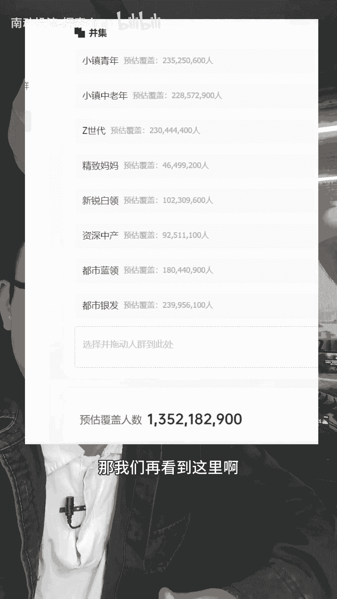
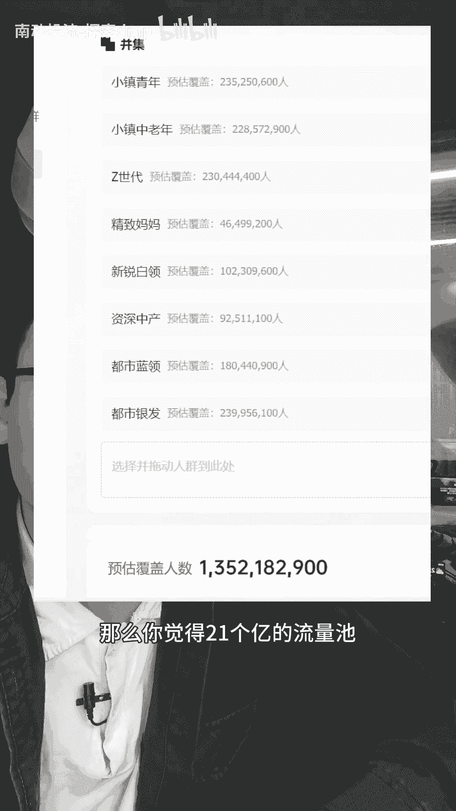

# 2024年直播带货怎么起号，直播带货推流机制，付费怎么启动自然流。 - P1 - 南动投流-探索dmp - BV1ey411h7VE

80%的带货直播间，如果打千川纯付费，撑不到年底一定会倒闭，原因就一句话，大家都看得见，相对于去年的同时期，付费流量的成本现在贵了三倍，以前毛利40%的品在抖音用钱买钱，搞纯付费能挣钱。

那是踩着平台的流量风口，那时候流量便宜啊，现在如果继续这样重付费买量，那你以前赚到的钱大概可能全部得填进去，我说的是不是事实，而且抖音的售后本身就是全网最高的，还有比价系统在后面追着你咬。

今年你不白嫖平台的自然流，结果就是每天都在发货，年底搭进去一台车，很久没有发视频了，今天我有好多想聊的，我真的很想把一些事情跟你们聊明白，我想说服你们，现在呢很多人觉得自然流量那很难做呀，你没法白嫖啊。

那是因为你们还停留在去年和前年，做自然流的方法里，各种编单马扁拉数据，那肯定来以前的抖音是什么呀，每天都有大量的新电商用户，新流量，看到什么东西都是新鲜的，你稍微憋一憋，停留就来了。

你稍微一片数据就来了，但是现在呢直播带货做了这么些年，用户也被教育了那么些年了，你那些小套路，这些老油条一眼就看出来了呀，你怎么骗呢，很多兄弟可能想反驳，说我话术贼强啊，我还能马扁啊，这一点我信啊。

但是兄弟们啊，你们吃过弹窗吗，憋着不放和刻意引导互动，他都是弹窗的呀，好啊，哪怕你的话术和节点也能规避这个平台的违规，但是平台在今年为什么抓这个抓的这么严呢，我们透过现象看本质。

就是平台不喜欢这种直播间啦，新号纯自然流，单场起爆卖二三十万的，我看过很多，但是第二场直接死耗的占99%，今年的自然流起号稳号，一定要结合付费去打，付费拉自然流的原理是什么呢，接下来我掰开了，揉碎了。

喂到你嘴巴里，做直播带货的兄弟们啊，这个视频真的值得你去研究两遍以上，而且我估计这个视频只有真正有实操经验的人，才能看懂，首先呢你直播间的免费，自然流量费的推荐和千川付费买的流量啊。

其实它们是同一种性质的流量，在同一个流量池里面，但是这里面的付费优先拿量，毕竟平台是卖流量的嘛，具体是什么意思呢，那我们做一个假设啊，某一个行业在抖音上面呢，它的整体流量是百分百好付费优先付费。

买走了其中的40%，还剩下60对吧，那么被付费买剩下的这60%才是自然流，反之呢，有些行业是高毛利低售后啊，几乎所有的商家都在重付费买量，那么这个行业呢是没有自然流的，所以电商直播间的费的推荐。

它是整个行业付费买剩下来的量，那剩下的这些电商流量，你觉得平台会分配给什么样的商家呢，我这么跟大家讲啊，开门做生意的本质，它就是为了赚钱呐，抖音电商部门他是有KPI指标的，这个KPI的完成度。

直接影响到抖音电商在资本市场的营收，你挂车的直播间，就归这个有KPI指标的电商部门管，他要完成这个指标，那你想啊被付费买，剩下来的这些电商流量分配给谁呢，必然是分配给能够帮他完成这个指标的，直播间商。

商家与商家之间的赛马，我们讲具体一点，就是同行同层级，同客单，同人群的商家去赛马，以前做纯自能用低价憋单码，贬套路，拉停留，做成交密度，本质上也是通过数据跟平台沟通，你看我赛马是最厉害的。

快把流量给我啊，这也是赛马在同时段开播的直播间，即时赛马对平台的即时价值，更高的直播间流量，池子里面剩下的流量预分配就给谁曝光，所以你们能看到的结果是，前5分钟的成交密度，决定下5分钟的推流速度。

这就是赛马付费拉自然流，本质就是用付费去辅辅助整个直播间，跟同行做更高的赛马价值，不管是投浅层也好，深层也罢，本质上都是为了赛马数据，这也就是付费拉自然流量的原理，跟千川投什么计划无实际关系啊。

不管什么莱卡拉自然流达人，拿自然流放量还是控成本，这只是节点上的东西，都不是拉自然流的核心，这里听不懂的可以倒回去看，第二遍看懂的再听我们接下来的实操部分，我们从起新号开始讲它的基础逻辑，第一个操作。

所有的千川计划都得打直头，只有直投才影响到直播间本身，你千川计划投的是短视频系统，给用户曝光的推送载体式短视频呀，那么接下来你的交易模型决定曝光人群，决定的依然是你的短视频，接下来会曝光给什么人看。

只有你直投画面成交的各种数据，才影响到你直播间的标签，这样你的数据才累积在你直播间，画面本身的这个载体，不信的你们真的可以去试一试一个户，如果你一直跑的是短视频，那不管你消耗多少，投产多高。

你忽然改成直投计划，不一定跑的出去，因为你的直播间没跑过标签，流量会很次计划的竞争力跟不上，第二个操作，拉高GPMGPM赢影响不了什么，但是他能表明两个东西，一个是流量质量，一个是转化能力。

直播带货的本质是承接，只有流量质量和转化能力都不差的情况下，才能有更好的承接，有承接才有推流，在新号起号阶段，投付费的目的就是打标签人货场不变，但GPM在递增，就表明你的流量越来越精准。

正如我刚才所说的，GPM能证明两个点，一个是流量质量，第二个是承接能力，GPM高了才有后续的操作，因为不管是流量犯还是承接差，都是拿不出自然流的，拿GPM打标签，用什么签穿计划呢，我给大家看个数据图。

假如我们在不做定向的情况下，整个千川的覆盖是22个亿，但是我们总人口才14个亿啊，哪来的22个亿呢，这里面呢就包含了大量的站外流量，那我们再看到这里啊。

把八大人群加起来是13个亿，没错吧，那么你觉得20一个亿的流量池。

和13个亿的流量池哪一个更真实呢，打标签拉千次肯定是用成长五人群包计划，对不对，但是他的投产会很低，因为他只有13个亿的总流量，池流量会很贵，所以结果可能是千次高，但是投产低。

新付费拉自然流的直播间付费投产真的重要吗，你的付费的目的只是去辅助你的自然流，第三个操作拉自然流量啊，不是说你GPM高了，标签打精准了，自然流量就来了，GPM打高之后，要把正价的成交密度拉高。

同时这个时候你要开始接自然流了，所以不能全场付费付费，在完成赛马之后要停掉接自然流，不然付费一直会透支你的预分配，这个就是我讲的付费抢量，很多人总以为付费投的越多，用什么计划，自然流就来得越猛。

其实不是，甚至乱打付费或者付费打得越猛，自然流量会死得越快，很多直播间在投了一段时间付费过后呢，自然流量越推越少，严重的依赖付费，原因是付费的优先等级更高嘛，刚才讲过会把一些本身属于免费给你的量。

用付费买进来，一个精准的，本来是你自然流量渠道的用户，他会先刷到你的广告，他通过广告的付费渠道，进入直播间进行的第二行为，那么本身属于自然流的数据，是被你的付费给抢走了，这样你的自然流千次就会越来越低。

流量越来越泛，自然流量越来越少，我看到很多直播间就是这样的，70%的费的来源，成交只有30%的占比，不会打，千川不要乱打，不然干成纯付费，你得哭死，今年你不白嫖自然流。

