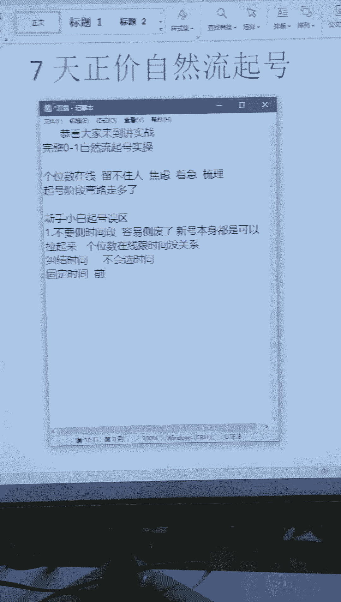
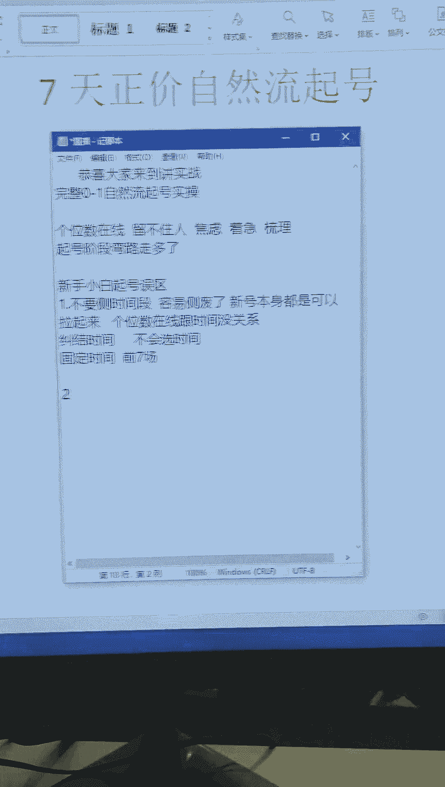

# 2024年直播带货新号怎么起号？ - P1 - 第一次来哔哩 - BV1cGsNeqEWg

就是很着急，所以今天的话我们就用一个小时的时间，给大家去梳理一下实战的起号思路啊，因为很多人就是前面的话踩坑了，说白一点就是在起号阶段，我们前期弯路走多了啊，以至于你直播间一直起不来。

所以今天的话我就以实战为主，给大家做一个详细的完整的梳理一下，咱们下半年的实战起号方法，然后我们先看一下都做什么类目的，结合你们的品类，我来给你们讲啊，因为内幕不一样，你们对应的人群不一样。

所以说你们在起号阶段选择的开播时间，包括旗号的一些细节，注意的事项都不同啊，那现在现在人相对较少，然后我看一下大家都做什么品类的，然后给你们去梳理一下你们这个内幕，今年适合的实操起号方法啊。

像咱们这个潮玩起号开播了吗，还有咱们的谈谈开播了没有，好物分享，做什么类目的啊，王哥做什么品类的好，目前有没有在直播间啊，开播了吗，现在啊可以把你们内幕抠出来，然后可以结合你们的内幕来给你们讲啊。

首先第一个起号的细节注意事项，就是我们在前面起号阶段，新手小白今年起号的几个误区啊，就在前面起号阶段呢要去注意一下这个细节，第一个就是时间在刚开播的时候呢，可能刚开始直播大概率很多兄弟会纠结。

这个时间段可能会考虑说我几点开播合适哦，那可能就会想着说我去每个点都播看看，去早上播一场，中午播一场，晚上播一场啊，那么这种情况下容易把账号给撤废了啊，你想一下平台它有六到8亿的日活量啊。

那么你想去做一个几十人直播间，或者说啊想去做一个百人在线的直播间，这个时间段是完全没有必要去测的，我们来这边播新号，起跑线都一样，本身咱们都是可以拉起来的，所以说在前面起奥前期如果说是什么情况。

个位数在线啊，这个时候呢你不要慌，你不要说哎个位数在线不行的，这个位数在线，这个时间不行的，个位数跟时间是没什么关系的啊，在刚开播的时候，大概率都是这种情况，你包括我去起型号也是一样。

前面的人都相对比较少，而且人群相对比较泛，所以说前期的话，如果说你们有在纠结这个时间的，或者说还不会选择时间的，可以票一下内幕，好吧，今天的话咱们就以实战的为主，给大家详细的完整去梳理一下。

然后你们有问题的话，可以把你问题答出来啊，我结合你们的情况，结合你们的内幕来给你们讲，昨天播了一个小时，57长官，那就57的场关就有点少了，正常的一个账号一个小时得在100场关左右啊。

57场光电板几个点，你是不是签粉号，第二个点，你账号前期的活跃度够不够，你前面的准备的一些细节，注意的事项有没有了解到位啊，这些的话你去看一下有没有踩坑，餐饮的话，你可以选择在晚上九点之后去开播啊。

咱们飘啊，开播了没有，现在，然后你可以干嘛，你可以去固定一下时间啊，就前面七场直播去固定一下。

可以吗，违违和规了，它就会出现了，这就是第二个点了，就是违规啊。

就是前面提要阶段维和规问题就会很大啊，又也就是说你说个两句被弹窗，说个两句被提示，再说个三五句被下播，那这样的话其实会影响你的账号，你会发现你的账号很难拉开播，就个位数是吧，个位数正常啊。

这个阶段的话不要慌啊，按照我今天梳理的这道十招起跳方式，你去拉三场，五场就能突破了，好又说前面起号，前期我们都要先去了解一下你的游戏规则，好先了解一下哪些内容可以做，哪些话可以讲。

不然的话你为何归会出现几个问题，第一个人群来讲会便饭啊，第二个呢，你直播间的报关报关推流啊就会变少对吧，那这种情况下就很影响你去拉起来啊，就很影响你的起号进度，所以说前面起号前期我们就是要去了解一下。

注意一下这个点好吧，如果说你们不知道哪些内容可以做，哪些内容该讲，你可以粉丝群对标一下，第一天开播随心推呃，三单播了一点20分钟是吧，做什么内幕的啊，如果说你是刚开播的时候呢。

前面的话不建议你们一上来就水晶推好吧，前面的话不建议你们一上来就水晶推，这就是我们第三个点要去注意的，就是如果说你们作为新人，新号不要去付费起号啊，你这种情况容易把账号给付费了。

因为你会发现直播间前面来的自然流量来的人，说白一点你还不会承接，不知道怎么把它留下，所以导致你付费，你去看一下咱们这个零下112度，你看一下你的付费占比有多少，是不是付费占比很高啊。

然后呢你的自然推流就会被你的付费所拉少啊，被压制了，所以以至于你去付费的情况下，直播间的人就会很多，然后你发现不对劲，你不去付费，你发现这个账号大概率就没人了啊，抢光就几十甚至就一两百了啊。

或者说更少了啊，那这个号大概率就废掉了啊，如果说你是刚开始起号，前期你先干嘛，你要先去做的是自然流啊，先把自然流量的模型拉出来，再把你直播间的人群精准度拉出来，第一场播多久是吧，第一场播多久。

你做什么品类的，咱们这个16页还要看一下你的情况啊，你的情况适合播多久，然后怎么播啊，今天我用一个小时把你们自然流量，自然流量起号的实操给你们讲完好吧，然后前面几号你们要把这个精准度做出来啊。

没有精准之前先不要去考虑付费，精准度出来之后，你再去考虑付费好吧，完带了是吧，盲带的话，前面的话如果说你是主播能力比较强的产品，性价比比较高的，属于强能货场的，你就可以去拉市场。

然后如果说你是强能货场的话，才适合去付费，能懂没有才适合你一上来去开播，去微付费，那如果说不是这种情况，我们就是去做自然流量啊，那前面自然流量的话怎么去做啊，接下来开始进入今天的实操起号内容啊。

也就是说我们0~1，自然流到底怎么去拉起来啊，可能很多人会觉得说起号自然流很难，或者说根本压根就做不起来，对不对，其实就是方式方法不对啊，就是你说白一点就是细节没有注意到位啊，一句话说的很好。

就是细节决定了成败，所以说我们先来了解一下喜好注意的细节啊，就是你没注意到位，他就是拉不起来啊，所以说前面刚开播，一旦你开始直播有问题，你们可以问我，我看到会回复大家啊。

然后我用一个小时把这自然流量给你们讲透啊，讲一下停留，讲一下标签，讲一下人货场的承接，讲一下自然流起号的实操起号思路啊，还有你如果说想付费，什么时候付费，待会都给大家讲一下啊，前面刚开播。

一旦我们开工就没有回头的箭啊，切记各位哦，前七场直播，也就是说你一个账号他能不能播的起来，账号能不能拉得动，前面七场就可以判断出来了，所以这七场直播相当于是来讲，就是比较关键的啊，比较关键比较核心的。

所以在这个阶段呢，你要做的第一个点就是稳定的去开播，好稳定的去开播，你不要说你不要说什么了，就是我开播了，然后什么没人对吧，可能很多兄弟会因为什么，因为直播间前面没人，或者说我开播了一个人没有没流量啊。

然后会去选择干嘛停播啊，停播个两天，断播个三天五天再来播，这种情况下会很影响你的喜好，你会发现你去开播，你账号很难搭，很难起啊，就是很影响你的起号进度啊，就像你去一个公司上班一样啊，你刚去上班。

你每天都不准点上班，那给人的印象就不好啊，所以说前面刚开播的时候呢，你没有人，你要放宽心态，这个阶段扶持流量怎么办，把人群倒了，扶持流量他人群就本身就是反的，所以说你要去拉正啊，把标签人群精准度拉正。

拉正的话，它扶持流量就没有了啊，咱们没商税做什么类目的啊，然后给你梳理一下，前面刚开播的时候，你先不要过多的去在意这个流量的高低好，可能很多兄弟们开播的话，可能就一直在追求这个在线啊。

可能一开播就追求这个场关对啊，但是你们要了解一个细节，要注意一个事项，就是前面你们追求的是人多人少吧，其实不是，我举个例子啊，比如说我给你1000的在线，这个人群很棒，能给你十个在线，这个人群很精准。

你们会选择哪一个，你们会选择哪一个，先把这个点搞懂，然后再把实操起要思路给你们讲明白啊，然后你们有问题的都可以问哦，不懂不理解都可以打在公屏上对吧，就是你们会选一还是选二，第二是吧对的，咱们16页。

你现在是开播了还是还没开播，我看一下你的阶段啊，播了五天了，在线十个人最真最高是吧，然后接下来咱们归往事归零，做什么内幕的，看一下你的内幕情况哦，然后接下来我给你梳理一下怎么去突破。

说白一点就是你的人群精准度还不行，所以你在线就叠加不上去啊，标签精准度还没有对吧，哦对了，所以说你今年做直播，其实为什么说你在线上不去，这很大一部分原因就是精准度不行，所以说你今年做直播。

你追求的是一个点精准啊，就是精准的话，你才能够什么把人气推流拉上去，英语课的是吧，英语课的可以啊，然后你现在场光有多少，就是你一场直播下场光有多少，播了蛮久了也不太行咋办，播了多久了。

知道他播了多久了啊，咱们闹腾姑娘啊，如果说播了有段时间还不行，就要看一下这个账号能不能拉了，新号开播的话，前面不要去福袋红包啊，前面我们就是不要去发这些东西，会会拉来什么其他人群啊。

所以说我给你们去梳理一下，那我人群不精准，我人留不下来，我转化不动，我标签没有这些我们怎么来处理，我们怎么去突破这个精准人群，就是来讲一下具体常见的两种起号方式啊，两种起号方式对吧，咱们这个闹腾古典。

你去粉丝群申请一下，然后等一下我下播看一下，你的账号啊，你都播了这么久了，那看一下这个号还能不能用了啊，如果不能用，你可能就要换号了，看下账号情况还O不OK好吧，然后这个精准度怎么提高。

来咱们这个美人鱼把灯牌亮一下，录屏打开啊，就是你要看一下你适合哪一种起号思路，第一种的话就是你主播能力比较强，产品性价比比较高，属于潜能或产的阶段，你扣个一，第二种情况就是说我主播能力并不强啊。

刚开始接触这一块，也是属于新人小白，扣个二，这两种情况不一样，起号的思路，直播的人群都不同啊，我了解一下你们目前是哪个点对吧，在一还是在二，在一的扣一，在二的扣二，结合你们的实际情况来给你们讲透好吧。

今天的话我们就是实操为主，完整领导一梳理一下，再二是吧，OK再二的话，咱们星星子你是做什么类目的，其要注意什么呢，注意这个现在就在讲啊，0~1起要注意的事项，直播的流程还有0~1实战的拉升的思路好吧。

咱们这个伊萨星球星卡做什么内位的盲袋是吧，也是做完带的，今天盲带还是挺多的哦，开播了吗，现在目前啊星星子目前开播了吗，在二是吧，OK在二的话，然后我们就来着重讲一下二好吧，那一我就讲一下，简单讲一下了。

还没有开播是吧，还没有开播的话，你去粉丝群申请一下新进者，给你来一份我们内部学员这样的这个桥资料啊，你去看一下前面起号账号怎么去活跃，怎么去选品，怎么去关闭同城，关闭你的什么搜索，还要关闭你的分享啊。

前面这些起要细节注意事项，你先去了解到位再去开播，然后按照我今天梳理这套思路去播，前几场没发过福袋没，没怎么没怎么有人是吧，没怎么有人，很正常，前面开播人都相对比较少，除非说你主播能力强的。

你产品性价比高的，那这种情况下，你就可以通过拉时长的方式，就是一场直播就可以把账号给拉起来了，也就是说你们在起号前期，你们不要总是觉得说起号周期要很长，或者说要很久，你主播能力强一点。

你产品性价比高一点，你通过拉时长是可以一场拉爆啊，一铲就可以拉爆，但是拉爆这边你要注意，不要被前面刚开播可能没人吓到了，能明白吗，哦前期直播间没有人很正常啊，前面的话你可能拉个两个半小时。

或者在三个小时的时候，你的在线推流他才会有所提高，前面注意一下，在你起号阶段啊，这个起号前期不要去发福袋啊，给你们补充这一点吧，不然很多人一直在问福袋，就是不要去发福袋啊，红包福袋都不要去给啊。

为什么呢，因为在你账号就是标签人群，精准度没有之没出来之前，你这个拉来的人群对吧，你会发现都是大爷大妈啊，都是奔着你这个红包福袋来的啊，然后你会发现你不发就没人，你一发就有人。

然后你会发现你转化不了对吧，你会发现这个转化不了，然后你发着发着你的其他流量会很多啊，其他流量会很多，所以说这个前期的时候呢，就是你在前面前三场啊，前三场你的直播标签没有之前先不要考虑好吧，不要去发啊。

不要去发好，等你人群精准度有了，人群对了，再来头牛能启发吗，头牛你要看一下你是什么情况，你如果说主播能力比较强，产品性价比比较高，那是可以起号，如果说你是新人小白来讲，那是起不来账号。

只会把账号起废了啊，咱们这个木木小作物好吧，要看自己实际情况来，然后如果说你是在这个阶段，那我说白了你一产区拉起来不现实，前三呢用不用微付费，你要你是这种情况还是这种情况，在一还是在二。

咱们这个媒体内衣啊，你主播能力行不行，你的产品性价比高不高啊，如果说你主播能力行，产品性价比高，那么就适合去付费，如果说你是新人小白，那么就不适合去付费，做自然流量好，去干嘛，去完全中去做递增好。

这个的话周期可能会拉长，就是起号的周期拉长，但是我们一样可以起号啊，所以这个时候你要了解一下，那我前面正常0~1起号大概要多久哦，就是起压要多久，你们觉得起个单要多久，还没有开始播的话，不要去想付费哦。

你做自然流量就可以了啊，咱们丽丽和美把灯牌亮一下，然后你粉丝群申请一下，我给你来一份起号资料，你看一下前面起号你该注意哪些细节，该了解哪些方面，起号的思路是怎么样的啊，不然的话你盲目的去起号。

很容易把账号给整废了，能明白吗，你会发现你开播了三天五天账号就废掉了哦，所以说你要先知道一下，正常我们0~1拉升一个账号周期大概多久，我了解一下各位，目前你们觉得我们从0~1从不会到会拉起来。

一个账号大概多长时间，一个月是吧，OK其他人呢咱们在和欧美，你觉得起号大概要多久啊，先把这个点你们先搞懂对吧，咱们八十四位电扇思考一下这个问题，把这个点搞懂了，你去拉起来就很快了，这个点你搞不懂。

你会发现你起来账号很费劲，一周嗯对了，半个月还是个位数来着，半个月还是个位数，不要进啊，接下来按照我这套思路去实战，三天五天就有所突破了，进来200多人正常吗，正常的啊，只要你一个小时的话。

有100人以上就是没问题啊，场关能在100以上都能打起来，三天是吧，三天是对的，正常就是在7~15天，有人说你们不要总是怀疑说我起号要一个月，我起号要半年一年，其实不需要那么久对吧，正常就7~15产。

如果说你们像你说的，有有已经有一个月的时间了，或者说有几个月的时间了，那么还是什么情况，还是个位数的情况，那这个时候你可能就要去换号啊，你再去拨再去拉，可能就没什么意义了对吧。

这个时候呢就是你有有些兄弟，他可能还不想放弃，还想继续播，那么你不过你就要改变，你要优化一下，你能破产，有可能是你直播间人货场的匹配度不行，导致直播间拉升不起来，所以说你人货场优化完了之后。

还是没人去换号好吧，然后我们今天梳理的这套实操起号思路呢，大概就像你说了三天啊，我们三天的时间就可以去拉爆了对吧，通过三天就可以拉爆了啊，然后所以说这个时候我们就来讲一下，那我这三天三场直播怎么拉的啊。

7~15天还是7~15产，接下来我给你讲透，到底前面7~15天还是7~15天啊，咱们庭院景观松把灯牌亮一下，然后录屏打开，我给你讲透这个内容，我把每一天每一场给你梳理明白好吧，首先讲的是第一天啊。

第一天的事情会比较多，注意的细节也比较多，要做的步骤也比较多，因为第一天我们要去干嘛，要去过这个过这个风和控啊，因为前面你会发现进来的人很少曝光，尝试推流不多对吧，所以说我们要去打开我们的什么啊。

这个广场哦，广场推流对吧，所以说前期刚开播的时候呢，首先来讲我们要做的几个细节，注意的几个事项，比如说我们起号的阶段啊，你们觉得我们刚开播的时候，是要去注重主播还是去注重运营啊，先把这个方向思路搞对啊。

你们觉得在刚开播的时候，我们是要去抓主播还是抓运营，一场两个小时嘛，一场等待会我给你讲啊，待会我给你讲一下怎么做停留，怎么拉标签，播多久怎么播好吧，时长这个有讲究的，不是说我想播两个小时，两个小时。

我想播多久，播多久，不是这样播的啊，他是有思路流程的好吧，都是对同城感觉不定向是吧，因为人群人群模型，流量模型还没拉出来呢啊，所以说你们先把这个点先梳理明白对吧。

你前面你注重的是主播上面还是在运营上面啊，先搞懂方向，不然的话你方向不对，你努力你怎么使力都全白费对吧，咱们朱小白就是主播是吧，其他人呢朱小白你是做什么类目的，其他兄弟们，你们觉得前面刚开播的时候。

我们更多的是在主播上面下功夫，还是在运营上面下功夫，升仙了是吧，生鲜的话你就是前期自然流去起啊，后面可以配合一点微付费哦，然后前期的话，你可以选择在早上08：10点去开播主播是吧。

嗯其实咱们很多兄弟们已经其实跑偏了啊，就是已经跑偏了，说我开播一段时间还是起不来对吧，对娱乐差不多啊，思路是一样的，细节不一样而已啊，企鹅的思路是一样的，就是注意的细节然思路不一样啊，主播是吧。

咱们吃阿佳做什么类目了，还是个先生果园做什么品类的，其实这个时候就是就是你们什么方向跑偏了啊，就是为什么起不来，就是跑偏了，其实0~1的时候是运营啊，什么时候是主播呢，是1~10的时候能明白吧。

也就是说你主播决定了你这个账号的上限对吧，那么运营决定你这个账号的下限，对了是运营，为什么说是运营，你想一下这个时候比如说你主播能力很强对吧，就是很能力很OK，但是这个时候你的人群是很泛的。

你标签人群是不精准的，那你主播能力再强，这些人他也把握不了啊，对啊，你是不是要先运营，把这块人群精准度做出来之后，再来去靠你的主播做承接呀，啊，那你前面的人群进度是靠靠运营去梳理出来的。

那你运营不懂的话，你一直拉盲目的拉拉不动，女装快一个月了，还是个位数是吧，咱们这个呃桃酥小奈，你去粉丝群找一下我，然后待会我帮你看一下啊，你一个月还是个位数就有点问题了好吧，一个月还是个位就有点问题。

待会帮你看看账号，你去粉丝群，我待会帮你看看，你等下流量模型怎么样，人群精准度多好啊，然后给你来一份旗号资料好吧，免费的交波朋友，认识一下短视频，挂着跟直播带货可以同事吗，呃如果说你是新人小白的话。

你先做先做直播，把直播拉起来之后再去短视频啊，因为你前面短视频发的效果不会很好对吧，而且精力也会耗费很大，大大妈，你说还是个位数在线是吧，播多久了，个位数在线的兄弟，个位数在线，咱们接下来不要慌。

我给你们去梳理一下运营的思路啊，给你们去理透这个内容好吧，解决个位数在线，解决产关低流速慢的问题啊，首先要做到这六个步骤，第一个就是你的开播时间啊，就是你前面开播，第一天你的开播时间有没有选择好好。

第二个点就是你开播前面刚开播一天，到底要播几场，以及你前面每一场直播，就像很多人在问的，我要播多久合适一点，包括像你们说的，我个位数在线，我留不住人，那怎么办，就要知道怎么做停留嘛对吧。

然后再来怎么把标签打出来，再来做好人货场的承接，就是这六个点啊，比如说你今天把这六个点消化吸收掉了，你去拉起来就很快，首播还没过，正在筹备迷茫是吧，OK咱们这个一颗珍珠把灯牌亮一下。

然后今天按照这个思路去播这六部曲，你做到位，你去拉起来就会很快了，不务费个位数算，所以说你前面的话，你可能就是一上来就付费，然后不付费没人了，就像我前面讲的其他误区一样，就是如果说你作为你是新人。

你又是新号，刚开播的时候，切记不要去考虑付费，因为你付完的时候，你会发现你付完了费，人群就跑偏了啊，你再去停止付费就没人了，好咱们先去果园，你把灯牌亮一下，我待会帮你看一下账号，你这账号能不能拉。

不能拉的话，可能就要去起新号了，没有必要在这个账号去浪费时间了好吧，然后完整把这实战内容给你们讲透啊，首先来讲第一个点就是时间上面啊，有没有说到现在还在纠结这个时间呢。

或者说还不会选择时间段的票一下内幕，因为我们的品类不一样，做的品类目也不一样，然后人群也不一样，对进群咱们上个灯牌，咱们在桃树灯牌亮一下，然后进一下粉丝群，然后待会下播，我帮你分析一下账号好吧。

看一下你的账号流量情况如何，还能不能拉我的直播间一直六七个人是吧，播了多久了，咱们这个快到碗里来，播了多久了，十天还是个位数的，十天还是个位数，你们待会着重听一下这个停留跟标签的内容。

说白一点就是你标签精准度没出来，所以导致你人群推流上不去啊，童装的是吧，童装的话你可以选择早上的六点到十点啊，同桌的话你就选择早上六点到十点好，漂一下内幕来，我先给你们把内幕梳理明白啊，内幕不一样。

人群不一样，时间的选择也不一样啊，所以说在刚开播第一场就要选择好假睫毛，你可以选择早上的08：10点，男装的话你去选择晚上九点之后，然后前面选择这个时间，切记去固定一下时间哦。

女装的话你就选择早上的08：10点，娱乐的话你就选择晚上九点之后，大码女装你就选择早上六点到十点，然后前面你要精准到分钟，比如说你是8。05播，你就每天8。05，你9。05你就9。05啊。

你不要说一会我8。05，一会我9。05啊，前面的话你们定点定时去哪里，账号时间的权重啊，十天的还是个位数，十天个位数还是可以挽救的啊，十天个位数还是可以拉的发饰的，发饰的话，你去选择下午的两点到六点啊。

闹腾姑娘下午两点到六点，然后景观收呢，你去选择下午的两点钟到晚上11点钟，然后前期去拿这个权重，不要去测时间好，切记各位在你这个时间段前面，你不要去测啊，把关注点一下，不然我看不到你们的互动啊。

我这边优先看到咱们有小灯牌的兄弟啊，生鲜水果类，你去选择早上的08：10点好吧，然后前面你们不要说去早上中午晚上播，会把账号给撤废了对吧，会把账号给撤废了，前面你开播。

你个位数在线跟这个时间跟时间是没有关系的，没有曝光是吧，没有曝光，艾伦你是不是千粉号，那你看一下几个问题，你是不是签粉号，然后你前面账号有没有活跃到位，是不是拿来就开播了啊，如果说是这种情况的话。

大概率是没有人的家具的话，你去选择晚上七点钟到12点啊，这个跟时间没有关系好吧，然后定点定时去播好吧，定点定时啊，咱们S又开播了吗，现在新号新号的话，你粉丝群看一下，看一下你的账号正不正不正常啊。

如果这种情况大概率是异常的啊，所以前面的话首先第一个点把时间整明白，第二个点就是我们要知道起号阶段啊，起号阶段流量拉升阶段我们要播几场啊，就是已经开播了，兄弟你们目前在播播几场。

女装区选择早上六点到十点好吧，家居服的下午可以哦，家居服的下午可以，你开播了吗，咱们那个佳丽啊，开播了没有，关注点一下咱们这个佳丽要不要换时间播是吧，你可以换一下，换完之后固定下来，不要一直换好吧。

就是你现在可以换，换完就要定定点定时了啊，每月早上08：10点左右去播盲袋，去选择晚上九点之后，然后你们现在在播的兄弟，一天播几场，起号多久可以开播，什么洗要多久可以开播，你账号活跃活跃一下。

然后把该设置的同城啊分享啊，搜索该关的功能就关闭掉，然后就可以开播了，然后梳理一下起号思路就可以开始了好吧，咱们SU啊，然后你家居可能要配合一点付费哦，纯自然流可能拉的有点费劲。

临时的话你去选择晚上九点之后好吧，咱们这个幸福一家把灯牌亮一下，同城要关啊，同城要关叫双关同城啊，然后这边讲一下这个内容啊，这个前面几几场格式就是有效的去直播对吧，一场就够了对吧，一场就多。

都没还没看到是吧，还没有看到你粉丝群找我拿一下，我把这份运营笔记这样子吧，你们如果说刚进来的，没有听到前面起号内容的，然后不会起号，没有思路方向的，不会选品测评，不会活跃账号的。

你们可以进一下我粉丝群好吧，然后我给你们拿一份那个运营笔记啊，把我这35年总结的运营经验，给你们梳理了一套啊，然后呢你们去找我拿一下，不要米免费的啊，认识一下交波朋友好吧。

然后今天的话你们如果说账号有问题的，待会我可以帮你们看一下账号啊，下播之后我去给你们看一下账号，然后粉丝群找我对标一下啊，申请完之后我下播给你们了啊，这是今天给你们的福利啊，拿个十份吧，前面十个进群的。

我们每人安排一个起效资料，然后呢给你们看号评额好吧，给你们安排一个看号平衡哦，然后这边讲一下，讲一下这个点，为什么说前面就播一场对吧，首先一个点啊，这里边涉及到一个内容叫做流量的预分配啊，什么意思呢。

比如说我今天开播，我播了一场，那我这一场有1万人看啊，有1万的场观，但我感觉我状态很不错对吧，我感觉我的情绪啊，我的感觉都很到位，我连续播个十场啊，你们觉得，那我直播间的场工会不会突破到10万对吧。

今天我就把实战的内容给你们讲完，讲完这个讲一下停留，讲一下标签，讲一下人货场的成见啊，这是我们开播第一天要做的事情，你把第一天的基础打牢了，你去拉起来，第二第三天就会很快啊。

所以说前面你们起号不要去焦虑着急，前面人少都很正常啊，所以前面你们觉得思考一下这个问题，我播一场1万人看，我播十场会不会有10万人看啊，把这个点先整明白一下，觉得行，打个行，觉得不行，哪个不行。

你们觉得行还是不行，嗯不行是吧对了为什么不行啊，不行对了，这个思路是对的，为什么对吧，证明咱们还是有一些基础认知的啊，不至于说盲目的在播对吧，前期直播间这种情况下是不会发生的啊，他是不会发生的，为什么。

因为抖爸爸的核心叫做去中心化哦，这是去中心化，说白了一点对吧，我煮一锅饭，本来这一锅饭可以十个人吃的，结果你一个人上来把这一锅饭全部吃完了，其他九个人那么饿着肚子，那能行吗对啊。

所以说前面起号阶段你去开多场，你去多开，它就会消耗掉你的权重流量啊，所以说如果说你有那个精力时间，你开多惨，你可以干嘛，你可以多播几个号，但我不建议你一个号就播多惨，你就是把精力集中。

把一场播好就够了啊，然后这一场怎么播，前面的话不需要发视频哦，先把精力集中在直播间，把直播间人群精准度标签拉上之后，再去考虑短视频好吧，咱们这一颗珍珠啊，然后这一场我没怎么播，播多久来这边有什么讲究啊。

给大家讲一下目前在播的兄弟，你们大概一场播多久啊，把你们现在播的时长扣出来啊，我看一下你们现在播的情况，播的时间怎么样，时长够不够十层行不行哦，漂一下，你们现在播的时长一个小时，一个小时是可以的啊。

一两个小时，一两个小时就OK的，好SUN咱们上一个灯牌啊，帮我顶一波数据好吧，也就是说播多久呢，我们是要看实际情况啊，第一种情况就是你主播能力比较强的，知道吧，产品性价比比较高的，属于全能货产的话。

你扣个一，第二种情况就是你刚开始直播属于新人小白，你扣个二啊，这两个阶段不一样，对应的人群播的时长，播的方式都不同啊，三个小时三个小时，你是自然流在播还是有付费啊，猪小白啊，然后你们现在播的话。

你们是一还是二啊，一的一是在在一的扣一，在二的扣二，啊自然流是吧，自然流三个小时的话，如果说你刚开始播的话，有点长的有点长的啊，你们是在哪个阶段，是在第一个阶段，还是在第二个阶段。

就是你们主播能力行不行，产品性价比高不高啊，高够的话扣个一，如果说你主播能力不是很强，产品线不是很高，扣个二好吧，那我结合你们的实际情况来讲，好卡灯牌的时候，OK卡完灯牌，你粉丝群去申请一下。

然后待会我去给你那个来看一下资料，二是吧，OK咱们用户的这个121437，做什么类目的嗯，做什么品类的，申请了给申请，然后下播给你去看一下啊，再二还栽，你们要扣一下，不然都不扣，我也不知道你们勤快好吧。

你们飘一下啊，在一还是在二，我才知道我着重讲哪一个哪个点啊，着重讲哪一方面，不都不说的话，我哪知道是是谁是谁啊，当月在一下，但约你做什么类目的关注点一下当月，好吧，首先的话如果说你们有在意的话。

你们就可以去拉十场啊，就可以去拉十场对吧，这种情况下，你就可以一场直播去播个3~5个小时啊，这边的话注意啊，这3~5个小时你是怎么播的，你就是拉时长去播的时候，你不要被啊。

就是前期直播间前面没有人给吓到了啊，你不要因为说人少或者说直播间不进人，然后你不敢播了啊，你就三五个小时，有时候播到个五六个小时都没问题啊，然后如果说你刚开始播的那这种情况，你就没有必要播那么久好吧。

把把多多摘下去，把多多咱们灯牌亮一下，然后给你梳理一下哦，像你这个尾货的话，你前面刚开始播，你就先播个60分钟啊，这个时候你就没有必要说去播到个三个小时，五个小时，你这样播没有意义啊，叫做空播对吧。

就60分钟起，然后呢后面根据你的数据来做递增啊，那我举个例子，比如说我怎么播呢，我第一天开播啊，我去播个60分钟对吧，然后我第二天开播，我去播个90分钟，80分钟，然后我第三天开播，我去播个90分钟。

那么你们觉得我这样播的话啊，我算不算我直播间的数据，在做地震，老觉得算哪个算，觉得不算哪个不算，对啊，我把这时长给你们讲透，算是吧，算对他是算啊，算的对，但是你们记住不要去空拉时长，就是这样播没问题。

但是你们也要根据实际的数据来，而不是说一直盲目的只为了去拉时长啊，所以说给你们去分享一个叫做运营口诀好吧，就是实在不会播，不懂怎么播的，按照这个口诀去拨，叫做时长九，你播的时间长，你直播间的数据差。

这个时候你要懂得去减少一下你的时长，去集中你直播间的数据，去拉你账号的权重哦，那这句话有没有不理解的，新号是吧，新号你是做什么内幕的，咱们这个哦张亚军内幕不一样啊，人群不一样，开播的时间也不一样。

第一天的话一个钟80人在线人群就犯，对前面刚开播人群本身就犯，这很正常的啊，精准度是后面拉出来的，所以你待会认真听一下这个标签，停留人货场承接啊，然后这边的话我问一下大家，有没有说不理解权重的。

就是说我经常在听别人讲权重，但是我理解不来什么是权重的啊，不理解的扣个一不理解，我就延展这个内容给你们去梳理一下，理解懂就过掉好吧，争取把这三天的其他实操内容给你们讲完好吧，新女性成长的话。

你就选择晚上啊，晚上的话九点之后去开播啊，九点之后去开播啊，结论讲的好的，咱们张晓天上班帮忙上个灯牌哦，然后粉丝群去申请一下，给你来一份见面礼，好吧哦，就是权重不理解的来我看一下多不多。

第一场的话我们要的是真实的啊，你去S安排那个都会都要出，都会出问题，咱们这个12加啊，最近你去用鱼啊，啊对吧，你这些都会容易出问题，千粉号这些都容易出问题啊，不建议不建议好吧，女装的话，你选择早上08：

10点啊，然后这个权重我给大家讲一下怎么去理解啊，你可以理解为你这个账号的叫做曝光量啊，这个曝光量嘛什么意思呢，我举个例子啊，比如说我百人在线对吧，我百人在线我开播，我可能就有3万5万人看到我。

但是如果说我个位数在线，我开播可能就是三百五百人看到我，所以说你权重高，他前面的曝光就大，你权重低，他前面的曝光就少，能懂吗，那这个时候有个问题，就是说那我现在的曝光量很少对吧，曝光量很少。

那我怎么去提升，或者说我想要去提升曝光，怎么去提升啊，播了半个月，半个月的话，你去粉丝群申请一下置换，集体要看一下你现在人群金融度如何，看一下你的流量情况怎么样啊，然后也要看一下你账号能不能拉。

你都播半个月了，正常是要拉起来了，你还没有动静，那就不对劲了，三星内幕的星号，你选择晚上十点之后啊，咱们这个先宝贝啊，关注点一下先宝贝，然后你们想想不想听一下这个内容，想听的话扣个一。

我就延展的给你们去梳理一下，这个曝光量提升的点啊，想想要的是吧，点关注了是吧，点关注了你粉丝群，去申请一下咱们这个香宝贝啊，然后给你来一份起号资料好吧，内部学员在用的免费的哦。

然后从你你服装是男装还是女装啊，你要具体一点啊，现在的话不想自家，焦虑是吧，不要焦虑啊，把我今天的书内容梳理完就不焦虑了好吧，女装的是吧，女装的话你去选择早上播，早上08：10点去播，到了千粉五天。

目前曝光量千粉的话，我跟你讲一下，你可能要去去换号了，咱们这个齿尖乃试哦，因为千粉最近容易出问题啊，千本不建议你们去搞啊，千粉啊，包括鱼啊，最近都会出现假流量或者说流量不正常啊。

因为最近风格控比较严格啊，所以这个时候我们来聊一下曝光提升的点啊，想听这个内容的扣个一啊，不然的话我们就要来讲停留，讲标签，讲人获奖承接啊，还有很多内容没讲，想是吧，想这样子想把你们内幕抠出来。

我根据你们内幕来讲啊，根据你们内部任务来检查这个报关好吧，漂一下品类，把你们内幕都飘出来，生鲜的是吧，OK我看下哪个内幕比较多啊，奶粉的奶粉了，开播了吗，现在水果的神仙的是吧，生鲜比较多啊。

咱们用户1143关注点一下服装，你要具体一点什么小白，你不要只扣个服装，你男装还是女装对吧，你不能说只扣个服装，内衣是吧，OK内衣可以啊，女装是吧，OK遇见咱们关注点一下女装的话，咱们灯牌亮一波对吧。

我看你们灯牌都没有啊，头留一个星期还得个位数怎么办，不要去投流啦，你投流就错了，投流方向就跑偏了，前面的话我们先做自然流，自然流量做起来再来考虑，奶粉的话，你就选择早上六点到十点啊。

男装是OK咱们拿男装来举例啊，比如你男装的直播间好吧，你开播第一天你不会播，你也不知道怎么播，所以说你盲目的播，所以说你数据很差好数据很差，然后呢你第二天第二天开播的时候，你会发现你你就知道怎么播了。

你就会播了啊，你就有思路有方向的，然后你的什么你的状态你的信心就很饱满，状态就拉满了啊，状态拉满的情况下呢，你你的什么你的数据也很好对吧，数据也做到位了，然后你去拉时长对吧，你感觉还不错，你去拉时长。

你们觉得接下来我拉时长，我的报关会不会提升，啊他会不会有所提升啊，觉得会打个会觉得不会打个不会对吧，偶有影响有影响，你们觉得会不会，就是我第一天我不会播，我什么数据，什么什么都没反馈出来。

但是我第二天我知道怎么播，我知道思路，知道方向，知道实操的点了，然后我把第二天的数据承接转化，各方面都做到位了，然后我拉时长去播，我的曝光会不会提升啊，觉得会打个会觉得不会打个不会。

看一下大家的思路想法，对不对，好吧，把这实战内容给你们讲透啊，完整的起号流程给你们讲完，会还是不会觉得会打个会觉得不会打不会，换其他货会有影响吗，会有影响啊，就是你要换货的话，要要有个衔接啊。

你不要直接换啊，直接换肯定会有影响对吧，会对吧没错，所以这个东西的话它叫做什么曝光提升，第一个点它叫做什么，第一个提升的叫做你直播间的实时数据啊，也就是说，首先他看的是你直播间实时反馈的指标。

那么第二个点看什么来再来啊，那我第二天是不是播好了，对不对，那我第三天去播的时候还会不会变好啊，我第三天开播前面的报关还会不会增加，还会不会更上一层楼，好把这个点搞明白对吧。

所以说我们很多人说我三天三天是怎么拉爆，就是按照这个思路去拉爆，第一天把基础打牢，第二天做好承接，第三天去做放大，就是这样的一个思路啊，对会没错啊，所以这叫做你直播间的什么，这叫做你直播间的历史数据啊。

所以说你曝光提升他看哪些方面，第一方面他看的是你直播间的实时指标，第二个方面他看的是你直播间的什么，上一层指标啊，要不要去投丢你粉丝群申请一下，看一下你投留情况怎么样啊。

如果说你们投流的付费占比在30%以下，就可以保持继续投流，如果说你的付费占比在30%以上，那么就停止投留好吧，咱们这个先宝贝啊，你去判断一下你现在账号情况怎么样，超过30就有问题了。

30以下就没有问题好吧，啊所以这就是这个曝光提现的两个两个指标，那这边的话有没有说，那我不知道直播间数据要做哪些，有没有有没有不知道的，不知道的，扣个一来啊，想听这个数据优先级的扣个，一。

想听这个停留的扣个，二，想听这个标签的扣个三，根据你们的实际情况来讲啊，因为后边还有很多实战内容，头条是在30%以上，那就是停止投流好吧，那这个时候你还要判断你这个号还能不能，能不能拉，还能不能用。

如果说在30%以上，就是有异常了啊，就是有问题了，人都没有，你要看一下你是不是投流停止之后就没人了，如果说没人呢，可能有些时候账号就废了啊，这在我刚开播前面我就有讲了对吧，如果说你作为新人。

新号很容易把账号给付费对啊，所以说你要看一下你停止付费，账号状态还能不能正常，如果不正常，可能就要去换号了啊，如果说你付费停止之后不再弹，可能就要换号了，因为你前面的一系列操作就是说起号的误区。

说白一点你弯路走多了，踩坑踩雷，踩多了，导致账号就好端端一个号就跑偏了，好吧啊，所以说我们啊我们就接着讲一下这些细节，其要内容好吧，然后听到现在文艺，主要你们听到现在有没有说想要系统学习的。

或者说想有人带着你们去起号的啊，想要少踩一些坑，少走一些弯路的，有的话你们扣个一好吧，有的话就安排一波福利啊，不然我们就接着梳理一下这个内容好吧，停留标签的点能破产的成绩啊。

也就说很多人想着说新号先直播信号视频，如果你要看你的情况啊，如果说你是新人，新号的话，你就先去做直播，如果说你有团队的话，你就可以先做视频好吧，好看一下你的情况，情况不同，做法不同啊。

然后这边的话是不是留不住人啊，或者说直播间个位数在线对吧，就想做数据，但是没有人给我做，是不是这种情况来试的，兄弟扣个四啊，也就是说我想去做，但是主要现在没有人啊，我做不来啊，来了就走。

是不是这种情况是是吧，是的话，咱们用户1437把灯牌帮我点亮一下啊，我看下多少人士啊，多少多的话，我们就接着讲一下，还有多少人在听51位电商啊，有多少兄弟们是这种情况，是这种问题的啊，是留不下来人的。

是转化不动的，这个位数在线的，来四的话，会不会是我统计一下，看下多不多，多的话我们就延展开梳理一下，如果就一个人，我们就过了好吧，不浪费你们时间啊，多给你们输出核心的干货，是是吧，是的话。

阿佳咱们都买那一波，我看你在直播间也听了，有一会了，觉得讲的还行的，咱们上一波关注认识一下哦，加一波朋友好不好，是的话，我们就来讲一下哦，哦这是什么情况，为什么开了播不给我人对吧。

先把这个点给你们梳理一下，首先你要先了解一下，你现在账号的问题是什么啊，所以说你要先去先去了解你账号的流量哦，你们觉得前面直播间给你，直播间分配进来的都是些什么流量对吧，思考一下这个问题。

前面直播间给你分配进的都是些什么流量，有没有就去注重过这个点，去了解过这个细节，前面直播间分配进来的都是些什么人群哦，都有些什么推流，有没有人知道，知道的可以打在公屏上哦，知道的兄弟。

咱们可以打在公屏上，粉丝是吧，初始就是饭对吧，你前面哪来的粉丝，你刚开播哪来的粉丝，你没什么粉丝量，你哪来的粉丝啊，对这饭对吧，那这就这就存在一个问题，就是存在就是各种的人群他都有啊。

什么什么年龄段都有，所以说容易就导致直播间秒进秒出，进来就走啊，所以我们管它叫做测试流量对吧，前面这波呢他是在测试你的，也就是说这种情况我们怎么办呢啊，为什么会出现这样呢，就是你第一天开播。

你要先搞清楚我们是播给谁听的对啊，前面刚起号，前期谁在听你直播，你们觉得是他在听你播，还是他在听你播啊，了解一下，思考一下，刚开始起号阶段，谁在听你直播，是哪一个，把这个点搞懂了。

你去突破第一阶段就很快了，对啦啊他嘛对不对，所以说你刚开播的时候，首先为什么说没人，首先你要知道每天开播的人有很多对吧，那么抖爸爸首先他不知道啊，不知道呢，你是干嘛的对吧。

他也不知道说给你去分配什么样的一些人群，所以说在前面刚开播，你也没有什么粉丝量对吧，其次你也没有什么作品啊，再然你也没有什么人设，对不对，不是什么明星，也不是什么网红嘛，哦而且你刚到这边。

他也不知道你来这边是不是来这边捣乱的啊，所以说前面刚开播的时候呢，他也不知道给你怎么去分配啊，所以说前期直播间没人的时候，这个很正常对吧，这个很正常，你就不要去焦虑，不要去着急，不要去慌乱，能明白吗。

你起号阶段都是这种问题啊，那这种情况我们怎么去突破，怎么有效的去突破这个阶段，怎么让他知道我是谁呢对吧，把你们内幕打出来，我来给你讲一下这个点，根据你们内幕来讲来把你们内幕票出来，我看，山西的是吧。

没人，一般情况下还能一直奖品吗，来把你们内幕打在公屏上好吧，漂一下品类好，漂一下品类，根据你的内幕来讲，品类扣出来嘞，假睫毛的好看下，哪个比较多哦，哪一个比较多的内幕啊，没关注的。

咱们关注上一上手工发夹了，OK其他人呢，其他兄弟们呢，我看一下啊，美美做什么类目的，还有这个甄选百货开播了吗啊，四只咪做什么品类的，多多遇见你，开播了没有哦，华子兄弟在不在直播间啊，星星向妹开播了吗。

快乐牛牛开播了没有，现在农产品的是吧，农产品开播了吗，还有这女装的是吧，辛夏林，你开播了吗，现在我看一下你们情况好，咱们皇子兄弟，咱们关注点一下，还有咱们这个新项领啊，帮我上个灯牌好不好。

然后你们粉丝群去申请一下啊，给你来一份那个起号资料对吧，那我给你拿你这个农产品啊，女装啊，拿你女装来讲好吧，比如你女装的直播间，你开播你要干嘛，开播了之后你的首先你的状态要拉满啊，状态要有对吧。

然后你要去讲你的什么，讲你这个产品的关键词好吧，讲话术对吧啊，你又说你不能说有人你才去讲，没人你不说话了，反倒越没人，你状态越要加，又有人的时候你可以放平缓一点，能懂吗，因为你这样去讲。

这样去说他才会什么，他才能识别到嘛，因为你说的内容你说的话他都能知道嘛，对不对，所以进一步的啊，进一步了，你直播间才会有什么，才会有相对精准的人群啊，这个时候你才能够什么，你才能够把握住对吧。

大概呢你一场直播会有一到两个对吧，那这个时候你再去，你再去抛强钩子啊，再去把他留住对吧，你才能留得住嘛，你才能成就得了嘛，那你什么话不是说什么事不去干，那肯定你标签拉升起来就很费劲了，周期就很长了。

能懂吗啊，那这个时候你要知道，那我们怎么去判断这个人群精准，会不会判断啊，就是我怎么知道这个人群是不是我想要的，我怎么知道这个人群他的精准度行不行，啊不要去花米千粉啊，花米千粉会有问题的，对啊。

你们觉得会不会判断不会判断扣个一啊，会的话，我们就讲一下标签啊，拉标签的技巧，对吧，来精准度不会判断的，扣个一好吧，我看下多不多，啊下午下午的话你就选择差不多三点左右啊，啊不会不会不会我们就讲一下好吧。

也就是说你可以安排一个什么，就是你开播了之后你怎么办，开播了之后你安排一个安排一个管理号，好管理号，也就是说开播的时候，你不是可以看到右下角有谁谁谁来了嘛，对不对，那这个时候你去看什么呢。

来你首先看它昵称啊，看到昵称你去判断这个人年龄群体，判断这个人群精准度，第二个你人昵称看不懂，也就说这个名字我不知道他是不是对吧，那你第二个点进去看他的头像好，看他头像头像又看不明白，你看他的年龄。

点开资料去看他的年龄，年龄又看不懂，你看他有没有发作品啊，就是通过这四个方面去判断精准，如果精准对，那我们就要打上标签了，我们就要去做承接了，就要去把标签拉出来了啊，就要去做反馈了。

说白一点你要去做反馈了啊，你要告诉抖爸爸，这个就是我需要的人群了好吧，下钩子，钩子它分为什么钩子，钩子分为它分为产品，钩子分为画出钩子，分为场景钩子这三个钩子钩子不理解的，可以粉丝群去找我对标一下啊。

给你拿一下，你去看一下怎么去下钩子好吧，这钩子的怎么去设计啊，钩子怎么去设计，好吧啊，咱们123木头人美美，咱们这几位兄弟关注，帮忙点一点哦，听了35分钟，觉得讲的还行的，帮忙点一波关注好吧。

感谢大家好，来我们来讲一下拉标签的技巧啊，然后我听到现在我们无一转，就你们听到有没有说想要系统学习的，或者说想要有人带着你们去起号的啊，想要少踩一些跟少走一些弯路的啊，节省一些时间成本的，有的话扣个有。

我看有没有，有的话我就讲一下啊，就想要系统学习，想要有人带的，想要减少一些时间成本的啊，有的话扣个有啊，有这样子啊，就是说首先要有要有执行力啊，有的话首先你要有执行力，你不能说三天捕鱼，五天晒网啊。

那这样的话浪费你精力，也浪费我时间好吧，有的话就是我0~1带着你们去起号啊，起得来也要稳得住，在这里住稳号啊，但是这么多人我没办法都带啊，今天我就打算就带两个兄弟啊，两位人两位兄弟，我领导一。

我带你们去实操落地啊，然后你们能接受付费的，扣个二，那我本能抄到，再等于去培养法对吧，就是说你能接受付费，没问题，我带着你去干啊，带着你一对一去实操啊，一步一步去落地啊，觉得OK的，扣个OK咱们相宝贝。

OK小宝贝，待会我去看一下你现在账号播的情况，还有你现在账号的流量情况啊，然后先宝贝，你去粉丝群，就是你去看一下我主页吧啊，看一下我主页，然后待会下播，我去跟你对标一下，先去帮你看一下账号。

分析一下你的账号情况，看一下我主页好，找一下我好吧，能接受付费的哦，然后我本人亲自带好吧，然后你就等着起飞好吧，等着起飞啊，个位数在线跟你没关系了啊，各位就在应该里面上去申请。

OK然后待会你去待会去看一下你的账号情况啊，如果说直播也就没人了，就下播了，要拉时长吗，看数据啊，我们要不要拉时长，看你的数据也你数据反馈的怎么样，数据反馈的行，你就可以去拿数据反馈不行，你就下播。

根据这运营口诀，你把这运营口诀去记一下，去去理解下来好吧，你没有数据的支撑，你去拉市场就没有意义啊，申请K了，申请OK咱们这个七七人初夏开播了吗，嗯啊然后你们有有问题可以问啊。

有问题我回答一下大家的问题，有问题可以问，还没开播是吧，OK还没开播，你就先去了解一下前面基础的账号活跃啊，设置啊，选品测品牌品啊，还有起号的思路啊，流程啊，这些注意的事项啊，先去了解清楚。

了解清楚再去开始会会快一点哦，不然的话你会发现盲目的去拉会很费劲，而且很容易把账号给整废掉好吧，不会起号不容起号，有什么问题的都可以问啊，现在大回答大大家的问题，然后有还在听，想听干货，打干货。

看下多不多，对就有问题想听干货可以打干货啊，有问题可以问问题，怎么提高曝光，咱们提高曝光不是讲了吗，刚刚不是讲过了吗，对啊，曝光提升两个方面，曝光提升两个点对吧，by实时的指标做好。

把历史数据承接做上来啊，就是这两个方面对吧，曝光提升就这两个点，把这两个点你做到位去拉就很快了，怎么看数据，你要看你的情况的啊，咱们SUV你灯牌亮一下啊，你去粉丝群申请一下，找一下我啊，给你拿一份资料。

你去看一下对吧，前面要注重哪些点，了解哪些方面好吧，灯牌亮一波，看你在直播间听半天了，这边点一下，右上角点一下，有个黄黄色的小心心点一下，然后点亮一下就OK了，啊这边有个红色的黄色的小提琴。

点亮一下就可以了，点练完之后，然后你申请进家粉出去好吧，我1000多场曝光，1000场过50多，那证明你的场景的什么吸引力不够啊，你的曝光进入率不行对吧，你的画面不吸引人，所以导致人家看到你没点进去啊。

所以说你的产关就低，场馆就低啊，所以这个时候你要去优化你的场景，7月快80来天，播了一个小时，观众人数算正常吗，你要看场光多少，一个小时你就一个小时产光有多少，如果说你一个小时产光有在100以上。

那这个曝光算是正常，如果说你一个小时100场关都没有，那这就是一场啊，那正常的账号是比较好拉，异常的话就是不行，那就没问题啊，1000~500就没问题，申请OK申请，然后我待会下播啊。

给你拿一份见面礼好吧，还有营业执照，怎能对一个营业只能一个店哦，然后一个店他可以三个号啊，就是一个斗电，它可以绑定三个抖音号啊，能明白吗，哦一个斗电它只能，肯定三个抖音号曝光。

1000人进入直播间300多啊，那这正常正常没问题的，也是能拉起来，但是你要梳理好怎么拉，不然的话你都播20来天了，还还没拉起来就不对了啊，正常7~15天就拉起来，你都播20来天了。

都证明你播的思路是有问题的，只有一个号可以领粉啊，其他号要千粉啊，但是现在是可以领粉前开啊，就现在可以领粉前开，三个抖音号就一个主账号，店铺号可以领粉，其他号叫千粉啊，但是现在可以领粉强开啊。

咱们这个呃微笑，待会我去看一下你的账号，就是你你去看一下我主页啊，想了解陪我跑的，你去看一下我主页，然后待会我先看一下你的账号，看一下你的情况啊，因为我时间精力有限，人多我也带不过来。

我要看一下你的情况，我能不能带啊，因为我要的是有交付，有结果的好吧，你去主页跟我对标一下主页，找一下我啊，主页看一下我，然后我们换个地方聊啊，我看一下，先帮你看下账号，先给你梳理一下你现在的问题啊。

看一下你的情况怎么样，个人号不能可以零粉钱开，有那个有渠道啊，可以领粉钱高，可以领粉强开，但是需要找人能明白吧，你们自己是开不了的哦，需要找人好吧，就就只能这么讲啊，嗯能理解就理解，理解不来也没办法啊。

不能讲太那个啥了，嗯然后有问题要呢可以再问一问啊，然后呢如果说有想了解这个了啊，想我带的想系统学习的，你们可以扣个二好，有的话我就再带一个人啊，因为人多我也带不来，精力，时间也有限啊，我要的是有交付。

有结果，因为都是我本人亲自对接好吧，就是有人带着你们会快一点，节省一些时间成本，没人带会比较弯弯绕绕，因为这个东西它一直在变，所以说你要迭代，你要跟着与时俱进，不然你很容易就会被淘汰，好吧。

觉得OK没问题，你们就扣个二好，流量扶持那都是放流量啊，你要把流量扶持给洗掉啊，流量扶持都是放流量，流量扶持没有精准的，就是，可以的，没问题，然后你去看一下我主页，待会待会这个七人出现啊。

然后等一下我给你看一下你现在的品，OK然后待会我下播，我先去看一下账号好吧，待会儿咱们这个兄弟，我待会下播去看一下，你知道吗，先梳理一下你现在情况，然后再看一下你是不是我去带，对没错没错啊。

然后你们有问题再问一下，没问题，我差不多卡过了，然后你粉丝群要申请哦，卡过灯牌要申请进下粉丝群哦，然后如果没问题，我就差不多我就去看一下你们账号，梳理一下你们的情况啊。

然后给你们调整优化一下接下来的方向好吧，还有实操的一些内容啊，然后没关注新进入直播间，没关注咱们关注上一上好吧，了解一下就一对一我亲自带哦，就一对一带你去实操，带你去落地，带你去复盘，带你去调整。

带你去优化哦，我亲自实操带着你去做是吧，每一天每一场带人去复盘对吧，嗯就这样带好，然后你可以粉丝群申请一下好吧。

