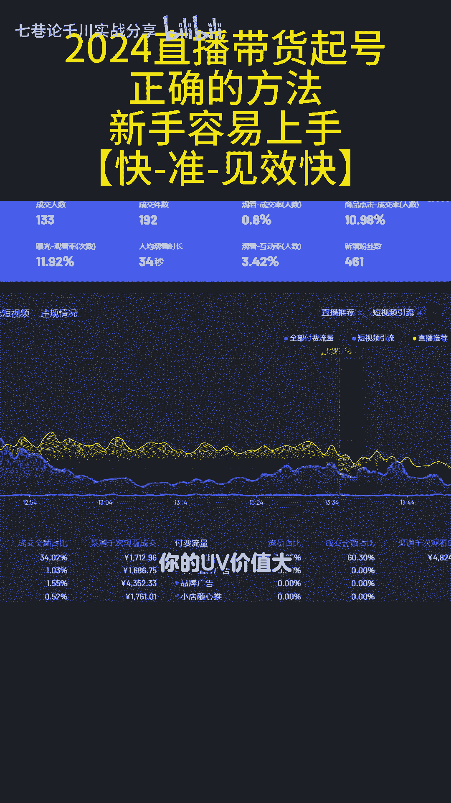
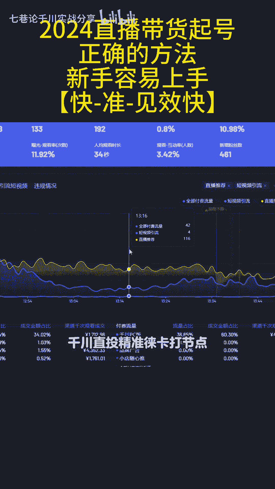
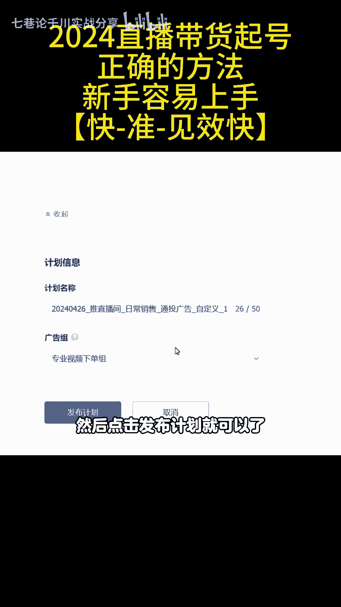
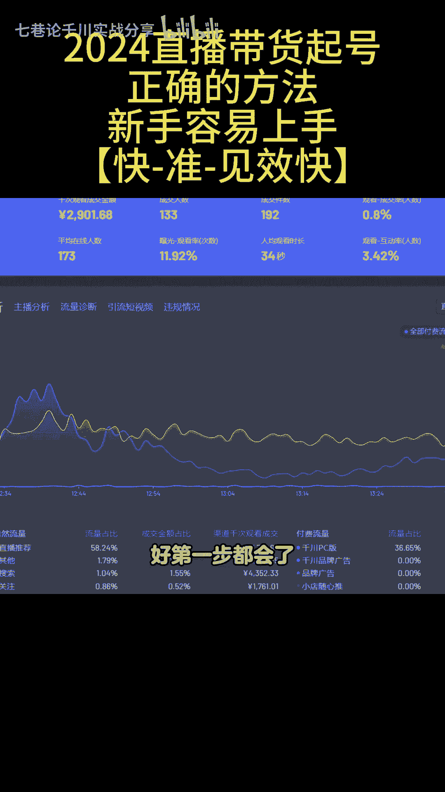
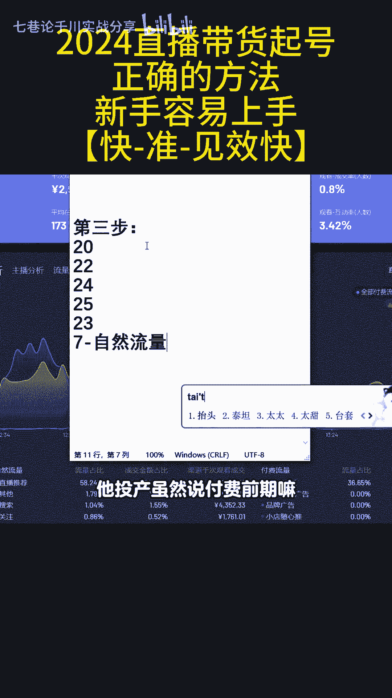
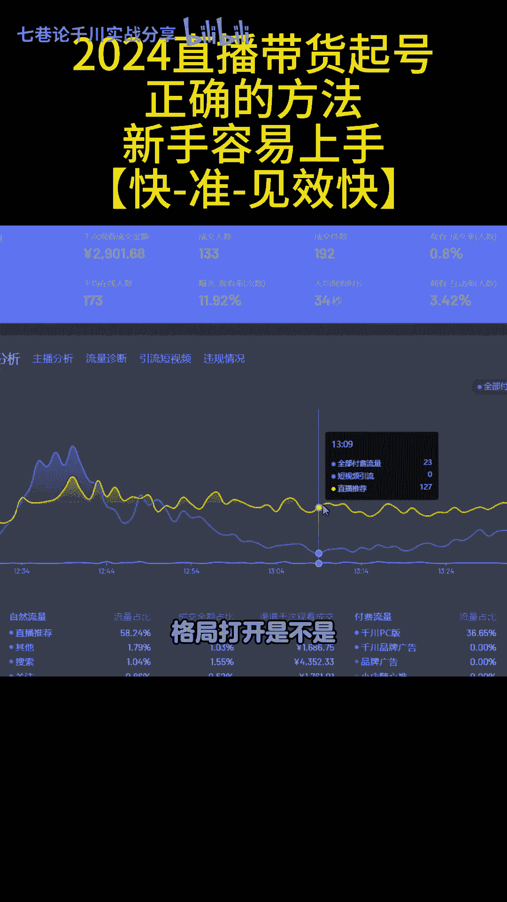

# 2024年直播带货起号正确的方法，新手也能快速上手起号 - P1 - 七巷论千川实战分享 - BV1rw4m1X7CG

今天给大家分享一个2024年直播带货起，正确的方法，这个桥的思路和方法学会了，我就这么跟你说吧，七天起号完全不是问题，而且这个方法来操作比较简单，新手容易操作，喜好的成功率非常高。

能够让你们快速的降噪效果好了，废话不多说啊，我直接分享实操，有用的兄弟们记得一定要点赞哦，第一步啊，那咱们首先先讲一下思路，新号起号，我们想要不管带自然流还是要起号成功。

我们要建立直播间的标签和拉千次的数据，因为平台上按照标签推流的，所以你标签建立的越精准，平台越容易给你推流，如果你的千次数据你拉得越高对吧，你的流量质量好，你的UV价值大。

所以平台才会给你大量的自然流量，也就是黄线，这个大家都知道，所以不管是建标签还是拉千次，最快的方法一定是投千川，投付费的，付费是起号最快的方法，这个是无可争议的，有的人说，那为什么要投付费呢。

有的人说做免费，No no no，如果说有条件的一定要付费起号，为什么，因为付费起号的流量质量它比免费流量，起号的流量质量要高多了，所以这套起号的方法它总称为千川直投，精准徕卡打节点。

微付费带动自然流量，那么具体的操作啊，怎么去学，教给大家思路，同样的我也把方法教给大家，那么在这里认真听具体的操作，就是这个简单的思路，同样的那我们怎么去做呢，千川怎么投啊，认真听，这是第二步。

首先推直播间日常销售通投，然后选择自定义，在这里选择控成本，然后呢在这里选择直播间成交，然后优惠券不启用预算呢，在这边卡500客单价，在这边来讲，如果说你客单价是100块钱，你先出60啊。

然后跑不动再加在自定义这里，你卡一下基础的年龄和性别，按照自己的产品受众群体，然后在行为兴趣这里，这就是建立精准池的计划，首先呢在这里选择电商互动行为，记住选择七天，为什么，因为行为大家可以看一下啊。

就是用户在电商阅读搜索观看的用户，在这里呢这七天的行为它是比较精准，流量是相对非常精准的，所以选择七天啊，你选择什么90天，60天都是比较放流，因为你前期要打标签是不是，然后拉千次，你想要打自然流。

微付费的话，你肯定为了数据，你肯定要把流量打的越精准越好啊，是不是，这样的话，你容易转化，你的签字才高嘛，如果说你在这里卖的是女装的，那么你选关键词的时候啊，你就点击查关键词，但是注意啊。

在这里呢因为有的时候系统它比较慢，所以呢你要点两次啊，添加完了之后呢，在这边我们看一下，总共就是啊29个词，但是呢350个字要填满，那么其他的词怎么去找啊，很简单，打开工具，这里有一个搜索流量分析。

然后呢你点进去了之后呢，在这边它都会有一些热搜词，看到没有，这个就是在抖音上，用户搜索的一些词，然后在这边也会有一些高跑量的词，和一些飙升词，你把这些词啊进行一个下载，比如说我们今天下载下来了之后呢。

然后点击这个数据啊，点击这边有个数据嘛，他点击一个筛选，然后呢把七天按照一个间隙去排，排好了之后，你就把这些词对吧，然后呢350个词我们可以做，你就把这些词都是你内幕嘛，搜索比较精准的一些词来。

你今天给它添加到计划里面来，兄弟们看我的一个操作啊，比如说我拉了这么多词，拉了这么多次之后呢，在这边天窗里面有一个批量添加，你点开批量添加了之后对吧，在这里你给它复制，复制了之后呢。

它里面有一些词词汇正在是校讲中，因为有一些词呢它是不能够添加的，然后我们等系统给我们校检好，校讲好了之后，在这里呢我们点击一下清除一些错误词，清除好了之后，然后点击添加，添加了之后。

然后我们发现总共就添加了200多个词，这些词有的是小于1万的，是不是这个没关系，因为它是搜索词，它跟大行为小兴趣不一样，这个叫精准的徕卡池，全是你内幕的，上面的350个词，你们都填一下啊，填好了之后呢。

你在下面对不对，你是女装，OK然后呢在这里选择女装，点击添加词，然后你添加关键词，兴趣这些词大家记住，像这种1000万以上的呢，就全部不要因为兴趣的流量本身比较泛。

所以呢我们要保证我们直播间的留恋就是精准，这样的话从容易拉千次嘛，对不对，这个大家记住了没有，填好了之后点击保存，保存了之后，大家可以看一下它的覆盖人数是1400多万，然后呢这个操作是新手的话。

你就多看几遍，这个是很重要的啊，选择七天，然后选择行为内幕这些词非常精准的，选好了之后，在下面选择直头画面，然后来点击发布计划就可以了。

这个呢就是徕卡池好，第一步都会了。

第二步呢怎么去打节点，拉出自然流，你要记住，兄弟们，这个是精准的徕卡池，它是属于微付费微付费起号，你微付费起号的话，首先你要记住啊，这种微付费起号，这种徕卡池呢它是非常精准的，你怎么样去打出自然流量啊。

首先兄弟们看过来，首先他的预算只能够是500，或者说300~500的预算，他一天只支持这么高，你不能够说哎你的计划对吧，你一天预算一千两千，你再有钱也不行，为什么，因为他的流量范围非常精准。

他不能跑高消耗，因为流量跑到后面越跑消耗，它的消耗是投产是越来越低的，流量非常棒，这个大家知道记住，所以你一个计划，比如说你跑了300元对吧，不管他的RY是多少，只要你启动对不对。

这个时候第二个计划就复制出来，再跑300元，然后呢第三个计划再复制出来，再跑300元，它的日预算你记住它的节点，就是它的日预算只能够到300~500，这是一个计划最多能消耗的值，这个大家明白了吧。

所以第二天你要复制这个呢，就是打节点的第一个操作，那么还有第三步啊，打节点的呢，第二个一个操作也就是我们的第三步，对不对，具体的的话，每天我们最好是微付费去做一个数据递增，比如说今天我打了啊20单。

那么明天我就22单，后天就24单，后天就25单，后天就30单对吧，那么大概你打个星号，就算你纯新号啊，那么你打个七天左右，那么你的自然流量你就能看到抬头，而且这个时候呢它投产，虽然说付费前期嘛投产是低。

因为你的价格要出高价才跑得动，但是你可以看得到他的签字，不管是付费的签字是特别高的，因为这个代表了流量精准，只要你把签字拉高了，对不对，平台就会愿意给你自然流，因为你的自然流量的价值体现你做到位了呀。

所以这个黄线平台为什么不给你的，这个比水银推要精准多了，所以呢兄弟们没学会的多看一看这个方法啊，谁都可以操作，小白都可以操作这个东西，别人卖很多钱的，我今天免费的分享大家学到的兄弟们啊。

视频点赞收藏起来，多看一看，分享给身边的朋友，格局打开是不是好了。

别问我是何方人。