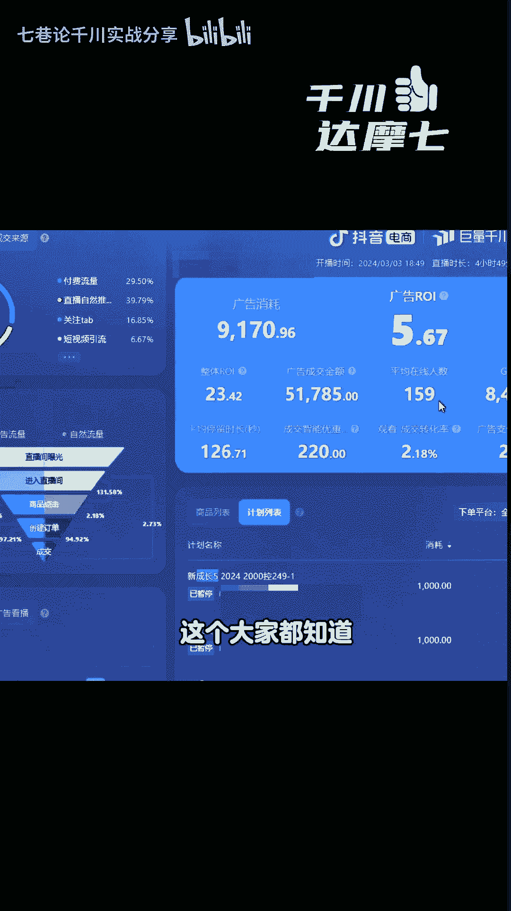
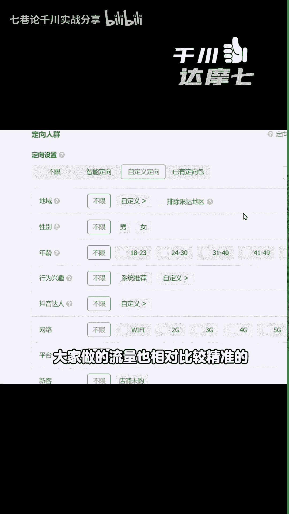
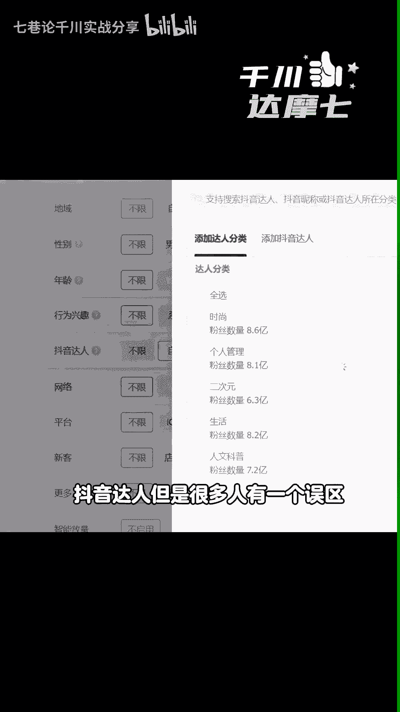
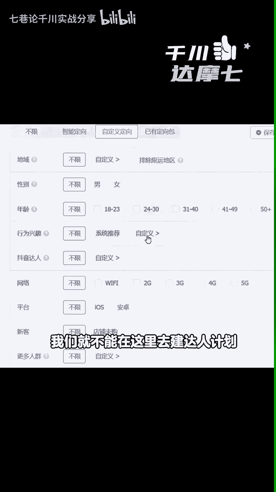
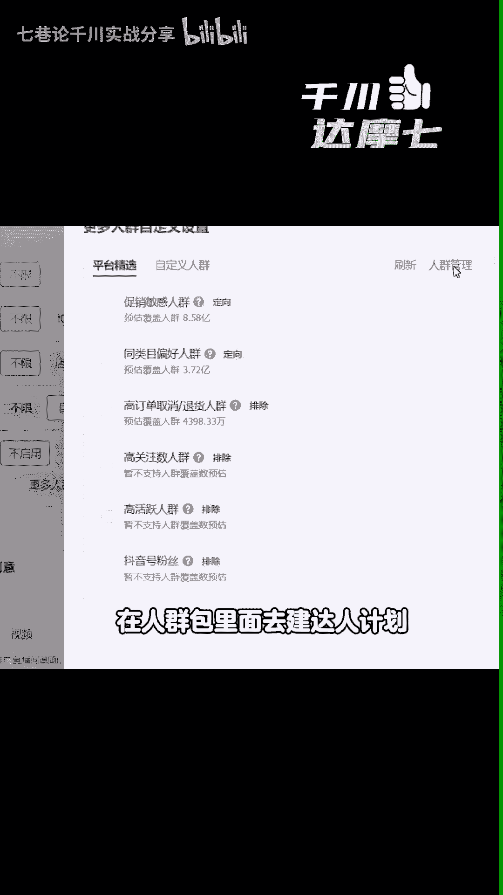
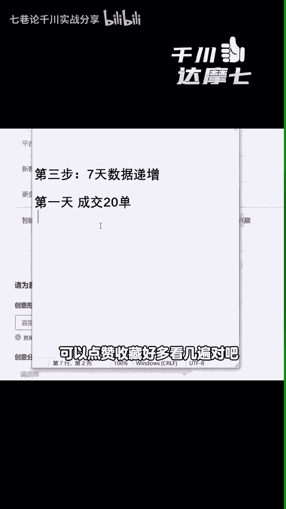

# 2024年直播间起号最快的方法 - P1 - 七巷论千川实战分享 - BV1WH4y157wv

2024年啊，直播间起号最快的方法对吧，成功率高达99%的起号诀窍，在24年起号的方法不外乎就两种，一种呢免费流量起号，一种呢付费投流起号，我下面分享的就是付费投流起号，为什么分享这个呢。

一来起号的速度特别快，二呢成功率非常高，三呢你快一点的话，你五天就能起成功，你慢一点的话，你七八天也就能搞得定对吧，但是啊起号的时候，这三个点千万不要操作错了，对不对。

建议在起号的朋友们呢视频点赞收藏好，以防你之后要用的时候你找不到了，下面讲这两个方法之前呢，先给大家看一下一个效果，这个呢就是今年起号的，2024年3月3号起号的，然后投产是五整体R23啊，今年起号的。

那么它的起号方式是人群包，就成长五直头带自然流起号，这个大家都知道。

那么今天讲的方法不是人群包的计划，方法是另外一种，因为人群包的计划很多人不会搭建啊，下面呢教给大家一种，基本上很容易就搭建的一个计划，那么第一步选择计划基础的搭建，我们在投流的时候选择千川推直播间。

日常销售通投选择自定义，然后投放方式控成本，投放优化目标，选择直播间成交，然后在下面智能优惠券不启用，这个时候你的预算啊基本上填个1000就可以了，出价呢那么在这里按照你自己的客单价，比如说你100。

你出个60%啊就可以了，第二我们选择计划来比较容易，大家做的流量也相对比较精准的。

那就是说在自定义里面，这边有一个抖音达人，抖音达人呢，但是很多人有一个误区。

其实你要记住他投的不是什么呢，你的同行的粉丝群体，他投的是你的同行的粉丝的相似群体，明白吗，不是图你的同行的人群一定要记住，所以在这里面我们选择除了关注不选之外，我们选择30天，那么在这里啊。

你添加达人的情况下，你要选择30个达人，那么选择30个达人的情况下，每个达人如果说覆盖人数是20万，就算你选择30个是600万，投过圈仓的人都知道，600万的覆盖人群也基本上很难去跑得动。

那么这个时候我们就不能在这里去建达人计划。

我们要在哪里，我们要在更多人群里面的自定义人群里面，在人群包里面去建达人计划。

具体怎么建呢，点击圈选人群，然后呢在基础人群这里有一个行为特征，这边有一个抖音达人给他拖入并结，那么这个时候啊，我们就可以在电商罗盘里面去选择我们的同行，同样的关注不选，然后选择近30天。

在这里你们记住，如果我们卖女装的话，那么你很容易找到30个自己的同行，但是30个不够，你要记住，那我们同样的在这里可以添加抖音达人，我们可以选择什么女装的用户，她也是童装的用户对吧。

你可以选择童装的一些对标的同行，或者说你可以选择一些美妆的是吧，服饰鞋包之类的，就是你这个领域的达人，你想一下你的顾客群体，你是卖女装的，难道他的这个人群只在抖音上买女装吗。

他肯定是买服饰鞋包美妆美容护肤，其他的人群嘛，对不对，你选30个600万，那么在这里你只要添加三个甚至四个，找一些达人就可以了，这个流量呢你选好了之后，它也是非常不错，比较精准的，这个是我们的第二步。

那么第三步投放的时候，花钱去投的时候，我们第三步我们要做一个七天的数据递增，什么数据递增，比如说你第一天你成交了，比如说20单，那么你第二天你就比20单要多是吧，每天做一个数据一帧。

然后来获得系统的一个数据推荐，那么这样的话你的号七天之后就很容易起来了，成功率高达90%以上，但是要记住这种起号的方式，付费起号啊，人货场要到位对吧，你人货场不到位的话，你起号都是没用的好了。

那么大家可以去操作啊，如果你不会的，可以点赞收藏好，多看几遍对吧。

别问我是何方人，达摩盘里一众生。