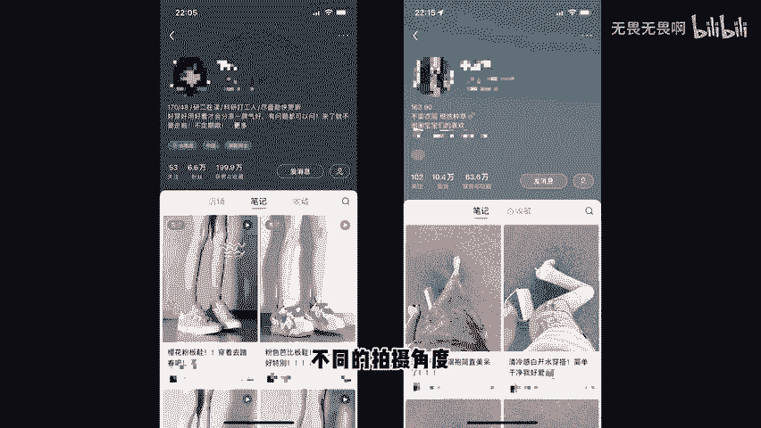
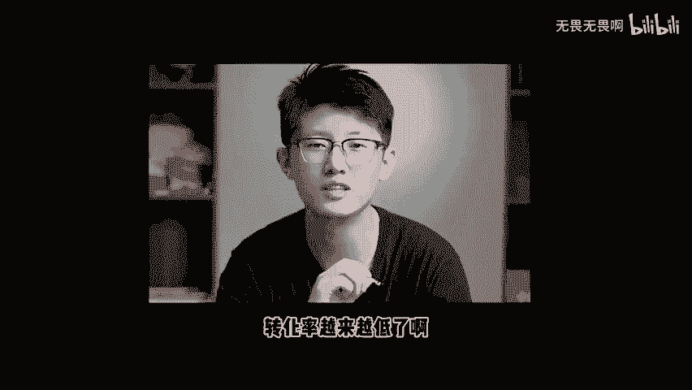
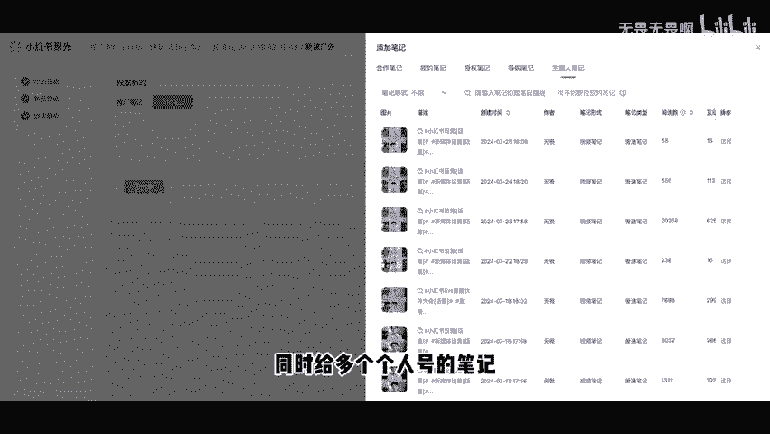

# 2024年都去给我做，主理人ip+产品号矩阵 - P1 - 无畏无畏啊 - BV17Ve4eUERu

来，各位老板们，是不是最近发现发产品没流量也卖不出去货了。然后呢又觉得做个IP这件事情有点难，发了好多视频之后，也没有流量没有转化。然后又发现把这两件事情都放到一个账号当中发哎会有点不太垂直。

内容比较乱，还想着把聚光投这件事情给他做起来。最近我们这边陪跑了很多的中小商业老板，我现在给大家建议都是主理人IP加产品号矩阵。什么意思呢？首先是多个产品的矩阵。

比如说我之前让我们运营把我的这个口播脚本拿去做成图文笔记，甚至AI的这个视频。然后这个操作下来之后，跑出来的数据就还不错。这是我这种偏知识类的账号。那如果说咱们在座各位是产品类的账号的话。

那就可以试着用不同的呈现形式，不同的拍摄角度，不同的场景来测试你们家的产品，把这件事情给到一个员工，甚至多个员工，多个账号去测试。每天呢甚至你都可以增加它的发布数量，直到测试出来，这个能拿到流量。

能拿到结果的作品，再把它去进行复制。直到他。😊。

没有流量再换别的东西去测试。其实这就是图文的意，它的优势在于制作成本低。但是我们员工是可以单独的执行操作，他只需要你去完成那个一让其他人去完成后面的零再做复制就好了。

然后是主理人IP这是平台最近在主推的，也是近几年很多人给我反馈说这个账号啊转化率越来越低了，转化越来越难了。其实转化的核心啊，也无非就是我们的专业度加信任度，你不能说既要求小红书用户质量高付费爽快。

又把大家当傻子吧。这帮人什么套路没见过。所以你们那些随便做的素材，以及那些蹩角的套路啊，真的就别拿出来丢人现眼了。现在如果说咱们想把这个生意继续好好的做下去。主理人IP是我们绕不开的事情。

但是啊我这里所讲到的这个IP，他不仅仅是单纯的说我出个镜，我拍个视频就是做IP的，他也不是单纯的说我抄几个爆款做做流量就好了。而是要真正的去分享我们的故事，我们的观点，我们的。

价值观以及我们怎么去打造这个IP的影响力，怎么去提升后端的转化，怎么去设计我们的产品业务等等等等。那这个搭配组合出来之后，既能够解决我们当下内容的变现问题，提升我们团队人员的运营效率。

又能够从长远的角度去考虑我们去提升整个账号，整个人物整个公司的一个市场竞争力，再包括到我后面的矩阵后台的操作。它是可以实现一个企业号矩阵，同时给多个个人号的笔记进行偷流和直播间的偷流了。

当你这个主理IP实现从0到1的时候，那再去铺这个矩阵的时候，就能够实现1到10甚至10到100的放大。那具体到实际的操作以及搭建的细节，可以了解一下，我们在8月份。

啊就是下个月在杭州举办的这一场线下课程。

